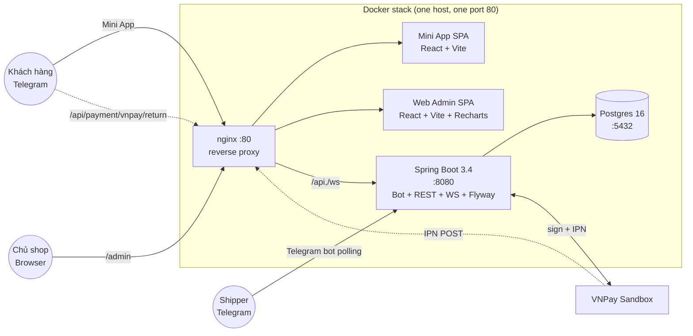

# Hệ thống Quản lý Giao hàng (KhoaLuan-GiaoHang)

> Khoá luận tốt nghiệp — Hệ thống quản lý giao hàng tích hợp Telegram Mini App,
> Web Admin, Backend Spring Boot và VNPay sandbox.

Toàn bộ chuỗi đặt hàng từ khách trên Telegram → shipper nhận đơn qua bot →
shipper chia sẻ Live Location → khách xem bản đồ real-time → khách thanh toán
qua VNPay → chủ shop theo dõi dashboard + báo cáo trên Web Admin → khách
đánh giá shipper sau khi nhận hàng. Triển khai một-lệnh qua Docker Compose.

---

## Kiến trúc tổng quan



## Tech stack

| Layer | Tech |
|-------|------|
| Backend | Java 17, Spring Boot 3.4, Spring Security, Spring Data JPA, Spring WebSocket (STOMP/SockJS), Flyway, Hikari, Jackson |
| Database | PostgreSQL 16 |
| Bot | telegrambots-springboot-longpolling-starter 7.x |
| Frontend | TypeScript 5.6, React 18, Vite 5, TanStack Query 5, Tailwind CSS 3, Recharts 3, Zustand 4, date-fns 3, axios |
| Mini App SDK | @twa-dev/sdk 7 |
| Realtime | STOMP over WebSocket, SockJS fallback, @stomp/stompjs (frontend) |
| Payment | VNPay sandbox (HMAC-SHA512, IPN server-to-server) |
| Deploy | Docker Compose (nginx + 4 services), multi-stage Dockerfiles |
| Tests | JUnit 5, Testcontainers (Postgres 16), Mockito, AssertJ |

## Quick start

```bash
# 1) Clone
git clone <repo-url> && cd KhoaLuan-GiaoHang

# 2) Copy & fill env file (4 values marked ▼ FILL IN ▼)
cp .env.example .env
$EDITOR .env

# 3) Up
docker compose -f infra/docker-compose.yml up -d

# 4) Watch healthchecks come green (~90s)
docker compose -f infra/docker-compose.yml ps
```

After all containers report `(healthy)`:

| URL | What |
|-----|------|
| http://localhost/ | Redirects to /admin/ |
| http://localhost/admin/ | Web Admin SPA |
| http://localhost/miniapp/ | Telegram Mini App (xem qua bot, dev-only standalone view) |
| http://localhost/actuator/health | Spring Boot health probe |

## Demo accounts

| Vai trò | Tài khoản | Cách truy cập |
|---------|-----------|---------------|
| Chủ shop | `shop@example.com` / `Demo@Shop2026!` | `http://localhost/admin/login` |
| Admin gốc (V5) | `admin@shop.local` / `admin123` (test fixture) | `http://localhost/admin/login` |
| Bot khách | (Telegram thật của bạn) | Chat bot `@<BOT_USERNAME>` từ `.env` → `/start` → tap "Đặt hàng" |
| Bot shipper | (Telegram thật khác) | Chat bot tương tự → `/start` → đăng ký shipper → chờ admin duyệt |

Dữ liệu seed sẵn (V11):
- 10 món ăn Việt Nam (phở, bún chả, bánh mì, …)
- 30 đơn rải đều 30 ngày (5 PENDING, 4 CONFIRMED, 3 ASSIGNED, 3 DELIVERING, 12 DELIVERED, 3 CANCELLED)
- 3 khách + 3 shipper demo (1 PENDING)
- 10 đánh giá (8 cao, 2 trung bình)

## Tính năng demo theo phase

| Phase | Tính năng | Cách demo |
|-------|-----------|-----------|
| P0 | Setup Maven + pnpm workspace + Flyway baseline | `./mvnw verify` + `pnpm -r build` |
| P1 | Auth (admin login + Telegram init data verify) | Đăng nhập Web Admin |
| P2 | Sản phẩm + đơn hàng CRUD | Tab "Sản phẩm" + "Đơn hàng" trên Web Admin |
| P3 | Mini App khách: xem món + giỏ hàng + checkout COD | Chat bot → "Đặt hàng" → đặt thử |
| P4 | Bot lệnh `/start`, đăng ký shipper, duyệt shipper | Bot khách + bot shipper |
| P5 | Shipper nhận đơn + Live Location (WebSocket) | Hai điện thoại + ngrok (xem RUNBOOK) |
| P6 | Bản đồ tracking real-time trên Mini App | Mở chi tiết đơn DELIVERING |
| P7 | VNPay sandbox thanh toán + IPN tự confirm | Checkout chọn VNPay → test card NCB |
| P8 | Dashboard KPI + 3 biểu đồ Recharts + đánh giá shipper qua bot | Web Admin `/` + `/reports` |
| P9 | Đóng gói Docker + seed + realtime admin orders + docs | Quick-start ở trên |

## Manual smoke test runbook

Xem [`docs/RUNBOOK.md`](docs/RUNBOOK.md) — danh sách step-by-step demo P1–P8 cho buổi bảo vệ.

## Tài liệu thiết kế

- Spec gốc: [`docs/superpowers/specs/2026-05-19-he-thong-quan-ly-giao-hang-design.md`](docs/superpowers/specs/2026-05-19-he-thong-quan-ly-giao-hang-design.md)
- Plan từng phase: [`docs/superpowers/plans/`](docs/superpowers/plans/)
- Tổng quan deploy: phase này (P9) — xem [`docs/superpowers/plans/2026-06-01-p9-polish-deploy.md`](docs/superpowers/plans/2026-06-01-p9-polish-deploy.md)

## Dev workflow (không cần Docker)

Cho luồng dev nhanh (Spring Boot + Vite trên máy host, chỉ Postgres trong Docker):

```bash
# Terminal 1 — Postgres
docker compose -f infra/docker-compose.dev.yml up -d

# Terminal 2 — Backend
cd backend
BOT_TOKEN=<token> BOT_USERNAME=<bot> ./mvnw -pl app spring-boot:run

# Terminal 3 — Mini App
cd frontend && pnpm install
pnpm --filter @shop/miniapp dev      # http://localhost:5173

# Terminal 4 — Web Admin
pnpm --filter @shop/webadmin dev     # http://localhost:5174
```

## Tests

```bash
# Backend (Testcontainers Postgres tự bật)
./backend/mvnw verify

# Frontend (build + type-check, không có unit tests trong phase này)
cd frontend && pnpm -r build && pnpm -r type-check
```

Tổng tests: ~221 backend (217 baseline + 4 IT của P9).

## Cấu trúc thư mục

```
KhoaLuan-GiaoHang/
├── backend/                  # Spring Boot 3.4 multi-module
│   ├── app/                  #   Executable jar entry point
│   ├── modules/{shared,auth,order,delivery,payment,notification,bot,miniapp,webadmin}/
│   ├── Dockerfile
│   └── pom.xml
├── frontend/                 # pnpm workspace
│   ├── miniapp/              #   Telegram Mini App
│   ├── webadmin/             #   Web Admin SPA
│   ├── shared/               #   @shop/shared (types + API clients)
│   ├── miniapp/Dockerfile
│   └── webadmin/Dockerfile
├── infra/
│   ├── docker-compose.yml         # Full stack
│   ├── docker-compose.dev.yml     # Postgres-only (for dev)
│   ├── nginx/nginx.conf
│   └── postgres/init.sql
├── docs/
│   ├── RUNBOOK.md            # Manual smoke test cho buổi bảo vệ
│   └── superpowers/{specs,plans,research,reviews}/
├── .env.example              # Canonical env var manifest
└── README.md                 # This file
```

## Acknowledgements

Khoá luận tốt nghiệp — Trường ĐH …, Khoa CNTT, năm học …
- Sinh viên: Lê Thị Trân Thuỳ
- Giảng viên hướng dẫn: …

Hệ thống được phát triển trên 9 phase, sử dụng phương pháp:
- TDD (Test-Driven Development) cho business logic
- Multi-stage Docker build cho triển khai
- Trunk-based workflow (`main` only, mỗi task một commit)
