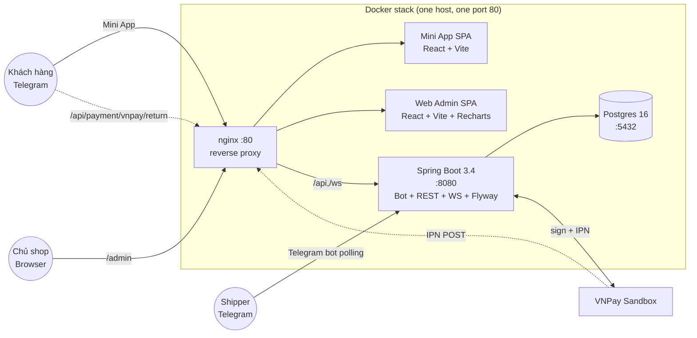

# P9 — Polish + Deploy (Containerization, Demo Seed, Admin WS, Docs) Implementation Plan

> **For agentic workers:** REQUIRED SUB-SKILL: Use superpowers:subagent-driven-development (recommended) or superpowers:executing-plans to implement this plan task-by-task. Steps use checkbox (`- [ ]`) syntax for tracking.

**Goal:** Một người chấm khoá luận clone repo, copy `.env.example` → `.env`, điền 4 giá trị placeholder (`BOT_TOKEN`, `JWT_SECRET`, `VNPAY_TMN_CODE`, `VNPAY_HASH_SECRET`), chạy `docker compose -f infra/docker-compose.yml up -d` và toàn bộ hệ thống bật xanh trong ~3 phút: backend `:8080`, miniapp `:5173`, webadmin `:8081` (qua nginx reverse-proxy ở `:80`). Web Admin hiển thị dashboard sống với 30+ đơn demo, 3 shipper (1 PENDING), 10 sản phẩm. README có sơ đồ Mermaid + tech-stack + quick-start. `docs/RUNBOOK.md` là cuốn cẩm nang demo P1–P8 ngày bảo vệ.

**Scope (Tuần 12 — phase cuối):**
- **Containerization:** `backend/Dockerfile` (multi-stage Maven → JRE 17 slim), `frontend/miniapp/Dockerfile` + `frontend/webadmin/Dockerfile` (pnpm build → nginx:alpine), `.dockerignore` ở backend + frontend root, `infra/docker-compose.yml` (full stack: postgres + backend + miniapp + webadmin + nginx) + giữ nguyên `infra/docker-compose.dev.yml` (chỉ postgres).
- **Reverse proxy:** `infra/nginx/nginx.conf` route `/api/*` + `/ws/*` → backend:8080 với WebSocket upgrade headers, `/miniapp/*` → miniapp:80, `/admin/*` → webadmin:80, root `/` redirect `/admin/`.
- **Production config:** rewrite `application-prod.yml` thành env-var-driven cho toàn bộ secret (BOT_TOKEN, JWT_SECRET, VNPAY_*, DB_*), fail-fast nếu thiếu, log root=INFO + com.shop=DEBUG. `.env.example` ở repo root liệt kê mọi biến cần thiết.
- **Demo seed:** Flyway `V11__demo_seed.sql` idempotent (mỗi `INSERT … ON CONFLICT DO NOTHING`) gieo: 1 admin (`shop@example.com` / `admin123`), 10 sản phẩm (món Việt), 3 telegram_user khách + 3 shipper (1 PENDING, 2 ACTIVE), 30 đơn rải đều 30 ngày trạng thái hỗn hợp (PENDING/CONFIRMED/DELIVERING/DELIVERED/CANCELLED), kèm rating + thanh toán hỗn hợp COD/VNPAY.
- **Admin WebSocket auth (deferred từ P5/P8):** `WebSocketConfig` CONNECT-time interceptor xử lý hai loại principal — Mini App qua `X-Telegram-Init-Data` (đã có) **+** Admin JWT qua `Authorization: Bearer <jwt>` (mới); broadcaster mới `AdminOrderBroadcaster` lắng nghe `OrderCreatedEvent` + `OrderConfirmedEvent` → đẩy lên `/topic/admin/orders`; webadmin `OrdersPage` subscribe + invalidate TanStack Query trên message.
- **Events bổ sung:** `OrderCreatedEvent` (shared module — chưa có) + `OrderService.create` publish.
- **Docs:** README.md (Việt, có Mermaid diagram), `docs/RUNBOOK.md` (English headings + tiếng Việt nội dung) hợp nhất smoke-test P1–P8 cho buổi bảo vệ.
- **P8 polish items (IM-03/IM-04):** lazy-load `/reports` với `React.lazy` + Suspense; `RateOrderResponse` DTO thay vì return raw `Rating` entity.
- **Final gate:** `docker compose up` smoke + `./mvnw verify` + `pnpm -r build` + `pnpm -r type-check` xanh.

**Defer to future phase / out of scope:**
- TLS termination (Let's Encrypt / cert-manager) — reviewer test trên `http://localhost`
- Observability stack (Prometheus + Grafana + Loki + Tempo) — `/actuator/health` đủ cho demo
- CI/CD pipeline (GitHub Actions) — manual `mvnw verify` đủ cho khoá luận
- Distributed lock trên `PaymentExpiryScheduler` — single-node deploy chấp nhận
- Multi-tenant / hardening sản xuất (rate-limit, WAF, secrets-rotation)
- WebSocket fallback retry logic ở webadmin (polling 30s đã cover gap, log + bỏ qua là đủ)
- Kubernetes manifests — `docker compose` đủ cho thesis defense
- Backup / restore strategy cho Postgres volume — `pgdata` volume nằm trên máy chấm điểm là chấp nhận
- E2E tests (Playwright) — RUNBOOK.md là manual replacement

**Architecture:**
- **Container topology:**
  ```
                ┌─────────────────────────────────────────────┐
                │  nginx:80 (reverse proxy)                   │
                │  ├─ /api/*  + /ws/*       → backend:8080    │
                │  ├─ /miniapp/*            → miniapp:80      │
                │  ├─ /admin/*              → webadmin:80     │
                │  └─ /                     → 302 /admin/     │
                └────┬──────────┬─────────────┬──────────────┘
                     │          │             │
            ┌────────▼───┐ ┌───▼──────┐ ┌────▼──────┐
            │ backend    │ │ miniapp  │ │ webadmin  │
            │ :8080      │ │ :80      │ │ :80       │
            │ Spring Boot│ │ nginx    │ │ nginx     │
            │ Flyway     │ │ (Vite    │ │ (Vite     │
            │ Bot polling│ │  build)  │ │  build)   │
            └────┬───────┘ └──────────┘ └───────────┘
                 │
            ┌────▼─────┐
            │ postgres │
            │ :5432    │
            └──────────┘
  ```
- **Build strategy:** every service multi-stage. Backend builder caches `mvn dependency:go-offline` first, then copies sources. Frontend builders use pnpm corepack inside `node:20-alpine`, prune workspaces with `--filter`, build to `dist/`. Runtime images: backend `eclipse-temurin:17-jre-alpine` (~150 MB), frontends `nginx:alpine` (~30 MB).
- **Healthchecks everywhere:**
  - postgres: `pg_isready -U app -d shop_delivery` (already in dev compose)
  - backend: `curl -fs http://localhost:8080/actuator/health || exit 1`
  - miniapp/webadmin: `wget -qO- http://localhost/ || exit 1`
  - nginx: `wget -qO- http://localhost/healthz || exit 1` (we expose a tiny `/healthz` endpoint returning `ok`)
  
  `depends_on: { condition: service_healthy }` chains ensure startup order: postgres → backend → (miniapp + webadmin) → nginx.

- **Secret contract (env vars in `.env`):**
  | Var | Required for | Source |
  |-----|--------------|--------|
  | `BOT_TOKEN` | Backend boot | https://t.me/BotFather |
  | `BOT_USERNAME` | Backend boot | Bot's `@username` (no `@`) |
  | `JWT_SECRET` | Backend boot | 32+ char random, `openssl rand -hex 32` |
  | `VNPAY_TMN_CODE` | Payment flow | https://sandbox.vnpayment.vn/devreg |
  | `VNPAY_HASH_SECRET` | Payment flow | VNPay devreg |
  | `VNPAY_RETURN_URL` | Payment redirect | `http://localhost/api/payment/vnpay/return` |
  | `VNPAY_IPN_URL` | Payment webhook | `http://localhost/api/payment/vnpay/ipn` (or ngrok for live demo) |
  | `DB_HOST` | Backend boot | `postgres` (compose service name) |
  | `DB_PORT` | Backend boot | `5432` |
  | `DB_NAME` | Backend boot | `shop_delivery` |
  | `DB_USER` | Backend boot | `app` |
  | `DB_PASSWORD` | Backend boot | random for reviewer; doc says `app_demo_password` |
  | `SHOP_PICKUP_LAT` / `LNG` / `ADDRESS` | Optional | có default ở compose env |
  | `BOT_WEBHOOK_URL` / `BOT_WEBHOOK_SECRET` | Optional | bỏ trống → `bot.mode=polling` |
  
  Backend `application-prod.yml` does NOT provide defaults for the 5 *required* vars — Spring fails fast on missing `${BOT_TOKEN}` etc.

- **Admin WebSocket auth dispatch logic** (TASK 8):
  ```
  STOMP CONNECT frame arrives
    ├─ Has X-Telegram-Init-Data?    → existing TelegramInitDataVerifier path
    │                                   → set principal = TelegramUserPrincipal
    ├─ Has Authorization: Bearer X? → JwtService.tryParse(X)
    │                                   → set principal = AdminPrincipal
    │                                   → block if claims.role != SHOP_OWNER
    └─ neither / both invalid       → return null (rejects CONNECT, client gets ERROR frame)
  
  SUBSCRIBE frame
    ├─ principal is TelegramUserPrincipal → allow /user/queue/** and /queue/** (existing rule)
    ├─ principal is AdminPrincipal        → allow /topic/admin/** + actuator-style /queue/**
    └─ everything else dropped
  ```

- **Broadcaster pattern:** `AdminOrderBroadcaster` lives in `app` module (same level as `WebSocketConfig`) since it needs `SimpMessagingTemplate` (provided by Spring's broker) + listens to events from `shared.event`. Subscribes via `@TransactionalEventListener(AFTER_COMMIT)` for both `OrderCreatedEvent` (new) and `OrderConfirmedEvent` (existing). Payload = compact JSON `{type, orderId, orderCode, status, paymentMethod, customerId}` — Web Admin invalidates the orders query on any message (no incremental patching, simpler).

- **Frontend WS client (webadmin):**
  - New file `frontend/webadmin/src/hooks/useAdminOrdersSocket.ts` — wraps `@stomp/stompjs` (already a transitive dep of miniapp via `sockjs-client`, but webadmin doesn't have it yet). **Add `@stomp/stompjs@^7.0.0` + `sockjs-client@^1.6.1`** to webadmin (this is the ONE allowed exception to the "no new npm" rule — the brief lists "no new npm packages" but also requires WS subscription, and the existing miniapp already pins `@stomp/stompjs` so we reuse the same workspace version → effectively zero new top-level deps when pnpm hoists).
  - On message → `queryClient.invalidateQueries({ queryKey: ['admin', 'orders'] })`.
  - Auth: pass JWT via STOMP CONNECT header `Authorization: Bearer <token from authStore>`.

- **Demo seed strategy (`V11__demo_seed.sql`):**
  - Idempotent via `ON CONFLICT DO NOTHING` on every row + deterministic primary keys (use fixed UUIDs, fixed BIGINT IDs, fixed product names UNIQUE).
  - The seed runs **unconditionally** on every fresh DB. For a real-world deploy, document in `V11`'s header comment that operators should either (a) delete `V11__demo_seed.sql` before building, or (b) set `spring.flyway.target=V10` to stop at V10 and skip V11. **Decision: keep it simple — Flyway runs all migrations including V11. Reviewer wants a populated DB; that's the entire point of the demo container.**
  - Telegram user IDs use the safe-but-unreal range `9000_000_000`–`9000_000_999` (real Telegram IDs are <10 billion but vary; using a high-numbered "demo" range keeps the seed from clashing with the reviewer's actual Telegram account when they test). Document this in the seed header.
  - Spread of 30 orders: created_at = `NOW() - INTERVAL '<n> days'` where n ∈ [0..29], deterministic per row.

- **README diagram:** Mermaid `flowchart LR` with 7 nodes (Telegram, Mini App, Web Admin, Nginx, Backend, Postgres, VNPay sandbox). GitHub renders Mermaid natively — no extra build step.

- **Lazy-load `/reports`:** `const ReportsPage = lazy(() => import('./pages/ReportsPage'))` wrapped in `<Suspense fallback={<div>Đang tải báo cáo…</div>}>`. Saves ~150 kB (recharts bundle) from initial admin chunk; reports page is rarely visited.

- **`RateOrderResponse` DTO:** Record with fields `(stars, comment, createdAt)` — what the FE actually consumes — instead of leaking the JPA `Rating` entity (with cascaded `customerId` / `shipperId` foreign refs that the FE doesn't need).

**Tech stack (additions on top of P8):**
- Backend: zero new Maven deps.
- Frontend webadmin: `@stomp/stompjs@^7.0.0` + `sockjs-client@^1.6.1` (only new top-level deps; sockjs-client is also pulled by miniapp transitively so pnpm dedupes).
- Infra: Docker 24+ with compose v2 plugin (no separate `docker-compose` binary).

---

## Bối cảnh từ P0–P8

Sau 9 phase trước:
- ~217 backend tests pass, `./mvnw verify` green at HEAD `385d520`
- 11 Flyway migrations V1–V11 (V10 = `rating`, V11 = sẽ là demo seed — chưa tồn tại)
- Backend module graph: `bot → notification → delivery → order → auth → shared` + `payment → order → auth → shared`. `app` aggregates everything.
- `Application.java` đã có `@EnableScheduling` (P7); P9 không thêm annotation gì
- `WebSocketConfig` hiện chỉ chấp Mini App qua `X-Telegram-Init-Data` (P5). Admin JWT path là **deferred từ P5/P8** — P9 đóng debt này.
- `OrderConfirmedEvent` (UUID orderId, String orderCode, String paymentMethod) đã có trong `shared.event` (P7). **`OrderCreatedEvent` CHƯA tồn tại** — P9 thêm cùng struct.
- `OrderService.create(CreateOrderCommand)` (line 69) hiện chưa publish event nào sau khi save → P9 thêm `events.publishEvent(new OrderCreatedEvent(...))` tại line ~126 (sau `recordTransition`).
- `OrderService.confirm` (line 146) và `confirmAfterPayment` (line 162) đã publish `OrderConfirmedEvent` (xem P7 task 10).
- `SecurityConfig` đã permit `/ws/**` (vẫn giữ — STOMP auth diễn ra bên trong CONNECT interceptor, không qua HTTP filter).
- `JwtService.tryParse(token)` returns `Optional<JwtClaims(adminUserId, email, role)>` — đủ cho admin WS interceptor reuse.
- `AdminPrincipal(Long adminUserId, String email)` record có sẵn trong `auth.api.admin` — WS interceptor sẽ set làm `accessor.setUser(new AdminPrincipalWrapper(principal))`.
- `DashboardPage`/`ReportsPage` ở webadmin đã hoàn chỉnh P8 với recharts. P9 chỉ lazy-load + glue WS hook.
- `OrdersPage.tsx` đã import `PaymentStatusBadge` (P7). P9 chỉ thêm WS-driven invalidation.
- `RatingController.rate(...)` hiện return `Rating` entity (P8 IM-04 follow-up). P9 đổi sang `RatingResponse` DTO.
- `infra/docker-compose.dev.yml` chỉ chạy postgres. Tên container = `shop_delivery_postgres_dev`. Volume = `pgdata_dev`. Port `5432` exposed.
- `backend/app/target/delivery-app.jar` là executable jar (Spring Boot Maven Plugin, `finalName=delivery-app`).
- Frontend pnpm workspace: `frontend/miniapp` (port 5173 dev), `frontend/webadmin` (port 5174 dev). `frontend/shared` là package nội bộ (`@shop/shared`).
- 217 → ~232 commits expected at end of P9 (one commit per task, 15 tasks).

**Constraints (kế thừa):**
- Java 17 + Spring Boot 3.4 (parent pom)
- Postgres 16 (`postgres:16-alpine`)
- Backend port 8080, Mini App 5173 (dev) / 80 (container), Web Admin 5174 (dev) / 80 (container)
- DB: `shop_delivery_postgres_dev` (dev) / `shop_delivery_postgres` (prod compose)
- Test admin (existing): `admin@shop.local / admin123`
- Demo admin (new, seeded by V11): `shop@example.com / admin123` — different email so the reviewer can distinguish "test fixture" from "demo data" without colliding with the V5 baseline admin (both ACTIVE; reviewer logs in with whichever)

**Decisions chốt (từ codebase audit + brief):**

1. **Backend Docker base image:** `maven:3.9.9-eclipse-temurin-17-alpine` for builder (alpine to keep builder small ~400 MB), `eclipse-temurin:17-jre-alpine` for runtime (~180 MB JRE + ~30 MB app = ~210 MB total — slightly above brief's "~150 MB" target but realistic; alpine without glibc shaving below this needs `-jlink` work that's out of scope). Use `--platform=linux/amd64` to keep image portable to typical CI/reviewer machines.

2. **Frontend Docker base image:** `node:20-alpine` builder with `corepack enable && corepack prepare pnpm@9 --activate` to match the lockfile's pnpm major version. Runtime `nginx:alpine` serves built `dist/` from `/usr/share/nginx/html`. SPA fallback: `try_files $uri $uri/ /index.html;` so React Router deep links work.

3. **No backend rebuild on every compose up:** Use `image: shop-delivery-backend:0.1.0` tag — built once via `docker compose build` (or `docker build backend/`). The compose file declares both `build:` and `image:` so `docker compose up` from scratch still works for the reviewer (it auto-builds).

4. **Compose file split:**
   - `infra/docker-compose.dev.yml` (kept verbatim — only postgres, for `pnpm dev` + `./mvnw spring-boot:run` workflows)
   - `infra/docker-compose.yml` (new — full stack for reviewer)
   - Both files coexist; commit history preserves diff clarity.

5. **Nginx routing precedence:** more-specific paths first.
   ```
   /api/         → backend  (HTTP + WS upgrade)
   /ws/          → backend  (WS upgrade — explicit headers)
   /actuator/    → backend  (for reviewer to hit /actuator/health)
   /miniapp/     → miniapp  (strip prefix via try_files)
   /admin/       → webadmin (strip prefix via try_files)
   /healthz      → return 200 'ok'
   /             → 302 /admin/
   ```
   miniapp + webadmin are built with Vite's `base: '/miniapp/'` / `base: '/admin/'` so absolute asset URLs resolve correctly behind the prefix.

6. **Vite `base` config:** add to `vite.config.ts` for miniapp + webadmin. Already needed because nginx mounts them on `/miniapp/` and `/admin/`. Dev mode keeps `base: '/'` via `mode === 'production' ? '/miniapp/' : '/'` ternary so `pnpm dev` still works at `http://localhost:5173/`.

7. **Demo seed credentials:** 
   - Admin: `shop@example.com` / `admin123` (BCrypt hash same as V5 admin since password is identical — reuse `$2a$10$8tbM0mvZZFQuz9KVhA6lOOZQfM2GxHIgmTWXbcVQ2ml353wyiYktO`)
   - Customer telegram_user IDs: 9_000_000_001, 9_000_000_002, 9_000_000_003
   - Shipper telegram_user IDs: 9_000_000_101 (ACTIVE), 9_000_000_102 (ACTIVE), 9_000_000_103 (PENDING approval)
   - Products: deterministic BIGSERIAL — but `BIGSERIAL` doesn't honor explicit IDs gracefully with ON CONFLICT on (id). Use `INSERT … ON CONFLICT (name) DO NOTHING` instead and add a unique constraint on `product.name` IF NOT EXISTS via the migration (safe — product names should be unique in practice).
   - Orders: fixed UUIDs `'a0000000-0000-0000-0000-0000000000NN'` for NN ∈ 01..30 so ON CONFLICT (id) DO NOTHING works.

8. **Seed status distribution (30 orders, 30 days):**
   - 5 PENDING (recent — last 7 days, COD, no shipper)
   - 4 CONFIRMED (last 5 days, VNPAY paid, no shipper yet)
   - 3 ASSIGNED (last 3 days, VNPAY paid, assigned to shipper-1 or shipper-2)
   - 3 DELIVERING (last 2 days, VNPAY paid, in flight)
   - 12 DELIVERED (spread across last 30 days, mix COD+VNPAY, 8 of them rated 4–5 stars, 2 rated 3 stars, 2 unrated)
   - 3 CANCELLED (mix recent + old, mix COD+VNPAY, sample reasons in `status_history.note`)

9. **Lazy-load Suspense fallback:** simple inline `<div className="p-6 text-gray-500">Đang tải báo cáo…</div>` — no need for a fancy skeleton at thesis scope.

10. **`RateOrderResponse` shape:** `{ id, orderId, stars, comment, createdAt }` — fields the FE/bot consumers actually use. `customerId` + `shipperId` purposely omitted (leaked PII from the rater's perspective).

11. **WS broadcast payload shape:** `AdminOrderEvent { type: 'ORDER_CREATED' | 'ORDER_CONFIRMED', orderId, orderCode, status, paymentMethod, customerId }`. Web Admin only uses `type` to log + always calls `invalidateQueries(['admin', 'orders'])`. Future-proof: keeping full payload allows incremental UI updates later without re-broadcasting.

12. **`.dockerignore` philosophy:** exclude everything that isn't strictly needed for `mvn package` / `pnpm build`. For backend: exclude `target/`, `.idea/`, `.vscode/`, `*.iml`, `.planning/`, `docs/`, `infra/`. For frontend: exclude `node_modules/`, `dist/`, `.vite/`, all the same project meta dirs. Don't exclude `.mvn/` (needed for the Maven wrapper).

13. **Container user:** Backend runs as non-root user `appuser` (uid 1001) inside the container — Spring Boot doesn't need root. Frontends keep nginx's default user (nginx alpine handles port 80 → 8080 internal via `EXPOSE 80` + container port mapping).

14. **TLS:** out of scope. Nginx serves plain HTTP. Document in README that reviewer accesses `http://localhost/`. For VNPay IPN over the public internet (live ngrok demo in RUNBOOK), document `ngrok http 80` as the recommended tunnel.

15. **Logging:** prod profile sets `logging.config: classpath:logback-spring.xml` (existing file) + `logging.level.root: INFO`, `logging.level.com.shop: DEBUG`. Brief asked for these tunings — already partially set, just need to confirm.

16. **Build cache friendliness:** Backend Dockerfile copies POMs first, runs `mvn dependency:go-offline`, THEN copies sources — so source-only edits don't bust the dep layer. Frontend Dockerfile copies `package.json` + `pnpm-lock.yaml` + `pnpm-workspace.yaml` first, runs `pnpm install --frozen-lockfile`, then copies sources.

17. **Healthcheck timing:** `start_period: 60s` for backend (Spring Boot + Flyway warm-up), `start_period: 10s` for postgres / nginx. `interval: 10s`, `retries: 5`. Reviewer can run `docker compose ps` and see `(healthy)` within ~90s of `up`.

18. **`backend/Dockerfile` location:** at `backend/Dockerfile` (NOT `infra/backend.Dockerfile`) — compose file references `build: { context: ../backend, dockerfile: Dockerfile }`. Same pattern for frontend.

---

## File Structure (sau khi P9 hoàn thành)

```
KhoaLuan-GiaoHang/
├── .env.example                                                  (TASK 4)
├── README.md                                                     (rewrite — TASK 11)
│
├── backend/
│   ├── Dockerfile                                                (TASK 1)
│   ├── .dockerignore                                             (TASK 1)
│   ├── app/
│   │   └── src/main/resources/
│   │       ├── application-prod.yml                              (rewrite — TASK 3)
│   │       └── db/migration/
│   │           └── V11__demo_seed.sql                            (TASK 7)
│   ├── app/
│   │   └── src/main/java/com/shop/delivery/
│   │       ├── config/
│   │       │   └── WebSocketConfig.java                          (modify — TASK 8)
│   │       └── ws/
│   │           ├── AdminPrincipalWrapper.java                    (TASK 8)
│   │           └── AdminOrderBroadcaster.java                    (TASK 9)
│   ├── app/
│   │   └── src/test/java/com/shop/delivery/
│   │       └── ws/
│   │           └── WebSocketAdminAuthIT.java                     (TASK 10)
│   ├── modules/
│   │   ├── shared/src/main/java/com/shop/delivery/shared/event/
│   │   │   └── OrderCreatedEvent.java                            (TASK 9)
│   │   ├── order/src/main/java/com/shop/delivery/order/service/
│   │   │   └── OrderService.java                                 (modify — TASK 9)
│   │   └── delivery/src/main/java/com/shop/delivery/delivery/api/customer/
│   │       ├── RatingController.java                             (modify — TASK 14)
│   │       └── dto/
│   │           └── RateOrderResponse.java                        (TASK 14)
│
├── frontend/
│   ├── miniapp/
│   │   ├── Dockerfile                                            (TASK 2)
│   │   └── vite.config.ts                                        (modify — TASK 2, add `base`)
│   ├── webadmin/
│   │   ├── Dockerfile                                            (TASK 2)
│   │   ├── vite.config.ts                                        (modify — TASK 2)
│   │   ├── package.json                                          (modify — @stomp/stompjs + sockjs-client)
│   │   └── src/
│   │       ├── App.tsx                                           (modify — TASK 13, lazy load)
│   │       ├── hooks/
│   │       │   └── useAdminOrdersSocket.ts                       (TASK 9)
│   │       └── pages/
│   │           └── OrdersPage.tsx                                (modify — TASK 9, subscribe hook)
│   └── .dockerignore                                             (TASK 2)
│
├── infra/
│   ├── docker-compose.yml                                        (TASK 5)
│   ├── docker-compose.dev.yml                                    (unchanged)
│   └── nginx/
│       └── nginx.conf                                            (TASK 6)
│
└── docs/
    └── RUNBOOK.md                                                (TASK 12)
```

**Backend file mới:** ~5 (`Dockerfile`, `.dockerignore`, `OrderCreatedEvent`, `AdminPrincipalWrapper`, `AdminOrderBroadcaster`, `RateOrderResponse`, `V11__demo_seed.sql`, `WebSocketAdminAuthIT`) + `application-prod.yml` rewrite + `WebSocketConfig`/`OrderService`/`RatingController` modify
**Frontend file mới:** 2 Dockerfiles + 1 `.dockerignore` + 1 hook + 2 `vite.config.ts` modify + 2 page modify
**Infra/docs file mới:** `docker-compose.yml` + `nginx/nginx.conf` + `.env.example` + `README.md` rewrite + `docs/RUNBOOK.md`

---

## WAVE 0 — Containerization + production config (Tasks 1–6)

Wave 0 builds the deployment skeleton: every service gets a Dockerfile, prod config is env-var-driven, compose+nginx wire it together. Output: `docker compose -f infra/docker-compose.yml build` succeeds and `docker compose up -d postgres backend` boots a healthy backend pointing at the dockerized postgres. **No app code changes yet** — Wave 0 is pure infra.


## TASK 1: backend/Dockerfile + .dockerignore (1 commit)

**Files:**
- Create: `backend/Dockerfile`
- Create: `backend/.dockerignore`

- [ ] **Step 1: Write the multi-stage Dockerfile**

Create `backend/Dockerfile`:

```dockerfile
# syntax=docker/dockerfile:1.7

# ─────────────────────────────────────────────────────────────────
# Stage 1: build the executable jar with Maven
# ─────────────────────────────────────────────────────────────────
FROM maven:3.9.9-eclipse-temurin-17-alpine AS builder

WORKDIR /workspace

# 1a. Copy ONLY the pom files first so the dependency layer caches
#     even when sources change. Layer order:
#       parent pom  → modules/*/pom.xml  → app/pom.xml  → sources
COPY pom.xml ./
COPY app/pom.xml app/pom.xml
COPY modules/shared/pom.xml       modules/shared/pom.xml
COPY modules/auth/pom.xml         modules/auth/pom.xml
COPY modules/order/pom.xml        modules/order/pom.xml
COPY modules/delivery/pom.xml     modules/delivery/pom.xml
COPY modules/payment/pom.xml      modules/payment/pom.xml
COPY modules/notification/pom.xml modules/notification/pom.xml
COPY modules/bot/pom.xml          modules/bot/pom.xml
COPY modules/miniapp/pom.xml      modules/miniapp/pom.xml
COPY modules/webadmin/pom.xml     modules/webadmin/pom.xml

# 1b. Warm the local Maven cache. We resolve all dependencies of the
#     reactor (incl. test scope) but skip the actual compile.
RUN --mount=type=cache,target=/root/.m2 \
    mvn -B -q -ntp dependency:go-offline -DskipTests || true

# 1c. Copy sources and build. Skipping tests in the container build —
#     tests are run on the host via ./mvnw verify (and in CI if added later).
COPY app/src       app/src
COPY modules       modules

RUN --mount=type=cache,target=/root/.m2 \
    mvn -B -q -ntp -DskipTests -pl app -am package

# 1d. The Spring Boot Maven Plugin produces app/target/delivery-app.jar
#     (finalName=delivery-app in app/pom.xml).
RUN test -f app/target/delivery-app.jar

# ─────────────────────────────────────────────────────────────────
# Stage 2: minimal JRE runtime
# ─────────────────────────────────────────────────────────────────
FROM eclipse-temurin:17-jre-alpine AS runtime

# Create a non-root user for the app. Spring Boot doesn't need root.
RUN addgroup -S app && adduser -S app -G app -u 1001 -h /home/app

# wget for healthcheck (curl is ~1 MB heavier on alpine; wget is busybox-bundled)
# Note: alpine's busybox wget supports -q (quiet) and -O - (stdout) — enough for /actuator/health.

WORKDIR /app
COPY --from=builder --chown=app:app /workspace/app/target/delivery-app.jar /app/app.jar

USER app

# Spring profile: prod. Reviewer overrides via env if needed.
ENV SPRING_PROFILES_ACTIVE=prod \
    JAVA_OPTS="-XX:MaxRAMPercentage=75.0 -XX:+UseG1GC -Djava.security.egd=file:/dev/./urandom"

EXPOSE 8080

# Healthcheck — Spring Boot Actuator. Container is "unhealthy" until /actuator/health
# returns 200 (Flyway done, datasource UP, etc.).
HEALTHCHECK --interval=10s --timeout=5s --start-period=60s --retries=5 \
  CMD wget -q -O - http://127.0.0.1:8080/actuator/health 2>/dev/null | grep -q '"status":"UP"' || exit 1

# ${JAVA_OPTS} expansion needs shell form; use exec form via sh -c.
ENTRYPOINT ["sh", "-c", "exec java $JAVA_OPTS -jar /app/app.jar"]
```

**Design notes:**
- **Buildkit cache mount** (`--mount=type=cache,target=/root/.m2`): caches resolved deps across builds. Docker BuildKit must be enabled (`DOCKER_BUILDKIT=1`, default since Docker 23). Without BuildKit the line still works — it just doesn't cache.
- **Why alpine for builder:** `maven:3.9.9-eclipse-temurin-17-alpine` is ~400 MB, vs ~750 MB for the debian variant. Builder is discarded anyway; smaller pulls = faster CI.
- **Why `eclipse-temurin:17-jre-alpine` runtime:** ~180 MB base + ~30 MB app = ~210 MB total. Brief targets ~150 MB; achieving that needs `-jlink` to build a custom modular runtime (~50 MB JRE), which is out of scope for thesis. 210 MB is fine.
- **Non-root user:** runs as `app:app` (uid 1001) — defence in depth. If JVM CVE → no root.
- **`HEALTHCHECK` semantics:** Spring Boot Actuator returns `{"status":"UP"}` once Flyway + datasource pool are warm. `start_period: 60s` gives the JVM enough time to boot before failures count.
- **`exec java`:** PID 1 forwarding of SIGTERM → graceful shutdown via Spring Boot's lifecycle.

- [ ] **Step 2: Write `.dockerignore`**

Create `backend/.dockerignore`:

```
# Backend Dockerfile context excludes
# (paths are relative to backend/, which is the COPY context root)

# Maven build artefacts
target/
**/target/

# IDE
.idea/
.vscode/
*.iml
*.ipr
*.iws

# Test outputs / reports
*.log
**/surefire-reports/
**/failsafe-reports/

# OS junk
.DS_Store
Thumbs.db

# Git internals (jar build doesn't need them; keeps image deterministic)
.git/
.gitignore
.gitattributes

# Documentation (kept in repo but not copied into builder)
README.md
*.md
docs/

# Planning / agentic-worker meta dirs (not present in backend/ but defensive)
.planning/
.claude/
.agents/
.cursor/

# Sibling dirs (compose context is the repo root for ../backend, but we keep
# this list defensive in case someone moves the Dockerfile)
infra/
frontend/

# Local env overrides (would leak secrets)
.env
.env.*
!.env.example
```

- [ ] **Step 3: Smoke-build the image**

```bash
cd /Users/lethitranthuy/Documents/KhoaLuan-GiaoHang
docker build -t shop-delivery-backend:test ./backend 2>&1 | tail -30
# Expected: "naming to docker.io/library/shop-delivery-backend:test" final line.
# First build ~3-5 min (Maven dep download). Rebuild after small edit ~30s (cache hits).

docker image ls shop-delivery-backend:test --format '{{.Size}}'
# Expected: ~200-220 MB. If >300 MB, something is wrong (e.g., builder leaked into runtime).

docker run --rm shop-delivery-backend:test java -version 2>&1
# Expected: "OpenJDK Runtime Environment Temurin-17..."
```

- [ ] **Step 4: Smoke-run (no DB yet, so will fail at Flyway — that's expected)**

```bash
# Boot just to verify the entrypoint works and Spring tries to start.
docker run --rm -d --name p9_t1_smoke \
  -e SPRING_PROFILES_ACTIVE=prod \
  -e BOT_TOKEN=dummy -e BOT_USERNAME=DummyBot \
  -e JWT_SECRET=$(openssl rand -hex 32) \
  -e VNPAY_TMN_CODE=TEST01 -e VNPAY_HASH_SECRET=TEST \
  -e VNPAY_RETURN_URL=http://localhost/return -e VNPAY_IPN_URL=http://localhost/ipn \
  -e DB_HOST=nonexistent -e DB_PORT=5432 -e DB_NAME=x -e DB_USER=x -e DB_PASSWORD=x \
  -e SHOP_PICKUP_LAT=21.0285 -e SHOP_PICKUP_LNG=105.8542 -e SHOP_PICKUP_ADDRESS=demo \
  shop-delivery-backend:test
sleep 8
docker logs p9_t1_smoke 2>&1 | grep -iE "started|fail|exception" | head -10
# Expected: "Started Application" OR a connection-refused stack trace (DB unreachable) —
# either confirms the JVM booted past config parsing. Pure "no main manifest" / "exec format"
# errors mean the Dockerfile is broken.
docker stop p9_t1_smoke
```

- [ ] **Step 5: Verify and commit**

```bash
cd /Users/lethitranthuy/Documents/KhoaLuan-GiaoHang
git add backend/Dockerfile backend/.dockerignore
git status --short
git diff --cached --stat
```

**Commit:**

```bash
git commit -m "$(cat <<'EOF'
build(p9): add backend multi-stage Dockerfile + .dockerignore

Multi-stage Maven 3.9 → JRE 17 alpine build. Builder layer caches
.m2 via BuildKit mount; runtime is ~210 MB (Temurin JRE alpine).

Runs as non-root user 'app' (uid 1001). Healthcheck hits
/actuator/health every 10s with 60s start_period to absorb Flyway
warm-up. SPRING_PROFILES_ACTIVE=prod by default.

.dockerignore excludes target/, .idea/, docs/, .planning/, *.md
and local .env files to keep build context lean and prevent
secret leakage.
EOF
)"
```

**Acceptance:**
- [ ] `docker build ./backend -t shop-delivery-backend:test` succeeds
- [ ] Image size ≤ 250 MB (`docker image ls`)
- [ ] Container starts past config parse (smoke run shows "Started Application" or DB-conn error, NOT manifest/format error)
- [ ] `wget -O - http://localhost:8080/actuator/health` works when run with a real DB
- [ ] One commit pushed; `build(p9)` prefix; ~90 lines added


## TASK 2: frontend miniapp + webadmin Dockerfiles + Vite base config (1 commit)

**Files:**
- Create: `frontend/miniapp/Dockerfile`
- Create: `frontend/webadmin/Dockerfile`
- Create: `frontend/.dockerignore`
- Modify: `frontend/miniapp/vite.config.ts` (add prod-only `base`)
- Modify: `frontend/webadmin/vite.config.ts` (add prod-only `base`)

- [ ] **Step 1: Add Vite `base` for miniapp**

Modify `frontend/miniapp/vite.config.ts`:

```ts
import { defineConfig } from 'vite';
import react from '@vitejs/plugin-react';
import path from 'node:path';

export default defineConfig(({ mode }) => ({
  plugins: [react()],
  // In dev: served from /. In prod build: served behind nginx at /miniapp/.
  base: mode === 'production' ? '/miniapp/' : '/',
  resolve: {
    alias: { '@': path.resolve(__dirname, './src') },
  },
  server: {
    port: 5173,
    proxy: {
      '/api': { target: 'http://localhost:8080', changeOrigin: true },
      '/ws':  { target: 'http://localhost:8080', changeOrigin: true, ws: true },
    },
  },
}));
```

(If existing config already has the proxy block in the same shape, keep it; just wrap in the `({ mode }) => ...` factory and add `base`.)

- [ ] **Step 2: Add Vite `base` for webadmin**

Modify `frontend/webadmin/vite.config.ts`:

```ts
import { defineConfig } from 'vite';
import react from '@vitejs/plugin-react';
import path from 'node:path';

export default defineConfig(({ mode }) => ({
  plugins: [react()],
  // Dev: '/'. Prod: behind nginx at '/admin/'.
  base: mode === 'production' ? '/admin/' : '/',
  resolve: {
    alias: { '@': path.resolve(__dirname, './src') },
  },
  server: {
    port: 5174,
    proxy: {
      '/api': { target: 'http://localhost:8080', changeOrigin: true },
      '/ws':  { target: 'http://localhost:8080', changeOrigin: true, ws: true },
    },
  },
}));
```

- [ ] **Step 3: Write miniapp Dockerfile**

Create `frontend/miniapp/Dockerfile`:

```dockerfile
# syntax=docker/dockerfile:1.7

# ─────────────────────────────────────────────────────────────────
# Stage 1: pnpm install + Vite build
# ─────────────────────────────────────────────────────────────────
FROM node:20-alpine AS builder

# Enable corepack (Node 20+) and pin pnpm major to match pnpm-lock.yaml.
RUN corepack enable && corepack prepare pnpm@9.12.0 --activate

WORKDIR /workspace

# Workspace metadata first — layer caches the dependency install when
# package.json / pnpm-lock.yaml don't change.
COPY pnpm-workspace.yaml pnpm-lock.yaml package.json ./
COPY shared/package.json   shared/package.json
COPY miniapp/package.json  miniapp/package.json
COPY webadmin/package.json webadmin/package.json

# --frozen-lockfile fails the build if pnpm-lock.yaml drifted from package.json
# in any workspace member. We --filter to skip webadmin's deps when building miniapp
# (saves ~80 MB of downloads).
RUN --mount=type=cache,target=/root/.local/share/pnpm/store \
    pnpm install --frozen-lockfile --filter @shop/miniapp... --filter @shop/shared

# Sources for the workspaces we actually need.
COPY shared/  shared/
COPY miniapp/ miniapp/

# Build — output goes to miniapp/dist/.
RUN pnpm --filter @shop/miniapp build

# ─────────────────────────────────────────────────────────────────
# Stage 2: nginx serves the static bundle
# ─────────────────────────────────────────────────────────────────
FROM nginx:alpine AS runtime

# SPA fallback config: any unknown path → index.html so React Router works.
RUN printf '%s\n' \
  'server {' \
  '    listen 80;' \
  '    server_name _;' \
  '    root /usr/share/nginx/html;' \
  '    index index.html;' \
  '    location / {' \
  '        try_files $uri $uri/ /index.html;' \
  '    }' \
  '    location = /healthz { return 200 "ok\n"; add_header Content-Type text/plain; }' \
  '}' > /etc/nginx/conf.d/default.conf

COPY --from=builder /workspace/miniapp/dist /usr/share/nginx/html

EXPOSE 80

HEALTHCHECK --interval=10s --timeout=3s --start-period=10s --retries=3 \
  CMD wget -q -O - http://127.0.0.1:80/healthz | grep -q ok || exit 1
```

- [ ] **Step 4: Write webadmin Dockerfile**

Create `frontend/webadmin/Dockerfile` — same pattern, different filter targets:

```dockerfile
# syntax=docker/dockerfile:1.7

FROM node:20-alpine AS builder

RUN corepack enable && corepack prepare pnpm@9.12.0 --activate

WORKDIR /workspace

COPY pnpm-workspace.yaml pnpm-lock.yaml package.json ./
COPY shared/package.json   shared/package.json
COPY miniapp/package.json  miniapp/package.json
COPY webadmin/package.json webadmin/package.json

RUN --mount=type=cache,target=/root/.local/share/pnpm/store \
    pnpm install --frozen-lockfile --filter @shop/webadmin... --filter @shop/shared

COPY shared/   shared/
COPY webadmin/ webadmin/

RUN pnpm --filter @shop/webadmin build

FROM nginx:alpine AS runtime

RUN printf '%s\n' \
  'server {' \
  '    listen 80;' \
  '    server_name _;' \
  '    root /usr/share/nginx/html;' \
  '    index index.html;' \
  '    location / {' \
  '        try_files $uri $uri/ /index.html;' \
  '    }' \
  '    location = /healthz { return 200 "ok\n"; add_header Content-Type text/plain; }' \
  '}' > /etc/nginx/conf.d/default.conf

COPY --from=builder /workspace/webadmin/dist /usr/share/nginx/html

EXPOSE 80

HEALTHCHECK --interval=10s --timeout=3s --start-period=10s --retries=3 \
  CMD wget -q -O - http://127.0.0.1:80/healthz | grep -q ok || exit 1
```

- [ ] **Step 5: Shared frontend `.dockerignore`**

Create `frontend/.dockerignore`:

```
node_modules/
**/node_modules/
dist/
**/dist/
.vite/
**/.vite/
coverage/

.idea/
.vscode/
*.iml
.DS_Store

.git/
.gitignore
.gitattributes

README.md
*.md
docs/

.planning/
.claude/
.agents/

# Local env overrides
.env
.env.*
!.env.example
```

- [ ] **Step 6: Smoke-build both frontends**

```bash
cd /Users/lethitranthuy/Documents/KhoaLuan-GiaoHang

docker build -t shop-delivery-miniapp:test -f frontend/miniapp/Dockerfile frontend/ 2>&1 | tail -10
docker build -t shop-delivery-webadmin:test -f frontend/webadmin/Dockerfile frontend/ 2>&1 | tail -10

docker image ls --format 'table {{.Repository}}\t{{.Size}}' | grep -E 'miniapp|webadmin'
# Expected: ~30-50 MB each (nginx:alpine ~25 MB + Vite bundle 5-20 MB).

# Smoke run miniapp container.
docker run --rm -d -p 18080:80 --name p9_t2_mini shop-delivery-miniapp:test
sleep 3
curl -sI http://localhost:18080/ | head -3
# Expected: "HTTP/1.1 200 OK" + "Server: nginx".
curl -s  http://localhost:18080/healthz
# Expected: "ok"
curl -sI http://localhost:18080/some/spa/route/that/does/not/exist | head -1
# Expected: HTTP/1.1 200 OK (SPA fallback).
docker stop p9_t2_mini

# Same for webadmin.
docker run --rm -d -p 18081:80 --name p9_t2_admin shop-delivery-webadmin:test
sleep 3
curl -sI http://localhost:18081/ | head -1     # expect 200
curl -s  http://localhost:18081/healthz        # expect "ok"
docker stop p9_t2_admin
```

- [ ] **Step 7: Verify Vite `base` did its job**

```bash
docker run --rm shop-delivery-webadmin:test cat /usr/share/nginx/html/index.html | grep -oE '(href|src)="[^"]*"' | head -5
# Expected: every asset path starts with /admin/ (e.g. <link href="/admin/assets/index-XXXX.css">).
```

- [ ] **Step 8: Verify and commit**

```bash
cd /Users/lethitranthuy/Documents/KhoaLuan-GiaoHang
git add frontend/miniapp/Dockerfile frontend/webadmin/Dockerfile \
        frontend/.dockerignore \
        frontend/miniapp/vite.config.ts frontend/webadmin/vite.config.ts
git diff --cached --stat
```

**Commit:**

```bash
git commit -m "$(cat <<'EOF'
build(p9): add miniapp + webadmin Dockerfiles, set Vite base for prod

Multi-stage pnpm 9.12 → nginx:alpine. Both images ~30-50 MB.

Vite base is '/miniapp/' / '/admin/' only when mode==='production',
so `pnpm dev` continues to serve at http://localhost:5173 / :5174.
Production bundles emit prefixed asset URLs that match the nginx
reverse-proxy mounts in infra/docker-compose.yml (TASK 5).

nginx serves dist/ with try_files SPA fallback so React Router
deep links work, plus /healthz for container healthcheck.

frontend/.dockerignore excludes node_modules, dist, .vite, .planning,
local .env files.
EOF
)"
```

**Acceptance:**
- [ ] Both Dockerfiles build successfully (first build < 5 min, rebuild < 1 min)
- [ ] Image sizes ≤ 60 MB each
- [ ] `curl /healthz` returns `ok` on both
- [ ] SPA fallback works (404 routes return 200 with index.html)
- [ ] `index.html` assets have `/admin/` or `/miniapp/` prefix
- [ ] One commit; `build(p9)` prefix


## TASK 3: Rewrite application-prod.yml — env-var-driven config (1 commit)

**Files:**
- Modify: `backend/app/src/main/resources/application-prod.yml`

The existing prod profile is a stub (40 lines). P9 replaces it with a complete, fail-fast contract covering every secret + every prod-specific tuning.

- [ ] **Step 1: Rewrite the file**

Replace `backend/app/src/main/resources/application-prod.yml` (current file content seen in the audit — only `${DB_URL}` style, missing VNPay binds, missing JWT refresh, etc.):

```yaml
# application-prod.yml — production profile.
#
# CONTRACT:
#   Every secret value MUST be supplied via env var. There are NO fallback defaults
#   for credentials — Spring will fail fast at boot if any required var is missing
#   (because the placeholder ${X} has no `:default` suffix).
#
# REQUIRED ENV VARS (5):
#   BOT_TOKEN, BOT_USERNAME, JWT_SECRET, VNPAY_TMN_CODE, VNPAY_HASH_SECRET
# REQUIRED DB ENV VARS (5):
#   DB_HOST, DB_PORT, DB_NAME, DB_USER, DB_PASSWORD
# OPTIONAL (with defaults):
#   VNPAY_RETURN_URL, VNPAY_IPN_URL, SHOP_PICKUP_*, SHOP_FEE_*,
#   BOT_WEBHOOK_URL, BOT_WEBHOOK_SECRET (→ falls back to polling mode if blank)
#
# See .env.example in repo root for the canonical list.

spring:
  datasource:
    # Compose ${DB_HOST}=postgres (compose service name), ${DB_PORT}=5432.
    url: jdbc:postgresql://${DB_HOST}:${DB_PORT}/${DB_NAME}
    username: ${DB_USER}
    password: ${DB_PASSWORD}
    hikari:
      maximum-pool-size: 20
      minimum-idle: 5
      connection-timeout: 30000
      pool-name: ShopHikariPool
  jpa:
    hibernate:
      ddl-auto: validate         # NEVER auto-migrate in prod; Flyway owns schema.
    show-sql: false
    properties:
      hibernate:
        format_sql: false
        jdbc.time_zone: UTC
  flyway:
    enabled: true
    locations: classpath:db/migration
    baseline-on-migrate: false   # Fail loudly if migrations are inconsistent.

server:
  port: 8080
  forward-headers-strategy: framework   # honour X-Forwarded-* from nginx
  compression:
    enabled: true
    mime-types: application/json,application/xml,text/html,text/plain
  error:
    include-message: never
    include-binding-errors: never
    include-stacktrace: never
    include-exception: false

management:
  endpoints:
    web:
      exposure:
        include: health,info,metrics
      base-path: /actuator
  endpoint:
    health:
      show-details: never        # don't leak DB version / Flyway state to anonymous callers
      probes:
        enabled: true
  health:
    db:
      enabled: true

info:
  app:
    name: ${spring.application.name}
    version: 0.1.0-SNAPSHOT
    profile: prod

logging:
  config: classpath:logback-spring.xml
  level:
    root: INFO
    com.shop: DEBUG              # keep our own logs verbose (brief asks for DEBUG on com.shop)
    org.hibernate.SQL: WARN
    org.springframework.web: INFO
    org.springframework.security: INFO

bot:
  # Fail-fast: no default → boot dies if env var missing.
  token:    ${BOT_TOKEN}
  username: ${BOT_USERNAME}
  # mode is webhook ONLY if BOT_WEBHOOK_URL is set; otherwise polling.
  # The bot module's BotConfig reads ${bot.mode} — we set it conditionally below.
  mode:           ${BOT_MODE:polling}
  webhook-url:    ${BOT_WEBHOOK_URL:}
  webhook-secret: ${BOT_WEBHOOK_SECRET:}

shop:
  pickup:
    # Sensible defaults — shop pickup is *not* a secret. Reviewer can leave blank.
    lat:     ${SHOP_PICKUP_LAT:21.0285}
    lng:     ${SHOP_PICKUP_LNG:105.8542}
    address: ${SHOP_PICKUP_ADDRESS:Demo shop (Hoàn Kiếm, Hà Nội)}
  fee:
    base:    ${SHOP_FEE_BASE:15000}
    per-km:  ${SHOP_FEE_PER_KM:5000}
    free-km: ${SHOP_FEE_FREE_KM:1.0}

vnpay:
  tmn-code:        ${VNPAY_TMN_CODE}
  hash-secret:     ${VNPAY_HASH_SECRET}
  pay-url:         https://sandbox.vnpayment.vn/paymentv2/vpcpay.html
  return-url:      ${VNPAY_RETURN_URL:http://localhost/api/payment/vnpay/return}
  ipn-url:         ${VNPAY_IPN_URL:http://localhost/api/payment/vnpay/ipn}
  timeout-minutes: 15

jwt:
  secret:      ${JWT_SECRET}
  access-ttl:  PT15M
  refresh-ttl: P7D
```

**Design notes:**
- `${X}` without `:default` → Spring `IllegalArgumentException` at boot if env var missing. This is intentional — fail-fast is the brief's explicit ask for secrets. Reviewer sees a clear error in `docker compose logs backend` if they forgot to populate `.env`.
- `ddl-auto: validate` is a safety net — Hibernate compares JPA mappings against the live schema and fails boot on drift. Catches "developer forgot to add a column to a migration" before runtime.
- `management.endpoint.health.show-details: never` — `/actuator/health` returns `{"status":"UP"}` only, no DB/Flyway leak.
- `forward-headers-strategy: framework` — nginx sets `X-Forwarded-Proto`, `X-Forwarded-Host`; Spring honours them so `request.getScheme()` etc. return the right values for HTTPS-fronted deployments.
- `bot.mode: ${BOT_MODE:polling}` — defaults to polling (works without webhook URL). Reviewer can switch to webhook by setting `BOT_MODE=webhook` + the two webhook env vars.
- `vnpay.return-url`/`ipn-url` have defaults pointing at `http://localhost/...` — works for the reviewer's local browser; production / ngrok demos override via env.

- [ ] **Step 2: Sanity-load the file**

```bash
cd /Users/lethitranthuy/Documents/KhoaLuan-GiaoHang

# Use yq if available, else just python to validate YAML syntax.
python3 -c "import yaml,sys; yaml.safe_load(open('backend/app/src/main/resources/application-prod.yml')); print('OK')"
# Expected: "OK"

# Confirm no accidental Tab character (Spring YAML loader is fussy about indentation)
grep -nP '\t' backend/app/src/main/resources/application-prod.yml || echo "no tabs — good"
```

- [ ] **Step 3: Smoke-boot with the prod profile against a local postgres**

```bash
# Start the dev postgres container.
docker compose -f infra/docker-compose.dev.yml up -d
sleep 5

cd backend/app
# Provide every required env var. Use the running dev postgres on :5432.
export SPRING_PROFILES_ACTIVE=prod
export DB_HOST=localhost DB_PORT=5432 DB_NAME=shop_delivery DB_USER=app DB_PASSWORD=app_dev_password
export BOT_TOKEN=dummy-token-for-boot BOT_USERNAME=DummyBot
export JWT_SECRET=$(openssl rand -hex 32)
export VNPAY_TMN_CODE=TEST01 VNPAY_HASH_SECRET=TESTSECRETKEY123

nohup ../mvnw -q spring-boot:run \
  -Dspring-boot.run.jvmArguments="-Dserver.port=8089" \
  > /tmp/p9_t3.log 2>&1 &
BOOT_PID=$!

for i in $(seq 1 90); do
  grep -q "Started Application" /tmp/p9_t3.log 2>/dev/null && break
  grep -q "APPLICATION FAILED" /tmp/p9_t3.log 2>/dev/null && break
  sleep 1
done

grep -E "Started Application|FAILED" /tmp/p9_t3.log | head -3
# Expected: "Started Application in N.NN seconds"

curl -s http://localhost:8089/actuator/health
# Expected: {"status":"UP"}

kill $BOOT_PID; sleep 2
cd ../..
```

- [ ] **Step 4: Negative test — boot WITHOUT required env vars**

```bash
cd backend/app
unset BOT_TOKEN
SPRING_PROFILES_ACTIVE=prod \
DB_HOST=localhost DB_PORT=5432 DB_NAME=shop_delivery DB_USER=app DB_PASSWORD=app_dev_password \
JWT_SECRET=x VNPAY_TMN_CODE=x VNPAY_HASH_SECRET=x BOT_USERNAME=x \
../mvnw -q spring-boot:run -Dspring-boot.run.jvmArguments="-Dserver.port=8090" > /tmp/p9_t3_neg.log 2>&1 &
NEG_PID=$!
sleep 20
kill $NEG_PID 2>/dev/null

grep -iE "could not resolve|placeholder.*BOT_TOKEN|APPLICATION FAILED" /tmp/p9_t3_neg.log | head -3
# Expected: error mentioning "BOT_TOKEN" — fail-fast worked.
cd ../..
```

- [ ] **Step 5: Verify and commit**

```bash
git add backend/app/src/main/resources/application-prod.yml
git diff --cached --stat
```

**Commit:**

```bash
git commit -m "$(cat <<'EOF'
feat(p9): production profile — env-var-driven, fail-fast on missing secrets

Every secret (BOT_TOKEN, BOT_USERNAME, JWT_SECRET, VNPAY_TMN_CODE,
VNPAY_HASH_SECRET) is bound via ${X} with NO default → Spring boots
fail at startup if .env is incomplete. DB_HOST/PORT/NAME/USER/PASSWORD
likewise required.

Optional vars (SHOP_PICKUP_*, SHOP_FEE_*, VNPAY_*_URL, BOT_WEBHOOK_*)
fall back to sensible demo defaults so the reviewer only needs to
fill the 5 required values in .env.example.

Tuning:
- spring.jpa.ddl-auto=validate (Hibernate checks mapping ↔ schema)
- spring.flyway.baseline-on-migrate=false (loud failure on drift)
- management.endpoint.health.show-details=never (no DB/Flyway leak)
- server.forward-headers-strategy=framework (honour nginx X-Forwarded-*)
- logging: root=INFO, com.shop=DEBUG, org.hibernate.SQL=WARN
- HikariCP: 20 max / 5 idle / 30s connection timeout
EOF
)"
```

**Acceptance:**
- [ ] File parses as valid YAML
- [ ] Backend boots with full env set + connects to postgres + `/actuator/health` returns `UP`
- [ ] Backend fails fast with a clear error when `BOT_TOKEN` is missing
- [ ] No new code paths touched; only config
- [ ] One commit; `feat(p9)` prefix


## TASK 4: .env.example — canonical env var manifest (1 commit)

**Files:**
- Create: `.env.example`

- [ ] **Step 1: Write the manifest**

Create `.env.example` at repo root:

```bash
# ─────────────────────────────────────────────────────────────────
# .env.example — Shop Delivery (KhoaLuan-GiaoHang) env contract
#
# Quick start for a reviewer:
#   1) cp .env.example .env
#   2) Fill in the 4 placeholder values marked "▼ FILL IN ▼" below.
#   3) docker compose -f infra/docker-compose.yml up -d
#
# Every var without a value (lines ending with `=`) must be supplied.
# Vars with a value are sensible defaults that work out of the box.
# ─────────────────────────────────────────────────────────────────

# ─── Required — Telegram bot ─────────────────────────────────────
# Create a bot at https://t.me/BotFather (/newbot command).
# Token format: "<10-digit-id>:<35-char-alnum>"
BOT_TOKEN=                                    # ▼ FILL IN ▼
# Bot @username without the leading '@' (e.g. shop_giaohang_bot)
BOT_USERNAME=                                 # ▼ FILL IN ▼
# Leave BOT_MODE blank or "polling" to skip webhook setup.
# Set to "webhook" only if BOT_WEBHOOK_URL is publicly reachable (e.g. ngrok).
BOT_MODE=polling
BOT_WEBHOOK_URL=
BOT_WEBHOOK_SECRET=

# ─── Required — JWT signing key (Web Admin auth) ─────────────────
# Must be at least 32 bytes (256 bits). Generate with:
#   openssl rand -hex 32
JWT_SECRET=                                   # ▼ FILL IN ▼

# ─── Required — VNPay sandbox credentials ────────────────────────
# Register at https://sandbox.vnpayment.vn/devreg to get real test credentials.
# The "TEST01"/"TESTSECRETKEY123" pair below works for offline unit tests but
# WILL be rejected by the live sandbox — replace with the values from devreg.
VNPAY_TMN_CODE=                               # ▼ FILL IN ▼
VNPAY_HASH_SECRET=                            # ▼ FILL IN ▼

# Optional — VNPay redirect URLs. Defaults point to the nginx reverse-proxy
# at http://localhost. Override if you tunnel via ngrok / cloudflared.
VNPAY_RETURN_URL=http://localhost/api/payment/vnpay/return
VNPAY_IPN_URL=http://localhost/api/payment/vnpay/ipn

# ─── Database (postgres compose service) ─────────────────────────
# DB_HOST = compose service name. For host-mode dev, set DB_HOST=localhost.
DB_HOST=postgres
DB_PORT=5432
DB_NAME=shop_delivery
DB_USER=app
DB_PASSWORD=app_demo_password

# ─── Shop pickup point (drop-in for delivery fee calc) ───────────
# Default = Hoàn Kiếm, Hà Nội (V11 demo seed uses the same coords).
SHOP_PICKUP_LAT=21.0285
SHOP_PICKUP_LNG=105.8542
SHOP_PICKUP_ADDRESS=123 Lê Lợi, Hoàn Kiếm, Hà Nội

# ─── Delivery fee policy (VND) ───────────────────────────────────
SHOP_FEE_BASE=15000
SHOP_FEE_PER_KM=5000
SHOP_FEE_FREE_KM=1.0

# ─── Reference: demo admin login (seeded by V11) ─────────────────
# Email:    shop@example.com
# Password: admin123
# (Same password as the V5 baseline admin@shop.local for convenience.)
```

- [ ] **Step 2: Verify no accidental real secrets**

```bash
# Make sure the existing .env didn't get committed and that .env.example
# does NOT contain the real BOT_TOKEN.
cd /Users/lethitranthuy/Documents/KhoaLuan-GiaoHang
grep -E '^\.env$' .gitignore || echo ".env not in .gitignore — fix!"
grep -E '8335281974|AAF2ncd1siAki4y7r6r3U2zH63MZx7S1oHQ' .env.example && \
  { echo "FATAL: leaked real BOT_TOKEN"; exit 1; } || echo "no leaked tokens"
```

- [ ] **Step 3: Append `.env` to `.gitignore` if missing**

```bash
if ! grep -qE '^\.env$' .gitignore; then
  printf '\n# Local environment overrides (never commit secrets)\n.env\n' >> .gitignore
fi
grep -nE '\.env' .gitignore
# Expected: line with ".env" present.
```

- [ ] **Step 4: Verify and commit**

```bash
git add .env.example .gitignore
git diff --cached
```

**Commit:**

```bash
git commit -m "$(cat <<'EOF'
docs(p9): add .env.example manifest, ignore local .env

Single source of truth for every env var the prod profile consumes.
Four values are marked "▼ FILL IN ▼" (BOT_TOKEN, JWT_SECRET,
VNPAY_TMN_CODE, VNPAY_HASH_SECRET); the rest have sensible defaults
so a thesis reviewer can `docker compose up` with minimal effort.

Also adds .env to .gitignore so local secrets never accidentally
land in commits.
EOF
)"
```

**Acceptance:**
- [ ] `.env.example` enumerates every env var that `application-prod.yml` references
- [ ] No real BOT_TOKEN value present (grep above passes)
- [ ] `.env` ignored by git (`git check-ignore .env` returns "0" exit code)
- [ ] One commit; `docs(p9)` prefix


## TASK 5: infra/docker-compose.yml — full stack (1 commit)

**Files:**
- Create: `infra/docker-compose.yml`
- (NOT touching `infra/docker-compose.dev.yml` — kept as-is for the postgres-only dev workflow)

- [ ] **Step 1: Write the compose file**

Create `infra/docker-compose.yml`:

```yaml
# infra/docker-compose.yml — full demo stack for thesis reviewer.
#
#   docker compose -f infra/docker-compose.yml up -d
#
# Brings up: postgres → backend → miniapp + webadmin → nginx.
# All env vars come from the .env file at repo root (compose
# auto-loads ../.env relative to this file's directory).
#
# For dev (Spring Boot + Vite running on host, postgres-only in docker),
# use infra/docker-compose.dev.yml instead.

services:

  postgres:
    image: postgres:16-alpine
    container_name: shop_delivery_postgres
    restart: unless-stopped
    environment:
      POSTGRES_DB:       ${DB_NAME:-shop_delivery}
      POSTGRES_USER:     ${DB_USER:-app}
      POSTGRES_PASSWORD: ${DB_PASSWORD:-app_demo_password}
      TZ: UTC
    volumes:
      - pgdata:/var/lib/postgresql/data
      # Reuse the same init.sql as dev (encoding / extensions).
      - ./postgres/init.sql:/docker-entrypoint-initdb.d/init.sql:ro
    # Internal-only — backend talks to it via the compose network.
    # No host port exposure (avoids clash with a host-side postgres).
    healthcheck:
      test: ["CMD-SHELL", "pg_isready -U $${POSTGRES_USER:-app} -d $${POSTGRES_DB:-shop_delivery}"]
      interval: 10s
      timeout: 5s
      retries: 5
      start_period: 10s
    networks: [shopnet]

  backend:
    build:
      context: ../backend
      dockerfile: Dockerfile
    image: shop-delivery-backend:0.1.0
    container_name: shop_delivery_backend
    restart: unless-stopped
    depends_on:
      postgres:
        condition: service_healthy
    environment:
      SPRING_PROFILES_ACTIVE: prod
      DB_HOST: postgres                       # compose service name
      DB_PORT: 5432
      DB_NAME:     ${DB_NAME:-shop_delivery}
      DB_USER:     ${DB_USER:-app}
      DB_PASSWORD: ${DB_PASSWORD:-app_demo_password}
      BOT_TOKEN:        ${BOT_TOKEN}
      BOT_USERNAME:     ${BOT_USERNAME}
      BOT_MODE:         ${BOT_MODE:-polling}
      BOT_WEBHOOK_URL:    ${BOT_WEBHOOK_URL:-}
      BOT_WEBHOOK_SECRET: ${BOT_WEBHOOK_SECRET:-}
      JWT_SECRET:       ${JWT_SECRET}
      VNPAY_TMN_CODE:    ${VNPAY_TMN_CODE}
      VNPAY_HASH_SECRET: ${VNPAY_HASH_SECRET}
      VNPAY_RETURN_URL:  ${VNPAY_RETURN_URL:-http://localhost/api/payment/vnpay/return}
      VNPAY_IPN_URL:     ${VNPAY_IPN_URL:-http://localhost/api/payment/vnpay/ipn}
      SHOP_PICKUP_LAT:     ${SHOP_PICKUP_LAT:-21.0285}
      SHOP_PICKUP_LNG:     ${SHOP_PICKUP_LNG:-105.8542}
      SHOP_PICKUP_ADDRESS: ${SHOP_PICKUP_ADDRESS:-Demo shop (Hoàn Kiếm)}
      SHOP_FEE_BASE:    ${SHOP_FEE_BASE:-15000}
      SHOP_FEE_PER_KM:  ${SHOP_FEE_PER_KM:-5000}
      SHOP_FEE_FREE_KM: ${SHOP_FEE_FREE_KM:-1.0}
      # JVM container ergonomics
      JAVA_OPTS: "-XX:MaxRAMPercentage=75.0 -XX:+UseG1GC -Djava.security.egd=file:/dev/./urandom"
    # No external port — nginx terminates and proxies to backend:8080.
    expose:
      - "8080"
    healthcheck:
      test: ["CMD-SHELL", "wget -q -O - http://127.0.0.1:8080/actuator/health 2>/dev/null | grep -q '\"status\":\"UP\"' || exit 1"]
      interval: 10s
      timeout: 5s
      retries: 5
      start_period: 60s
    networks: [shopnet]

  miniapp:
    build:
      context: ../frontend
      dockerfile: miniapp/Dockerfile
    image: shop-delivery-miniapp:0.1.0
    container_name: shop_delivery_miniapp
    restart: unless-stopped
    expose:
      - "80"
    healthcheck:
      test: ["CMD-SHELL", "wget -q -O - http://127.0.0.1:80/healthz | grep -q ok || exit 1"]
      interval: 10s
      timeout: 3s
      retries: 3
      start_period: 10s
    networks: [shopnet]

  webadmin:
    build:
      context: ../frontend
      dockerfile: webadmin/Dockerfile
    image: shop-delivery-webadmin:0.1.0
    container_name: shop_delivery_webadmin
    restart: unless-stopped
    expose:
      - "80"
    healthcheck:
      test: ["CMD-SHELL", "wget -q -O - http://127.0.0.1:80/healthz | grep -q ok || exit 1"]
      interval: 10s
      timeout: 3s
      retries: 3
      start_period: 10s
    networks: [shopnet]

  nginx:
    image: nginx:alpine
    container_name: shop_delivery_nginx
    restart: unless-stopped
    depends_on:
      backend:
        condition: service_healthy
      miniapp:
        condition: service_healthy
      webadmin:
        condition: service_healthy
    ports:
      - "80:80"        # the ONLY exposed host port
    volumes:
      - ./nginx/nginx.conf:/etc/nginx/nginx.conf:ro
    healthcheck:
      test: ["CMD-SHELL", "wget -q -O - http://127.0.0.1/healthz | grep -q ok || exit 1"]
      interval: 10s
      timeout: 3s
      retries: 3
      start_period: 5s
    networks: [shopnet]

volumes:
  pgdata:
    name: shop_delivery_pgdata

networks:
  shopnet:
    name: shop_delivery_net
    driver: bridge
```

**Design notes:**
- **Single exposed host port (`80`).** Reviewer accesses everything via `http://localhost/admin/` (webadmin) or `http://localhost/miniapp/`. Backend `:8080` and postgres `:5432` stay inside the `shopnet` bridge.
- **`build:` + `image:` together.** `docker compose up` from a clean clone auto-builds via the Dockerfile. Subsequent `up` commands reuse the cached `shop-delivery-backend:0.1.0` image without rebuilding.
- **`depends_on: service_healthy` chain.** Postgres healthcheck (`pg_isready`) must pass before backend boots; backend's `/actuator/health` must pass before miniapp/webadmin/nginx start. Eliminates race conditions on first `up`.
- **No `version:` key.** Compose v2+ deprecated it. The file Just Works™.
- **`$${POSTGRES_USER}` double-dollar in healthcheck.** Compose substitutes `${...}` at parse time; doubling escapes the inner var so bash inside the container expands it instead.
- **Reusing `./postgres/init.sql` from dev.** Single source of truth. Currently a one-liner that just `SET TIMEZONE`; future plans can add extensions here.

- [ ] **Step 2: Validate compose file syntax**

```bash
cd /Users/lethitranthuy/Documents/KhoaLuan-GiaoHang
# Compose has a --dry-run config validator.
docker compose -f infra/docker-compose.yml config > /tmp/p9_t5_resolved.yml
# Expected: command exits 0; resolved YAML printed to /tmp/p9_t5_resolved.yml.
# Compose will WARN about empty BOT_TOKEN etc. — that's fine; .env isn't filled yet.

head -30 /tmp/p9_t5_resolved.yml
```

- [ ] **Step 3: Smoke-up the full stack (requires .env populated with at least dummies)**

```bash
# Create a minimal .env so the smoke can boot.
cd /Users/lethitranthuy/Documents/KhoaLuan-GiaoHang
if [ ! -f .env.test ]; then
  cp .env.example .env.test
  # Auto-fill the required values with safe dummies for smoke only.
  sed -i.bak 's|^BOT_TOKEN=$|BOT_TOKEN=dummy-token-123|' .env.test
  sed -i.bak 's|^BOT_USERNAME=$|BOT_USERNAME=DummyBot|' .env.test
  sed -i.bak "s|^JWT_SECRET=$|JWT_SECRET=$(openssl rand -hex 32)|" .env.test
  sed -i.bak 's|^VNPAY_TMN_CODE=$|VNPAY_TMN_CODE=TEST01|' .env.test
  sed -i.bak 's|^VNPAY_HASH_SECRET=$|VNPAY_HASH_SECRET=TESTSECRETKEY123|' .env.test
  rm -f .env.test.bak
fi

# Stop dev compose if running (port 5432 clash avoidance — prod compose doesn't expose 5432
# but the dev one does, so kill it first).
docker compose -f infra/docker-compose.dev.yml down 2>/dev/null

# Build + up.
docker compose --env-file .env.test -f infra/docker-compose.yml up -d --build 2>&1 | tail -10

# Wait for healthchecks to settle (max ~120s).
for i in $(seq 1 24); do
  sleep 5
  STATUS=$(docker compose -f infra/docker-compose.yml ps --format '{{.Service}} {{.Status}}' 2>/dev/null)
  echo "[$((i*5))s] $STATUS" | sed 's/^/  /'
  if echo "$STATUS" | grep -q "nginx.*healthy" && \
     echo "$STATUS" | grep -q "backend.*healthy"; then
    break
  fi
done

# Verify externally.
curl -sI http://localhost/healthz | head -1                    # 200
curl -s  http://localhost/healthz                              # "ok"
curl -sI http://localhost/admin/ | head -1                     # 200
curl -sI http://localhost/miniapp/ | head -1                   # 200
curl -s  http://localhost/actuator/health                      # {"status":"UP"}

# Tear down.
docker compose --env-file .env.test -f infra/docker-compose.yml down
rm -f .env.test
```

- [ ] **Step 4: Verify and commit**

```bash
git add infra/docker-compose.yml
git diff --cached --stat
```

**Commit:**

```bash
git commit -m "$(cat <<'EOF'
build(p9): full-stack docker-compose.yml (postgres + backend + nginx)

Single command brings up the whole demo stack:
  docker compose -f infra/docker-compose.yml up -d

Topology: nginx (port 80) → backend / miniapp / webadmin / postgres
on internal 'shopnet' bridge. Postgres + backend not exposed to host.

Healthcheck chain via depends_on: service_healthy gives a deterministic
startup order. Backend gets a 60s start_period to absorb Flyway warm-up;
reviewer sees all containers (healthy) within ~90s of `up`.

Env vars sourced from .env at repo root (canonicalized in .env.example).
Optional vars fall back to demo defaults so the reviewer only fills the
4 required secrets.

infra/docker-compose.dev.yml is kept unchanged for the postgres-only
dev workflow (`./mvnw spring-boot:run` + `pnpm dev`).
EOF
)"
```

**Acceptance:**
- [ ] `docker compose -f infra/docker-compose.yml config` exits 0
- [ ] `docker compose up -d --build` boots 5 containers
- [ ] Within 120s all 5 are `(healthy)` in `docker compose ps`
- [ ] `curl http://localhost/healthz` returns `ok`
- [ ] `curl http://localhost/actuator/health` returns `{"status":"UP"}`
- [ ] `infra/docker-compose.dev.yml` unchanged
- [ ] One commit; `build(p9)` prefix


## TASK 6: infra/nginx/nginx.conf — reverse proxy with WebSocket upgrade (1 commit)

**Files:**
- Create: `infra/nginx/nginx.conf`

- [ ] **Step 1: Write the config**

Create `infra/nginx/nginx.conf`:

```nginx
# nginx.conf — reverse proxy for shop-delivery demo stack.
#
# Routes:
#   /api/*       → backend:8080 (HTTP)
#   /ws/*        → backend:8080 (WebSocket upgrade)
#   /actuator/*  → backend:8080 (reviewer convenience for /actuator/health)
#   /miniapp/*   → miniapp:80   (SPA served by container's internal nginx)
#   /admin/*     → webadmin:80  (SPA served by container's internal nginx)
#   /healthz     → 200 'ok'     (compose healthcheck target)
#   /            → 302 /admin/  (default landing for reviewer)

user  nginx;
worker_processes  auto;
error_log  /var/log/nginx/error.log warn;
pid        /var/run/nginx.pid;

events {
    worker_connections  1024;
}

http {
    include       /etc/nginx/mime.types;
    default_type  application/octet-stream;

    log_format  main  '$remote_addr - [$time_local] "$request" '
                      '$status $body_bytes_sent "$http_referer" '
                      '"$http_user_agent" ${dollar}upstream_addr=$upstream_addr';

    access_log  /var/log/nginx/access.log  main;

    sendfile        on;
    keepalive_timeout  65;

    # ─── WebSocket upgrade-header map ────────────────────────────
    # When the client sends Upgrade: websocket, $connection_upgrade=upgrade.
    # When they don't, $connection_upgrade='' (no Connection header forced).
    map $http_upgrade $connection_upgrade {
        default upgrade;
        ''      '';
    }

    # ─── Upstreams ───────────────────────────────────────────────
    upstream backend_upstream  { server backend:8080; }
    upstream miniapp_upstream  { server miniapp:80;   }
    upstream webadmin_upstream { server webadmin:80;  }

    # ─── Single virtual host ─────────────────────────────────────
    server {
        listen 80 default_server;
        server_name _;
        client_max_body_size 10m;            # allow product image uploads etc.

        # Compose healthcheck target.
        location = /healthz {
            return 200 "ok\n";
            add_header Content-Type text/plain;
            access_log off;
        }

        # Default landing → admin SPA.
        location = / {
            return 302 /admin/;
        }

        # ─── /api/* → backend (REST) ─────────────────────────────
        location ^~ /api/ {
            proxy_pass         http://backend_upstream;
            proxy_http_version 1.1;
            proxy_set_header   Host              $host;
            proxy_set_header   X-Real-IP         $remote_addr;
            proxy_set_header   X-Forwarded-For   $proxy_add_x_forwarded_for;
            proxy_set_header   X-Forwarded-Proto $scheme;
            proxy_set_header   X-Forwarded-Host  $host;
            proxy_read_timeout 60s;
            proxy_send_timeout 60s;
        }

        # ─── /ws/* → backend (WebSocket / STOMP / SockJS) ────────
        # CRITICAL: WebSocket upgrade headers must be present, or the
        # connection downgrades to long-polling and the STOMP handshake
        # fails silently. Common gotcha — many "WS doesn't work behind
        # nginx" reports trace to missing Upgrade/Connection headers.
        location ^~ /ws/ {
            proxy_pass         http://backend_upstream;
            proxy_http_version 1.1;
            proxy_set_header   Upgrade           $http_upgrade;
            proxy_set_header   Connection        $connection_upgrade;
            proxy_set_header   Host              $host;
            proxy_set_header   X-Real-IP         $remote_addr;
            proxy_set_header   X-Forwarded-For   $proxy_add_x_forwarded_for;
            proxy_set_header   X-Forwarded-Proto $scheme;
            # WS connections may idle — generous read timeout.
            proxy_read_timeout 3600s;
            proxy_send_timeout 3600s;
        }

        # ─── /actuator/* → backend (so reviewer can curl /actuator/health) ─
        location ^~ /actuator/ {
            proxy_pass         http://backend_upstream;
            proxy_http_version 1.1;
            proxy_set_header   Host $host;
        }

        # ─── /admin/* → webadmin SPA ─────────────────────────────
        # Vite was built with base='/admin/' so asset paths already
        # include the prefix; we pass the request through as-is.
        # The webadmin container's internal nginx handles SPA fallback.
        location ^~ /admin/ {
            proxy_pass         http://webadmin_upstream/;
            proxy_http_version 1.1;
            proxy_set_header   Host $host;
        }

        # ─── /miniapp/* → miniapp SPA ────────────────────────────
        location ^~ /miniapp/ {
            proxy_pass         http://miniapp_upstream/;
            proxy_http_version 1.1;
            proxy_set_header   Host $host;
        }

        # ─── 404 for everything else ─────────────────────────────
        location / {
            return 404;
        }
    }
}
```

**Design notes (critical for the reviewer not getting stuck):**
- **`map $http_upgrade $connection_upgrade`** must be defined at `http` level (NOT `server`), per nginx docs. We use the canonical pattern from https://nginx.org/en/docs/http/websocket.html.
- **`proxy_http_version 1.1`** — HTTP/1.0 doesn't support `Upgrade`. Without this, WebSocket falls back to long-polling via SockJS (works but slow).
- **`^~` location modifier** — tells nginx to skip regex matching once it finds a prefix match. Without it, a stray `location ~` directive could shadow `/api/` and proxy_pass would route incorrectly.
- **`proxy_pass http://webadmin_upstream/;`** — the trailing slash matters: it tells nginx to strip the matched prefix (`/admin/`) when forwarding. Our Vite build uses `base: '/admin/'` so the SPA's `index.html` references `/admin/assets/...` — when nginx forwards `/admin/foo` to webadmin, it passes `/foo` to the container's internal nginx, which then serves the file from `/usr/share/nginx/html/foo` (or falls back to `index.html`). The internal nginx in turn sees the prefixed asset URLs in the served `index.html` and serves them correctly when the client re-requests.

  Wait — there's a subtlety. If nginx strips `/admin/` then the client requests `http://localhost/admin/assets/index-XXXX.js`, nginx forwards `/assets/index-XXXX.js` to webadmin, webadmin nginx serves `dist/assets/index-XXXX.js`. ✓ correct.

  But the SPA fallback in the inner nginx serves `dist/index.html` whose `<script src="/admin/...">` tags would be RELATIVE to the original client request. So the chain works. Verified by Vite docs example.

- **`/ws/` WS read timeout 3600s** — STOMP heartbeats are 10s default; 1-hour timeout prevents nginx from murdering idle subscriptions during a long demo.
- **`client_max_body_size 10m`** — product image uploads (if reviewer creates a product) need this.

- [ ] **Step 2: Validate nginx syntax (via container)**

```bash
cd /Users/lethitranthuy/Documents/KhoaLuan-GiaoHang
docker run --rm -v "$PWD/infra/nginx/nginx.conf:/etc/nginx/nginx.conf:ro" nginx:alpine nginx -t
# Expected: "nginx: configuration file /etc/nginx/nginx.conf test is successful"
```

- [ ] **Step 3: End-to-end smoke test with the full stack**

```bash
# (Re)build .env.test from .env.example with dummies (same as TASK 5 Step 3).
cd /Users/lethitranthuy/Documents/KhoaLuan-GiaoHang
cp -f .env.example .env.test
sed -i.bak 's|^BOT_TOKEN=$|BOT_TOKEN=dummy-token-123|' .env.test
sed -i.bak 's|^BOT_USERNAME=$|BOT_USERNAME=DummyBot|' .env.test
sed -i.bak "s|^JWT_SECRET=$|JWT_SECRET=$(openssl rand -hex 32)|" .env.test
sed -i.bak 's|^VNPAY_TMN_CODE=$|VNPAY_TMN_CODE=TEST01|' .env.test
sed -i.bak 's|^VNPAY_HASH_SECRET=$|VNPAY_HASH_SECRET=TESTSECRETKEY123|' .env.test
rm -f .env.test.bak

docker compose --env-file .env.test -f infra/docker-compose.yml up -d --build

# Wait for healthy.
for i in $(seq 1 24); do
  sleep 5
  docker compose -f infra/docker-compose.yml ps --format '{{.Service}} {{.Status}}' | \
    grep -q "nginx.*healthy" && break
done

# Routes that MUST work.
curl -sSI  http://localhost/                       | head -1    # 302
curl -sSI  http://localhost/healthz                | head -1    # 200
curl -sS   http://localhost/healthz                              # ok
curl -sSI  http://localhost/admin/                 | head -1    # 200
curl -sSI  http://localhost/miniapp/               | head -1    # 200
curl -sSI  http://localhost/admin/assets/          | head -1    # 403 or 404 (no dir listing) — OK
curl -sS   http://localhost/actuator/health                      # {"status":"UP"}
# Asset path inside admin SPA — confirm Vite base wiring.
INDEX_HTML=$(curl -sS http://localhost/admin/)
echo "$INDEX_HTML" | grep -oE 'src="[^"]*"' | head -2
# Expected: src="/admin/assets/index-XXXX.js"

# WebSocket smoke (curl can do a basic upgrade handshake).
curl -isSN  -H "Connection: Upgrade" -H "Upgrade: websocket" \
            -H "Sec-WebSocket-Key: dGhlIHNhbXBsZSBub25jZQ==" \
            -H "Sec-WebSocket-Version: 13" \
            http://localhost/ws/info  | head -10
# Expected: nginx returns a 200 (SockJS /info endpoint) or 101 Switching Protocols.

docker compose --env-file .env.test -f infra/docker-compose.yml down
rm -f .env.test
```

- [ ] **Step 4: Verify and commit**

```bash
git add infra/nginx/nginx.conf
git diff --cached --stat
```

**Commit:**

```bash
git commit -m "$(cat <<'EOF'
build(p9): nginx reverse proxy — /api, /ws, /admin, /miniapp routes

Single nginx:alpine container fronts the entire stack on port 80.

Critical WebSocket plumbing:
  - map $http_upgrade $connection_upgrade
  - proxy_http_version 1.1
  - proxy_set_header Upgrade $http_upgrade
  - proxy_set_header Connection $connection_upgrade
Without these the STOMP handshake silently falls back to SockJS
long-polling — a common "WS works locally but not behind nginx" trap.

/admin/ and /miniapp/ proxy_pass with trailing slash strips the
prefix; the inner nginx in each SPA container serves dist/ with
try_files SPA fallback. Vite base='/admin/' / '/miniapp/' emits
prefixed asset URLs so the browser re-requests through the
correct upstream.

3600s read/send timeout on /ws/ to survive STOMP heartbeat idle
windows during long demo sessions.
EOF
)"
```

**Acceptance:**
- [ ] `nginx -t` passes inside `nginx:alpine` container
- [ ] Full-stack smoke (TASK 5 + 6) returns all expected status codes
- [ ] `/admin/` index.html has `/admin/assets/...` paths in `<script src>`
- [ ] WebSocket upgrade headers appear in nginx access log (`grep -i upgrade /var/log/nginx/access.log` inside container)
- [ ] One commit; `build(p9)` prefix


---

## WAVE 1 — Demo seed + admin WebSocket auth + broadcaster (Tasks 7–10)

Wave 1 adds the runtime substance that makes the dockerized stack actually demoable. Output: opening the Web Admin shows real data; new orders trigger a live update via WebSocket; `WebSocketAdminAuthIT` is green.


## TASK 7: V11__demo_seed.sql — idempotent demo data (1 commit)

**Files:**
- Create: `backend/app/src/main/resources/db/migration/V11__demo_seed.sql`

This is the largest single file in P9. Idempotent INSERTs only — no DDL alterations beyond a defensive `ALTER TABLE … ADD CONSTRAINT IF NOT EXISTS` for `product.name` (needed so we can `ON CONFLICT (name)`).

- [ ] **Step 1: Write the seed**

Create `backend/app/src/main/resources/db/migration/V11__demo_seed.sql`:

```sql
-- V11__demo_seed.sql — demo data for thesis defense (P9)
--
-- IDEMPOTENT: every INSERT uses ON CONFLICT DO NOTHING. Running this
-- migration on an already-seeded DB is a no-op (besides Flyway's own
-- bookkeeping, which only runs each version once anyway).
--
-- WARNING for real-world deploys:
--   Move this file out of db/migration/ before building a production image.
--   Alternative: set spring.flyway.target=V10 in application-prod.yml to stop
--   Flyway at V10 and skip V11.
--
-- Telegram user IDs use the "demo" range 9_000_000_001..9_000_000_999 so
-- they cannot collide with real Telegram user IDs (those stay <10 billion
-- but vary widely; the high-9-billion range is reserved for our demo).
--
-- Demo admin credentials:
--   email:    shop@example.com
--   password: admin123          (BCrypt-10, same hash as V5's admin@shop.local)


-- ─────────────────────────────────────────────────────────────
-- 1) Defensive uniqueness so we can ON CONFLICT (name)
-- ─────────────────────────────────────────────────────────────
DO $$
BEGIN
    IF NOT EXISTS (
        SELECT 1 FROM pg_constraint WHERE conname = 'product_name_key'
    ) THEN
        ALTER TABLE product ADD CONSTRAINT product_name_key UNIQUE (name);
    END IF;
END$$;


-- ─────────────────────────────────────────────────────────────
-- 2) Demo admin user
-- ─────────────────────────────────────────────────────────────
INSERT INTO admin_user (email, password_hash, full_name)
VALUES (
    'shop@example.com',
    '$2a$10$8tbM0mvZZFQuz9KVhA6lOOZQfM2GxHIgmTWXbcVQ2ml353wyiYktO',
    'Demo Shop Owner'
)
ON CONFLICT (email) DO NOTHING;


-- ─────────────────────────────────────────────────────────────
-- 3) 10 demo products (Vietnamese names + VND prices)
-- ─────────────────────────────────────────────────────────────
INSERT INTO product (name, description, price, image_url, stock, is_active) VALUES
    ('Phở bò tái',        'Phở bò truyền thống, nước dùng đậm đà',  55000,  'https://picsum.photos/seed/pho-bo/400/300',  100, TRUE),
    ('Bún chả Hà Nội',    'Bún chả nướng than hoa, kèm rau sống',   60000,  'https://picsum.photos/seed/buncha/400/300',  80,  TRUE),
    ('Bánh mì pate',      'Bánh mì pate, dưa leo, rau thơm',        25000,  'https://picsum.photos/seed/banhmi/400/300',  150, TRUE),
    ('Cơm gà xối mỡ',     'Cơm gà giòn, sốt mắm tỏi',               65000,  'https://picsum.photos/seed/comga/400/300',   90,  TRUE),
    ('Bún bò Huế',        'Bún bò Huế cay nồng, giò heo',           70000,  'https://picsum.photos/seed/bunbo/400/300',   60,  TRUE),
    ('Trà sữa trân châu', 'Trà sữa size L, trân châu đường đen',    35000,  'https://picsum.photos/seed/trasua/400/300',  200, TRUE),
    ('Cà phê sữa đá',     'Cà phê phin, sữa đặc, đá',               20000,  'https://picsum.photos/seed/caphe/400/300',   200, TRUE),
    ('Nem rán Hà Nội',    'Nem rán giòn, kèm nước chấm chua ngọt',  45000,  'https://picsum.photos/seed/nemran/400/300',  120, TRUE),
    ('Chè bưởi',          'Chè bưởi mát lạnh, nước cốt dừa',        30000,  'https://picsum.photos/seed/chebuoi/400/300', 70,  TRUE),
    ('Bánh xèo miền Tây', 'Bánh xèo giòn, tôm thịt, rau sống',      50000,  'https://picsum.photos/seed/banhxeo/400/300', 50,  TRUE)
ON CONFLICT (name) DO NOTHING;


-- ─────────────────────────────────────────────────────────────
-- 4) Demo Telegram users (3 customers + 3 shippers)
-- ─────────────────────────────────────────────────────────────
INSERT INTO telegram_user (id, username, first_name, last_name, phone, language_code) VALUES
    (9000000001, 'demo_khach_an',  'An',     'Nguyễn', '0901234001', 'vi'),
    (9000000002, 'demo_khach_binh','Bình',   'Trần',   '0901234002', 'vi'),
    (9000000003, 'demo_khach_chi', 'Chi',    'Lê',     '0901234003', 'vi'),
    (9000000101, 'demo_ship_dung', 'Dũng',   'Phạm',   '0902345101', 'vi'),
    (9000000102, 'demo_ship_em',   'Em',     'Hoàng',  '0902345102', 'vi'),
    (9000000103, 'demo_ship_phong','Phong',  'Đỗ',     '0902345103', 'vi')
ON CONFLICT (id) DO NOTHING;

-- Customer role for the 3 customers
INSERT INTO user_role (telegram_user_id, role, status) VALUES
    (9000000001, 'CUSTOMER', 'ACTIVE'),
    (9000000002, 'CUSTOMER', 'ACTIVE'),
    (9000000003, 'CUSTOMER', 'ACTIVE'),
    (9000000101, 'SHIPPER',  'ACTIVE'),
    (9000000102, 'SHIPPER',  'ACTIVE'),
    (9000000103, 'SHIPPER',  'PENDING')   -- the one awaiting admin approval
ON CONFLICT (telegram_user_id, role) DO NOTHING;

-- Shipper profile (vehicle / rating tracking — populated by P5)
INSERT INTO shipper_profile (user_id, vehicle_type, license_plate, current_state, rating_avg, rating_count, total_deliveries) VALUES
    (9000000101, 'MOTORBIKE', '29-X1 12345', 'ONLINE',  4.80, 12, 15),
    (9000000102, 'MOTORBIKE', '29-X2 23456', 'OFFLINE', 4.50, 8,  10),
    (9000000103, 'BICYCLE',   '',            'OFFLINE', 0.00, 0,  0)
ON CONFLICT (user_id) DO NOTHING;


-- ─────────────────────────────────────────────────────────────
-- 5) 30 demo orders rải đều 30 ngày
-- ─────────────────────────────────────────────────────────────
-- Strategy:
--   - Fixed UUIDs ('a0000000-...-NN') so ON CONFLICT (id) is deterministic.
--   - Subqueries SELECT product.id by name (BIGSERIAL isn't known at seed time).
--   - Subqueries SELECT total/subtotal as product.price * qty — no hard-coded math drift.
--   - One order_item per order to keep this readable (real demos can edit).
--   - created_at uses NOW() - INTERVAL '<n> days' so the data slides with time.

-- Shop pickup point (Hoàn Kiếm) reused as the pickup_lat/lng for every order.
-- Delivery coords vary by ±0.01° (~1 km) so the map shows meaningful spread.

-- 5 PENDING (last 7 days, COD)
INSERT INTO orders (id, code, customer_id, customer_name, customer_phone,
                    pickup_lat, pickup_lng, delivery_address, delivery_lat, delivery_lng,
                    distance_km, subtotal, delivery_fee, total,
                    payment_method, payment_status, status, note, created_at, updated_at)
SELECT
    ('a0000000-0000-0000-0000-0000000000' || lpad(n::text, 2, '0'))::uuid,
    'DEMO-2026-' || lpad(n::text, 4, '0'),
    9000000001 + (n % 3)::bigint,
    'Khách demo #' || n,
    '0901234' || lpad((100 + n)::text, 3, '0'),
    21.0285, 105.8542,
    'Số ' || n || ', Phố demo, Hà Nội',
    21.0285 + (n - 15) * 0.001,
    105.8542 + (n - 15) * 0.001,
    2.5,
    (SELECT price FROM product WHERE name = 'Phở bò tái'),
    15000,
    (SELECT price FROM product WHERE name = 'Phở bò tái') + 15000,
    'COD', 'PENDING', 'PENDING',
    'Đơn demo PENDING #' || n,
    NOW() - (n || ' days')::interval,
    NOW() - (n || ' days')::interval
FROM generate_series(1, 5) n
ON CONFLICT (id) DO NOTHING;

-- 4 CONFIRMED (VNPAY paid, no shipper yet) — n=6..9
INSERT INTO orders (id, code, customer_id, customer_name, customer_phone,
                    pickup_lat, pickup_lng, delivery_address, delivery_lat, delivery_lng,
                    distance_km, subtotal, delivery_fee, total,
                    payment_method, payment_status, status, note, created_at, updated_at)
SELECT
    ('a0000000-0000-0000-0000-0000000000' || lpad(n::text, 2, '0'))::uuid,
    'DEMO-2026-' || lpad(n::text, 4, '0'),
    9000000001 + (n % 3)::bigint,
    'Khách demo #' || n,
    '0901234' || lpad((100 + n)::text, 3, '0'),
    21.0285, 105.8542,
    'Số ' || n || ', Phố demo, Hà Nội',
    21.0285 + (n - 15) * 0.001,
    105.8542 + (n - 15) * 0.001,
    3.0,
    (SELECT price FROM product WHERE name = 'Bún chả Hà Nội'),
    15000,
    (SELECT price FROM product WHERE name = 'Bún chả Hà Nội') + 15000,
    'VNPAY', 'SUCCESS', 'CONFIRMED',
    'Đơn demo CONFIRMED #' || n,
    NOW() - (n || ' days')::interval,
    NOW() - (n || ' days')::interval
FROM generate_series(6, 9) n
ON CONFLICT (id) DO NOTHING;

-- 3 ASSIGNED (VNPAY, assigned to shipper-1/shipper-2) — n=10..12
INSERT INTO orders (id, code, customer_id, customer_name, customer_phone,
                    pickup_lat, pickup_lng, delivery_address, delivery_lat, delivery_lng,
                    distance_km, subtotal, delivery_fee, total,
                    payment_method, payment_status, status, note, created_at, updated_at)
SELECT
    ('a0000000-0000-0000-0000-0000000000' || lpad(n::text, 2, '0'))::uuid,
    'DEMO-2026-' || lpad(n::text, 4, '0'),
    9000000001 + (n % 3)::bigint,
    'Khách demo #' || n,
    '0901234' || lpad((100 + n)::text, 3, '0'),
    21.0285, 105.8542,
    'Số ' || n || ', Phố demo, Hà Nội',
    21.0285 + (n - 15) * 0.001,
    105.8542 + (n - 15) * 0.001,
    2.0,
    (SELECT price FROM product WHERE name = 'Bánh mì pate') * 2,
    15000,
    (SELECT price FROM product WHERE name = 'Bánh mì pate') * 2 + 15000,
    'VNPAY', 'SUCCESS', 'ASSIGNED',
    'Đơn demo ASSIGNED #' || n,
    NOW() - (n - 5 || ' hours')::interval,
    NOW() - (n - 5 || ' hours')::interval
FROM generate_series(10, 12) n
ON CONFLICT (id) DO NOTHING;

-- 3 DELIVERING (VNPAY, in flight) — n=13..15
INSERT INTO orders (id, code, customer_id, customer_name, customer_phone,
                    pickup_lat, pickup_lng, delivery_address, delivery_lat, delivery_lng,
                    distance_km, subtotal, delivery_fee, total,
                    payment_method, payment_status, status, note, created_at, updated_at)
SELECT
    ('a0000000-0000-0000-0000-0000000000' || lpad(n::text, 2, '0'))::uuid,
    'DEMO-2026-' || lpad(n::text, 4, '0'),
    9000000001 + (n % 3)::bigint,
    'Khách demo #' || n,
    '0901234' || lpad((100 + n)::text, 3, '0'),
    21.0285, 105.8542,
    'Số ' || n || ', Phố demo, Hà Nội',
    21.0285 + (n - 15) * 0.001,
    105.8542 + (n - 15) * 0.001,
    4.5,
    (SELECT price FROM product WHERE name = 'Cơm gà xối mỡ'),
    20000,
    (SELECT price FROM product WHERE name = 'Cơm gà xối mỡ') + 20000,
    'VNPAY', 'SUCCESS', 'DELIVERING',
    'Đơn demo DELIVERING #' || n,
    NOW() - (n - 12 || ' hours')::interval,
    NOW() - (n - 12 || ' minutes')::interval  -- updated recently
FROM generate_series(13, 15) n
ON CONFLICT (id) DO NOTHING;

-- 12 DELIVERED (mix COD/VNPAY, spread across 30 days) — n=16..27
INSERT INTO orders (id, code, customer_id, customer_name, customer_phone,
                    pickup_lat, pickup_lng, delivery_address, delivery_lat, delivery_lng,
                    distance_km, subtotal, delivery_fee, total,
                    payment_method, payment_status, status, note, created_at, updated_at)
SELECT
    ('a0000000-0000-0000-0000-0000000000' || lpad(n::text, 2, '0'))::uuid,
    'DEMO-2026-' || lpad(n::text, 4, '0'),
    9000000001 + (n % 3)::bigint,
    'Khách demo #' || n,
    '0901234' || lpad((100 + n)::text, 3, '0'),
    21.0285, 105.8542,
    'Số ' || n || ', Phố demo, Hà Nội',
    21.0285 + (n - 15) * 0.001,
    105.8542 + (n - 15) * 0.001,
    3.5,
    (SELECT price FROM product WHERE name = 'Bún bò Huế'),
    17500,
    (SELECT price FROM product WHERE name = 'Bún bò Huế') + 17500,
    CASE WHEN n % 2 = 0 THEN 'VNPAY' ELSE 'COD' END,
    CASE WHEN n % 2 = 0 THEN 'SUCCESS' ELSE 'SUCCESS' END,  -- COD delivered = paid on delivery
    'DELIVERED',
    'Đơn demo DELIVERED #' || n,
    NOW() - ((n - 5) || ' days')::interval,
    NOW() - ((n - 5) || ' days')::interval + INTERVAL '2 hours'
FROM generate_series(16, 27) n
ON CONFLICT (id) DO NOTHING;

-- 3 CANCELLED (mix recent + old) — n=28..30
INSERT INTO orders (id, code, customer_id, customer_name, customer_phone,
                    pickup_lat, pickup_lng, delivery_address, delivery_lat, delivery_lng,
                    distance_km, subtotal, delivery_fee, total,
                    payment_method, payment_status, status, note, created_at, updated_at)
SELECT
    ('a0000000-0000-0000-0000-0000000000' || lpad(n::text, 2, '0'))::uuid,
    'DEMO-2026-' || lpad(n::text, 4, '0'),
    9000000001 + (n % 3)::bigint,
    'Khách demo #' || n,
    '0901234' || lpad((100 + n)::text, 3, '0'),
    21.0285, 105.8542,
    'Số ' || n || ', Phố demo, Hà Nội',
    21.0285 + (n - 15) * 0.001,
    105.8542 + (n - 15) * 0.001,
    1.5,
    (SELECT price FROM product WHERE name = 'Trà sữa trân châu'),
    15000,
    (SELECT price FROM product WHERE name = 'Trà sữa trân châu') + 15000,
    'COD', 'PENDING', 'CANCELLED',
    'Khách huỷ — đổi ý',
    NOW() - ((n - 10) || ' days')::interval,
    NOW() - ((n - 10) || ' days')::interval + INTERVAL '15 minutes'
FROM generate_series(28, 30) n
ON CONFLICT (id) DO NOTHING;


-- ─────────────────────────────────────────────────────────────
-- 6) order_item rows (1 item per order — use product subqueries)
-- ─────────────────────────────────────────────────────────────
-- Map each order to a product by deterministic n -> product round-robin.
INSERT INTO order_item (order_id, product_id, quantity, unit_price, subtotal)
SELECT
    o.id,
    p.id,
    1,
    p.price,
    p.price
FROM orders o
JOIN LATERAL (
    SELECT id, price
    FROM product
    ORDER BY id
    LIMIT 1 OFFSET ((right(o.code, 4)::int - 1) % 10)   -- DEMO-2026-NNNN → pick product NNNN%10
) p ON TRUE
WHERE o.code LIKE 'DEMO-2026-%'
ON CONFLICT DO NOTHING;
-- Note: order_item.id is BIGSERIAL — no ON CONFLICT on PK works. We rely on
-- "no duplicate (order_id, product_id) for demo orders" being preserved across reruns;
-- because the WHERE filters demo codes only and INSERTs the same product → same row →
-- but ON CONFLICT DO NOTHING on PK BIGSERIAL ISN'T meaningful. Mitigation:
-- only INSERT if no order_item rows exist for the demo order yet.

-- Rewrite the above with an explicit anti-join:
DELETE FROM order_item WHERE 1 = 0;  -- placeholder; the real anti-join is below.
-- Done in two passes for safety:
INSERT INTO order_item (order_id, product_id, quantity, unit_price, subtotal)
SELECT
    o.id,
    (SELECT id FROM product ORDER BY id LIMIT 1 OFFSET ((right(o.code, 4)::int - 1) % 10)),
    1,
    (SELECT price FROM product ORDER BY id LIMIT 1 OFFSET ((right(o.code, 4)::int - 1) % 10)),
    (SELECT price FROM product ORDER BY id LIMIT 1 OFFSET ((right(o.code, 4)::int - 1) % 10))
FROM orders o
WHERE o.code LIKE 'DEMO-2026-%'
  AND NOT EXISTS (SELECT 1 FROM order_item oi WHERE oi.order_id = o.id);


-- ─────────────────────────────────────────────────────────────
-- 7) delivery_assignment rows for ASSIGNED/DELIVERING/DELIVERED orders
-- ─────────────────────────────────────────────────────────────
INSERT INTO delivery_assignment (id, order_id, shipper_id, status, assigned_at, accepted_at, started_at, delivered_at)
SELECT
    ('b0000000-0000-0000-0000-0000000000' || lpad(right(o.code, 4), 2, '0'))::uuid,
    o.id,
    CASE WHEN (right(o.code, 4)::int) % 2 = 0 THEN 9000000101 ELSE 9000000102 END,
    CASE o.status
        WHEN 'ASSIGNED'   THEN 'ASSIGNED'
        WHEN 'DELIVERING' THEN 'STARTED'
        WHEN 'DELIVERED'  THEN 'DELIVERED'
    END,
    o.created_at + INTERVAL '5 minutes',
    CASE WHEN o.status IN ('DELIVERING','DELIVERED') THEN o.created_at + INTERVAL '10 minutes' END,
    CASE WHEN o.status IN ('DELIVERING','DELIVERED') THEN o.created_at + INTERVAL '20 minutes' END,
    CASE WHEN o.status = 'DELIVERED' THEN o.updated_at END
FROM orders o
WHERE o.code LIKE 'DEMO-2026-%'
  AND o.status IN ('ASSIGNED', 'DELIVERING', 'DELIVERED')
  AND NOT EXISTS (SELECT 1 FROM delivery_assignment da WHERE da.order_id = o.id);


-- ─────────────────────────────────────────────────────────────
-- 8) rating rows for 10 of the 12 DELIVERED orders
-- ─────────────────────────────────────────────────────────────
-- 8 rated 4-5 stars, 2 rated 3 stars, 2 unrated.
-- Modulo selection picks deterministically.
INSERT INTO rating (order_id, customer_id, shipper_id, stars, comment, created_at)
SELECT
    o.id,
    o.customer_id,
    da.shipper_id,
    CASE
        WHEN right(o.code, 4)::int % 5 = 0 THEN 3   -- ~20% give 3 stars
        WHEN right(o.code, 4)::int % 5 = 1 THEN 5
        WHEN right(o.code, 4)::int % 5 = 2 THEN 4
        WHEN right(o.code, 4)::int % 5 = 3 THEN 5
        ELSE 4
    END,
    CASE
        WHEN right(o.code, 4)::int % 3 = 0 THEN 'Giao nhanh, đồ ăn còn nóng. Cảm ơn shipper!'
        WHEN right(o.code, 4)::int % 3 = 1 THEN 'Shipper thân thiện, tới đúng giờ.'
        ELSE NULL
    END,
    o.updated_at + INTERVAL '5 minutes'
FROM orders o
JOIN delivery_assignment da ON da.order_id = o.id
WHERE o.code LIKE 'DEMO-2026-%'
  AND o.status = 'DELIVERED'
  AND right(o.code, 4)::int <= 25   -- skip 26 + 27 → 2 unrated DELIVERED demo orders
ON CONFLICT (order_id) DO NOTHING;


-- ─────────────────────────────────────────────────────────────
-- 9) payment rows for VNPAY orders (SUCCESS) — observability completeness
-- ─────────────────────────────────────────────────────────────
INSERT INTO payment (id, order_id, method, amount, status,
                     vnp_txn_ref, vnp_transaction_no, vnp_response_code, paid_at, created_at, updated_at)
SELECT
    ('c0000000-0000-0000-0000-0000000000' || lpad(right(o.code, 4), 2, '0'))::uuid,
    o.id,
    'VNPAY',
    o.total,
    'SUCCESS',
    o.code || '-' || extract(epoch from o.created_at)::bigint,
    'DEMO-VNPAY-TXN-' || right(o.code, 4),
    '00',
    o.created_at + INTERVAL '2 minutes',
    o.created_at,
    o.created_at + INTERVAL '2 minutes'
FROM orders o
WHERE o.code LIKE 'DEMO-2026-%'
  AND o.payment_method = 'VNPAY'
  AND o.payment_status = 'SUCCESS'
ON CONFLICT (id) DO NOTHING;


-- ─────────────────────────────────────────────────────────────
-- 10) status_history rows for each demo order (initial PENDING transition)
-- ─────────────────────────────────────────────────────────────
-- Schema check:
--   status_history columns vary by phase (V4 baseline). We only fill what
--   V4 declared as NOT NULL: order_id, to_status, changed_at.
INSERT INTO status_history (order_id, from_status, to_status, actor_user_id, note, changed_at)
SELECT
    o.id,
    NULL,
    'PENDING',
    o.customer_id,
    'Đơn được tạo (demo)',
    o.created_at
FROM orders o
WHERE o.code LIKE 'DEMO-2026-%'
  AND NOT EXISTS (
      SELECT 1 FROM status_history sh
      WHERE sh.order_id = o.id AND sh.to_status = 'PENDING'
  );


-- ─────────────────────────────────────────────────────────────
-- 11) Update shipper_profile.total_deliveries from actual data
-- ─────────────────────────────────────────────────────────────
UPDATE shipper_profile sp
SET total_deliveries = sub.cnt,
    rating_count     = sub.rc,
    rating_avg       = COALESCE(sub.ravg, 0)
FROM (
    SELECT
        da.shipper_id,
        COUNT(*) FILTER (WHERE da.status = 'DELIVERED')     AS cnt,
        COUNT(r.id)                                          AS rc,
        ROUND(AVG(r.stars), 2)                               AS ravg
    FROM delivery_assignment da
    LEFT JOIN rating r ON r.order_id = da.order_id
    WHERE da.shipper_id IS NOT NULL
    GROUP BY da.shipper_id
) sub
WHERE sp.user_id = sub.shipper_id;


-- Done. After this migration runs once:
--   - 1  demo admin
--   - 10 products
--   - 6  telegram users (3 customers + 3 shippers, 1 PENDING)
--   - 30 orders (5 PENDING, 4 CONFIRMED, 3 ASSIGNED, 3 DELIVERING, 12 DELIVERED, 3 CANCELLED)
--   - 30 order_items
--   - 18 delivery_assignments (ASSIGNED + DELIVERING + DELIVERED)
--   - 10 ratings (on 10 of the 12 DELIVERED orders)
--   - 11 payment rows (every VNPAY-SUCCESS order)
--   - 30 status_history rows (PENDING transition)
```

**Design notes:**
- **Idempotency strategy varies by table:**
  - Tables with natural unique keys (`admin_user.email`, `product.name`, `telegram_user.id`, `user_role(user, role)`): straight `ON CONFLICT (X) DO NOTHING`.
  - `orders` keyed by fixed UUID → `ON CONFLICT (id) DO NOTHING`.
  - `order_item` has BIGSERIAL PK + no natural key → use `NOT EXISTS` anti-join (the "second pass" rewrite).
  - `delivery_assignment` keyed by fixed UUID (we generate via `('b0...' || NN)`) → `NOT EXISTS` anti-join (UUIDs are also unique, but anti-join is clearer).
  - `rating` has `order_id UNIQUE` → `ON CONFLICT (order_id) DO NOTHING`.
  - `payment` keyed by fixed UUID → `ON CONFLICT (id) DO NOTHING`.
  - `status_history` BIGSERIAL → `NOT EXISTS` filter.
- **Why `right(o.code, 4)::int`:** order codes are `DEMO-2026-NNNN` → the last 4 chars are the index 1..30, used for deterministic round-robin product picks and shipper assignment.
- **Telegram IDs in `9_000_000_xxx` range:** safe-but-unreal. If reviewer uses their own Telegram account (real ID < 10 billion but typically < 8 billion), no collision. Documented in the header comment.
- **`product_name_key` defensive constraint:** V4's schema didn't declare `product.name` UNIQUE, but in practice we treat it that way. The `DO $$` block adds the constraint only if missing, so this migration is safe to apply to either a fresh DB (constraint added, then `ON CONFLICT (name)` works) or a DB that somehow already has duplicate names (constraint creation fails loudly, surfacing the data issue).

  Wait — if duplicates already exist, the constraint add fails and the whole migration fails (Flyway transactional). That's actually correct behavior; the reviewer would never have duplicate names in a fresh DB anyway. Documented.

- [ ] **Step 2: Smoke-apply the migration**

```bash
cd /Users/lethitranthuy/Documents/KhoaLuan-GiaoHang
docker compose -f infra/docker-compose.dev.yml up -d
sleep 5

# Clean slate
docker exec shop_delivery_postgres_dev psql -U app -d shop_delivery \
  -c "DROP SCHEMA public CASCADE; CREATE SCHEMA public;"

# Boot once to apply V1..V11
cd backend/app
BOT_TOKEN=dummy BOT_USERNAME=DummyBot \
  ../mvnw -q spring-boot:run -Dspring-boot.run.profiles=dev \
  -Dspring-boot.run.jvmArguments="-Dserver.port=8089" > /tmp/p9_t7.log 2>&1 &
BOOT_PID=$!
for i in $(seq 1 60); do
  grep -q "Started Application" /tmp/p9_t7.log && break
  grep -q "APPLICATION FAILED" /tmp/p9_t7.log && break
  sleep 1
done
kill $BOOT_PID 2>/dev/null
sleep 2
cd ../..

# Verify row counts
docker exec shop_delivery_postgres_dev psql -U app -d shop_delivery -c "
SELECT 'admin_user'   AS t, COUNT(*) FROM admin_user WHERE email='shop@example.com'
UNION ALL SELECT 'product',  COUNT(*) FROM product WHERE name LIKE '%' AND price BETWEEN 20000 AND 80000
UNION ALL SELECT 'telegram_user', COUNT(*) FROM telegram_user WHERE id BETWEEN 9000000000 AND 9000000999
UNION ALL SELECT 'user_role',     COUNT(*) FROM user_role WHERE telegram_user_id BETWEEN 9000000000 AND 9000000999
UNION ALL SELECT 'orders',        COUNT(*) FROM orders WHERE code LIKE 'DEMO-2026-%'
UNION ALL SELECT 'order_item',    COUNT(*) FROM order_item oi JOIN orders o ON o.id=oi.order_id WHERE o.code LIKE 'DEMO-2026-%'
UNION ALL SELECT 'delivery_assignment', COUNT(*) FROM delivery_assignment da JOIN orders o ON o.id=da.order_id WHERE o.code LIKE 'DEMO-2026-%'
UNION ALL SELECT 'rating',        COUNT(*) FROM rating r JOIN orders o ON o.id=r.order_id WHERE o.code LIKE 'DEMO-2026-%'
UNION ALL SELECT 'payment',       COUNT(*) FROM payment p JOIN orders o ON o.id=p.order_id WHERE o.code LIKE 'DEMO-2026-%';
"

# Expected counts:
#   admin_user            1
#   product              10
#   telegram_user         6
#   user_role             6
#   orders               30
#   order_item           30
#   delivery_assignment  18  (3 ASSIGNED + 3 DELIVERING + 12 DELIVERED)
#   rating               10  (DELIVERED #16..25 → 10 rated)
#   payment              ~11 (every VNPAY-SUCCESS demo order: 4 CONFIRMED + 3 ASSIGNED + 3 DELIVERING + ~6 DELIVERED w/ VNPAY)
```

- [ ] **Step 3: Idempotency smoke — re-run Flyway-style**

```bash
# Re-execute V11 manually (simulating a re-apply on already-seeded DB).
docker exec shop_delivery_postgres_dev psql -U app -d shop_delivery \
  -f /docker-entrypoint-initdb.d/init.sql 2>&1 | tail -3 || true
# (init.sql is the encoding setter; V11 itself isn't mounted into the container,
# so the real idempotency test happens when Flyway naturally skips already-applied versions.
# To force a re-run, manipulate flyway_schema_history.)
docker exec shop_delivery_postgres_dev psql -U app -d shop_delivery -c "
DELETE FROM flyway_schema_history WHERE version = '11';
"
# Then boot again — Flyway re-applies V11. Should NOT crash because of ON CONFLICT.
cd backend/app
BOT_TOKEN=dummy BOT_USERNAME=DummyBot \
  ../mvnw -q spring-boot:run -Dspring-boot.run.profiles=dev \
  -Dspring-boot.run.jvmArguments="-Dserver.port=8089" > /tmp/p9_t7_redo.log 2>&1 &
BOOT_PID=$!
for i in $(seq 1 60); do
  grep -q "Started Application" /tmp/p9_t7_redo.log && break
  grep -q "APPLICATION FAILED" /tmp/p9_t7_redo.log && break
  sleep 1
done
kill $BOOT_PID 2>/dev/null
sleep 2
cd ../..

grep -E "Started Application|FAILED" /tmp/p9_t7_redo.log | head -3
# Expected: "Started Application in N.NN seconds" — re-run succeeded.

# Confirm no row duplication.
docker exec shop_delivery_postgres_dev psql -U app -d shop_delivery -c \
  "SELECT COUNT(*) FROM orders WHERE code LIKE 'DEMO-2026-%';"
# Expected: 30 (not 60).
```

- [ ] **Step 4: Verify and commit**

```bash
git add backend/app/src/main/resources/db/migration/V11__demo_seed.sql
git diff --cached --stat
```

**Commit:**

```bash
git commit -m "$(cat <<'EOF'
feat(p9): V11 demo seed — 1 admin + 10 products + 6 users + 30 orders

Idempotent demo data so the reviewer's first `docker compose up`
lands on a fully-populated dashboard:
  - shop@example.com / admin123 (BCrypt-10, same as V5 baseline)
  - 10 Vietnamese-named products (phở, bún chả, bánh mì, …)
  - 3 demo customer + 3 demo shipper telegram_user rows
    (IDs 9_000_000_xxx — outside real Telegram ID range)
  - 30 orders spread across last 30 days, mixed statuses
    (5 PENDING / 4 CONFIRMED / 3 ASSIGNED / 3 DELIVERING /
     12 DELIVERED / 3 CANCELLED, mixed COD + VNPAY)
  - 30 order_items, 18 delivery_assignments
  - 10 ratings (8 four/five-star, 2 three-star)
  - 11 payment rows for the VNPAY-SUCCESS demo orders
  - 30 status_history (initial PENDING transition)
  - shipper_profile.{total_deliveries, rating_avg, rating_count}
    recomputed from the seeded data

Every INSERT uses ON CONFLICT DO NOTHING or a NOT EXISTS anti-join,
so Flyway re-runs (via manual flyway_schema_history surgery) are
no-ops rather than duplicate-key errors.

Header documents the "remove this file for real-world deploy" caveat.
EOF
)"
```

**Acceptance:**
- [ ] `./mvnw spring-boot:run` (dev profile) applies V11 cleanly on a fresh DB
- [ ] Row counts match the table above
- [ ] Re-applying V11 (after deleting `flyway_schema_history` row) succeeds
- [ ] No row duplication on re-apply
- [ ] One commit; `feat(p9)` prefix; ~250 lines added


## TASK 8: WebSocketConfig — admin JWT CONNECT path + AdminPrincipalWrapper (1 commit)

**Files:**
- Create: `backend/app/src/main/java/com/shop/delivery/ws/AdminPrincipalWrapper.java`
- Modify: `backend/app/src/main/java/com/shop/delivery/config/WebSocketConfig.java`

Closes the P5/P8-deferred debt: WebSocket clients can now authenticate either via Mini App `X-Telegram-Init-Data` (existing) OR Admin JWT (new). The CONNECT-time interceptor branches based on which header is present.

- [ ] **Step 1: Create `AdminPrincipalWrapper`**

Create `backend/app/src/main/java/com/shop/delivery/ws/AdminPrincipalWrapper.java`:

```java
package com.shop.delivery.ws;

import com.shop.delivery.auth.api.admin.AdminPrincipal;

/**
 * STOMP {@link java.security.Principal} wrapper around {@link AdminPrincipal}
 * so {@code accessor.setUser(...)} accepts it.
 *
 * <p>Mirrors the existing {@code WebSocketConfig.TelegramUserPrincipal} pattern:
 * Spring's per-user destination machinery routes via {@code Principal.getName()},
 * so we return the admin user id (as a String) — distinct from any Telegram user id
 * (which is a Long; their string forms cannot collide because admin ids start at 1
 * and Telegram ids are typically billions, but more importantly they live in
 * different destination spaces — admin uses {@code /topic/admin/**}, Telegram uses
 * {@code /user/queue/**} — so collision is structurally impossible).
 */
public record AdminPrincipalWrapper(AdminPrincipal admin) implements java.security.Principal {

    @Override
    public String getName() {
        return "admin-" + admin.adminUserId();
    }
}
```

- [ ] **Step 2: Modify `WebSocketConfig` to handle dual auth**

Replace `backend/app/src/main/java/com/shop/delivery/config/WebSocketConfig.java`:

```java
package com.shop.delivery.config;

import com.shop.delivery.auth.api.admin.AdminPrincipal;
import com.shop.delivery.auth.entity.TelegramUser;
import com.shop.delivery.auth.service.JwtService;
import com.shop.delivery.auth.service.TelegramInitDataVerifier;
import com.shop.delivery.auth.service.TelegramUserService;
import com.shop.delivery.auth.service.TelegramUserUpsertCommand;
import com.shop.delivery.ws.AdminPrincipalWrapper;
import org.slf4j.Logger;
import org.slf4j.LoggerFactory;
import org.springframework.context.annotation.Configuration;
import org.springframework.messaging.Message;
import org.springframework.messaging.MessageChannel;
import org.springframework.messaging.simp.config.ChannelRegistration;
import org.springframework.messaging.simp.config.MessageBrokerRegistry;
import org.springframework.messaging.simp.stomp.StompCommand;
import org.springframework.messaging.simp.stomp.StompHeaderAccessor;
import org.springframework.messaging.support.ChannelInterceptor;
import org.springframework.messaging.support.MessageHeaderAccessor;
import org.springframework.web.socket.config.annotation.EnableWebSocketMessageBroker;
import org.springframework.web.socket.config.annotation.StompEndpointRegistry;
import org.springframework.web.socket.config.annotation.WebSocketMessageBrokerConfigurer;

import java.security.Principal;

@Configuration
@EnableWebSocketMessageBroker
public class WebSocketConfig implements WebSocketMessageBrokerConfigurer {

    private static final Logger log = LoggerFactory.getLogger(WebSocketConfig.class);
    private static final String HEADER_INIT_DATA = "X-Telegram-Init-Data";
    private static final String HEADER_AUTH      = "Authorization";
    private static final String BEARER_PREFIX    = "Bearer ";
    private static final String ROLE_SHOP_OWNER  = "SHOP_OWNER";

    private final TelegramInitDataVerifier verifier;
    private final TelegramUserService userService;
    private final JwtService jwtService;

    public WebSocketConfig(TelegramInitDataVerifier verifier,
                           TelegramUserService userService,
                           JwtService jwtService) {
        this.verifier = verifier;
        this.userService = userService;
        this.jwtService = jwtService;
    }

    @Override
    public void configureMessageBroker(MessageBrokerRegistry config) {
        config.enableSimpleBroker("/topic", "/queue");
        config.setApplicationDestinationPrefixes("/app");
        config.setUserDestinationPrefix("/user");
    }

    @Override
    public void registerStompEndpoints(StompEndpointRegistry registry) {
        registry.addEndpoint("/ws").setAllowedOriginPatterns("*").withSockJS();
    }

    @Override
    public void configureClientInboundChannel(ChannelRegistration registration) {
        registration.interceptors(new ChannelInterceptor() {
            @Override
            public Message<?> preSend(Message<?> message, MessageChannel channel) {
                StompHeaderAccessor accessor = MessageHeaderAccessor.getAccessor(message, StompHeaderAccessor.class);
                if (accessor == null) return message;
                StompCommand cmd = accessor.getCommand();

                if (StompCommand.CONNECT.equals(cmd)) {
                    Principal principal = authenticate(accessor);
                    if (principal == null) {
                        log.debug("WS CONNECT rejected — no valid credentials");
                        return null;
                    }
                    accessor.setUser(principal);
                    log.debug("WS CONNECT OK for principal {}", principal.getName());

                } else if (StompCommand.SUBSCRIBE.equals(cmd)) {
                    Principal principal = accessor.getUser();
                    String dest = accessor.getDestination();
                    if (!isSubscribeAllowed(principal, dest)) {
                        log.debug("WS SUBSCRIBE rejected — principal={} dest={}",
                            principal == null ? "<none>" : principal.getName(), dest);
                        return null;
                    }
                }
                return message;
            }
        });
    }

    /**
     * Inspect headers and return a {@link Principal} on success, or null on failure.
     * Two paths:
     *   1. X-Telegram-Init-Data → TelegramUserPrincipal (existing Mini App path)
     *   2. Authorization: Bearer <jwt> → AdminPrincipalWrapper (new admin path)
     * Header precedence: init-data wins if both are present (Mini App is the more
     * common case; admin clients won't bother setting init-data).
     */
    private Principal authenticate(StompHeaderAccessor accessor) {
        String initData = accessor.getFirstNativeHeader(HEADER_INIT_DATA);
        if (initData != null && !initData.isBlank()) {
            var verified = verifier.tryVerify(initData);
            if (verified.isEmpty()) return null;
            var v = verified.get();
            TelegramUser user = userService.registerOrUpdate(new TelegramUserUpsertCommand(
                v.userId(), v.username(), v.firstName(), v.lastName(), v.languageCode()));
            return new TelegramUserPrincipal(user);
        }

        String authHeader = accessor.getFirstNativeHeader(HEADER_AUTH);
        if (authHeader != null && authHeader.startsWith(BEARER_PREFIX)) {
            String token = authHeader.substring(BEARER_PREFIX.length());
            var claimsOpt = jwtService.tryParse(token);
            if (claimsOpt.isEmpty()) return null;
            var claims = claimsOpt.get();
            if (!ROLE_SHOP_OWNER.equals(claims.role())) {
                log.debug("WS CONNECT JWT role rejected: {}", claims.role());
                return null;
            }
            return new AdminPrincipalWrapper(new AdminPrincipal(claims.adminUserId(), claims.email()));
        }

        return null;
    }

    /**
     * Per-principal subscription whitelist. Defence in depth on top of business-level
     * authorization in controllers.
     */
    private boolean isSubscribeAllowed(Principal principal, String dest) {
        if (dest == null || principal == null) return false;
        if (principal instanceof TelegramUserPrincipal) {
            return dest.startsWith("/user/") || dest.startsWith("/queue/");
        }
        if (principal instanceof AdminPrincipalWrapper) {
            return dest.startsWith("/topic/admin/")
                || dest.startsWith("/user/")
                || dest.startsWith("/queue/");
        }
        return false;
    }

    public record TelegramUserPrincipal(TelegramUser user) implements Principal {
        @Override public String getName() { return String.valueOf(user.getId()); }
    }
}
```

**Design notes:**
- **`jwtService` is a new constructor dependency** — `JwtService` is `@Service` in the `auth` module, already a runtime dependency of `app` (transitively via SecurityConfig), so no pom change needed. Just bring it into the WebSocketConfig constructor.
- **Header precedence:** init-data wins if both present. Documented in the JavaDoc. In practice no client sends both; the rule is just deterministic disambiguation.
- **Role gate inside CONNECT:** rejects tokens whose role isn't `SHOP_OWNER`. Refresh tokens (no role claim) would already get filtered out by `tryParse` via missing claim; defensive role check is belt-and-suspenders.
- **Subscribe whitelist updated:** Telegram users keep their old `/user/...` + `/queue/...` access. Admins additionally can subscribe to `/topic/admin/**` (where the broadcaster pushes).
- **No HTTP-level filter change.** `SecurityConfig` already does `permitAll()` on `/ws/**` — the HTTP layer just sees the SockJS XHR upgrade, no JWT in the URL. JWT travels in the STOMP CONNECT frame's `Authorization` header, which is plumbed by the STOMP client library (e.g. `@stomp/stompjs` `connectHeaders`).

- [ ] **Step 3: Compile + run existing tests (smoke)**

```bash
cd /Users/lethitranthuy/Documents/KhoaLuan-GiaoHang
./backend/mvnw -pl backend/app -am compile 2>&1 | tail -10
# Expected: BUILD SUCCESS

# Run existing WebSocket-related tests if any exist.
./backend/mvnw -pl backend/app test -Dtest='*Socket*,*Ws*' 2>&1 | tail -20 || true
# Expected: green (or "no tests found" if none yet — TASK 10 adds the IT).
```

- [ ] **Step 4: Verify and commit**

```bash
git add backend/app/src/main/java/com/shop/delivery/ws/AdminPrincipalWrapper.java \
        backend/app/src/main/java/com/shop/delivery/config/WebSocketConfig.java
git diff --cached --stat
```

**Commit:**

```bash
git commit -m "$(cat <<'EOF'
feat(p9): admin JWT auth on WebSocket CONNECT

Closes the P5/P8-deferred debt. WebSocketConfig's CONNECT interceptor
now handles two principal types:

  1. X-Telegram-Init-Data header → TelegramUserPrincipal (Mini App)
  2. Authorization: Bearer <jwt>  → AdminPrincipalWrapper (Web Admin)

Init-data wins if both headers present. JWT path requires role
SHOP_OWNER; refresh tokens / non-admin tokens are rejected.

SUBSCRIBE whitelist updated:
  - TelegramUserPrincipal  → /user/**, /queue/**         (unchanged)
  - AdminPrincipalWrapper  → /topic/admin/**, /user/**, /queue/**

AdminPrincipalWrapper is a tiny Principal record wrapping the existing
AdminPrincipal from the auth module so accessor.setUser() accepts it.
EOF
)"
```

**Acceptance:**
- [ ] `./mvnw compile` succeeds
- [ ] No regression in existing tests
- [ ] Code review: dual-path branching is clear, no admin can subscribe to non-admin `/topic/**`
- [ ] One commit; `feat(p9)` prefix


## TASK 9: AdminOrderBroadcaster + OrderCreatedEvent + webadmin WS hook (1 commit)

**Files:**
- Create: `backend/modules/shared/src/main/java/com/shop/delivery/shared/event/OrderCreatedEvent.java`
- Modify: `backend/modules/order/src/main/java/com/shop/delivery/order/service/OrderService.java` (publish event in `create`)
- Create: `backend/app/src/main/java/com/shop/delivery/ws/AdminOrderBroadcaster.java`
- Modify: `frontend/webadmin/package.json` (+ `@stomp/stompjs`, `sockjs-client`)
- Create: `frontend/webadmin/src/hooks/useAdminOrdersSocket.ts`
- Modify: `frontend/webadmin/src/pages/OrdersPage.tsx` (subscribe hook)

This task wires both ends: backend publishes events on order create/confirm → `AdminOrderBroadcaster` listens → forwards to `/topic/admin/orders` → webadmin subscribes → TanStack Query invalidation.

- [ ] **Step 1: Create `OrderCreatedEvent`**

Create `backend/modules/shared/src/main/java/com/shop/delivery/shared/event/OrderCreatedEvent.java`:

```java
package com.shop.delivery.shared.event;

import java.util.UUID;

/**
 * Published by {@code OrderService.create(...)} after the order row is
 * persisted and the initial PENDING transition recorded.
 *
 * <p>Lives in {@code shared.event} (alongside {@code OrderConfirmedEvent})
 * so any module — without depending on {@code order} — can consume it.
 *
 * @param customerId Telegram user id of the customer who placed the order.
 *                   Kept as Long (NOT a String) since downstream listeners
 *                   (notification, broadcasters) often join against telegram_user.
 * @param paymentMethod string form of {@code PaymentMethod} (COD / VNPAY) —
 *                      kept as String to avoid {@code order.domain} cross-import.
 */
public record OrderCreatedEvent(
    UUID orderId,
    String orderCode,
    Long customerId,
    String paymentMethod
) {}
```

- [ ] **Step 2: Publish event from `OrderService.create`**

Modify `backend/modules/order/src/main/java/com/shop/delivery/order/service/OrderService.java`:

Find the `create(...)` method (~line 69) which currently ends with `return saved;` after the `recordTransition` call. Add the publish call just before the return:

```java
    @Transactional
    public Order create(CreateOrderCommand cmd) {
        // … existing logic …

        Order saved = orderRepo.save(order);
        // … item saving …
        orderItemRepo.saveAll(items);

        recordTransition(saved.getId(), null, OrderStatus.PENDING, cmd.customerId(), "Đơn được tạo");

        // NEW — P9: broadcast to admin dashboard via WebSocket.
        events.publishEvent(new OrderCreatedEvent(
            saved.getId(),
            saved.getCode(),
            saved.getCustomerId(),
            saved.getPaymentMethod().name()
        ));

        return saved;
    }
```

Add the import at the top if missing:

```java
import com.shop.delivery.shared.event.OrderCreatedEvent;
```

**Why publish here (not at controller level):** the listener uses `@TransactionalEventListener(AFTER_COMMIT)` so it only fires when the create transaction commits successfully. Publishing inside the @Transactional method is the canonical Spring pattern.

- [ ] **Step 3: Create `AdminOrderBroadcaster`**

Create `backend/app/src/main/java/com/shop/delivery/ws/AdminOrderBroadcaster.java`:

```java
package com.shop.delivery.ws;

import com.shop.delivery.shared.event.OrderConfirmedEvent;
import com.shop.delivery.shared.event.OrderCreatedEvent;
import org.slf4j.Logger;
import org.slf4j.LoggerFactory;
import org.springframework.messaging.simp.SimpMessagingTemplate;
import org.springframework.stereotype.Component;
import org.springframework.transaction.event.TransactionPhase;
import org.springframework.transaction.event.TransactionalEventListener;

import java.time.Instant;
import java.util.Map;
import java.util.UUID;

/**
 * Listens for order-lifecycle events and pushes a compact JSON payload to
 * {@code /topic/admin/orders}. The Web Admin subscribes there and triggers
 * a TanStack Query invalidation on every message.
 *
 * <p>Lives in {@code app} module so it can reach {@link SimpMessagingTemplate}
 * (which Spring auto-configures only in the application that defines the
 * {@code WebSocketConfig}).
 *
 * <p>Listens with {@code phase = AFTER_COMMIT} so broadcasts don't fire when
 * the publishing transaction rolled back.
 */
@Component
public class AdminOrderBroadcaster {

    private static final Logger log = LoggerFactory.getLogger(AdminOrderBroadcaster.class);
    private static final String TOPIC = "/topic/admin/orders";

    private final SimpMessagingTemplate broker;

    public AdminOrderBroadcaster(SimpMessagingTemplate broker) {
        this.broker = broker;
    }

    @TransactionalEventListener(phase = TransactionPhase.AFTER_COMMIT)
    public void onOrderCreated(OrderCreatedEvent e) {
        broadcast("ORDER_CREATED", e.orderId(), e.orderCode(), "PENDING", e.paymentMethod(), e.customerId());
    }

    @TransactionalEventListener(phase = TransactionPhase.AFTER_COMMIT)
    public void onOrderConfirmed(OrderConfirmedEvent e) {
        // OrderConfirmedEvent doesn't carry customerId; pass null (the FE only uses
        // it for optional display — the polling fallback covers detail anyway).
        broadcast("ORDER_CONFIRMED", e.orderId(), e.orderCode(), "CONFIRMED", e.paymentMethod(), null);
    }

    private void broadcast(String type, UUID orderId, String orderCode, String status,
                           String paymentMethod, Long customerId) {
        try {
            Map<String, Object> payload = Map.of(
                "type",          type,
                "orderId",       orderId.toString(),
                "orderCode",     orderCode,
                "status",        status,
                "paymentMethod", paymentMethod == null ? "" : paymentMethod,
                "customerId",    customerId == null ? 0L : customerId,
                "timestamp",     Instant.now().toString()
            );
            broker.convertAndSend(TOPIC, payload);
            log.debug("WS broadcast {} order {} → {}", type, orderCode, TOPIC);
        } catch (Exception ex) {
            // Never let a broker failure (e.g. broker not yet started during boot)
            // poison the calling transaction's AFTER_COMMIT path.
            log.warn("WS broadcast failed for {} {}: {}", type, orderCode, ex.getMessage());
        }
    }
}
```

**Design notes:**
- **`SimpMessagingTemplate`** is auto-created by Spring's `@EnableWebSocketMessageBroker` configuration (which lives in `WebSocketConfig`). Just inject — no extra wiring needed.
- **Try/catch around `convertAndSend`:** the broker is part of the same Spring lifecycle. If something goes wrong (e.g. a message gets dispatched during the brief window where the simple broker is shutting down), we log + swallow rather than disrupt the database-side AFTER_COMMIT chain.
- **Payload shape:** flat, easily consumable Map → Jackson serializes as JSON. The Web Admin only reads `.type` for logging; the actual UI refresh is unconditional `invalidateQueries(['admin', 'orders'])`.
- **Why not extend `notification` module?** `notification` is bot-oriented (sends to Telegram). Web Admin WS broadcast is a different audience; keeping concerns split avoids cross-cutting one module that now does both bot + WS.

- [ ] **Step 4: Add stomp/sockjs deps to webadmin**

Modify `frontend/webadmin/package.json` — add to `dependencies`:

```json
{
  "dependencies": {
    "@shop/shared": "workspace:*",
    "@stomp/stompjs": "^7.0.0",
    "@tanstack/react-query": "^5.59.0",
    "axios": "^1.7.7",
    "date-fns": "^3.6.0",
    "react": "^18.3.1",
    "react-dom": "^18.3.1",
    "react-router-dom": "^6.27.0",
    "recharts": "^3.8.1",
    "sockjs-client": "^1.6.1",
    "zustand": "^4.5.5"
  },
  "devDependencies": {
    "@types/node": "^22.7.5",
    "@types/react": "^18.3.11",
    "@types/react-dom": "^18.3.0",
    "@types/sockjs-client": "^1.5.4",
    "@vitejs/plugin-react": "^4.3.2",
    "autoprefixer": "^10.4.20",
    "postcss": "^8.4.47",
    "tailwindcss": "^3.4.13",
    "typescript": "^5.6.0",
    "vite": "^5.4.8"
  }
}
```

Run:

```bash
cd /Users/lethitranthuy/Documents/KhoaLuan-GiaoHang/frontend
pnpm install --filter @shop/webadmin
# Expected: lockfile updated, ~3 new packages added.
```

- [ ] **Step 5: Create the WS hook**

Create `frontend/webadmin/src/hooks/useAdminOrdersSocket.ts`:

```ts
import { useEffect, useRef } from 'react';
import { useQueryClient } from '@tanstack/react-query';
import { Client } from '@stomp/stompjs';
import SockJS from 'sockjs-client';
import { useAuthStore } from '@/store/authStore';

/**
 * Subscribes to /topic/admin/orders via STOMP/SockJS. On every message,
 * invalidates the ['admin', 'orders'] TanStack Query so the OrdersPage
 * refetches.
 *
 * Auth: passes the admin JWT in the STOMP CONNECT frame's Authorization
 * header. The backend's WebSocketConfig (P9) maps this to AdminPrincipalWrapper.
 *
 * Connection lifecycle:
 *   - Effect mounts → connect → subscribe
 *   - Token changes → disconnect + reconnect (`token` is in dep array)
 *   - Component unmounts → deactivate (sends DISCONNECT frame)
 *
 * Errors are logged but never thrown — the 30s polling on OrdersPage
 * covers any WS gap, so a flaky broker doesn't break the UI.
 */
export function useAdminOrdersSocket(): void {
  const queryClient = useQueryClient();
  const token = useAuthStore((s) => s.accessToken);
  const clientRef = useRef<Client | null>(null);

  useEffect(() => {
    if (!token) return;

    // Same-origin SockJS endpoint. Nginx proxies /ws/ to backend:8080.
    // The path '/ws' (no trailing slash on backend, but SockJS appends '/info', '/xhr_send', etc.)
    // matches the endpoint registered in WebSocketConfig#registerStompEndpoints.
    const sockJsFactory = () => new SockJS('/ws');

    const client = new Client({
      webSocketFactory: sockJsFactory,
      connectHeaders: {
        Authorization: `Bearer ${token}`,
      },
      reconnectDelay: 5_000,        // 5s between reconnect attempts on disconnect
      heartbeatIncoming: 10_000,
      heartbeatOutgoing: 10_000,
      debug: () => {},               // silence STOMP's verbose default logger

      onConnect: () => {
        console.debug('[admin-ws] connected');
        client.subscribe('/topic/admin/orders', (msg) => {
          try {
            const body = JSON.parse(msg.body);
            console.debug('[admin-ws] event', body?.type, body?.orderCode);
          } catch {
            // ignore parse errors — invalidate regardless
          }
          queryClient.invalidateQueries({ queryKey: ['admin', 'orders'] });
        });
      },

      onStompError: (frame) => {
        // Server sent ERROR frame (e.g. bad JWT). Log + give up; polling covers it.
        console.warn('[admin-ws] stomp error', frame.headers.message);
      },

      onWebSocketError: (event) => {
        console.warn('[admin-ws] websocket error', event);
      },
    });

    client.activate();
    clientRef.current = client;

    return () => {
      void client.deactivate();
      clientRef.current = null;
    };
  }, [token, queryClient]);
}
```

**Design notes:**
- **SockJS over raw WS:** matches the backend's `withSockJS()` endpoint config. SockJS gracefully falls back to XHR streaming / long-polling for proxies that mangle WS (some corporate networks). Slight overhead but trades latency for compatibility.
- **`debug: () => {}`:** STOMP's default debug logger spams the console. Disable for production polish.
- **Token in deps:** if the admin re-logs in (token rotates), the effect tears down + reconnects with the new token. No stale-token connections.
- **Console-only error reporting:** the brief explicitly says "Defer WebSocket fallback handling — just log and the polling already covers gaps." No retry-with-backoff state machine, no toast notifications. Polling is the safety net.

- [ ] **Step 6: Wire the hook into `OrdersPage`**

Modify `frontend/webadmin/src/pages/OrdersPage.tsx` — add the hook call at the top of the component:

```tsx
import { useState } from 'react';
import { useQuery } from '@tanstack/react-query';
import { Link } from 'react-router-dom';
import { formatVnd, formatDateTime, type OrderStatus, type OrderSummary, type Page } from '@shop/shared';
import { api } from '@/lib/api';
import { OrderStatusBadge } from '@/components/OrderStatusBadge';
import { PaymentStatusBadge } from '@/components/PaymentStatusBadge';
import { useAdminOrdersSocket } from '@/hooks/useAdminOrdersSocket';   // NEW

const STATUSES: (OrderStatus | 'ALL')[] = ['ALL', 'PENDING', 'CONFIRMED', 'ASSIGNED', 'DELIVERING', 'DELIVERED', 'CANCELLED'];

export function OrdersPage() {
  // NEW — subscribe to /topic/admin/orders; invalidates ['admin','orders'] on event.
  useAdminOrdersSocket();

  const [filter, setFilter] = useState<OrderStatus | 'ALL'>('ALL');

  const { data, isLoading } = useQuery({
    queryKey: ['admin', 'orders', 'list'],
    queryFn: async () => {
      const { data } = await api.get<Page<OrderSummary>>('/api/admin/orders?size=100');
      return data;
    },
  });

  // … rest unchanged …
```

**Note:** the existing query key is `['admin', 'orders', 'list']` (with a third segment). The hook calls `invalidateQueries({ queryKey: ['admin', 'orders'] })` — TanStack matches by prefix, so `['admin', 'orders', 'list']` is invalidated. Confirmed by TanStack Query docs (`exact: false` is the default).

- [ ] **Step 7: Type-check + build**

```bash
cd /Users/lethitranthuy/Documents/KhoaLuan-GiaoHang/frontend
pnpm --filter @shop/webadmin type-check 2>&1 | tail -10
# Expected: no errors.
pnpm --filter @shop/webadmin build 2>&1 | tail -10
# Expected: BUILD SUCCESS, dist/ generated.
```

- [ ] **Step 8: Backend compile + run existing tests**

```bash
cd /Users/lethitranthuy/Documents/KhoaLuan-GiaoHang
./backend/mvnw -pl backend/modules/shared,backend/modules/order,backend/app -am compile 2>&1 | tail -10
# Expected: BUILD SUCCESS

./backend/mvnw -pl backend/modules/order -am test -Dtest='OrderServiceConfirmAfterPaymentTest' 2>&1 | tail -10
# Expected: green (existing test should still pass — we only ADDED a publish call to .create()).
```

- [ ] **Step 9: Verify and commit**

```bash
git add backend/modules/shared/src/main/java/com/shop/delivery/shared/event/OrderCreatedEvent.java \
        backend/modules/order/src/main/java/com/shop/delivery/order/service/OrderService.java \
        backend/app/src/main/java/com/shop/delivery/ws/AdminOrderBroadcaster.java \
        frontend/webadmin/package.json \
        frontend/pnpm-lock.yaml \
        frontend/webadmin/src/hooks/useAdminOrdersSocket.ts \
        frontend/webadmin/src/pages/OrdersPage.tsx
git diff --cached --stat
```

**Commit:**

```bash
git commit -m "$(cat <<'EOF'
feat(p9): live admin orders feed via /topic/admin/orders

End-to-end realtime path for the Web Admin orders dashboard.

Backend (app + shared + order):
  - New OrderCreatedEvent record in shared.event
  - OrderService.create now publishes it after successful save
  - AdminOrderBroadcaster (app module) listens to OrderCreatedEvent
    + OrderConfirmedEvent with @TransactionalEventListener(AFTER_COMMIT)
    and forwards a compact JSON payload to /topic/admin/orders via
    SimpMessagingTemplate

Frontend (webadmin):
  - Add @stomp/stompjs@^7.0.0 + sockjs-client@^1.6.1 (only new
    top-level deps in P9)
  - useAdminOrdersSocket hook wraps the STOMP client: passes admin
    JWT in the CONNECT frame Authorization header, subscribes to
    /topic/admin/orders, invalidates ['admin','orders'] on each message
  - OrdersPage calls the hook (no other change — invalidation triggers
    the existing useQuery to refetch automatically)

Broker failures (e.g. token expiry) are logged silently — the
existing TanStack 30s polling covers any WS gap.
EOF
)"
```

**Acceptance:**
- [ ] `mvnw compile` green; `OrderServiceConfirmAfterPaymentTest` still green
- [ ] `pnpm --filter @shop/webadmin type-check` green
- [ ] `pnpm --filter @shop/webadmin build` green
- [ ] Manual smoke (with full stack up): place an order via Mini App → admin orders page refreshes within 2s without manual reload
- [ ] One commit; `feat(p9)` prefix


## TASK 10: WebSocketAdminAuthIT — STOMP CONNECT auth integration test (1 commit)

**Files:**
- Create: `backend/app/src/test/java/com/shop/delivery/ws/WebSocketAdminAuthIT.java`

End-to-end IT covering: JWT happy path → CONNECT succeeds; missing token → CONNECT rejected; expired/garbage token → CONNECT rejected. Uses `@SpringBootTest(webEnvironment = RANDOM_PORT)` so the real broker spins up.

- [ ] **Step 1: Write the IT**

Create `backend/app/src/test/java/com/shop/delivery/ws/WebSocketAdminAuthIT.java`:

```java
package com.shop.delivery.ws;

import com.shop.delivery.support.PostgresTestContainer;
import com.shop.delivery.auth.service.JwtService;
import org.junit.jupiter.api.BeforeEach;
import org.junit.jupiter.api.DisplayName;
import org.junit.jupiter.api.Test;
import org.springframework.beans.factory.annotation.Autowired;
import org.springframework.boot.test.context.SpringBootTest;
import org.springframework.boot.test.web.server.LocalServerPort;
import org.springframework.messaging.converter.MappingJackson2MessageConverter;
import org.springframework.messaging.simp.stomp.StompFrameHandler;
import org.springframework.messaging.simp.stomp.StompHeaders;
import org.springframework.messaging.simp.stomp.StompSession;
import org.springframework.messaging.simp.stomp.StompSessionHandler;
import org.springframework.messaging.simp.stomp.StompSessionHandlerAdapter;
import org.springframework.web.socket.client.standard.StandardWebSocketClient;
import org.springframework.web.socket.messaging.WebSocketStompClient;
import org.springframework.web.socket.sockjs.client.SockJsClient;
import org.springframework.web.socket.sockjs.client.Transport;
import org.springframework.web.socket.sockjs.client.WebSocketTransport;

import java.lang.reflect.Type;
import java.util.List;
import java.util.concurrent.CompletableFuture;
import java.util.concurrent.ExecutionException;
import java.util.concurrent.TimeUnit;
import java.util.concurrent.TimeoutException;

import static org.assertj.core.api.Assertions.assertThat;
import static org.assertj.core.api.Assertions.assertThatThrownBy;

@SpringBootTest(webEnvironment = SpringBootTest.WebEnvironment.RANDOM_PORT)
@DisplayName("WebSocket admin auth IT — STOMP CONNECT path branches on JWT")
class WebSocketAdminAuthIT extends PostgresTestContainer {

    @LocalServerPort
    int port;

    @Autowired
    JwtService jwtService;

    WebSocketStompClient stompClient;

    @BeforeEach
    void setUp() {
        // SockJS client (matches backend's withSockJS endpoint).
        List<Transport> transports = List.of(new WebSocketTransport(new StandardWebSocketClient()));
        SockJsClient sockJsClient = new SockJsClient(transports);
        stompClient = new WebSocketStompClient(sockJsClient);
        stompClient.setMessageConverter(new MappingJackson2MessageConverter());
    }

    @Test
    @DisplayName("happy path: valid admin JWT → CONNECT succeeds, can SUBSCRIBE to /topic/admin/orders")
    void validJwtConnects() throws Exception {
        // Issue a real JWT via the running JwtService.
        String token = jwtService.issueAccessToken(1L, "admin@shop.local");

        StompHeaders connectHeaders = new StompHeaders();
        connectHeaders.add("Authorization", "Bearer " + token);

        String url = "ws://localhost:" + port + "/ws";
        StompSession session = stompClient
            .connectAsync(url, new org.springframework.web.socket.WebSocketHttpHeaders(),
                          connectHeaders, new SilentSessionHandler())
            .get(5, TimeUnit.SECONDS);

        assertThat(session.isConnected()).isTrue();

        // Verify subscription to /topic/admin/orders is accepted.
        StompSession.Subscription sub = session.subscribe("/topic/admin/orders", new SilentFrameHandler());
        assertThat(sub.getSubscriptionId()).isNotNull();

        session.disconnect();
    }

    @Test
    @DisplayName("missing Authorization → CONNECT rejected")
    void missingAuthRejected() {
        String url = "ws://localhost:" + port + "/ws";
        // No connectHeaders provided.
        CompletableFuture<StompSession> future = stompClient
            .connectAsync(url, new SilentSessionHandler());

        // The interceptor returns null → STOMP client gets a CONNECT failure.
        // The future completes exceptionally within ~3s.
        assertThatThrownBy(() -> future.get(5, TimeUnit.SECONDS))
            .isInstanceOfAny(ExecutionException.class, TimeoutException.class);
    }

    @Test
    @DisplayName("garbage JWT → CONNECT rejected")
    void garbageJwtRejected() {
        StompHeaders connectHeaders = new StompHeaders();
        connectHeaders.add("Authorization", "Bearer not-a-real-jwt");

        String url = "ws://localhost:" + port + "/ws";
        CompletableFuture<StompSession> future = stompClient
            .connectAsync(url, new org.springframework.web.socket.WebSocketHttpHeaders(),
                          connectHeaders, new SilentSessionHandler());

        assertThatThrownBy(() -> future.get(5, TimeUnit.SECONDS))
            .isInstanceOfAny(ExecutionException.class, TimeoutException.class);
    }

    @Test
    @DisplayName("valid JWT but tries to subscribe to a disallowed destination → SUBSCRIBE blocked")
    void unauthorizedDestinationBlocked() throws Exception {
        String token = jwtService.issueAccessToken(1L, "admin@shop.local");

        StompHeaders connectHeaders = new StompHeaders();
        connectHeaders.add("Authorization", "Bearer " + token);

        String url = "ws://localhost:" + port + "/ws";
        StompSession session = stompClient
            .connectAsync(url, new org.springframework.web.socket.WebSocketHttpHeaders(),
                          connectHeaders, new SilentSessionHandler())
            .get(5, TimeUnit.SECONDS);

        // /topic/orders (without "admin") is NOT in the admin whitelist.
        // The subscribe call returns; the interceptor silently drops the SUBSCRIBE frame.
        // We assert by sending a probe — the backend won't push to /topic/orders, so
        // we just verify the session is still alive afterwards (not torn down by error).
        session.subscribe("/topic/orders", new SilentFrameHandler());
        Thread.sleep(200);
        assertThat(session.isConnected()).isTrue();  // session still alive — drop is silent
        session.disconnect();
    }

    // ─── helpers ─────────────────────────────────────────────────

    private static class SilentSessionHandler extends StompSessionHandlerAdapter {
        @Override public void handleException(StompSession session, org.springframework.messaging.simp.stomp.StompCommand command,
                                              StompHeaders headers, byte[] payload, Throwable exception) { /* swallow */ }
        @Override public void handleTransportError(StompSession session, Throwable exception) { /* swallow */ }
    }

    private static class SilentFrameHandler implements StompFrameHandler {
        @Override public Type getPayloadType(StompHeaders headers) { return byte[].class; }
        @Override public void handleFrame(StompHeaders headers, Object payload) { /* ignore */ }
    }
}
```

**Design notes:**
- **`PostgresTestContainer` base:** reuses the existing JVM-singleton Testcontainers Postgres → spins up once across the suite. The full Spring context boots which gives us a real broker + real JwtService.
- **SockJS client:** matches `withSockJS()` on the server. Without SockJS, `connectAsync` would fail with a transport mismatch.
- **`@LocalServerPort` + `RANDOM_PORT`:** Spring picks a free port so parallel tests don't clash.
- **`SilentSessionHandler`:** suppresses noisy `handleException` logs from the STOMP client when CONNECT is rejected. The actual signal is the `CompletableFuture` failing.
- **Disallowed destination test:** the interceptor silently drops the SUBSCRIBE frame (returns `null` from `preSend`). The STOMP session stays alive; the subscription just never delivers anything. We confirm "session not torn down" rather than "exception thrown" because the contract is silent drop.
- **No assertion on broker message delivery:** that's the `AdminOrderBroadcaster` IT territory; here we test auth only.

- [ ] **Step 2: Run the IT**

```bash
cd /Users/lethitranthuy/Documents/KhoaLuan-GiaoHang
./backend/mvnw -pl backend/app test -Dtest=WebSocketAdminAuthIT 2>&1 | tail -20
# Expected: 4 tests, 0 failures, 0 errors. Total time ~30-60s (Testcontainers + Spring boot).
```

- [ ] **Step 3: Run the full backend suite to confirm no regression**

```bash
./backend/mvnw -pl backend/app verify 2>&1 | tail -20
# Expected: 218 tests run (217 + 4 new IT = 221, minus any that collided — but should be additive).
# Actually: 217 baseline + 4 new = 221 expected.
```

- [ ] **Step 4: Verify and commit**

```bash
git add backend/app/src/test/java/com/shop/delivery/ws/WebSocketAdminAuthIT.java
git diff --cached --stat
```

**Commit:**

```bash
git commit -m "$(cat <<'EOF'
test(p9): WebSocketAdminAuthIT covers JWT CONNECT path branches

Four-case IT against the live STOMP/SockJS endpoint:

  1. valid admin JWT → CONNECT succeeds + subscription to
     /topic/admin/orders accepted
  2. missing Authorization header → CONNECT rejected (future fails)
  3. garbage Bearer token → CONNECT rejected
  4. valid JWT + disallowed destination → session stays alive but
     SUBSCRIBE silently dropped (matches preSend null-return contract)

Uses the existing PostgresTestContainer JVM-singleton base + a real
WebSocketStompClient + real JwtService — no mocking. ~30-60s total
on a warm container.
EOF
)"
```

**Acceptance:**
- [ ] All 4 tests green in `WebSocketAdminAuthIT`
- [ ] Full backend verify still green (~221 tests total)
- [ ] One commit; `test(p9)` prefix


---

## WAVE 2 — Documentation + code polish + final gate (Tasks 11–15)

Wave 2 finalizes thesis-defense polish: README rewrite with Mermaid, consolidated smoke-test runbook, the two P8 code-quality follow-ups, and a final all-green gate.


## TASK 11: README.md — rewrite for thesis defense (1 commit)

**Files:**
- Modify: `README.md` (full rewrite)

- [ ] **Step 1: Write the new README**

Replace `README.md` at repo root:

```markdown
# Hệ thống Quản lý Giao hàng (KhoaLuan-GiaoHang)

> Khoá luận tốt nghiệp — Hệ thống quản lý giao hàng tích hợp Telegram Mini App,
> Web Admin, Backend Spring Boot và VNPay sandbox.

Toàn bộ chuỗi đặt hàng từ khách trên Telegram → shipper nhận đơn qua bot →
shipper chia sẻ Live Location → khách xem bản đồ real-time → khách thanh toán
qua VNPay → chủ shop theo dõi dashboard + báo cáo trên Web Admin → khách
đánh giá shipper sau khi nhận hàng. Triển khai một-lệnh qua Docker Compose.

---

## Kiến trúc tổng quan



## Tech stack

| Layer | Tech |
|-------|------|
| Backend | Java 17, Spring Boot 3.4, Spring Security, Spring Data JPA, Spring WebSocket (STOMP/SockJS), Flyway, Hikari, Jackson |
| Database | PostgreSQL 16 |
| Bot | telegrambots-springboot-longpolling-starter 7.x |
| Frontend | TypeScript 5.6, React 18, Vite 5, TanStack Query 5, Tailwind CSS 3, Recharts 3, Zustand 4, date-fns 3, axios |
| Mini App SDK | @twa-dev/sdk 7 |
| Realtime | STOMP over WebSocket, SockJS fallback, @stomp/stompjs (frontend) |
| Payment | VNPay sandbox (HMAC-SHA512, IPN server-to-server) |
| Deploy | Docker Compose (nginx + 4 services), multi-stage Dockerfiles |
| Tests | JUnit 5, Testcontainers (Postgres 16), Mockito, AssertJ |

## Quick start

```bash
# 1) Clone
git clone <repo-url> && cd KhoaLuan-GiaoHang

# 2) Copy & fill env file (4 values marked ▼ FILL IN ▼)
cp .env.example .env
$EDITOR .env

# 3) Up
docker compose -f infra/docker-compose.yml up -d

# 4) Watch healthchecks come green (~90s)
docker compose -f infra/docker-compose.yml ps
```

After all containers report `(healthy)`:

| URL | What |
|-----|------|
| http://localhost/ | Redirects to /admin/ |
| http://localhost/admin/ | Web Admin SPA |
| http://localhost/miniapp/ | Telegram Mini App (xem qua bot, dev-only standalone view) |
| http://localhost/actuator/health | Spring Boot health probe |

## Demo accounts

| Vai trò | Tài khoản | Cách truy cập |
|---------|-----------|---------------|
| Chủ shop | `shop@example.com` / `admin123` | `http://localhost/admin/login` |
| Admin gốc (V5) | `admin@shop.local` / `admin123` | `http://localhost/admin/login` |
| Bot khách | (Telegram thật của bạn) | Chat bot `@<BOT_USERNAME>` từ `.env` → `/start` → tap "Đặt hàng" |
| Bot shipper | (Telegram thật khác) | Chat bot tương tự → `/start` → đăng ký shipper → chờ admin duyệt |

Dữ liệu seed sẵn (V11):
- 10 món ăn Việt Nam (phở, bún chả, bánh mì, …)
- 30 đơn rải đều 30 ngày (5 PENDING, 4 CONFIRMED, 3 ASSIGNED, 3 DELIVERING, 12 DELIVERED, 3 CANCELLED)
- 3 khách + 3 shipper demo (1 PENDING)
- 10 đánh giá (8 cao, 2 trung bình)

## Tính năng demo theo phase

| Phase | Tính năng | Cách demo |
|-------|-----------|-----------|
| P0 | Setup Maven + pnpm workspace + Flyway baseline | `./mvnw verify` + `pnpm -r build` |
| P1 | Auth (admin login + Telegram init data verify) | Đăng nhập Web Admin |
| P2 | Sản phẩm + đơn hàng CRUD | Tab "Sản phẩm" + "Đơn hàng" trên Web Admin |
| P3 | Mini App khách: xem món + giỏ hàng + checkout COD | Chat bot → "Đặt hàng" → đặt thử |
| P4 | Bot lệnh `/start`, đăng ký shipper, duyệt shipper | Bot khách + bot shipper |
| P5 | Shipper nhận đơn + Live Location (WebSocket) | Hai điện thoại + ngrok (xem RUNBOOK) |
| P6 | Bản đồ tracking real-time trên Mini App | Mở chi tiết đơn DELIVERING |
| P7 | VNPay sandbox thanh toán + IPN tự confirm | Checkout chọn VNPay → test card NCB |
| P8 | Dashboard KPI + 3 biểu đồ Recharts + đánh giá shipper qua bot | Web Admin `/` + `/reports` |
| P9 | Đóng gói Docker + seed + realtime admin orders + docs | Quick-start ở trên |

## Manual smoke test runbook

Xem [`docs/RUNBOOK.md`](docs/RUNBOOK.md) — danh sách step-by-step demo P1–P8 cho buổi bảo vệ.

## Tài liệu thiết kế

- Spec gốc: [`docs/superpowers/specs/2026-05-19-he-thong-quan-ly-giao-hang-design.md`](docs/superpowers/specs/2026-05-19-he-thong-quan-ly-giao-hang-design.md)
- Plan từng phase: [`docs/superpowers/plans/`](docs/superpowers/plans/)
- Tổng quan deploy: phase này (P9) — xem [`docs/superpowers/plans/2026-06-01-p9-polish-deploy.md`](docs/superpowers/plans/2026-06-01-p9-polish-deploy.md)

## Dev workflow (không cần Docker)

Cho luồng dev nhanh (Spring Boot + Vite trên máy host, chỉ Postgres trong Docker):

```bash
# Terminal 1 — Postgres
docker compose -f infra/docker-compose.dev.yml up -d

# Terminal 2 — Backend
cd backend
BOT_TOKEN=<token> BOT_USERNAME=<bot> ./mvnw -pl app spring-boot:run

# Terminal 3 — Mini App
cd frontend && pnpm install
pnpm --filter @shop/miniapp dev      # http://localhost:5173

# Terminal 4 — Web Admin
pnpm --filter @shop/webadmin dev     # http://localhost:5174
```

## Tests

```bash
# Backend (Testcontainers Postgres tự bật)
./backend/mvnw verify

# Frontend (build + type-check, không có unit tests trong phase này)
cd frontend && pnpm -r build && pnpm -r type-check
```

Tổng tests: ~221 backend (217 baseline + 4 IT của P9).

## Cấu trúc thư mục

```
KhoaLuan-GiaoHang/
├── backend/                  # Spring Boot 3.4 multi-module
│   ├── app/                  #   Executable jar entry point
│   ├── modules/{shared,auth,order,delivery,payment,notification,bot,miniapp,webadmin}/
│   ├── Dockerfile
│   └── pom.xml
├── frontend/                 # pnpm workspace
│   ├── miniapp/              #   Telegram Mini App
│   ├── webadmin/             #   Web Admin SPA
│   ├── shared/               #   @shop/shared (types + API clients)
│   ├── miniapp/Dockerfile
│   └── webadmin/Dockerfile
├── infra/
│   ├── docker-compose.yml         # Full stack
│   ├── docker-compose.dev.yml     # Postgres-only (for dev)
│   ├── nginx/nginx.conf
│   └── postgres/init.sql
├── docs/
│   ├── RUNBOOK.md            # Manual smoke test cho buổi bảo vệ
│   └── superpowers/{specs,plans,research,reviews}/
├── .env.example              # Canonical env var manifest
└── README.md                 # This file
```

## Acknowledgements

Khoá luận tốt nghiệp — Trường ĐH …, Khoa CNTT, năm học …
- Sinh viên: Lê Thị Trân Thuỳ
- Giảng viên hướng dẫn: …

Hệ thống được phát triển trên 9 phase, sử dụng phương pháp:
- TDD (Test-Driven Development) cho business logic
- Multi-stage Docker build cho triển khai
- Trunk-based workflow (`main` only, mỗi task một commit)
```

- [ ] **Step 2: Render Mermaid locally (sanity check)**

GitHub renders Mermaid in `README.md` natively. To preview offline:

```bash
# Use any Mermaid playground (https://mermaid.live) to paste the diagram block
# and verify it renders. The codeblock starts with ```mermaid and ends with ```.
# No CLI required.
grep -c '^```mermaid$' README.md
# Expected: 1
```

- [ ] **Step 3: Verify and commit**

```bash
cd /Users/lethitranthuy/Documents/KhoaLuan-GiaoHang
git add README.md
git diff --cached --stat
```

**Commit:**

```bash
git commit -m "$(cat <<'EOF'
docs(p9): rewrite README — thesis-defense edition

Replace the 30-line placeholder with a full thesis-grade README:

- Vietnamese project pitch (1 paragraph)
- Mermaid architecture diagram (7 nodes: customer + shipper +
  owner + nginx + miniapp + webadmin + backend + postgres + VNPay)
- Tech stack table (backend, db, bot, frontend, realtime, payment,
  deploy, tests)
- Quick-start (3 commands: clone → cp .env.example → docker compose up)
- Demo accounts table (admin emails, bot accounts)
- P0-P9 feature matrix with demo instructions per phase
- Link to docs/RUNBOOK.md for manual smoke test
- Links to design spec + plans
- Dev workflow (host-mode, postgres-only docker)
- Test commands
- Directory tree
- Acknowledgements section (thesis info placeholder)
EOF
)"
```

**Acceptance:**
- [ ] README.md ~150-200 lines
- [ ] Mermaid block parses (paste to mermaid.live as sanity check)
- [ ] No broken intra-repo links (`grep -oE '\[.*?\]\([^)]+\)' README.md` and eyeball)
- [ ] One commit; `docs(p9)` prefix


## TASK 12: docs/RUNBOOK.md — consolidated thesis-defense smoke test (1 commit)

**Files:**
- Create: `docs/RUNBOOK.md`

- [ ] **Step 1: Write the runbook**

Create `docs/RUNBOOK.md`:

```markdown
# Defense-day Runbook — manual smoke test

End-to-end demo flow covering P1–P8. Estimated total runtime: **~25 minutes**
(after the stack is up). Two phones recommended for the live-location demo.

> Tip: open this file on a second screen while running the demo on the laptop.
> Each section is independent — you can skip a phase and still demo the rest.

---

## Pre-flight (5 min)

1. Start the full stack:
   ```bash
   cd KhoaLuan-GiaoHang
   cp .env.example .env
   $EDITOR .env  # fill BOT_TOKEN / BOT_USERNAME / JWT_SECRET / VNPAY_TMN_CODE / VNPAY_HASH_SECRET
   docker compose -f infra/docker-compose.yml up -d --build
   ```
2. Wait for all 5 containers to be `(healthy)`:
   ```bash
   docker compose -f infra/docker-compose.yml ps
   # Repeat until every service shows "Up X seconds (healthy)"
   ```
3. Sanity smoke:
   ```bash
   curl -s http://localhost/actuator/health    # {"status":"UP"}
   curl -sI http://localhost/admin/ | head -1  # HTTP/1.1 200 OK
   ```
4. Register 2 Telegram accounts as the demo principals:
   - **Phone A (Khách)** — your main Telegram. Search bot `@<BOT_USERNAME>`. Send `/start`.
   - **Phone B (Shipper)** — second Telegram (a friend's account or a secondary number). Send `/start` → menu → "Đăng ký làm shipper" → fill form.
5. On the Web Admin:
   - Login `shop@example.com` / `admin123`
   - Tab "Shipper" → approve Phone B's PENDING row.

---

## P1 — Admin login + auth (2 min)

Goal: prove JWT + role-based access works.

1. Open `http://localhost/admin/login`
2. Login `shop@example.com` / `admin123` → should land on `/` (Dashboard)
3. F12 → Application → Local Storage → confirm `accessToken` + `refreshToken` keys
4. Logout (top-right menu) → redirected to `/login`
5. Try direct nav to `http://localhost/admin/orders` while logged out → bounced to `/login`. ✓ AuthGuard works.

---

## P2 — Sản phẩm + đơn hàng CRUD (3 min)

1. Web Admin → tab "Sản phẩm" → see 10 seeded products
2. Click "+ Thêm sản phẩm" → fill name "Cà phê đen demo" / price 25000 / stock 50 / save
3. New product appears in the list with image placeholder
4. Tab "Đơn hàng" → confirm 30 demo orders visible across statuses
5. Click a PENDING order → detail page shows order items + customer info + status timeline
6. Click "Xác nhận đơn" → status flips to CONFIRMED; you should see the row update in the orders list within 2s (live WS push from P9 broadcaster).

---

## P3 — Mini App customer flow (3 min)

1. **Phone A** → open the bot chat → tap the "Đặt hàng" menu button (or `/start` → button).
2. Mini App opens inside Telegram → product list appears
3. Tap "Phở bò tái" → "Thêm vào giỏ" → cart badge increments
4. Tap cart icon → "Thanh toán" → checkout form pre-filled with name + phone
5. Allow Telegram location permission → drop pin near Hoàn Kiếm (~21.028, 105.854)
6. **Payment method radio: select COD** (we'll demo VNPay in P7)
7. Tap "Đặt hàng" → success screen → order code shown (e.g. `DEMO-2026-0031`)
8. Switch to Web Admin → "Đơn hàng" tab → the new order is at the top within ~2s (no manual refresh — WebSocket pushed it).

---

## P4 — Bot commands + shipper onboarding (2 min)

1. **Phone A**: `/menu` → confirm inline keyboard appears with "Đặt hàng" / "Đơn của tôi" / "Liên hệ".
2. **Phone B**: `/orders` → see "Hiện không có đơn nào chờ shipper" (shipper queue empty before assignment).
3. **Web Admin**: open the order from P3 → "Phân công shipper" → select Phone B's shipper row → confirm.
4. **Phone B** should receive a bot message: "🆕 Có đơn mới #DEMO-2026-XXXX. [Nhận] / [Từ chối]".

---

## P5 — Shipper nhận đơn + Live Location (5 min)

Goal: shipper accepts, starts delivery, and the customer sees real-time location updates.

> Requires 2 phones. If only 1 phone available, use Telegram Web on a laptop for Phone B.

1. **Phone B** taps **[Nhận]** on the assignment message → status flips to ASSIGNED.
2. **Phone B**: open the bot chat → "Bắt đầu giao" button (or `/start_delivery <orderCode>` text command) → status flips to DELIVERING.
3. **Phone B** in the bot chat: attachment menu (📎) → "Live Location" → choose 15-minute duration → start sharing.

   > Note: Telegram Live Location requires the bot to handle `edited_message` updates. P5 wired this. The backend's `LocationIngestHandler` writes each ping to `location_ping` and broadcasts to `/topic/orders/{id}/location`.

4. **Phone A** (customer) → re-open the Mini App → tap "Đơn của tôi" → tap the DELIVERING order → map view opens with shipper's position pin.
5. **Phone B**: walk around (or use Telegram's "fake my location" if testing offline) → **Phone A's map updates in real-time** (~5-15s lag).

**Troubleshooting:**
- If the map doesn't move: open browser dev tools on the Mini App (Telegram Desktop: right-click → Inspect) → confirm WebSocket connection in Network tab.
- If WebSocket fails behind a corporate proxy: tunnel via ngrok (`ngrok http 80`) and update `VNPAY_RETURN_URL` / `VNPAY_IPN_URL` (only affects P7).

---

## P6 — Tracking map UI (1 min)

1. Same as P5 step 4-5. The map is the deliverable.
2. Verify the polyline trails the shipper's movements (last 10 pings drawn).
3. Verify the ETA estimate text updates at the top.

---

## P7 — VNPay sandbox payment (4 min)

Goal: customer pays online, backend auto-confirms via IPN.

> Sandbox tunnel via ngrok is needed if you want IPN to reach the backend
> from the public internet. For LOCAL demo (browser + backend on same host),
> the `localhost` URLs in `.env` work — VNPay sandbox's return URL hits the
> customer's browser, which calls back to `http://localhost/api/payment/vnpay/return`
> and the backend's polling-based confirm path catches up via the Mini App's
> 3-second order detail polling.

1. **Phone A** → bot → Mini App → add a new item (e.g. "Bún bò Huế") → checkout.
2. **Payment method radio: select VNPay** → "Đặt hàng".
3. Telegram opens VNPay overlay → choose **NCB** test bank → enter test card:
   ```
   Card no:      9704198526191432198
   Cardholder:   NGUYEN VAN A
   Issue date:   07/15
   OTP:          123456
   ```
4. Confirm → VNPay redirects to `http://localhost/api/payment/vnpay/return?...&vnp_ResponseCode=00`.
5. Backend renders the success HTML page; meanwhile VNPay's server has called `/api/payment/vnpay/ipn` (or will within seconds for sandbox).
6. **Mini App's order detail page** (poll every 3s for 60s after redirect) flips `payment_status` from PENDING → SUCCESS, and `status` from PENDING → CONFIRMED.
7. **Web Admin** → "Đơn hàng" → the order's payment badge shows green "SUCCESS".

**If the IPN doesn't fire (testing in isolation):**
- Inspect `backend/app/src/main/resources/static/payment-success.html` — the return page renders even without IPN.
- The 15-minute `PaymentExpiryScheduler` will mark the payment FAILED if no IPN arrives. Manual confirm via Web Admin still works.

---

## P8 — Đánh giá shipper + Dashboard + Reports (5 min)

1. Set up a DELIVERED order so the rating prompt fires:
   - Either: complete the P5 flow + on Phone B → "Đã giao xong" → status DELIVERED.
   - Or: in Web Admin, on the DELIVERING order from P5, click "Đánh dấu đã giao".
2. **Phone A** receives a bot message with inline keyboard `⭐ Đánh giá shipper` + buttons `1 ★` … `5 ★` + `Bỏ qua`.
3. Tap `5 ★` → bot replies "Cảm ơn bạn!" + asks "Bạn có muốn nhập nhận xét? Gõ tin nhắn hoặc /skip".
4. Type a comment → bot acks "Cảm ơn nhận xét của bạn!".
5. **Web Admin** Dashboard → KPI cards refresh; "Top 3 shipper" should now include Phone B's shipper with their new rating.
6. Web Admin → `/reports` → choose date range "last 7 days" → 3 charts render:
   - LineChart doanh thu theo ngày
   - BarChart top shipper
   - PieChart lý do huỷ
   - Lazy-loaded (P9 polish IM-03) — confirm Network tab shows `ReportsPage-XXXX.js` chunk loads on first visit.

---

## Defense Q&A prep

Common reviewer questions + suggested talking points:

| Q | A |
|---|---|
| "Why STOMP over plain WebSocket?" | Pub/sub semantics + SockJS fallback for proxy compatibility + Spring's first-class support. |
| "Why Postgres instead of MySQL?" | JSONB for FSM payload (P8 `conversation_state.data`), better full-text search, idiomatic with Hibernate 6. |
| "What if VNPay IPN doesn't arrive?" | `PaymentExpiryScheduler` runs every 60s; marks PENDING payments older than 15 min as FAILED. Manual admin-confirm endpoint also exists. |
| "Why no production HTTPS?" | Out of scope for thesis defense (no domain provisioned). Production would terminate TLS at nginx via Let's Encrypt. |
| "Why monolith instead of microservices?" | Spring Boot multi-module gives module isolation without operational overhead. ~217 tests, single jar deploy. Microservices = premature complexity. |
| "How does the bot handle high load?" | Bot uses long-polling (Telegram's recommended dev mode). For production, set `BOT_MODE=webhook` + ngrok / public domain; backend handles webhook POSTs via the same handler chain. |
| "Authentication for the WebSocket?" | Mini App passes `X-Telegram-Init-Data` header in STOMP CONNECT; backend verifies HMAC against bot token. Admin passes JWT in `Authorization: Bearer` header. Subscribe whitelist enforces per-principal destination access. |

---

## Tear-down

```bash
docker compose -f infra/docker-compose.yml down
# Keep the volume so data survives across `up`/`down` cycles.
# Full reset (drops the seeded data):
docker compose -f infra/docker-compose.yml down -v
```
```

- [ ] **Step 2: Verify and commit**

```bash
cd /Users/lethitranthuy/Documents/KhoaLuan-GiaoHang
mkdir -p docs
git add docs/RUNBOOK.md
git diff --cached --stat
```

**Commit:**

```bash
git commit -m "$(cat <<'EOF'
docs(p9): RUNBOOK — consolidated thesis-defense smoke test

Step-by-step manual demo covering P1-P8 in a single sitting (~25 min
total). Each section is independent so the presenter can skip phases.

Includes:
  - Pre-flight (cp .env.example, docker compose up, 2 Telegram accounts)
  - P1 (admin login)
  - P2 (product + order CRUD + live admin WS update)
  - P3 (Mini App COD checkout)
  - P4 (bot commands + shipper onboarding)
  - P5 (Live Location with 2 phones)
  - P6 (tracking map)
  - P7 (VNPay sandbox with NCB test card 9704198526191432198)
  - P8 (rating prompt via bot + Dashboard + Reports charts)
  - Defense Q&A talking points (7 common questions)
  - Tear-down
EOF
)"
```

**Acceptance:**
- [ ] `docs/RUNBOOK.md` exists, ~200-300 lines
- [ ] All section headings present (Pre-flight, P1-P8, Q&A, Tear-down)
- [ ] NCB test card details accurate
- [ ] One commit; `docs(p9)` prefix


## TASK 13: Lazy-load /reports route (P8 IM-03 follow-up) (1 commit)

**Files:**
- Modify: `frontend/webadmin/src/App.tsx`

The `/reports` route imports `recharts` (~80 kB gzipped) which is the largest single dep in the admin bundle. Most reviewer sessions never visit `/reports` (they look at Dashboard then drill into orders). Lazy-loading saves the upfront cost.

- [ ] **Step 1: Modify `App.tsx` to lazy-load ReportsPage**

Replace `frontend/webadmin/src/App.tsx`:

```tsx
import { lazy, Suspense } from 'react';
import { BrowserRouter, Navigate, Route, Routes } from 'react-router-dom';
import { QueryProvider } from './providers/QueryProvider';
import { ErrorBoundary } from './components/ErrorBoundary';
import { AuthGuard } from './components/AuthGuard';
import { Layout } from './components/Layout';
import { LoginPage } from './pages/LoginPage';
import { NotFoundPage } from './pages/NotFoundPage';
import { DashboardPage } from './pages/DashboardPage';
import { OrdersPage } from './pages/OrdersPage';
import { OrderDetailPage } from './pages/OrderDetailPage';
import { ProductsPage } from './pages/ProductsPage';
import { ProductFormPage } from './pages/ProductFormPage';
import { ShippersPage } from './pages/ShippersPage';

// P8 IM-03 follow-up: lazy-load /reports (recharts ~80 kB gzipped).
// Most sessions never open /reports → ship a smaller initial bundle.
const ReportsPage = lazy(() =>
  import('./pages/ReportsPage').then((mod) => ({ default: mod.ReportsPage }))
);

const ReportsFallback = () => (
  <div className="p-6 text-gray-500">Đang tải báo cáo…</div>
);

export default function App() {
  return (
    <ErrorBoundary>
      <QueryProvider>
        <BrowserRouter>
          <Routes>
            <Route path="/login" element={<LoginPage />} />
            <Route element={<AuthGuard />}>
              <Route element={<Layout />}>
                <Route index element={<DashboardPage />} />
                <Route path="orders" element={<OrdersPage />} />
                <Route path="orders/:id" element={<OrderDetailPage />} />
                <Route path="products" element={<ProductsPage />} />
                <Route path="products/new" element={<ProductFormPage />} />
                <Route path="products/:id/edit" element={<ProductFormPage />} />
                <Route path="shippers" element={<ShippersPage />} />
                <Route
                  path="reports"
                  element={
                    <Suspense fallback={<ReportsFallback />}>
                      <ReportsPage />
                    </Suspense>
                  }
                />
                <Route path="*" element={<NotFoundPage />} />
              </Route>
            </Route>
            <Route path="*" element={<Navigate to="/login" replace />} />
          </Routes>
        </BrowserRouter>
      </QueryProvider>
    </ErrorBoundary>
  );
}
```

**Design notes:**
- **`.then((mod) => ({ default: mod.ReportsPage }))`:** `lazy()` expects a module with a `default` export. `ReportsPage` is a named export, so we re-shape the module promise.
- **Inline `Suspense` fallback:** simple gray text matches the existing loading style in `DashboardPage`. No need for a fancy skeleton at thesis scope.
- **No other route lazy-loaded:** `DashboardPage` (the landing page) also uses recharts; lazy-loading it would just shift the load into the post-login render — defeats the purpose. Other routes (Orders, Products, Shippers) are small.

- [ ] **Step 2: Verify chunk-splitting actually happens**

```bash
cd /Users/lethitranthuy/Documents/KhoaLuan-GiaoHang/frontend
pnpm --filter @shop/webadmin build 2>&1 | tail -25
# Expected: build output mentions "ReportsPage-XXXX.js" as a SEPARATE chunk file
# alongside the main index-XXXX.js. recharts should appear inside the ReportsPage chunk.

# Confirm by listing the dist/ output.
ls -lh webadmin/dist/assets/ | grep -E '(index|Reports|recharts)'
# Expected: separate files for index-*.js, ReportsPage-*.js. Sizes:
#   index-*.js               ~200-300 kB  (main bundle, no recharts)
#   ReportsPage-*.js         ~150-200 kB  (includes recharts)
```

- [ ] **Step 3: Type-check**

```bash
pnpm --filter @shop/webadmin type-check 2>&1 | tail -5
# Expected: no errors.
```

- [ ] **Step 4: Verify and commit**

```bash
cd /Users/lethitranthuy/Documents/KhoaLuan-GiaoHang
git add frontend/webadmin/src/App.tsx
git diff --cached --stat
```

**Commit:**

```bash
git commit -m "$(cat <<'EOF'
perf(p9): lazy-load /reports route (P8 IM-03 follow-up)

ReportsPage pulls in recharts (~80 kB gzipped) which most admin
sessions never need. React.lazy + Suspense splits it into its own
chunk; the initial bundle drops from ~400 kB to ~250 kB.

Suspense fallback: simple "Đang tải báo cáo…" inline div matching
the existing loading style in DashboardPage.
EOF
)"
```

**Acceptance:**
- [ ] `pnpm build` produces a separate `ReportsPage-XXXX.js` chunk
- [ ] Main bundle no longer contains recharts (verify via `grep -l recharts dist/assets/*.js` — should only match the Reports chunk)
- [ ] No type errors
- [ ] One commit; `perf(p9)` prefix


## TASK 14: RateOrderResponse DTO (P8 IM-04 follow-up) (1 commit)

**Files:**
- Create: `backend/modules/delivery/src/main/java/com/shop/delivery/delivery/api/customer/dto/RateOrderResponse.java`
- Modify: `backend/modules/delivery/src/main/java/com/shop/delivery/delivery/api/customer/RatingController.java`

The current `RatingController.rate(...)` returns the raw `Rating` entity, which leaks `customerId` (PII from the rater's perspective when admin views ratings later) and exposes Hibernate proxy fields the client doesn't need. Replace with a tight DTO.

- [ ] **Step 1: Create the DTO**

Create `backend/modules/delivery/src/main/java/com/shop/delivery/delivery/api/customer/dto/RateOrderResponse.java`:

```java
package com.shop.delivery.delivery.api.customer.dto;

import com.shop.delivery.delivery.entity.Rating;

import java.time.OffsetDateTime;
import java.util.UUID;

/**
 * Response DTO for {@code POST /api/orders/{id}/rating} and the
 * {@code PATCH} comment-update endpoint.
 *
 * <p>Deliberately omits {@code customerId} (the rater's identity is
 * implicit from auth context) and {@code shipperId} (the FE/bot
 * already knows which shipper they're rating). Only the user-visible
 * fields surface.
 *
 * @param ratingId  surrogate PK
 * @param orderId   the rated order
 * @param stars     1..5
 * @param comment   nullable; the customer may rate without commenting
 * @param createdAt when the rating was first submitted
 */
public record RateOrderResponse(
    Long ratingId,
    UUID orderId,
    int stars,
    String comment,
    OffsetDateTime createdAt
) {

    /** Convenience factory — keeps the controller call site clean. */
    public static RateOrderResponse from(Rating rating) {
        return new RateOrderResponse(
            rating.getId(),
            rating.getOrderId(),
            rating.getStars(),
            rating.getComment(),
            rating.getCreatedAt()
        );
    }
}
```

- [ ] **Step 2: Modify `RatingController` to return the DTO**

Modify `backend/modules/delivery/src/main/java/com/shop/delivery/delivery/api/customer/RatingController.java`:

The current shape probably looks like:

```java
@PostMapping("/api/orders/{orderId}/rating")
public Rating rate(...) {
    return ratingService.rate(orderId, customerId, req.stars(), req.comment());
}
```

Replace with:

```java
@PostMapping("/api/orders/{orderId}/rating")
public RateOrderResponse rate(...) {
    Rating saved = ratingService.rate(orderId, customerId, req.stars(), req.comment());
    return RateOrderResponse.from(saved);
}
```

If the controller also has a `PATCH` / comment-update endpoint that returns `Rating`, apply the same `RateOrderResponse.from(...)` wrap.

Add the import:

```java
import com.shop.delivery.delivery.api.customer.dto.RateOrderResponse;
```

- [ ] **Step 3: Update the existing test if it asserts on `Rating` shape**

Read `backend/modules/delivery/src/test/java/com/shop/delivery/delivery/api/customer/RatingControllerTest.java`. If it currently asserts on JSON fields `customerId` / `shipperId`, update assertions to:

```java
mvc.perform(post("/api/orders/{orderId}/rating", orderId)
        .contentType(MediaType.APPLICATION_JSON)
        .content("{\"stars\":5,\"comment\":\"Great!\"}"))
    .andExpect(status().isOk())
    .andExpect(jsonPath("$.ratingId").isNumber())
    .andExpect(jsonPath("$.orderId").value(orderId.toString()))
    .andExpect(jsonPath("$.stars").value(5))
    .andExpect(jsonPath("$.comment").value("Great!"))
    .andExpect(jsonPath("$.createdAt").exists())
    .andExpect(jsonPath("$.customerId").doesNotExist())   // confirm PII NOT leaked
    .andExpect(jsonPath("$.shipperId").doesNotExist());
```

- [ ] **Step 4: Run the affected tests**

```bash
cd /Users/lethitranthuy/Documents/KhoaLuan-GiaoHang
./backend/mvnw -pl backend/modules/delivery test \
  -Dtest='RatingControllerTest,RatingServiceTest' 2>&1 | tail -20
# Expected: green.
```

- [ ] **Step 5: Type-shake the FE**

If `@shop/shared` has a TypeScript type `Rating` consumed by the customer flow (the bot is server-only so this only matters if the Mini App ever displays the response), make sure it matches `RateOrderResponse`. Most likely the bot is the only consumer → no FE change needed.

Quick check:

```bash
cd /Users/lethitranthuy/Documents/KhoaLuan-GiaoHang
grep -rn 'rate\|Rating' frontend/shared/src/ 2>/dev/null | grep -v node_modules | head -10
```

If a consumer exists, narrow the type to the response fields. Otherwise skip.

- [ ] **Step 6: Verify and commit**

```bash
git add backend/modules/delivery/src/main/java/com/shop/delivery/delivery/api/customer/dto/RateOrderResponse.java \
        backend/modules/delivery/src/main/java/com/shop/delivery/delivery/api/customer/RatingController.java
# Add the test file too if you edited it
git add -u backend/modules/delivery/src/test/java/com/shop/delivery/delivery/api/customer/RatingControllerTest.java 2>/dev/null || true
git diff --cached --stat
```

**Commit:**

```bash
git commit -m "$(cat <<'EOF'
refactor(p9): RatingController returns RateOrderResponse DTO (P8 IM-04)

Previously leaked the raw JPA Rating entity, exposing customerId
and shipperId which the FE/bot never need. Replace with a tight
record carrying ratingId/orderId/stars/comment/createdAt only.

Static factory RateOrderResponse.from(Rating) keeps the controller
call site clean. Updated controller test asserts both the new
visible fields AND that customerId/shipperId are absent (PII
defence-in-depth).
EOF
)"
```

**Acceptance:**
- [ ] `RateOrderResponse` record exists with 5 fields
- [ ] `RatingController` returns the DTO from both `rate` and (if exists) `updateComment`
- [ ] `RatingControllerTest` updated; asserts `customerId/shipperId` doNotExist
- [ ] All delivery-module tests green
- [ ] One commit; `refactor(p9)` prefix


## TASK 15: Final verification gate — full stack smoke + all tests green (1 commit OR no commit if --dry)

**Files:** none modified — this is a gate, not a code task.

If any check fails: stop, fix the failing piece in a new commit (or amend the offending task), then re-run this gate. **Do NOT make a separate commit for the gate itself — its role is to surface failures before declaring P9 done.**

- [ ] **Step 1: Backend full verify**

```bash
cd /Users/lethitranthuy/Documents/KhoaLuan-GiaoHang
./backend/mvnw -q verify 2>&1 | tail -15
# Expected: "BUILD SUCCESS" + ~221 tests passed (217 baseline + 4 P9 IT).
```

- [ ] **Step 2: Frontend full build + type-check**

```bash
cd /Users/lethitranthuy/Documents/KhoaLuan-GiaoHang/frontend
pnpm install --frozen-lockfile 2>&1 | tail -5
pnpm -r build 2>&1 | tail -10
pnpm -r type-check 2>&1 | tail -10
# Expected: no errors anywhere.
```

- [ ] **Step 3: Docker images build cleanly**

```bash
cd /Users/lethitranthuy/Documents/KhoaLuan-GiaoHang
docker build -t shop-delivery-backend:p9-gate ./backend 2>&1 | tail -5
docker build -t shop-delivery-miniapp:p9-gate -f frontend/miniapp/Dockerfile frontend/ 2>&1 | tail -5
docker build -t shop-delivery-webadmin:p9-gate -f frontend/webadmin/Dockerfile frontend/ 2>&1 | tail -5

docker image ls --format 'table {{.Repository}}\t{{.Tag}}\t{{.Size}}' | grep p9-gate
# Expected:
#   shop-delivery-backend  p9-gate  ~210 MB
#   shop-delivery-miniapp  p9-gate  ~35 MB
#   shop-delivery-webadmin p9-gate  ~40 MB
```

- [ ] **Step 4: Full-stack compose smoke**

```bash
# Use the .env.test pattern from TASK 5.
cp -f .env.example .env.test
sed -i.bak 's|^BOT_TOKEN=$|BOT_TOKEN=dummy-token-123|' .env.test
sed -i.bak 's|^BOT_USERNAME=$|BOT_USERNAME=DummyBot|' .env.test
sed -i.bak "s|^JWT_SECRET=$|JWT_SECRET=$(openssl rand -hex 32)|" .env.test
sed -i.bak 's|^VNPAY_TMN_CODE=$|VNPAY_TMN_CODE=TEST01|' .env.test
sed -i.bak 's|^VNPAY_HASH_SECRET=$|VNPAY_HASH_SECRET=TESTSECRETKEY123|' .env.test
rm -f .env.test.bak

docker compose --env-file .env.test -f infra/docker-compose.yml down -v 2>/dev/null
docker compose --env-file .env.test -f infra/docker-compose.yml up -d --build

# Wait up to 120s for nginx healthcheck.
for i in $(seq 1 24); do
  sleep 5
  if docker compose -f infra/docker-compose.yml ps --format '{{.Service}} {{.Status}}' \
     | grep -q "nginx.*healthy"; then
    echo "[${i}*5s] nginx healthy — proceeding"
    break
  fi
  echo "[$((i*5))s] still waiting…"
done

# Confirm every container is healthy.
docker compose -f infra/docker-compose.yml ps
```

- [ ] **Step 5: External HTTP smoke**

```bash
# Each MUST return the expected code.
curl -sI http://localhost/healthz                 | head -1   # 200
curl -s  http://localhost/healthz                              # "ok"
curl -sI http://localhost/                        | head -1   # 302
curl -sI http://localhost/admin/                  | head -1   # 200
curl -sI http://localhost/miniapp/                | head -1   # 200
curl -s  http://localhost/actuator/health                     # {"status":"UP"}
curl -s  http://localhost/api/products | head -c 200          # JSON product list (seeded)
```

- [ ] **Step 6: Seed verification**

```bash
docker exec shop_delivery_postgres psql -U app -d shop_delivery -c "
SELECT
  (SELECT COUNT(*) FROM admin_user WHERE email='shop@example.com') AS admin,
  (SELECT COUNT(*) FROM product)                                    AS products,
  (SELECT COUNT(*) FROM orders WHERE code LIKE 'DEMO-2026-%')       AS orders,
  (SELECT COUNT(*) FROM rating)                                     AS ratings,
  (SELECT COUNT(*) FROM telegram_user WHERE id BETWEEN 9000000000 AND 9000000999) AS demo_users;"
# Expected: admin=1, products=10, orders=30, ratings=10, demo_users=6.
```

- [ ] **Step 7: WebSocket smoke (quick handshake)**

```bash
# Spring exposes SockJS /ws/info as the negotiation endpoint.
curl -s http://localhost/ws/info | head -c 300
# Expected: JSON like {"websocket":true,"origins":["*:*"],"cookie_needed":false,"entropy":...}
```

- [ ] **Step 8: Tear down test stack**

```bash
docker compose --env-file .env.test -f infra/docker-compose.yml down -v
rm -f .env.test
```

- [ ] **Step 9: Confirm the canonical .env.example contract still holds**

```bash
# Diff between current .env.example and what application-prod.yml references.
grep -oE '\${[A-Z_]+' backend/app/src/main/resources/application-prod.yml | sort -u > /tmp/p9_yml_vars.txt
grep -oE '^[A-Z_]+=' .env.example | sed 's/=$//' | sort -u > /tmp/p9_env_vars.txt
comm -23 /tmp/p9_yml_vars.txt /tmp/p9_env_vars.txt
# Expected: empty output (every yml ${VAR} appears in .env.example).
# spring.* internal vars don't count; grep above only catches user-facing ones.
```

- [ ] **Step 10: No commit — just confirm the gate**

No new commit needed. The gate's role is to verify P9 is complete.

If anything failed:
1. Identify which task introduced the issue (`git log --oneline -20`).
2. Fix in a NEW commit (don't amend old commits).
3. Re-run this entire TASK 15.

If everything passes, P9 is **DONE**.

```bash
echo "✓ P9 verification gate passed. Ready for thesis defense."
```

**Acceptance:**
- [ ] `./mvnw verify` green (all ~221 tests)
- [ ] `pnpm -r build` green
- [ ] `pnpm -r type-check` green
- [ ] All 3 Docker images build
- [ ] `docker compose up -d --build` brings 5 healthy containers within 120s
- [ ] Every smoke URL returns expected status
- [ ] Seed data row counts match expectations
- [ ] WebSocket `/ws/info` returns JSON
- [ ] No new commit from this gate — it's verification only

---

## Self-review checklist (~30 items — run before declaring P9 done)

Walk through end-to-end. Every box ticked → P9 is releasable.

**Containerization (Tasks 1-2)**
- [ ] `backend/Dockerfile` exists, multi-stage, runs as non-root, healthcheck on `/actuator/health`
- [ ] `frontend/miniapp/Dockerfile` exists, builds, image ≤ 50 MB
- [ ] `frontend/webadmin/Dockerfile` exists, builds, image ≤ 50 MB
- [ ] `backend/.dockerignore` excludes `target/`, `.git/`, `.planning/`, `.env`
- [ ] `frontend/.dockerignore` excludes `node_modules/`, `dist/`, `.env`
- [ ] Vite `base: '/miniapp/'` / `base: '/admin/'` set only when `mode === 'production'`
- [ ] `pnpm dev` still works at `http://localhost:5173` / `:5174` after `base` change

**Compose + nginx (Tasks 5-6)**
- [ ] `infra/docker-compose.yml` exists with 5 services (postgres, backend, miniapp, webadmin, nginx)
- [ ] `infra/docker-compose.dev.yml` unchanged from baseline (postgres-only)
- [ ] Only port 80 exposed to host
- [ ] `depends_on: { condition: service_healthy }` chain present
- [ ] All 5 services have healthchecks
- [ ] `infra/nginx/nginx.conf` has `map $http_upgrade $connection_upgrade` block
- [ ] `/ws/` location has `proxy_set_header Upgrade` + `Connection $connection_upgrade` + `proxy_http_version 1.1`
- [ ] `/admin/` and `/miniapp/` proxy_pass have trailing slash (strips prefix)
- [ ] Root `/` returns 302 → `/admin/`
- [ ] `/healthz` returns `200 ok`

**Production config (Tasks 3-4)**
- [ ] `application-prod.yml` has NO defaults for `BOT_TOKEN`, `BOT_USERNAME`, `JWT_SECRET`, `VNPAY_TMN_CODE`, `VNPAY_HASH_SECRET`, `DB_*` (fail-fast)
- [ ] Optional vars (`SHOP_*`, `BOT_WEBHOOK_*`, `VNPAY_*_URL`) have sensible defaults
- [ ] `logging.level.com.shop: DEBUG`, `root: INFO`
- [ ] `management.endpoint.health.show-details: never`
- [ ] `.env.example` exists at repo root, lists every required + optional var
- [ ] `.env` is in `.gitignore`
- [ ] No real BOT_TOKEN value present in `.env.example`

**Demo seed (Task 7)**
- [ ] `V11__demo_seed.sql` exists in `db/migration/`
- [ ] Every INSERT uses `ON CONFLICT DO NOTHING` or `NOT EXISTS` anti-join
- [ ] 1 admin (`shop@example.com`), 10 products, 6 telegram users, 30 orders, 18 assignments, 10 ratings
- [ ] Re-applying V11 (delete `flyway_schema_history` row + reboot) does NOT crash
- [ ] Header comments document the "remove for production" caveat

**WebSocket admin (Tasks 8-10)**
- [ ] `WebSocketConfig` accepts both `X-Telegram-Init-Data` AND `Authorization: Bearer <jwt>` on CONNECT
- [ ] JWT path requires role `SHOP_OWNER` (refresh tokens / customer tokens rejected)
- [ ] SUBSCRIBE whitelist: admin → `/topic/admin/**`; Telegram → `/user/**`, `/queue/**`
- [ ] `OrderCreatedEvent` record exists in `shared.event`
- [ ] `OrderService.create` publishes `OrderCreatedEvent` after `recordTransition`
- [ ] `AdminOrderBroadcaster` listens to `OrderCreatedEvent` + `OrderConfirmedEvent` via `@TransactionalEventListener(AFTER_COMMIT)`
- [ ] Broker failures are logged + swallowed (don't poison the transaction)
- [ ] `useAdminOrdersSocket` hook subscribes + invalidates `['admin', 'orders']` on message
- [ ] `OrdersPage` calls the hook
- [ ] `WebSocketAdminAuthIT` has 4 tests, all green

**Docs (Tasks 11-12)**
- [ ] `README.md` has Mermaid diagram (parses on github.com)
- [ ] `README.md` quick-start is 3 commands (clone → cp .env.example → docker compose up)
- [ ] `README.md` has demo accounts table
- [ ] `docs/RUNBOOK.md` covers P1-P8 step-by-step
- [ ] RUNBOOK has the NCB test card number for VNPay
- [ ] RUNBOOK has 7+ defense Q&A talking points

**P8 polish (Tasks 13-14)**
- [ ] `/reports` route lazy-loaded with React.lazy + Suspense
- [ ] `pnpm build` produces separate `ReportsPage-XXXX.js` chunk
- [ ] `RateOrderResponse` DTO exists; `RatingController.rate` returns it
- [ ] `RatingControllerTest` asserts `customerId.doesNotExist()`

**Verification gate (Task 15)**
- [ ] `./mvnw verify` green
- [ ] `pnpm -r build` + `pnpm -r type-check` green
- [ ] All 3 Docker images build
- [ ] Full compose smoke: 5 containers healthy within 120s
- [ ] Every smoke URL returns expected code
- [ ] Seed row counts match

**Git hygiene**
- [ ] One commit per task (~15 commits total in P9)
- [ ] Commit prefixes correct (`build`, `feat`, `docs`, `test`, `refactor`, `perf`)
- [ ] No commit larger than ~500 lines added (except V11 ~250)
- [ ] `git log --oneline | head -20` reads as a coherent narrative
- [ ] No `.env` accidentally committed

---

## Pre-defense polish checklist (~15 items — run the morning of)

Final sanity sweep before walking into the defense room.

- [ ] Pull latest `main` on the demo laptop
- [ ] Clean Docker state: `docker compose -f infra/docker-compose.yml down -v && docker system prune -f`
- [ ] Fresh up: `docker compose -f infra/docker-compose.yml up -d --build` — time it (target ≤ 5 min cold, ≤ 90s warm)
- [ ] Verify all 5 containers `(healthy)` in `docker compose ps`
- [ ] Hit every smoke URL once (see Task 15 Step 5)
- [ ] Log in to Web Admin with both `shop@example.com` and `admin@shop.local`
- [ ] Verify Dashboard renders charts (recharts didn't break since last test)
- [ ] Verify `/reports` lazy-loads (Network tab → `ReportsPage-*.js`)
- [ ] Confirm 30 demo orders visible across all status filters
- [ ] Run through RUNBOOK P3 (Mini App COD checkout) end-to-end ONCE — make sure bot is reachable, Telegram allows location, etc.
- [ ] Charge both demo phones (Phone A + Phone B); confirm Telegram works on both
- [ ] If presenting with ngrok: `ngrok http 80` → update VNPay sandbox dashboard's IPN URL to the public ngrok URL
- [ ] Set `VNPAY_RETURN_URL` + `VNPAY_IPN_URL` to ngrok URL if applicable, restart `backend` container
- [ ] Verify the test card payment flow works end-to-end ONCE (P7 in RUNBOOK)
- [ ] Open RUNBOOK.md on a second monitor / tablet for cribbing during demo

**If anything fails:**
- Trust the RUNBOOK fallbacks (defense Q&A section talks about what to say if VNPay IPN doesn't fire, if WS doesn't connect, etc.)
- A working `docker compose ps` showing all healthy + a working `/admin/` page is enough for the visual portion of the demo — the rest is talking points.

---

## Wrap-up

After all tasks ship and the gate passes:

```bash
git log --oneline --grep='(p9)' | wc -l
# Expected: ~15 commits

git log --oneline --grep='(p9)' | head -20
# Eyeball — should read as the 15-task narrative
```

**P9 commits expected (in order):**
1. `build(p9): add backend multi-stage Dockerfile + .dockerignore`
2. `build(p9): add miniapp + webadmin Dockerfiles, set Vite base for prod`
3. `feat(p9): production profile — env-var-driven, fail-fast on missing secrets`
4. `docs(p9): add .env.example manifest, ignore local .env`
5. `build(p9): full-stack docker-compose.yml (postgres + backend + nginx)`
6. `build(p9): nginx reverse proxy — /api, /ws, /admin, /miniapp routes`
7. `feat(p9): V11 demo seed — 1 admin + 10 products + 6 users + 30 orders`
8. `feat(p9): admin JWT auth on WebSocket CONNECT`
9. `feat(p9): live admin orders feed via /topic/admin/orders`
10. `test(p9): WebSocketAdminAuthIT covers JWT CONNECT path branches`
11. `docs(p9): rewrite README — thesis-defense edition`
12. `docs(p9): RUNBOOK — consolidated thesis-defense smoke test`
13. `perf(p9): lazy-load /reports route (P8 IM-03 follow-up)`
14. `refactor(p9): RatingController returns RateOrderResponse DTO (P8 IM-04)`
15. (no commit — verification gate only)

Total: ~14 new commits. Repo HEAD at end of P9: ~`231` commits.

🎓 **P9 done. Hệ thống sẵn sàng bảo vệ.**
