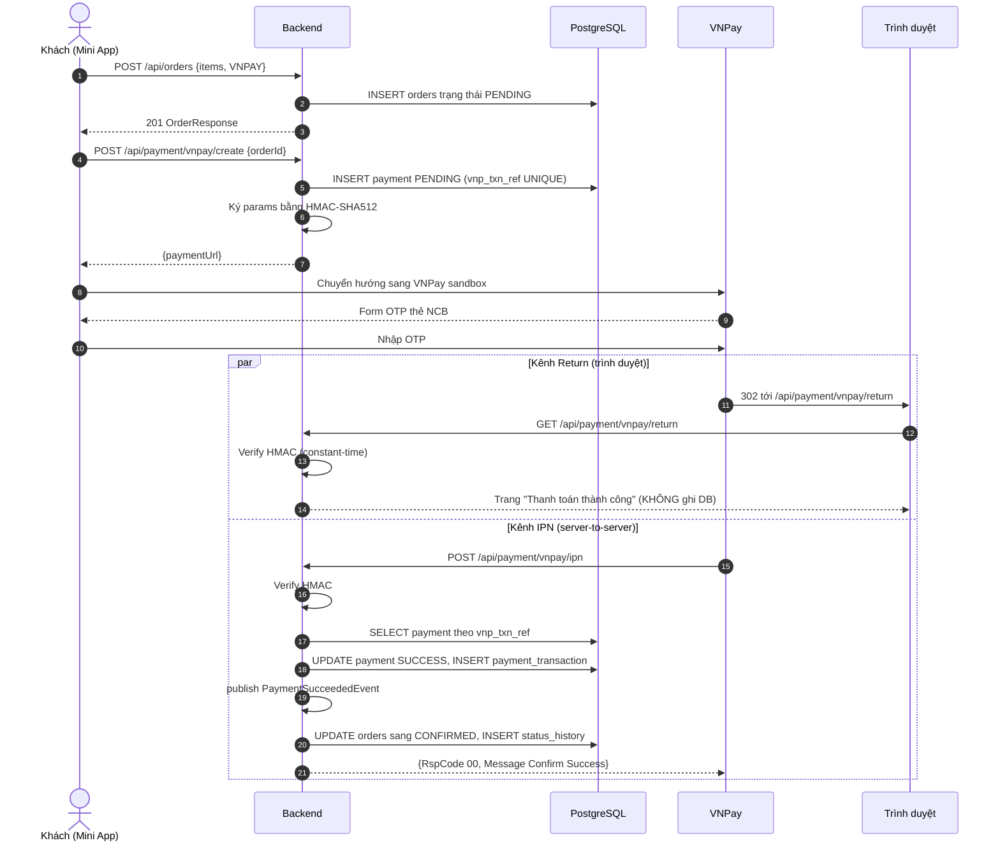
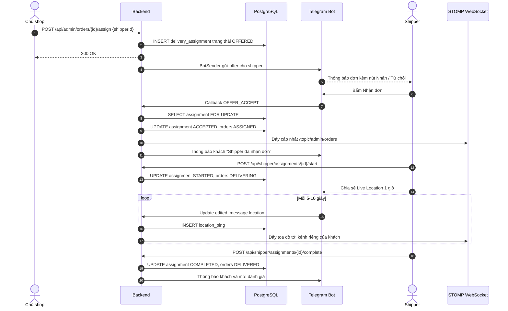
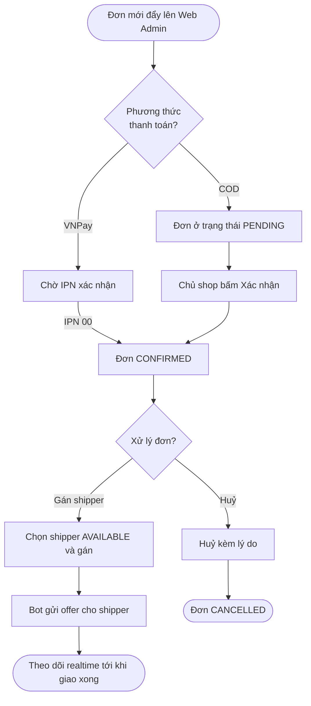
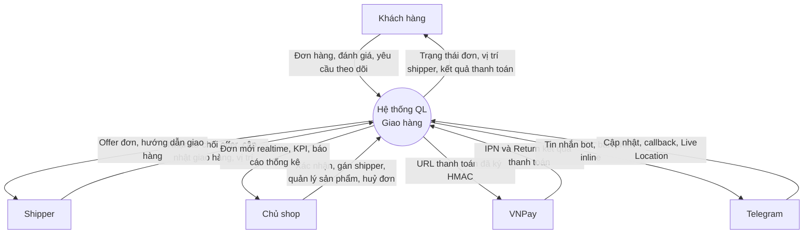
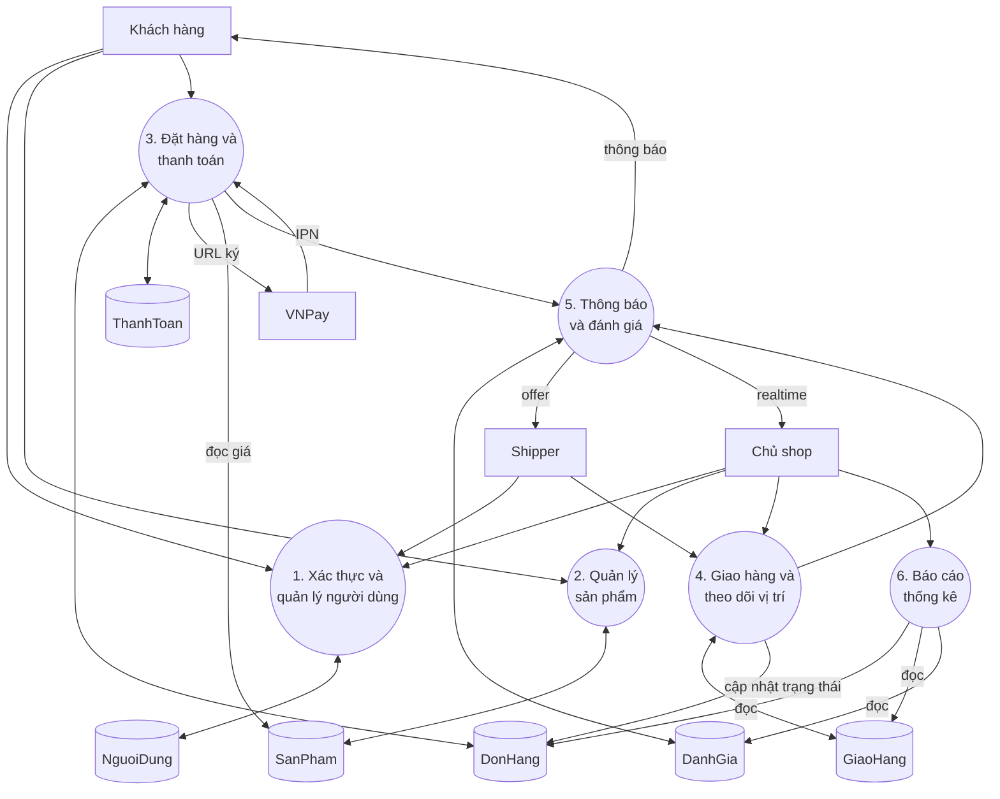
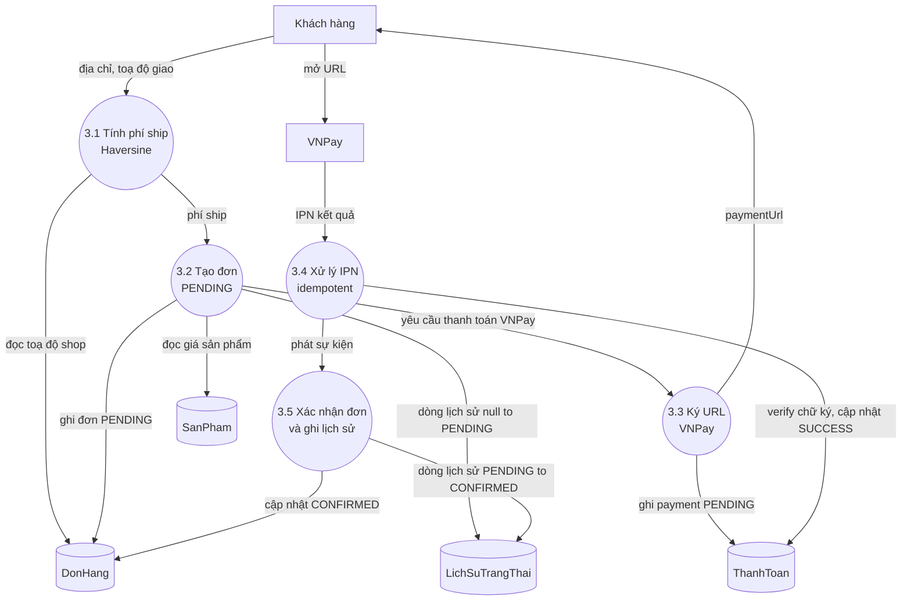

# CHƯƠNG 2: PHÂN TÍCH HỆ THỐNG

Chương này trình bày quá trình phân tích hệ thống quản lý giao hàng tích hợp Telegram Mini App, Web Admin và cổng thanh toán VNPay. Nội dung được tổ chức theo trình tự phương pháp luận phân tích hệ thống phần mềm cổ điển: xác định và gom nhóm các chức năng, xây dựng sơ đồ phân cấp chức năng, mô tả quy trình xử lý nghiệp vụ, đặc tả chi tiết các use case trọng yếu và cuối cùng là biểu diễn dòng dữ liệu qua sơ đồ luồng dữ liệu (Data Flow Diagram — DFD) ở ba mức: khung cảnh, mức đỉnh và mức dưới đỉnh.

Hệ thống phục vụ ba vai trò người dùng chính với ranh giới trách nhiệm rõ ràng: **Khách hàng** đặt hàng và theo dõi đơn qua Telegram Mini App, **Shipper** nhận và thực hiện giao hàng qua Telegram Bot kết hợp Mini App, **Chủ shop** điều phối và quản trị toàn hệ thống qua Web Admin trên trình duyệt. Toàn bộ vòng đời của một đơn hàng được điều khiển bởi một máy trạng thái hữu hạn (Finite State Machine — FSM) gồm bảy trạng thái: `PENDING`, `CONFIRMED`, `ASSIGNED`, `DELIVERING`, `DELIVERED`, cùng với hai nhánh kết thúc bất thường là `CANCELLED` và `RETURNED`. Máy trạng thái này là xương sống nghiệp vụ, ràng buộc mọi chuyển dịch trạng thái đơn hàng phải tuân theo các đường đi hợp lệ đã được định nghĩa trước, ngăn chặn các thao tác trái phép hoặc sai trình tự.

## 2.1. Phân tích hệ thống

### 2.1.1. Xác định và gom các chức năng

Xuất phát từ các yêu cầu chức năng đã khảo sát, hệ thống được phân rã thành các chức năng đơn lẻ, sau đó gom nhóm theo hai chiều: theo **vai trò người dùng** (để làm rõ trách nhiệm của từng tác nhân) và theo **phân hệ nghiệp vụ** (để phục vụ thiết kế mô-đun). Mục này trình bày cách gom theo vai trò; sơ đồ phân cấp ở mục 2.1.2 sẽ gom theo phân hệ.

**a) Nhóm chức năng của Khách hàng**

Khách hàng là người dùng cuối tương tác với hệ thống hoàn toàn qua Telegram Mini App và bot Telegram, không cần cài đặt thêm bất kỳ ứng dụng nào. Các chức năng của khách hàng gồm:

- **Đăng nhập tự động qua Telegram.** Khi khách mở Mini App, hệ thống xác thực danh tính qua chuỗi `initData` được Telegram ký bằng HMAC-SHA256, không yêu cầu nhập tài khoản hay mật khẩu.
- **Duyệt danh mục sản phẩm.** Khách xem danh sách sản phẩm còn hiệu lực kèm hình ảnh, mô tả, giá và tình trạng còn hàng.
- **Quản lý giỏ hàng.** Khách thêm, sửa số lượng, xoá sản phẩm trong giỏ; trạng thái giỏ được lưu cục bộ trên `localStorage` thông qua Zustand.
- **Đặt đơn COD.** Khách nhập địa chỉ giao, ghim toạ độ trên bản đồ, chọn thanh toán tiền mặt khi nhận hàng.
- **Đặt đơn và thanh toán VNPay.** Khách chọn phương thức thanh toán điện tử, được chuyển hướng sang cổng VNPay để hoàn tất giao dịch.
- **Xem lịch sử đơn hàng.** Khách xem danh sách đơn đã đặt và chi tiết từng đơn.
- **Theo dõi vị trí shipper thời gian thực.** Khi đơn đang ở trạng thái giao (`DELIVERING`), khách theo dõi vị trí shipper di chuyển trên bản đồ Leaflet.
- **Huỷ đơn.** Khách chủ động huỷ đơn khi đơn còn ở trạng thái `PENDING` hoặc `CONFIRMED`.
- **Đánh giá shipper.** Sau khi đơn được giao thành công (`DELIVERED`), khách chấm điểm shipper từ 1 đến 5 sao kèm bình luận tuỳ chọn thông qua bot Telegram.

**b) Nhóm chức năng của Shipper**

Shipper là nhân viên giao hàng nội bộ của shop, tương tác qua bot Telegram (nhận thông báo, bấm nút inline) kết hợp Mini App (cập nhật trạng thái, xem chi tiết). Các chức năng gồm:

- **Nhận hoặc từ chối offer đơn.** Khi được chủ shop gán đơn, shipper nhận thông báo qua bot kèm bàn phím inline hai nút `[Nhận đơn]` và `[Từ chối]`.
- **Bắt đầu giao hàng.** Shipper bấm "Bắt đầu giao" để chuyển đơn sang trạng thái giao và bắt đầu hành trình.
- **Chia sẻ Live Location.** Shipper chia sẻ vị trí trực tiếp qua Telegram trong suốt quá trình giao; mỗi cập nhật vị trí được hệ thống ghi nhận thành một `location_ping`.
- **Đánh dấu đã giao.** Shipper xác nhận đã giao hàng thành công, kết thúc assignment.
- **Báo cáo sự cố giao hàng.** Trường hợp không liên lạc được khách, shipper báo cáo để chuyển đơn sang trạng thái hoàn trả (`RETURNED`).
- **Chuyển trạng thái sẵn sàng.** Shipper bật/tắt trạng thái `AVAILABLE`/`OFFLINE` để hệ thống biết có thể gán đơn hay không.

**c) Nhóm chức năng của Chủ shop**

Chủ shop quản trị toàn hệ thống qua Web Admin, xác thực bằng email và mật khẩu với cơ chế JWT. Các chức năng gồm:

- **Đăng nhập Web Admin.** Chủ shop đăng nhập bằng email và mật khẩu, hệ thống trả về cặp access token (JWT hạn 15 phút) và refresh token (lưu trong cơ sở dữ liệu, hạn 7 ngày).
- **Xem dashboard.** Chủ shop xem các chỉ số vận hành quan trọng (KPI) và ba biểu đồ: doanh thu theo ngày, top shipper, tỉ lệ huỷ đơn.
- **Quản lý đơn hàng thời gian thực.** Chủ shop xem danh sách đơn, lọc theo trạng thái và khoảng ngày, nhận đơn mới đẩy về theo thời gian thực qua WebSocket.
- **Xác nhận đơn COD.** Chủ shop xác nhận các đơn thanh toán tiền mặt để chuyển từ `PENDING` sang `CONFIRMED`.
- **Gán shipper cho đơn.** Chủ shop chọn shipper phù hợp và gán đơn, kích hoạt luồng offer qua bot.
- **Huỷ đơn.** Chủ shop huỷ đơn kèm lý do ở các trạng thái cho phép.
- **Quản lý sản phẩm.** Chủ shop thêm, sửa, xoá sản phẩm (CRUD).
- **Quản lý và duyệt shipper.** Chủ shop duyệt shipper đăng ký mới, khoá và mở khoá shipper.
- **Xem báo cáo thống kê.** Chủ shop xem báo cáo doanh thu, top shipper theo doanh thu và tỉ lệ huỷ theo khoảng thời gian tuỳ chọn.

Việc gom nhóm theo vai trò cho thấy ba tác nhân có mối liên hệ tuần tự chặt chẽ: khách hàng khởi tạo nhu cầu (đặt đơn), chủ shop điều phối (xác nhận, gán), shipper thực thi (giao hàng), và vòng lặp khép lại khi khách đánh giá. Chính sự đan xen này đòi hỏi một cơ chế đồng bộ trạng thái xuyên suốt — được hiện thực bằng máy trạng thái đơn hàng bảy trạng thái.

### 2.1.2. Sơ đồ phân cấp chức năng

Sau khi gom theo vai trò, các chức năng được tổ chức lại theo phân hệ nghiệp vụ để phục vụ thiết kế kiến trúc. Toàn hệ thống được phân rã theo cây phân cấp: cấp gốc là **Hệ thống quản lý giao hàng**, cấp hai là sáu phân hệ nghiệp vụ, cấp ba là các chức năng con cụ thể. Sơ đồ phân cấp chức năng (Function Hierarchy Diagram) dưới đây thể hiện cấu trúc phân rã đó.

```mermaid
graph TD
  ROOT[Hệ thống quản lý giao hàng]

  ROOT --> A[1. Quản lý người dùng<br/>và xác thực]
  ROOT --> B[2. Quản lý sản phẩm<br/>và đơn hàng]
  ROOT --> C[3. Đặt hàng<br/>và thanh toán]
  ROOT --> D[4. Giao hàng và<br/>theo dõi vị trí]
  ROOT --> E[5. Thông báo<br/>và đánh giá]
  ROOT --> F[6. Báo cáo<br/>thống kê]

  A --> A1[1.1 Đăng nhập Mini App<br/>qua Telegram initData]
  A --> A2[1.2 Đăng nhập Web Admin<br/>bằng JWT]
  A --> A3[1.3 Đăng ký và duyệt shipper]
  A --> A4[1.4 Quản lý vai trò<br/>và phân quyền]

  B --> B1[2.1 CRUD sản phẩm]
  B --> B2[2.2 Duyệt danh mục<br/>và giỏ hàng]
  B --> B3[2.3 Quản lý vòng đời đơn<br/>máy trạng thái 7 trạng thái]
  B --> B4[2.4 Ghi lịch sử trạng thái]

  C --> C1[3.1 Đặt đơn COD]
  C --> C2[3.2 Đặt đơn VNPay]
  C --> C3[3.3 Tính phí ship Haversine]
  C --> C4[3.4 Xử lý IPN thanh toán]
  C --> C5[3.5 Hết hạn thanh toán]

  D --> D1[4.1 Gán shipper cho đơn]
  D --> D2[4.2 Nhận / từ chối offer]
  D --> D3[4.3 Bắt đầu giao và đánh dấu đã giao]
  D --> D4[4.4 Ghi nhận Live Location ping]
  D --> D5[4.5 Bản đồ tracking realtime]

  E --> E1[5.1 Thông báo realtime WebSocket]
  E --> E2[5.2 Thông báo qua bot Telegram]
  E --> E3[5.3 Đánh giá shipper 1-5 sao]
  E --> E4[5.4 Bình luận đánh giá qua FSM hội thoại]

  F --> F1[6.1 Dashboard KPI]
  F --> F2[6.2 Báo cáo doanh thu]
  F --> F3[6.3 Top shipper]
  F --> F4[6.4 Tỉ lệ huỷ đơn]
```

Sơ đồ phân cấp trên phản ánh nguyên tắc gom nhóm theo miền nghiệp vụ (bounded context) đã áp dụng khi thiết kế kiến trúc: mỗi phân hệ cấp hai tương ứng gần như một-một với một mô-đun trong kiến trúc Modular Monolith. Cụ thể, phân hệ "Quản lý người dùng và xác thực" ánh xạ sang mô-đun `auth`; "Quản lý sản phẩm và đơn hàng" và "Đặt hàng và thanh toán" ánh xạ sang `order` và `payment`; "Giao hàng và theo dõi vị trí" ánh xạ sang `delivery`; "Thông báo và đánh giá" ánh xạ sang `notification` và `bot`; "Báo cáo thống kê" nằm trong `delivery`. Cách phân rã này bảo đảm mỗi chức năng con đều có một chủ sở hữu rõ ràng, tránh chồng chéo trách nhiệm.

## 2.2. Quy trình xử lý các chức năng

Mục này mô tả bằng lời kết hợp sơ đồ cho năm quy trình nghiệp vụ trọng tâm của hệ thống. Đây là các quy trình có độ phức tạp cao, liên quan nhiều tác nhân và nhiều bước chuyển trạng thái, do đó cần được phân tích kỹ trước khi đặc tả use case.

### 2.2.1. Quy trình đặt đơn COD

Đây là quy trình đặt hàng đơn giản nhất, không liên quan cổng thanh toán điện tử. Diễn biến như sau: khách hàng từ giỏ hàng chuyển sang trang Checkout, nhập địa chỉ giao và ghim toạ độ trên bản đồ Leaflet, nhập số điện thoại liên hệ. Hệ thống tính phí ship theo công thức Haversine dựa trên khoảng cách từ điểm xuất phát (lấy từ cấu hình shop) đến điểm giao. Khách chọn phương thức COD và bấm "Xác nhận".

Khi nhận yêu cầu, backend xác thực chuỗi `initData`, tính lại phí ship phía máy chủ (không tin phí do client gửi lên), tạo bản ghi đơn hàng ở trạng thái `PENDING` cùng các dòng sản phẩm và một dòng lịch sử trạng thái đầu tiên (`null → PENDING`), tất cả trong một giao dịch cơ sở dữ liệu. Sau khi giao dịch commit thành công, một trình lắng nghe sự kiện dạng `AFTER_COMMIT` sẽ đẩy đơn mới lên Web Admin qua WebSocket và gửi thông báo cho chủ shop qua bot. Việc đặt các tác dụng phụ (thông báo, đẩy WebSocket) sau thời điểm commit đảm bảo không có thông báo giả nào được phát đi nếu giao dịch bị rollback.

### 2.2.2. Quy trình đặt đơn và thanh toán VNPay với IPN

Quy trình thanh toán VNPay phức tạp hơn đáng kể do có sự tham gia của cổng thanh toán bên ngoài và hai kênh phản hồi song song: **Return URL** (trình duyệt khách được chuyển hướng về) và **IPN — Instant Payment Notification** (VNPay gọi server-to-server đến backend). Nguyên tắc thiết kế cốt lõi là **IPN là nguồn sự thật duy nhất** để cập nhật trạng thái thanh toán; Return URL chỉ dùng để hiển thị kết quả cho khách và tuyệt đối không cập nhật cơ sở dữ liệu. Nguyên tắc này chống lại lỗi bảo mật phổ biến khi lập trình viên tin tưởng Return URL — vốn có thể bị người dùng giả mạo bằng cách sửa tham số trên URL.

Diễn biến: khách đặt đơn với phương thức VNPay, backend tạo đơn `PENDING`; sau đó khách gọi tạo thanh toán, backend tạo bản ghi payment `PENDING` với mã tham chiếu giao dịch `vnp_txn_ref` duy nhất (định dạng `<mã đơn>-<epochMs>`, chống replay), ký URL thanh toán bằng HMAC-SHA512 và trả về `paymentUrl`. Mini App mở URL này để chuyển khách sang cổng VNPay sandbox. Khách nhập OTP và hoàn tất. VNPay phản hồi qua hai kênh song song: kênh Return chuyển trình duyệt về `/api/payment/vnpay/return` (backend chỉ verify chữ ký rồi hiển thị trang kết quả); kênh IPN gọi `/api/payment/vnpay/ipn` — backend verify chữ ký HMAC bằng so sánh thời gian hằng số, tra bản ghi payment theo `vnp_txn_ref`, cập nhật trạng thái payment sang `SUCCESS`, ghi audit vào `payment_transaction` với payload thô dạng JSONB, rồi phát sự kiện `PaymentSucceededEvent`. Trình lắng nghe (chạy trong giao dịch mới) cập nhật đơn sang `CONFIRMED` và ghi lịch sử trạng thái. Cuối cùng backend trả cho VNPay mã phản hồi `{RspCode: "00"}`. Nếu khách thoát Mini App giữa chừng, đơn vẫn ở `PENDING`; sau 15 phút, một scheduler đánh dấu payment là `FAILED`.

Sơ đồ tuần tự dưới đây mô tả hai kênh song song của luồng VNPay:

### 2.2.3. Quy trình gán shipper, giao hàng và chia sẻ Live Location

Đây là quy trình dài nhất và có nhiều tác nhân nhất, trải qua bốn giai đoạn: gán — nhận — giao — hoàn tất. Chủ shop chọn một shipper và gán đơn; backend tạo một bản ghi `delivery_assignment` ở trạng thái `OFFERED` và phát sự kiện, sau đó bot gửi shipper thông báo kèm bàn phím inline hai nút. Shipper bấm "Nhận"; bot gửi callback về backend. Backend khoá bản ghi assignment để chống tranh chấp, kiểm tra shipper không đang giao một đơn khác (ràng buộc bởi partial unique index `uq_assignment_shipper_started` ở tầng cơ sở dữ liệu), chuyển assignment sang `ACCEPTED` và đơn sang `ASSIGNED`, đẩy cập nhật lên Web Admin và thông báo cho khách.

Khi shipper bấm "Bắt đầu giao", backend chuyển assignment sang `STARTED` và đơn sang `DELIVERING`. Bot hướng dẫn shipper chia sẻ Live Location. Từ thời điểm này, mỗi 5–10 giây Telegram bắn một cập nhật vị trí đến webhook; bộ xử lý `LiveLocationHandler` tra cứu assignment `STARTED` của shipper để định tuyến, lưu một `location_ping` và phát sự kiện. Một bộ phát tin (`LocationBroadcaster`, chạy sau khi giao dịch commit) đẩy toạ độ qua STOMP đến kênh riêng của khách; Mini App khách nhận và cập nhật vị trí marker shipper trên bản đồ. Khi đến nơi, shipper bấm "Đã giao"; backend chuyển assignment sang `COMPLETED`, đơn sang `DELIVERED`, tăng biến đếm số đơn đã giao của shipper và đặt shipper về trạng thái `AVAILABLE`. Bot gửi khách bàn phím inline năm sao để đánh giá.

Sơ đồ tuần tự dưới đây mô tả toàn bộ quy trình gán và giao đơn:

### 2.2.4. Quy trình đánh giá shipper

Sau khi đơn được giao thành công, bot chủ động gửi khách một bàn phím inline gồm năm nút sao và một nút "Bỏ qua". Khách bấm số sao N (1 ≤ N ≤ 5); bot gửi callback `RATE:<orderId>:<N>`. Backend chèn một dòng đánh giá vào bảng `rating` (ràng buộc UNIQUE trên `order_id` để chống đánh giá trùng một đơn), sau đó tính lại điểm trung bình và số lượng đánh giá của shipper bằng truy vấn tổng hợp trên toàn bộ đánh giá của shipper đó (không dùng phép cộng tăng dần để tránh sai số tích luỹ), rồi cập nhật vào hồ sơ shipper. Bot chỉnh sửa tin nhắn gốc để gỡ bàn phím và hiển thị lời cảm ơn.

Tiếp theo, hệ thống chuyển khách sang trạng thái hội thoại `CUSTOMER_RATING_COMMENT` (lưu `{orderId}` vào cột JSONB của bảng trạng thái hội thoại) và mời khách nhập bình luận hoặc gõ `/skip`. Nếu khách gõ văn bản, một bộ xử lý ưu tiên cao sẽ bắt văn bản này trước các bộ xử lý khác, cập nhật cột bình luận của đánh giá rồi xoá trạng thái hội thoại. Nếu khách gõ `/skip`, hệ thống chỉ xoá trạng thái hội thoại. Cơ chế FSM hội thoại này cho phép bot phân biệt được văn bản khách gõ là bình luận đánh giá hay là một lệnh khác.

### 2.2.5. Quy trình chủ shop quản lý và gán đơn

Chủ shop làm việc trên Web Admin với luồng liên tục theo thời gian thực. Khi khách đặt đơn mới, đơn được đẩy tức thì lên màn hình danh sách đơn qua WebSocket mà không cần tải lại trang. Với đơn COD ở trạng thái `PENDING`, chủ shop bấm "Xác nhận" để chuyển sang `CONFIRMED`. Với đơn VNPay, đơn tự động chuyển `CONFIRMED` khi IPN báo thanh toán thành công, nên chủ shop không cần xác nhận thủ công.

Ở trạng thái `CONFIRMED`, chủ shop mở danh sách shipper đang ở trạng thái `AVAILABLE`, chọn một shipper và gán đơn — kích hoạt quy trình offer mô tả ở mục 2.2.3. Trong suốt vòng đời đơn, mọi chuyển trạng thái đều được đẩy realtime lên Web Admin để chủ shop giám sát. Chủ shop cũng có thể huỷ đơn kèm lý do ở các trạng thái cho phép (`PENDING`, `CONFIRMED`, `ASSIGNED`); khi huỷ, cả đơn lẫn assignment (nếu có) đều được chuyển sang trạng thái `CANCELLED` một cách nhất quán. Sơ đồ dưới đây tóm tắt cây quyết định của chủ shop khi xử lý một đơn:

## 2.3. Đặc tả chức năng

Mục này đặc tả chi tiết sáu use case trọng yếu nhất theo chuẩn UML, mỗi đặc tả gồm sáu thành phần: Tên chức năng, Tác nhân, Điều kiện trước, Luồng chính (đánh số bước), Luồng thay thế và Điều kiện sau. Sáu use case được chọn vì bao phủ đầy đủ vòng đời đơn hàng và tương tác của cả ba vai trò.

### 2.3.1. Đặc tả UC — Đặt đơn

- **Tên chức năng:** Đặt đơn (COD hoặc VNPay).
- **Tác nhân:** Khách hàng.
- **Điều kiện trước:** Khách đã đăng nhập Mini App với `initData` hợp lệ; giỏ hàng có ít nhất một sản phẩm; cấu hình shop có toạ độ điểm xuất phát.
- **Luồng chính:**
  1. Khách vào trang Checkout từ giỏ hàng.
  2. Khách nhập địa chỉ giao và ghim toạ độ trên bản đồ Leaflet.
  3. Khách nhập số điện thoại liên hệ và ghi chú (tuỳ chọn).
  4. Hệ thống tính phí ship theo công thức Haversine: `delivery_fee = base_fee + max(0, distance_km − free_km) × fee_per_km`.
  5. Khách chọn phương thức thanh toán (COD hoặc VNPay).
  6. Khách bấm "Xác nhận".
  7. Nếu chọn COD: hệ thống tạo đơn ở trạng thái `PENDING`, phát sự kiện `OrderCreatedEvent`, gửi thông báo đến chủ shop qua bot và đẩy đơn mới lên Web Admin realtime.
  8. Nếu chọn VNPay: hệ thống tạo đơn `PENDING` và payment `PENDING`, ký URL VNPay và trả về `paymentUrl`; Mini App mở URL để chuyển khách sang cổng thanh toán.
- **Luồng thay thế:**
  - 4a. Khoảng cách vượt bán kính giao hàng cho phép → hệ thống trả lỗi `OUT_OF_DELIVERY_RANGE` (HTTP 422), không tạo đơn.
  - 6a. Thiếu thông tin bắt buộc → giao diện hiển thị lỗi kiểm tra dữ liệu, không gọi API.
  - 8a. Khách thoát Mini App giữa luồng VNPay → đơn vẫn ở `PENDING`; sau 15 phút, scheduler đánh dấu payment là `FAILED`.
- **Điều kiện sau:** Đơn đã được lưu bền vững ở trạng thái `PENDING`; thông báo đã gửi đến chủ shop (với COD) hoặc URL thanh toán đã sẵn sàng (với VNPay).

### 2.3.2. Đặc tả UC — Thanh toán VNPay

- **Tên chức năng:** Thanh toán đơn hàng qua cổng VNPay.
- **Tác nhân:** Khách hàng (chủ động), VNPay (hệ thống ngoài, gửi Return và IPN).
- **Điều kiện trước:** Đơn đã tồn tại ở trạng thái `PENDING`; khách đã chọn phương thức VNPay; đã tạo payment `PENDING` với `vnp_txn_ref` duy nhất.
- **Luồng chính:**
  1. Hệ thống ký các tham số thanh toán bằng HMAC-SHA512 và trả về `paymentUrl`.
  2. Mini App mở `paymentUrl`; khách được chuyển sang cổng VNPay sandbox.
  3. Khách nhập thông tin thẻ và OTP, hoàn tất giao dịch trên VNPay.
  4. VNPay chuyển trình duyệt khách về Return URL `/api/payment/vnpay/return`; backend verify chữ ký và hiển thị trang kết quả (không cập nhật cơ sở dữ liệu).
  5. Song song, VNPay gọi IPN `/api/payment/vnpay/ipn` (server-to-server).
  6. Backend verify chữ ký HMAC bằng so sánh thời gian hằng số, tra bản ghi payment theo `vnp_txn_ref`.
  7. Backend cập nhật payment sang `SUCCESS`, ghi audit vào `payment_transaction` (payload thô JSONB), phát sự kiện `PaymentSucceededEvent`.
  8. Trình lắng nghe cập nhật đơn sang `CONFIRMED` và ghi lịch sử trạng thái.
  9. Backend trả về VNPay mã phản hồi `{RspCode: "00"}`.
- **Luồng thay thế:**
  - 6a. Chữ ký không hợp lệ → backend ghi payload vào audit trail nhưng không cập nhật payment; trả mã lỗi cho VNPay.
  - 7a. IPN đến lần thứ hai cho cùng `vnp_txn_ref` (retry) → hệ thống nhận ra payment đã `SUCCESS`, xử lý idempotent, không cập nhật trùng.
  - 7b. Mã phản hồi VNPay khác `00` → cập nhật payment sang `FAILED`, đơn giữ nguyên `PENDING`.
- **Điều kiện sau:** Trạng thái payment và đơn phản ánh đúng kết quả giao dịch; mọi sự kiện VNPay đều được lưu vào audit trail.

### 2.3.3. Đặc tả UC — Shipper nhận đơn

- **Tên chức năng:** Shipper nhận (hoặc từ chối) offer đơn hàng.
- **Tác nhân:** Shipper.
- **Điều kiện trước:** Shipper đã đăng ký và được duyệt (vai trò SHIPPER, trạng thái ACTIVE); chủ shop vừa gán đơn cho shipper.
- **Luồng chính:**
  1. Backend tạo bản ghi `DeliveryAssignment` ở trạng thái `OFFERED`.
  2. Bot gửi shipper thông báo kèm bàn phím inline `[Nhận đơn]` và `[Từ chối]`.
  3. Shipper bấm "Nhận đơn"; bot gửi callback `OFFER_ACCEPT:<assignmentId>`.
  4. Backend khoá bản ghi assignment và kiểm tra: shipper không có assignment `STARTED` nào khác; assignment vẫn ở `OFFERED`.
  5. Backend chuyển assignment sang `ACCEPTED` và đơn sang `ASSIGNED`.
  6. Bot thông báo khách "Shipper [Tên] đã nhận đơn" và đẩy cập nhật lên Web Admin.
- **Luồng thay thế:**
  - 3a. Shipper bấm "Từ chối" → assignment chuyển `REJECTED`, đơn quay về hàng chờ để chủ shop gán shipper khác.
  - 4a. Shipper đã có một assignment `STARTED` khác → partial unique index từ chối, backend bắt ngoại lệ và trả lỗi "Bạn đang giao một đơn khác".
  - 4b. Assignment đã được xử lý bởi thao tác trước (tranh chấp) → backend trả lỗi "Đơn đã có shipper khác nhận" hoặc "Offer không còn hiệu lực".
- **Điều kiện sau:** Đơn ở trạng thái `ASSIGNED`; assignment ở `ACCEPTED`; khách đã nhận thông báo.

### 2.3.4. Đặc tả UC — Giao hàng và chia sẻ Live Location

- **Tên chức năng:** Giao hàng và chia sẻ vị trí trực tiếp.
- **Tác nhân:** Shipper (chính), Khách hàng (theo dõi bản đồ), Telegram (nguồn Live Location).
- **Điều kiện trước:** Assignment ở trạng thái `ACCEPTED`; shipper đã đến điểm xuất phát.
- **Luồng chính:**
  1. Shipper bấm "Bắt đầu giao" trên Mini App.
  2. Backend chuyển assignment `ACCEPTED → STARTED` và đơn `ASSIGNED → DELIVERING`.
  3. Bot gửi shipper hướng dẫn chia sẻ Live Location.
  4. Shipper chia sẻ Live Location qua Telegram (đính kèm → Location → Share Live Location for 1 hour).
  5. Telegram bắn cập nhật vị trí đầu tiên đến webhook; `LiveLocationHandler` lưu `location_ping` đầu tiên và phát sự kiện.
  6. Mỗi 5–10 giây, Telegram bắn cập nhật vị trí mới; backend lưu ping và phát sự kiện.
  7. Bộ phát tin đẩy toạ độ qua STOMP đến kênh riêng của khách.
  8. Mini App khách cập nhật vị trí marker shipper trên bản đồ Leaflet.
  9. Shipper đến nơi, bấm "Đã giao".
  10. Backend chuyển assignment `STARTED → COMPLETED`, đơn `DELIVERING → DELIVERED`, tăng biến đếm số đơn đã giao và đặt shipper về `AVAILABLE`.
  11. Bot gửi khách bàn phím năm sao để đánh giá.
- **Luồng thay thế:**
  - 4a. Shipper không chia sẻ Live Location → hệ thống vẫn hoạt động, chỉ thiếu bản đồ realtime; khách vẫn nhận cập nhật trạng thái đơn.
  - 9a. Shipper báo "Không liên lạc được khách" → assignment `STARTED → CANCELLED` và đơn `DELIVERING → RETURNED` kèm lý do.
- **Điều kiện sau:** Đơn ở trạng thái `DELIVERED`; shipper trở về `AVAILABLE`; khách nhận lời mời đánh giá.

### 2.3.5. Đặc tả UC — Đánh giá shipper

- **Tên chức năng:** Đánh giá shipper sau khi giao hàng.
- **Tác nhân:** Khách hàng.
- **Điều kiện trước:** Đơn ở trạng thái `DELIVERED`; chưa có đánh giá nào cho đơn này (ràng buộc UNIQUE trên `rating.order_id`).
- **Luồng chính:**
  1. Bot gửi khách bàn phím inline năm sao kèm nút "Bỏ qua".
  2. Khách bấm số sao N (1 ≤ N ≤ 5); bot phát callback `RATE:<orderId>:<N>`.
  3. Hệ thống chèn một dòng `rating(order_id, customer_id, shipper_id, stars=N)`.
  4. Hệ thống tính lại điểm trung bình và số lượng đánh giá của shipper từ truy vấn tổng hợp, rồi cập nhật vào hồ sơ shipper.
  5. Bot chỉnh sửa tin nhắn gốc, gỡ bàn phím và hiển thị "Cảm ơn bạn đã đánh giá N sao!".
  6. Bot mời khách nhập bình luận kèm gợi ý gõ `/skip`; hệ thống chuyển trạng thái hội thoại sang `CUSTOMER_RATING_COMMENT`, lưu `{orderId}` vào JSONB.
  7. Nếu khách gõ văn bản: bộ xử lý ưu tiên cao cập nhật cột bình luận và xoá trạng thái hội thoại.
  8. Nếu khách gõ `/skip`: hệ thống chỉ xoá trạng thái hội thoại.
- **Luồng thay thế:**
  - 3a. Đánh giá đã tồn tại cho đơn (vi phạm UNIQUE) → bot trả "Bạn đã đánh giá đơn này rồi".
  - 1a. Khách bấm "Bỏ qua" ngay từ đầu → không tạo đánh giá, kết thúc luồng.
- **Điều kiện sau:** Đánh giá được lưu; điểm trung bình của shipper đã cập nhật; trạng thái hội thoại đã được xoá.

### 2.3.6. Đặc tả UC — Chủ shop gán đơn

- **Tên chức năng:** Chủ shop gán shipper cho đơn hàng.
- **Tác nhân:** Chủ shop.
- **Điều kiện trước:** Chủ shop đã đăng nhập Web Admin (JWT hợp lệ); đơn ở trạng thái `CONFIRMED`; tồn tại ít nhất một shipper ở trạng thái `AVAILABLE`.
- **Luồng chính:**
  1. Chủ shop mở chi tiết đơn cần gán trên Web Admin.
  2. Chủ shop mở danh sách shipper đang sẵn sàng và chọn một shipper.
  3. Chủ shop gọi `POST /api/admin/orders/{id}/assign` kèm `shipperId`.
  4. Backend tạo bản ghi `delivery_assignment` ở trạng thái `OFFERED` và phát sự kiện `OrderAssignedEvent`.
  5. Sau khi giao dịch commit, bot gửi shipper offer kèm bàn phím inline.
  6. Web Admin hiển thị đơn ở trạng thái "Đã gửi offer, chờ shipper nhận".
- **Luồng thay thế:**
  - 3a. Đơn không ở trạng thái `CONFIRMED` → backend từ chối, trả lỗi trạng thái không hợp lệ.
  - 4a. Shipper được chọn không còn `AVAILABLE` → backend trả lỗi, chủ shop chọn shipper khác.
  - 5a. Shipper từ chối offer → assignment chuyển `REJECTED`, đơn quay về hàng chờ để gán lại.
- **Điều kiện sau:** Tồn tại một assignment ở trạng thái `OFFERED` cho đơn; shipper đã nhận offer qua bot.

## 2.4. Sơ đồ luồng dữ liệu (DFD)

Sơ đồ luồng dữ liệu mô tả cách dữ liệu di chuyển qua hệ thống: từ các tác nhân ngoài, qua các tiến trình xử lý, đến các kho dữ liệu và ngược lại. Mục này trình bày DFD ở ba mức phân rã dần: mức khung cảnh (context), mức đỉnh (level 0) và mức dưới đỉnh (level 1).

### 2.4.1. DFD mức khung cảnh

Ở mức khung cảnh, toàn bộ hệ thống được coi là một tiến trình trung tâm duy nhất, tương tác với năm tác nhân ngoài: **Khách hàng**, **Shipper**, **Chủ shop**, **VNPay** (cổng thanh toán) và **Telegram** (hạ tầng bot và Live Location). Sơ đồ làm rõ ranh giới hệ thống và các luồng dữ liệu chính đi vào — đi ra.

Sơ đồ mức khung cảnh cho thấy hệ thống đóng vai trò trung gian điều phối giữa ba vai trò người dùng và hai hệ thống ngoài. Đặc biệt, Telegram vừa là kênh giao tiếp của khách và shipper, vừa là nguồn cung cấp dữ liệu Live Location — một luồng dữ liệu quan trọng chảy liên tục vào hệ thống trong suốt quá trình giao hàng.

### 2.4.2. DFD mức đỉnh

Ở mức đỉnh, tiến trình trung tâm được phân rã thành sáu tiến trình chính, tương ứng sáu phân hệ nghiệp vụ, cùng sáu kho dữ liệu chính: **NguoiDung**, **SanPham**, **DonHang**, **GiaoHang**, **ThanhToan** và **DanhGia**. Sơ đồ dưới đây thể hiện các tiến trình, kho dữ liệu và luồng dữ liệu giữa chúng.

Sơ đồ mức đỉnh làm rõ vai trò trung tâm của kho **DonHang**: hầu hết các tiến trình đều đọc hoặc ghi vào kho này, phản ánh việc đơn hàng là thực thể trung tâm của toàn nghiệp vụ. Tiến trình "Báo cáo thống kê" chỉ đọc dữ liệu (không ghi), tổng hợp từ ba kho DonHang, GiaoHang và DanhGia để sinh các chỉ số cho chủ shop.

### 2.4.3. DFD mức dưới đỉnh

Ở mức dưới đỉnh, tiến trình "3. Đặt hàng và thanh toán" được phân rã thành các tiến trình con để làm rõ chi tiết xử lý bên trong. Đây là tiến trình phức tạp nhất vì bao gồm cả logic tính phí, tạo đơn và tích hợp cổng thanh toán ngoài với cơ chế IPN.

Sơ đồ mức dưới đỉnh làm rõ ba điểm thiết kế then chốt của quy trình đặt hàng và thanh toán. Thứ nhất, phí ship luôn được tính lại phía máy chủ (tiến trình 3.1) chứ không tin phí do client gửi. Thứ hai, kho **ThanhToan** chỉ được cập nhật sang `SUCCESS` bởi tiến trình xử lý IPN (3.4) — hiện thực đúng nguyên tắc IPN là nguồn sự thật duy nhất. Thứ ba, mọi chuyển trạng thái đơn đều để lại dấu vết trong kho **LichSuTrangThai**, phục vụ kiểm toán và tái hiện dòng thời gian của đơn.

## 2.5. Kết luận chương

Chương 2 đã hoàn thành việc phân tích hệ thống quản lý giao hàng theo trình tự phương pháp luận chặt chẽ. Trước hết, các chức năng được xác định và gom nhóm theo ba vai trò (khách hàng, shipper, chủ shop) rồi tổ chức lại thành sáu phân hệ nghiệp vụ qua sơ đồ phân cấp chức năng. Tiếp đó, năm quy trình nghiệp vụ trọng tâm — đặt đơn COD, đặt đơn và thanh toán VNPay với IPN, gán shipper và giao hàng kèm Live Location, đánh giá shipper, chủ shop quản lý và gán đơn — được mô tả bằng lời kết hợp sơ đồ tuần tự và lưu đồ. Sáu use case quan trọng nhất được đặc tả chi tiết theo chuẩn UML với đầy đủ tác nhân, điều kiện trước, luồng chính, luồng thay thế và điều kiện sau. Cuối cùng, dòng dữ liệu trong hệ thống được biểu diễn qua ba mức DFD, làm rõ ranh giới hệ thống, các tiến trình xử lý, sáu kho dữ liệu chính và cơ chế tích hợp cổng thanh toán VNPay.

Toàn bộ kết quả phân tích trong chương này — đặc biệt là máy trạng thái đơn hàng bảy trạng thái, ranh giới phân hệ và cấu trúc dòng dữ liệu — là cơ sở trực tiếp để Chương 3 trình bày thiết kế chi tiết kiến trúc, cơ sở dữ liệu, API và các cơ chế bảo mật của hệ thống.
