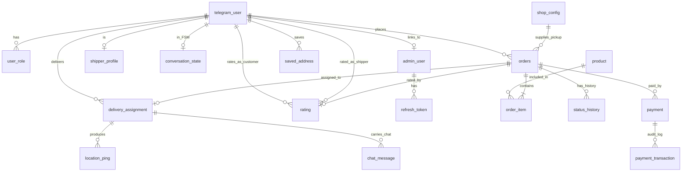
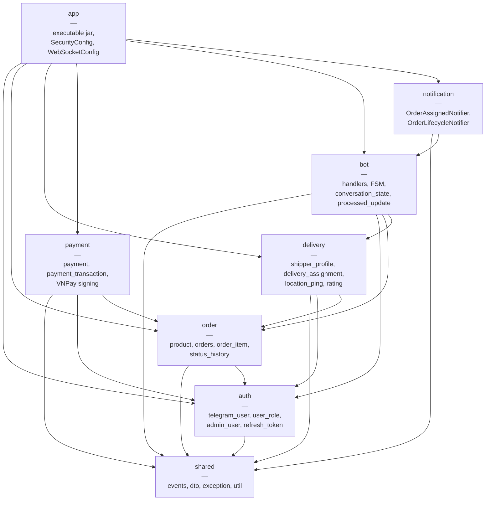
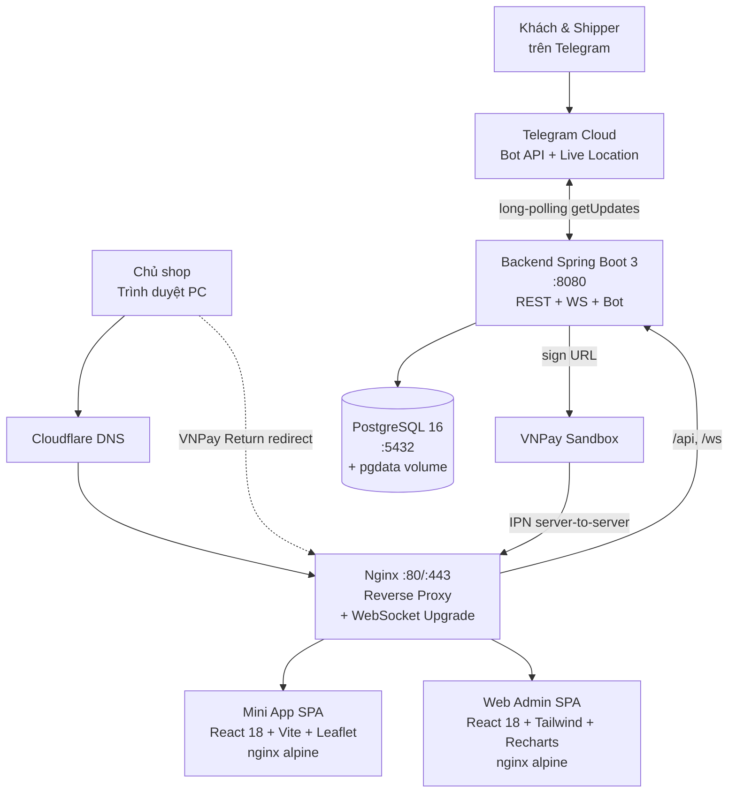
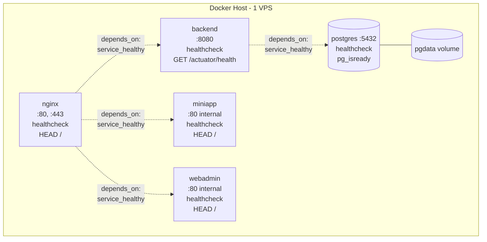
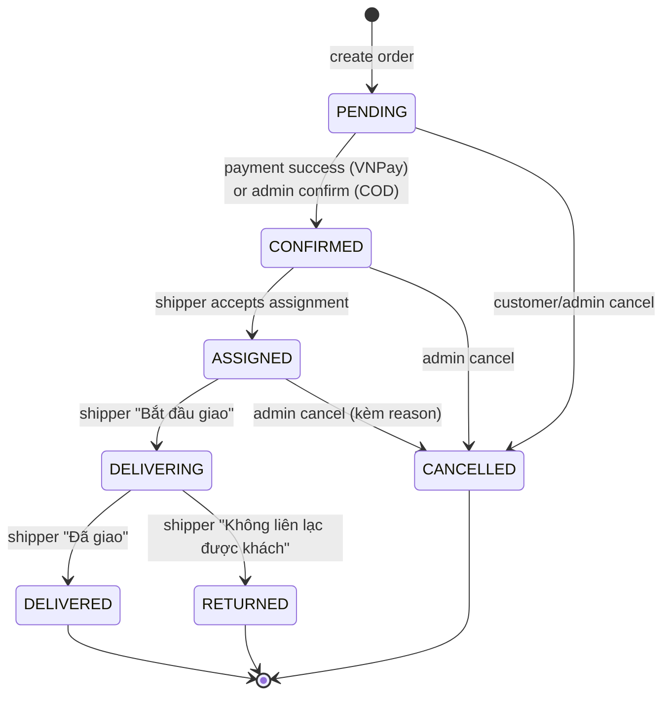
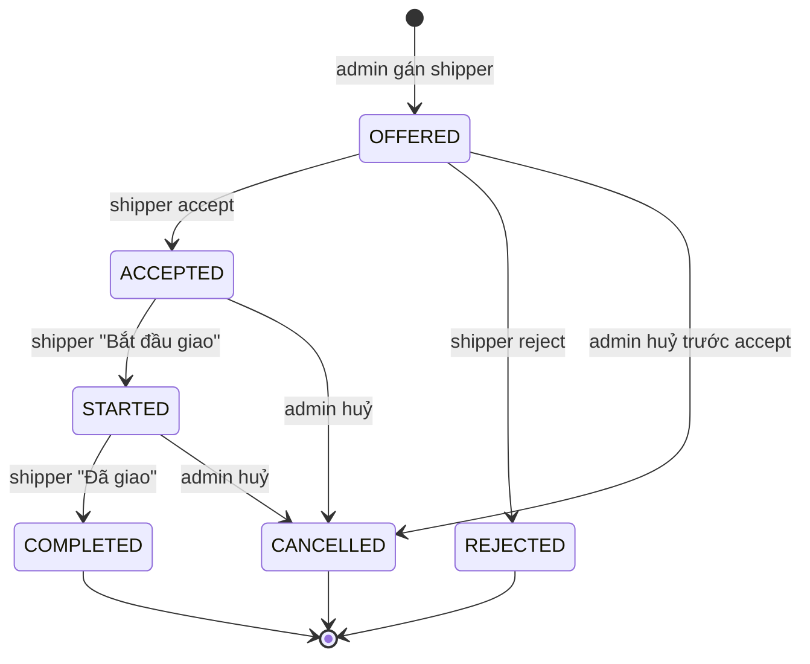
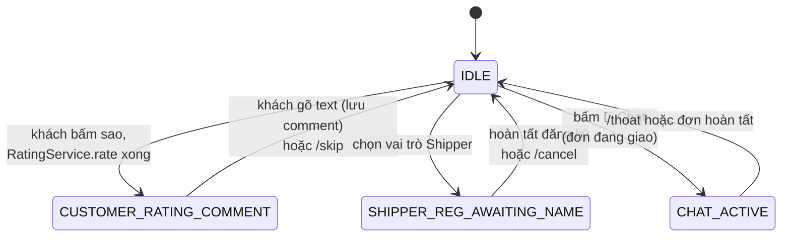

# CHƯƠNG 3: THIẾT KẾ HỆ THỐNG

Chương này trình bày thiết kế dữ liệu của hệ thống quản lý giao hàng dựa trên nền tảng Telegram và cổng thanh toán VNPay. Toàn bộ dữ liệu nghiệp vụ được lưu trữ trong một cơ sở dữ liệu quan hệ PostgreSQL 16, gồm khoảng mười bảy bảng chính, được tạo lập và tiến hoá tuần tự bằng công cụ quản lý phiên bản lược đồ Flyway thông qua các tập tin di trú (migration) đánh số từ V1 đến V17. Nội dung chương được tổ chức thành sáu phần lớn: hai phần đầu trình bày thiết kế dữ liệu ở mức khái niệm và mức logic — bao gồm mô hình thực thể liên kết (ERD), đặc tả chi tiết từng bảng và mô hình quan hệ; bốn phần tiếp theo lần lượt trình bày thiết kế kiến trúc tổng thể theo phong cách Modular Monolith, thiết kế giao diện lập trình ứng dụng (API), thiết kế các máy trạng thái hữu hạn điều khiển vòng đời nghiệp vụ, và thiết kế bảo mật theo nguyên tắc phòng thủ nhiều lớp.

## 3.1. Phân tích và thiết kế dữ liệu

### 3.1.1. Mô hình thực thể liên kết (ERD)

Mô hình thực thể liên kết (Entity Relationship Diagram — ERD) là công cụ mô hình hoá dữ liệu ở mức khái niệm, biểu diễn các thực thể (entity) trong hệ thống cùng các mối quan hệ (relationship) giữa chúng mà chưa đi sâu vào kiểu dữ liệu hay ràng buộc cụ thể. Sơ đồ dưới đây được tái sử dụng và mở rộng từ thiết kế lược đồ cơ sở dữ liệu của hệ thống, thể hiện đầy đủ mười chín thực thể chính và các quan hệ giữa chúng.

Các thực thể chính trong mô hình được diễn giải như sau.

**telegram_user** là thực thể trung tâm của toàn bộ hệ thống. Mỗi bản ghi tương ứng với một người dùng Telegram duy nhất, được định danh bằng chính mã số người dùng do Telegram cấp. Đây là điểm hội tụ của nhiều quan hệ: một người dùng có thể được gán một hoặc nhiều vai trò (`user_role`), có thể là chủ tài khoản quản trị (`admin_user`), có thể là một shipper với hồ sơ nghề nghiệp riêng (`shipper_profile`), có thể đang trong một trạng thái hội thoại của bot (`conversation_state`), và với tư cách khách hàng có thể tạo nhiều đơn hàng (`orders`) cũng như đưa ra nhiều lượt đánh giá (`rating`).

**user_role** biểu diễn quan hệ nhiều–nhiều đã được phân giải giữa người dùng và vai trò trong hệ thống. Một người dùng có thể đồng thời giữ nhiều vai trò khác nhau (ví dụ vừa là khách hàng vừa là shipper), và mỗi cặp người dùng–vai trò là duy nhất.

**product** là danh mục sản phẩm được chào bán. Mỗi sản phẩm có thể xuất hiện trong nhiều dòng đơn hàng khác nhau thông qua thực thể trung gian `order_item`.

**orders** là đơn hàng — thực thể nghiệp vụ cốt lõi. Một đơn hàng do một khách hàng tạo ra, chứa một hoặc nhiều dòng sản phẩm (`order_item`), sinh ra một chuỗi lịch sử chuyển trạng thái (`status_history`), có thể được gán tối đa một phiên giao hàng (`delivery_assignment`), có thể phát sinh một hoặc nhiều lần thanh toán (`payment`) và có thể nhận tối đa một lượt đánh giá (`rating`).

**delivery_assignment** là phiên gán shipper cho một đơn hàng. Quan hệ giữa đơn hàng và phiên gán là một–một (một đơn chỉ có tối đa một phiên gán còn hiệu lực). Mỗi phiên gán khi shipper chia sẻ vị trí trực tiếp sẽ sinh ra một chuỗi các điểm định vị (`location_ping`).

**payment** và **payment_transaction** hình thành hai lớp của mô hình thanh toán: `payment` ghi trạng thái thanh toán tổng thể của một đơn, còn `payment_transaction` là nhật ký kiểm toán (audit log) lưu vết mọi sự kiện tương tác với VNPay.

**rating** ghi nhận đánh giá của khách hàng đối với shipper sau khi đơn hàng đã giao thành công. Thực thể này tham chiếu đồng thời tới đơn hàng, tới người dùng đóng vai khách hàng và tới người dùng đóng vai shipper.

Các thực thể phụ trợ gồm: **admin_user** (tài khoản quản trị Web Admin) cùng **refresh_token** (token làm mới phiên đăng nhập); **conversation_state** và **processed_update** phục vụ cơ chế máy trạng thái hội thoại và bảo đảm tính bất biến (idempotency) của bot; và **shop_config** là bản ghi cấu hình đơn nhất (singleton) lưu toạ độ điểm lấy hàng và tham số tính phí giao hàng.

### 3.1.2. Mô hình thực thể logic

Mô hình thực thể logic đặc tả chi tiết từng bảng ở mức có thể hiện thực trực tiếp trên hệ quản trị cơ sở dữ liệu, bao gồm tên cột, kiểu dữ liệu và các ràng buộc/khoá đi kèm. Toàn bộ đặc tả dưới đây phản ánh trung thực các tập tin di trú Flyway V1–V17 của hệ thống. Quy ước ký hiệu: **PK** — khoá chính (Primary Key); **FK** — khoá ngoại (Foreign Key); **UQ** — ràng buộc duy nhất (Unique); **NN** — không rỗng (Not Null); **CK** — ràng buộc kiểm tra (Check).

#### a) Bảng `telegram_user` (V2)

Lưu thông tin người dùng Telegram. Khoá chính là mã số người dùng do Telegram cấp (không tự sinh).

| Tên cột | Kiểu dữ liệu | Ràng buộc / Khoá |
|---|---|---|
| id | BIGINT | PK (= Telegram user ID) |
| username | VARCHAR(64) | — |
| first_name | VARCHAR(128) | — |
| last_name | VARCHAR(128) | — |
| phone | VARCHAR(32) | — |
| photo_url | TEXT | — |
| language_code | VARCHAR(8) | — |
| is_blocked | BOOLEAN | NN, mặc định FALSE |
| created_at | TIMESTAMPTZ | NN, mặc định NOW() |
| updated_at | TIMESTAMPTZ | NN, mặc định NOW() |

Chỉ mục bộ phận: `idx_telegram_user_username` trên `username` với điều kiện `WHERE username IS NOT NULL`.

#### b) Bảng `user_role` (V2)

Gán vai trò cho người dùng. Phân giải quan hệ nhiều–nhiều giữa người dùng và tập vai trò.

| Tên cột | Kiểu dữ liệu | Ràng buộc / Khoá |
|---|---|---|
| id | BIGSERIAL | PK |
| telegram_user_id | BIGINT | NN, FK → telegram_user(id) ON DELETE CASCADE |
| role | VARCHAR(16) | NN — CUSTOMER \| SHIPPER \| SHOP_OWNER |
| status | VARCHAR(16) | NN, mặc định 'ACTIVE' — ACTIVE \| PENDING \| BLOCKED |
| assigned_at | TIMESTAMPTZ | NN, mặc định NOW() |

Ràng buộc duy nhất: `uq_user_role` UNIQUE `(telegram_user_id, role)`. Chỉ mục: `idx_user_role_lookup` trên `(telegram_user_id, status)`.

#### c) Bảng `admin_user` (V5)

Tài khoản đăng nhập Web Admin của chủ shop, xác thực bằng email và mật khẩu băm BCrypt.

| Tên cột | Kiểu dữ liệu | Ràng buộc / Khoá |
|---|---|---|
| id | BIGSERIAL | PK |
| email | VARCHAR(255) | NN, UQ |
| password_hash | VARCHAR(255) | NN (BCrypt-10) |
| full_name | VARCHAR(128) | — |
| telegram_user_id | BIGINT | FK → telegram_user(id) |
| is_active | BOOLEAN | NN, mặc định TRUE |
| created_at | TIMESTAMPTZ | NN, mặc định NOW() |
| updated_at | TIMESTAMPTZ | NN, mặc định NOW() |

Chỉ mục bộ phận: `idx_admin_user_active` trên `is_active` với `WHERE is_active = TRUE`.

#### d) Bảng `refresh_token` (V5)

Lưu refresh token của phiên đăng nhập Web Admin. Chỉ lưu giá trị băm (SHA-256), không lưu bản rõ.

| Tên cột | Kiểu dữ liệu | Ràng buộc / Khoá |
|---|---|---|
| id | UUID | PK |
| admin_user_id | BIGINT | NN, FK → admin_user(id) ON DELETE CASCADE |
| token_hash | VARCHAR(255) | NN, UQ (SHA-256) |
| expires_at | TIMESTAMPTZ | NN |
| revoked | BOOLEAN | NN, mặc định FALSE |
| created_at | TIMESTAMPTZ | NN, mặc định NOW() |

Chỉ mục: `idx_refresh_token_user` trên `admin_user_id`; `idx_refresh_token_expiry` trên `expires_at` với `WHERE revoked = FALSE`.

#### e) Bảng `product` (V4)

Danh mục sản phẩm.

| Tên cột | Kiểu dữ liệu | Ràng buộc / Khoá |
|---|---|---|
| id | BIGSERIAL | PK |
| name | VARCHAR(255) | NN |
| description | TEXT | — |
| price | NUMERIC(12,2) | NN, CK (price >= 0) |
| image_url | TEXT | — |
| stock | INT | NN, mặc định 0, CK (stock >= 0) |
| is_active | BOOLEAN | NN, mặc định TRUE |
| created_at | TIMESTAMPTZ | NN, mặc định NOW() |
| updated_at | TIMESTAMPTZ | NN, mặc định NOW() |

Chỉ mục bộ phận: `idx_product_active` trên `is_active` với `WHERE is_active = TRUE`.

#### f) Bảng `orders` (V4)

Đơn hàng — thực thể nghiệp vụ trung tâm. Khoá chính dạng UUID nhằm chống dò tuần tự (enumeration). Nhiều trường được lưu dưới dạng bản chụp (snapshot) tại thời điểm tạo đơn.

| Tên cột | Kiểu dữ liệu | Ràng buộc / Khoá |
|---|---|---|
| id | UUID | PK |
| code | VARCHAR(32) | NN, UQ (dạng "DH<yyyyMMdd>-<seq>") |
| customer_id | BIGINT | NN, FK → telegram_user(id) |
| customer_name | VARCHAR(128) | — (snapshot) |
| customer_phone | VARCHAR(32) | — (snapshot) |
| pickup_lat | NUMERIC(10,7) | NN |
| pickup_lng | NUMERIC(10,7) | NN |
| delivery_address | TEXT | NN |
| delivery_lat | NUMERIC(10,7) | NN |
| delivery_lng | NUMERIC(10,7) | NN |
| distance_km | NUMERIC(8,3) | NN, CK (distance_km >= 0) |
| subtotal | NUMERIC(12,2) | NN, CK (subtotal >= 0) |
| delivery_fee | NUMERIC(12,2) | NN, CK (delivery_fee >= 0) |
| total | NUMERIC(12,2) | NN, CK (total >= 0) |
| payment_method | VARCHAR(16) | NN — COD \| VNPAY |
| payment_status | VARCHAR(16) | NN, mặc định 'PENDING' — PENDING \| SUCCESS \| FAILED \| REFUNDED |
| status | VARCHAR(16) | NN, mặc định 'PENDING' |
| note | TEXT | — |
| version | INT | NN, mặc định 0 (khoá lạc quan @Version) |
| created_at | TIMESTAMPTZ | NN, mặc định NOW() |
| updated_at | TIMESTAMPTZ | NN, mặc định NOW() |

Chỉ mục ghép: `idx_orders_status_created` trên `(status, created_at DESC)`; `idx_orders_customer_created` trên `(customer_id, created_at DESC)`.

#### g) Bảng `order_item` (V4)

Dòng sản phẩm trong đơn. Đơn giá được chụp lại từ `product.price` tại thời điểm tạo đơn để tránh biến động giá về sau ảnh hưởng đơn cũ.

| Tên cột | Kiểu dữ liệu | Ràng buộc / Khoá |
|---|---|---|
| id | BIGSERIAL | PK |
| order_id | UUID | NN, FK → orders(id) ON DELETE CASCADE |
| product_id | BIGINT | NN, FK → product(id) |
| quantity | INT | NN, CK (quantity > 0) |
| unit_price | NUMERIC(12,2) | NN, CK (unit_price >= 0) — snapshot |
| subtotal | NUMERIC(12,2) | NN, CK (subtotal >= 0) |

Chỉ mục: `idx_order_item_order` trên `order_id`.

#### h) Bảng `status_history` (V4)

Nhật ký kiểm toán mỗi lần đơn hàng chuyển trạng thái. Bản ghi được chèn tại tầng dịch vụ trong cùng giao dịch với thao tác cập nhật trạng thái, không dùng trigger.

| Tên cột | Kiểu dữ liệu | Ràng buộc / Khoá |
|---|---|---|
| id | BIGSERIAL | PK |
| order_id | UUID | NN, FK → orders(id) ON DELETE CASCADE |
| from_status | VARCHAR(16) | cho phép NULL (lần khởi tạo) |
| to_status | VARCHAR(16) | NN |
| changed_by_user_id | BIGINT | cho phép NULL (sự kiện hệ thống) |
| changed_at | TIMESTAMPTZ | NN, mặc định NOW() |
| note | TEXT | — |

Chỉ mục: `idx_status_history_order` trên `(order_id, changed_at)`.

#### i) Bảng `shipper_profile` (V6)

Hồ sơ nghề nghiệp của shipper. Khoá chính đồng thời là khoá ngoại tới `telegram_user` (quan hệ một–một). Các trường `rating_avg` và `rating_count` được tính lại từ truy vấn tổng hợp trên toàn bộ đánh giá của shipper.

| Tên cột | Kiểu dữ liệu | Ràng buộc / Khoá |
|---|---|---|
| user_id | BIGINT | PK, FK → telegram_user(id) ON DELETE CASCADE |
| vehicle_type | VARCHAR(16) | NN — MOTORBIKE \| CAR \| BICYCLE |
| license_plate | VARCHAR(16) | — |
| current_state | VARCHAR(16) | NN, mặc định 'OFFLINE' — AVAILABLE \| BUSY \| OFFLINE |
| rating_avg | NUMERIC(3,2) | NN, mặc định 0.00 |
| rating_count | INT | NN, mặc định 0 |
| total_deliveries | INT | NN, mặc định 0 |
| updated_at | TIMESTAMPTZ | NN, mặc định NOW() |

Chỉ mục: `idx_shipper_state` trên `current_state`.

#### j) Bảng `delivery_assignment` (V6, V8)

Phiên gán shipper cho đơn hàng. Khoá chính UUID; cột `order_id` mang ràng buộc UNIQUE nhằm bảo đảm mỗi đơn chỉ có một phiên gán.

| Tên cột | Kiểu dữ liệu | Ràng buộc / Khoá |
|---|---|---|
| id | UUID | PK |
| order_id | UUID | NN, UQ, FK → orders(id) ON DELETE CASCADE |
| shipper_id | BIGINT | FK → telegram_user(id) |
| status | VARCHAR(16) | NN — OFFERED \| ACCEPTED \| STARTED \| COMPLETED \| REJECTED \| CANCELLED |
| assigned_at | TIMESTAMPTZ | NN, mặc định NOW() |
| accepted_at | TIMESTAMPTZ | cho phép NULL |
| rejected_at | TIMESTAMPTZ | cho phép NULL |
| started_at | TIMESTAMPTZ | cho phép NULL |
| delivered_at | TIMESTAMPTZ | cho phép NULL |
| cancelled_at | TIMESTAMPTZ | cho phép NULL |

Chỉ mục: `idx_delivery_assignment_shipper` trên `(shipper_id, status)`; `idx_delivery_assignment_order` trên `order_id`. Ràng buộc duy nhất bộ phận `uq_assignment_shipper_started` (V8): UNIQUE trên `(shipper_id)` với điều kiện `WHERE status = 'STARTED'` — bảo đảm mỗi shipper chỉ có tối đa một phiên giao đang chạy tại một thời điểm.

#### k) Bảng `location_ping` (V7)

Điểm định vị GPS thu được từ tính năng Live Location của Telegram trong lúc shipper đang giao hàng.

| Tên cột | Kiểu dữ liệu | Ràng buộc / Khoá |
|---|---|---|
| id | BIGSERIAL | PK |
| assignment_id | UUID | NN, FK → delivery_assignment(id) ON DELETE CASCADE |
| lat | NUMERIC(10,7) | NN |
| lng | NUMERIC(10,7) | NN |
| accuracy | NUMERIC(8,2) | cho phép NULL |
| heading | NUMERIC(5,2) | cho phép NULL |
| recorded_at | TIMESTAMPTZ | NN, mặc định NOW() |

Chỉ mục: `idx_location_ping_assignment_time` trên `(assignment_id, recorded_at DESC)` — hỗ trợ dựng lại đường đi (polyline); `idx_location_ping_recorded_at` trên `recorded_at`.

#### l) Bảng `payment` (V9)

Thanh toán của đơn hàng. Một đơn có thể phát sinh nhiều lần thanh toán (khi khách thử lại sau thất bại). Cột `vnp_txn_ref` là mã tham chiếu giao dịch VNPay mang ràng buộc UNIQUE nhằm chống phát lại (replay).

| Tên cột | Kiểu dữ liệu | Ràng buộc / Khoá |
|---|---|---|
| id | UUID | PK |
| order_id | UUID | NN, FK → orders(id) |
| method | VARCHAR(16) | NN — COD \| VNPAY |
| amount | NUMERIC(12,2) | NN, CK (amount >= 0) |
| status | VARCHAR(16) | NN — PENDING \| SUCCESS \| FAILED \| REFUNDED |
| vnp_txn_ref | VARCHAR(64) | UQ ("<orderCode>-<epochMs>") |
| vnp_transaction_no | VARCHAR(64) | — |
| vnp_response_code | VARCHAR(16) | — ("00", "07", ...) |
| paid_at | TIMESTAMPTZ | cho phép NULL |
| version | INT | NN, mặc định 0 (khoá lạc quan @Version) |
| created_at | TIMESTAMPTZ | NN, mặc định NOW() |
| updated_at | TIMESTAMPTZ | NN, mặc định NOW() |

Chỉ mục: `idx_payment_order` trên `order_id`; `idx_payment_status_created` trên `(status, created_at)`.

#### m) Bảng `payment_transaction` (V9)

Nhật ký kiểm toán mọi sự kiện VNPay. Trường `raw_payload` lưu toàn bộ payload đến dưới dạng JSONB, kể cả khi chữ ký không hợp lệ, phục vụ điều tra hậu kỳ (forensics).

| Tên cột | Kiểu dữ liệu | Ràng buộc / Khoá |
|---|---|---|
| id | BIGSERIAL | PK |
| payment_id | UUID | NN, FK → payment(id) ON DELETE CASCADE |
| event_type | VARCHAR(16) | NN — CREATE \| IPN \| RETURN |
| raw_payload | JSONB | NN |
| recorded_at | TIMESTAMPTZ | NN, mặc định NOW() |

Chỉ mục: `idx_payment_tx_payment` trên `(payment_id, recorded_at)`.

#### n) Bảng `rating` (V10)

Đánh giá của khách hàng đối với shipper sau khi đơn đã giao. Cột `order_id` mang ràng buộc UNIQUE để chống đánh giá trùng cho cùng một đơn.

| Tên cột | Kiểu dữ liệu | Ràng buộc / Khoá |
|---|---|---|
| id | BIGSERIAL | PK |
| order_id | UUID | NN, UQ, FK → orders(id) ON DELETE CASCADE |
| customer_id | BIGINT | NN, FK → telegram_user(id) |
| shipper_id | BIGINT | NN, FK → telegram_user(id) |
| stars | SMALLINT | NN, CK (stars BETWEEN 1 AND 5) |
| comment | TEXT | — |
| created_at | TIMESTAMPTZ | NN, mặc định NOW() |

Chỉ mục: `idx_rating_shipper_created` trên `(shipper_id, created_at DESC)`. Ràng buộc UNIQUE trên `order_id` tự sinh chỉ mục đi kèm.

#### o) Bảng `conversation_state` (V3)

Trạng thái máy hội thoại hữu hạn (FSM) của bot cho mỗi người dùng. Khoá chính đồng thời là khoá ngoại tới `telegram_user`. Trường `data` dạng JSONB lưu ngữ cảnh tuỳ theo trạng thái.

| Tên cột | Kiểu dữ liệu | Ràng buộc / Khoá |
|---|---|---|
| telegram_user_id | BIGINT | PK, FK → telegram_user(id) ON DELETE CASCADE |
| state | VARCHAR(64) | NN |
| data | JSONB | cho phép NULL |
| updated_at | TIMESTAMPTZ | NN, mặc định NOW() |

Chỉ mục: `idx_conversation_state_updated_at` trên `updated_at` (hỗ trợ cron dọn trạng thái quá hạn, TTL 30 phút).

#### p) Bảng `processed_update` (V3)

Bảo đảm tính bất biến (idempotency) cho bot: mỗi cập nhật (update) từ Telegram chỉ được xử lý một lần, chống trường hợp Telegram gửi lại trùng lặp.

| Tên cột | Kiểu dữ liệu | Ràng buộc / Khoá |
|---|---|---|
| update_id | BIGINT | PK |
| processed_at | TIMESTAMPTZ | NN, mặc định NOW() |

Chỉ mục: `idx_processed_update_processed_at` trên `processed_at`.

#### q) Bảng `shop_config` (V13)

Bản ghi cấu hình cửa hàng dạng đơn nhất (singleton). Ràng buộc `CHECK (id = 1)` bảo đảm bảng luôn chỉ có đúng một dòng. Lưu thông tin thương hiệu, toạ độ điểm lấy hàng và các tham số tính phí giao hàng.

| Tên cột | Kiểu dữ liệu | Ràng buộc / Khoá |
|---|---|---|
| id | SMALLINT | PK, CK (id = 1) |
| name | VARCHAR(128) | NN, mặc định 'Shop Giao Hàng' |
| tagline | VARCHAR(256) | NN |
| logo_url | TEXT | — |
| brand_primary | VARCHAR(7) | NN, mặc định '#D97706' |
| brand_secondary | VARCHAR(7) | NN, mặc định '#FB923C' |
| contact_phone | VARCHAR(32) | — |
| contact_email | VARCHAR(128) | — |
| opening_hours | VARCHAR(64) | mặc định '08:00 - 22:00 hằng ngày' |
| pickup_lat | NUMERIC(10,7) | NN, mặc định 21.0285 |
| pickup_lng | NUMERIC(10,7) | NN, mặc định 105.8542 |
| pickup_address | VARCHAR(256) | NN, mặc định 'Shop default' |
| fee_base | NUMERIC(12,2) | NN, mặc định 15000 |
| fee_per_km | NUMERIC(12,2) | NN, mặc định 5000 |
| free_km | NUMERIC(8,3) | NN, mặc định 0 |
| updated_at | TIMESTAMPTZ | NN, mặc định NOW() |

#### r) Bảng `saved_address` (V16)

Địa chỉ giao thường dùng của khách, tự lưu khi đặt đơn thành công (mục 4.7.4). Khử trùng theo cặp toạ độ để một địa điểm chỉ xuất hiện một lần cho mỗi khách.

| Cột | Kiểu | Ràng buộc |
|---|---|---|
| id | BIGSERIAL | PK |
| customer_id | BIGINT | FK → telegram_user(id), NN, ON DELETE CASCADE |
| address | TEXT | NN |
| lat | NUMERIC(10,7) | NN |
| lng | NUMERIC(10,7) | NN |
| use_count | INT | NN, mặc định 1 |
| last_used_at | TIMESTAMPTZ | NN, mặc định NOW() |
| created_at | TIMESTAMPTZ | NN, mặc định NOW() |

Ràng buộc: UQ `(customer_id, lat, lng)`. Chỉ mục: `idx_saved_address_customer` trên `(customer_id, last_used_at DESC)`.

#### s) Bảng `chat_message` (V17)

Tin nhắn chat ẩn danh khách ↔ shipper qua bot làm trung gian (mục 4.7.5). Trường `sender_user_id` chỉ phục vụ audit nội bộ, không bao giờ lộ cho bên kia.

| Cột | Kiểu | Ràng buộc |
|---|---|---|
| id | BIGSERIAL | PK |
| assignment_id | UUID | FK → delivery_assignment(id), NN, ON DELETE CASCADE |
| sender_role | VARCHAR(16) | NN (CUSTOMER / SHIPPER) |
| sender_user_id | BIGINT | NN |
| body | TEXT | NN |
| created_at | TIMESTAMPTZ | NN, mặc định NOW() |

Chỉ mục: `idx_chat_message_assignment` trên `(assignment_id, created_at)`.

## 3.2. Mô hình quan hệ

### 3.2.1. Mô hình quan hệ ER rút gọn

Mô hình quan hệ rút gọn biểu diễn mỗi bảng dưới dạng ký hiệu `TênBảng(danh_sách_thuộc_tính)`, trong đó khoá chính được đánh dấu **PK** (in đậm/gạch chân), khoá ngoại được đánh dấu **FK**, và ràng buộc duy nhất được đánh dấu **UQ**. Cách biểu diễn này lược bỏ kiểu dữ liệu và ràng buộc kiểm tra, tập trung làm rõ cấu trúc khoá và mối liên kết giữa các bảng.

- **telegram_user**(<u>id</u> **PK**, username, first_name, last_name, phone, photo_url, language_code, is_blocked, created_at, updated_at)

- **user_role**(<u>id</u> **PK**, telegram_user_id **FK**→telegram_user, role, status, assigned_at); **UQ**(telegram_user_id, role)

- **admin_user**(<u>id</u> **PK**, email **UQ**, password_hash, full_name, telegram_user_id **FK**→telegram_user, is_active, created_at, updated_at)

- **refresh_token**(<u>id</u> **PK**, admin_user_id **FK**→admin_user, token_hash **UQ**, expires_at, revoked, created_at)

- **product**(<u>id</u> **PK**, name, description, price, image_url, stock, is_active, created_at, updated_at)

- **orders**(<u>id</u> **PK**, code **UQ**, customer_id **FK**→telegram_user, customer_name, customer_phone, pickup_lat, pickup_lng, delivery_address, delivery_lat, delivery_lng, distance_km, subtotal, delivery_fee, total, payment_method, payment_status, status, note, version, created_at, updated_at)

- **order_item**(<u>id</u> **PK**, order_id **FK**→orders, product_id **FK**→product, quantity, unit_price, subtotal)

- **status_history**(<u>id</u> **PK**, order_id **FK**→orders, from_status, to_status, changed_by_user_id, changed_at, note)

- **shipper_profile**(<u>user_id</u> **PK, FK**→telegram_user, vehicle_type, license_plate, current_state, rating_avg, rating_count, total_deliveries, updated_at)

- **delivery_assignment**(<u>id</u> **PK**, order_id **UQ, FK**→orders, shipper_id **FK**→telegram_user, status, assigned_at, accepted_at, rejected_at, started_at, delivered_at, cancelled_at); **UQ** bộ phận(shipper_id) WHERE status='STARTED'

- **location_ping**(<u>id</u> **PK**, assignment_id **FK**→delivery_assignment, lat, lng, accuracy, heading, recorded_at)

- **payment**(<u>id</u> **PK**, order_id **FK**→orders, method, amount, status, vnp_txn_ref **UQ**, vnp_transaction_no, vnp_response_code, paid_at, version, created_at, updated_at)

- **payment_transaction**(<u>id</u> **PK**, payment_id **FK**→payment, event_type, raw_payload, recorded_at)

- **rating**(<u>id</u> **PK**, order_id **UQ, FK**→orders, customer_id **FK**→telegram_user, shipper_id **FK**→telegram_user, stars, comment, created_at)

- **conversation_state**(<u>telegram_user_id</u> **PK, FK**→telegram_user, state, data, updated_at)

- **processed_update**(<u>update_id</u> **PK**, processed_at)

- **shop_config**(<u>id</u> **PK**, name, tagline, logo_url, brand_primary, brand_secondary, contact_phone, contact_email, opening_hours, pickup_lat, pickup_lng, pickup_address, fee_base, fee_per_km, free_km, updated_at)

### 3.2.2. Mô hình quan hệ từ CSDL

Phần này mô tả tường minh các quan hệ khoá ngoại được hiện thực trong cơ sở dữ liệu, kèm ngữ nghĩa nghiệp vụ và hành vi xoá lan truyền (ON DELETE CASCADE) nếu có. Toàn hệ thống có mười sáu quan hệ khoá ngoại chính, được nhóm theo cụm nghiệp vụ như sau.

**Cụm người dùng và vai trò.** Bảng `telegram_user` là bảng cha của nhiều quan hệ. `user_role.telegram_user_id → telegram_user.id` (ON DELETE CASCADE) — khi xoá người dùng thì mọi vai trò của họ bị xoá theo; quan hệ này là một–nhiều (một người dùng nhiều vai trò), kèm ràng buộc UNIQUE `(telegram_user_id, role)` để tránh trùng vai trò. `admin_user.telegram_user_id → telegram_user.id` là quan hệ một–một tuỳ chọn, liên kết tài khoản quản trị với một tài khoản Telegram để bot có thể gửi thông báo cho chủ shop. `shipper_profile.user_id → telegram_user.id` (ON DELETE CASCADE) là quan hệ một–một, trong đó khoá chính của hồ sơ shipper chính là khoá ngoại trỏ về người dùng. `conversation_state.telegram_user_id → telegram_user.id` (ON DELETE CASCADE) là quan hệ một–một, mỗi người dùng có tối đa một trạng thái hội thoại đang hoạt động.

**Cụm quản trị.** `refresh_token.admin_user_id → admin_user.id` (ON DELETE CASCADE) là quan hệ một–nhiều: một tài khoản quản trị có thể có nhiều refresh token (nhiều thiết bị/phiên); khi xoá tài khoản thì mọi token bị thu hồi theo.

**Cụm đơn hàng.** `orders.customer_id → telegram_user.id` liên kết đơn hàng với khách hàng tạo đơn (một–nhiều). `order_item.order_id → orders.id` (ON DELETE CASCADE) — quan hệ một–nhiều thể hiện đơn hàng gồm nhiều dòng sản phẩm; xoá đơn thì xoá toàn bộ dòng. `order_item.product_id → product.id` liên kết mỗi dòng với sản phẩm gốc (không cascade, vì sản phẩm là dữ liệu danh mục dùng chung). `status_history.order_id → orders.id` (ON DELETE CASCADE) — quan hệ một–nhiều ghi lại toàn bộ lịch sử chuyển trạng thái của một đơn.

**Cụm giao hàng.** `delivery_assignment.order_id → orders.id` (ON DELETE CASCADE, UNIQUE) là quan hệ một–một: một đơn có tối đa một phiên gán shipper. `delivery_assignment.shipper_id → telegram_user.id` liên kết phiên gán với shipper (một–nhiều: một shipper nhiều phiên gán qua thời gian). `location_ping.assignment_id → delivery_assignment.id` (ON DELETE CASCADE) là quan hệ một–nhiều: một phiên giao sinh ra chuỗi nhiều điểm định vị; xoá phiên gán thì xoá theo toàn bộ điểm định vị. Đây là chuỗi quan hệ dây chuyền `orders → delivery_assignment → location_ping`.

**Cụm thanh toán.** `payment.order_id → orders.id` là quan hệ một–nhiều: một đơn có thể phát sinh nhiều lần thanh toán (khách thử lại sau khi thất bại). `payment_transaction.payment_id → payment.id` (ON DELETE CASCADE) là quan hệ một–nhiều: một lần thanh toán ghi nhiều sự kiện kiểm toán (CREATE, IPN, RETURN). Chuỗi quan hệ `orders → payment → payment_transaction` cho phép truy vết đầy đủ vòng đời thanh toán của một đơn.

**Cụm đánh giá.** `rating.order_id → orders.id` (ON DELETE CASCADE, UNIQUE) là quan hệ một–một: mỗi đơn nhận tối đa một đánh giá. `rating.customer_id → telegram_user.id` và `rating.shipper_id → telegram_user.id` là hai quan hệ khoá ngoại cùng trỏ về bảng `telegram_user` nhưng mang hai vai trò ngữ nghĩa khác nhau — người đánh giá (khách hàng) và người được đánh giá (shipper). Đây là ví dụ điển hình về hai quan hệ độc lập giữa cùng một cặp bảng.

**Bảng `product` và `shop_config`.** `product` là bảng cha trong quan hệ với `order_item` như đã nêu. `shop_config` không tham gia quan hệ khoá ngoại hình thức, nhưng về mặt logic cung cấp toạ độ điểm lấy hàng (`pickup_lat`, `pickup_lng`) và tham số phí (`fee_base`, `fee_per_km`, `free_km`) được chụp vào bảng `orders` tại thời điểm tạo đơn — quan hệ logic này được biểu diễn bằng liên kết `shop_config → orders` trong ERD ở mục 3.1.1.

Tổng hợp lại, mô hình dữ liệu tuân thủ nguyên tắc chuẩn hoá tới dạng chuẩn thứ ba (3NF) đối với dữ liệu tham chiếu, đồng thời chủ động phi chuẩn hoá (denormalization) có kiểm soát ở một số điểm phục vụ hiệu năng và bất biến nghiệp vụ: đơn giá (`order_item.unit_price`), thông tin khách (`orders.customer_name`, `orders.customer_phone`), toạ độ lấy hàng và trạng thái thanh toán (`orders.payment_status`) được chụp lại tại thời điểm tạo đơn để đơn hàng bất biến trước các thay đổi về sau. Các khoá chính dạng UUID cho `orders`, `payment`, `delivery_assignment`, `refresh_token` chống dò tuần tự, trong khi các bảng nội bộ dùng BIGSERIAL nhẹ và hiệu quả. Hệ thống ràng buộc UNIQUE và các chỉ mục bộ phận (partial index) bảo đảm các bất biến nghiệp vụ quan trọng ngay tại tầng cơ sở dữ liệu, tiêu biểu là quy tắc "một shipper chỉ có một phiên giao đang chạy" và "mỗi đơn chỉ một phiên gán, một đánh giá".

## 3.3. Thiết kế kiến trúc tổng thể

### 3.3.1. Kiến trúc Modular Monolith với tám bounded context

Hệ thống được thiết kế theo kiến trúc Modular Monolith: toàn bộ backend đóng gói và triển khai như một khối duy nhất, nhưng bên trong được phân rã thành tám mô-đun Maven độc lập, mỗi mô-đun tương ứng một ngữ cảnh nghiệp vụ tách bạch (bounded context) theo tinh thần của phương pháp thiết kế hướng miền (Domain-Driven Design). Cách tổ chức này giữ được ưu điểm dễ triển khai, dễ gỡ lỗi của kiến trúc nguyên khối, đồng thời tạo sẵn ranh giới rõ ràng để về sau có thể tách từng mô-đun thành dịch vụ độc lập mà không phải viết lại phần lõi nghiệp vụ.

Tám mô-đun phụ thuộc lẫn nhau theo một đồ thị có hướng phi chu trình (DAG): mọi cạnh phụ thuộc đều một chiều, không tồn tại phụ thuộc vòng. Mô-đun `shared` ở đáy đồ thị chứa các sự kiện ứng dụng, DTO và tiện ích dùng chung; mô-đun `app` ở đỉnh đồ thị là điểm hợp thành, chứa phương thức `main` và các cấu hình xuyên suốt.

Trách nhiệm của từng mô-đun được tổng hợp trong Bảng 3.1.

**Bảng 3.1. Bảng trách nhiệm tám mô-đun (bounded context) của hệ thống**

| Mô-đun | Trách nhiệm chính |
|---|---|
| `shared` | Các sự kiện ứng dụng liên mô-đun (OrderCreatedEvent, OrderConfirmedEvent...), exception cơ sở (DomainException), DTO chung, tiện ích (Haversine, JWT helper). |
| `auth` | Đăng ký người dùng Telegram qua lệnh `/start`, xác minh initData bằng HMAC, quản lý vai trò CUSTOMER / SHIPPER / SHOP_OWNER, tài khoản quản trị email + mật khẩu + JWT (access 15 phút, refresh 7 ngày). |
| `order` | CRUD sản phẩm, vòng đời đơn hàng, ghi `status_history`, tính phí giao hàng theo công thức Haversine, máy trạng thái OrderStatus. |
| `delivery` | Gán shipper, máy trạng thái DeliveryAssignment, lưu `location_ping` từ Live Location, đánh giá shipper, báo cáo top shipper. |
| `payment` | Tạo URL VNPay ký HMAC-SHA512, xử lý Return URL (không cập nhật CSDL), xử lý IPN bất biến (idempotent) kèm vết kiểm toán JSONB. |
| `bot` | Tiếp nhận cập nhật từ Telegram (long-polling), UpdateRouter phân tuyến theo vai trò, các handler `common/customer/shipper/shopowner`, FSM `ConversationState`, BotSender bọc giới hạn tốc độ Bucket4j. |
| `notification` | Lắng nghe sự kiện liên mô-đun bằng `@TransactionalEventListener(AFTER_COMMIT)`, gửi tin nhắn qua bot và đẩy WebSocket. |
| `app` | Mô-đun thực thi — chứa `SecurityConfig`, `WebSocketConfig`, phương thức `main` và tập tin `application.yml`. |

### 3.3.2. Giao tiếp giữa các mô-đun bằng Spring Application Events

Các mô-đun không gọi trực tiếp vào tầng truy xuất dữ liệu của nhau mà giao tiếp thông qua cơ chế sự kiện ứng dụng của Spring. Khi một nghiệp vụ hoàn tất (tạo đơn, xác nhận đơn, gán shipper, thanh toán thành công, nhận điểm định vị...), mô-đun chủ quản phát một sự kiện định nghĩa trong `shared` (OrderCreatedEvent, OrderConfirmedEvent, OrderAssignedEvent, PaymentSucceededEvent, LocationPingReceivedEvent). Mô-đun `notification` đăng ký lắng nghe các sự kiện này bằng `@TransactionalEventListener(AFTER_COMMIT)`: trình lắng nghe chỉ được kích hoạt sau khi giao dịch cơ sở dữ liệu của nghiệp vụ gốc đã commit thành công, nhờ đó không bao giờ xảy ra tình huống đã gửi thông báo cho người dùng nhưng giao dịch gốc bị hoàn tác (rollback). Cách ghép nối lỏng này giúp mô-đun nghiệp vụ không cần biết đến sự tồn tại của kênh thông báo, và việc bổ sung một kênh thông báo mới chỉ đòi hỏi thêm một trình lắng nghe mà không sửa mã nghiệp vụ.

### 3.3.3. Sơ đồ kiến trúc tổng thể

Sơ đồ dưới đây thể hiện toàn cảnh các thành phần của hệ thống và các kênh giao tiếp giữa chúng: khách hàng và shipper tương tác qua Telegram (Mini App và Bot), chủ shop dùng trình duyệt truy cập Web Admin qua Cloudflare DNS và Nginx; backend Spring Boot giao tiếp với Telegram Cloud bằng long-polling và với VNPay qua URL ký số cùng kênh IPN server-to-server.

### 3.3.4. Kiến trúc triển khai Docker Compose

Toàn bộ hệ thống được triển khai trên một máy chủ ảo (VPS) duy nhất bằng Docker Compose với năm container: (1) `nginx` — reverse proxy kiêm điểm kết thúc TLS, phục vụ cổng 80/443; (2) `backend` — ứng dụng Spring Boot cổng 8080; (3) `postgres` — PostgreSQL 16 kèm volume `pgdata` bảo toàn dữ liệu qua các lần khởi động lại; (4) `miniapp` và (5) `webadmin` — hai container nginx alpine phục vụ tập tin tĩnh của hai ứng dụng React đã build.

Mỗi container khai báo healthcheck riêng, và chỉ thị `depends_on: condition: service_healthy` bảo đảm thứ tự khởi động đúng: `postgres` phải khoẻ trước, `backend` đợi `/actuator/health` trả về UP, sau đó `miniapp`, `webadmin` và cuối cùng `nginx` mới nhận lưu lượng từ bên ngoài.

## 3.4. Thiết kế API

### 3.4.1. Nguyên tắc thiết kế REST và phân vùng theo vai trò

API của hệ thống tuân theo phong cách REST: tài nguyên được định danh bằng danh từ trong đường dẫn, thao tác được biểu đạt bằng phương thức HTTP (GET đọc, POST tạo hoặc thực hiện hành động, PUT cập nhật, DELETE xoá), dữ liệu trao đổi dưới dạng JSON, và mã trạng thái HTTP phản ánh đúng kết quả xử lý (201 khi tạo thành công, 403 khi không đủ quyền, 409 khi xung đột trạng thái). Không gian URL được phân vùng theo vai trò người dùng, mỗi phân vùng gắn với một cơ chế xác thực riêng như Bảng 3.2.

**Bảng 3.2. Phân vùng URL và cơ chế xác thực tương ứng**

| Phân vùng | Tiền tố URL | Cơ chế xác thực |
|---|---|---|
| Khách hàng | `/api/orders/*`, `/api/products/*`, `/api/payment/vnpay/create` | Telegram initData (HMAC-SHA256) |
| Shipper | `/api/shipper/*` | Telegram initData (HMAC-SHA256) |
| Quản trị | `/api/admin/*` | JWT (Authorization: Bearer) |
| Công khai | `/api/payment/vnpay/return`, `/api/payment/vnpay/ipn` | Chữ ký HMAC-SHA512 của VNPay |
| Bot webhook | `/api/bot/webhook` | Header secret token của Telegram (chỉ dùng ở chế độ webhook; mặc định hệ thống chạy long-polling) |

### 3.4.2. Cơ chế xác thực

**Telegram initData (Mini App).** Mọi yêu cầu từ Mini App mang header `X-Telegram-Init-Data` chứa dữ liệu khởi tạo do Telegram ký. Bộ lọc `TelegramAuthFilter` kiểm tra `auth_date` còn hạn (24 giờ), tính HMAC-SHA256 với khoá dẫn xuất `HMAC("WebAppData", botToken)`, so sánh với trường `hash` bằng `MessageDigest.isEqual` (so sánh thời gian hằng định, chống tấn công thời gian), rồi gắn thuộc tính `currentUser` vào yêu cầu để tầng điều khiển sử dụng qua resolver `@CurrentUser`.

**JWT (Web Admin).** Bộ lọc `JwtAuthFilter` đọc header `Authorization: Bearer <token>`; access token là JWS HS512 với payload `{sub: adminId, role: SHOP_OWNER, exp: ...}`, ký bằng khoá bí mật từ biến môi trường, thời hạn 15 phút. Refresh token là UUID v4 thời hạn 7 ngày, chỉ lưu giá trị băm SHA-256 trong bảng `refresh_token`, có thể thu hồi từng phiên.

**Ba endpoint không qua bộ lọc xác thực người dùng.** `/api/payment/vnpay/return` và `/api/payment/vnpay/ipn` được VNPay gọi trực tiếp nên không thể mang danh tính người dùng; cả hai được xác thực bằng chữ ký HMAC-SHA512 do VNPay ký trên toàn bộ tham số. `/api/bot/webhook` (chỉ kích hoạt ở chế độ webhook) được xác thực bằng header secret token do hệ thống đăng ký trước với Telegram. Như vậy 100% endpoint thay đổi trạng thái đều có cơ chế xác thực tương xứng.

### 3.4.3. Danh sách endpoint

Hệ thống công bố 45 endpoint REST, liệt kê đầy đủ trong Bảng 3.3 (mỗi dòng ứng với một đường dẫn; một số đường dẫn phục vụ nhiều phương thức HTTP). Sáu endpoint cuối bảng thuộc pha hoàn thiện sau bảo vệ (mục 4.7).

**Bảng 3.3. Danh sách đầy đủ 45 endpoint REST của hệ thống**

| Phương thức | Đường dẫn | Vai trò | Mô tả |
|---|---|---|---|
| GET | `/api/me` | Khách hàng, Shipper | Trả thông tin người dùng hiện tại và các vai trò |
| GET | `/api/products` | Khách hàng | Danh mục sản phẩm đang bán |
| GET | `/api/products/{id}` | Khách hàng | Chi tiết sản phẩm |
| POST | `/api/orders` | Khách hàng | Tạo đơn hàng (COD hoặc VNPay) |
| GET | `/api/orders/mine` | Khách hàng | Lịch sử đơn của khách (phân trang) |
| GET | `/api/orders/{id}` | Khách hàng | Chi tiết đơn hàng |
| POST | `/api/orders/{id}/cancel` | Khách hàng | Khách huỷ đơn (PENDING/CONFIRMED) |
| POST | `/api/orders/{id}/rating` | Khách hàng | Đánh giá shipper sau khi giao |
| POST | `/api/payment/vnpay/create` | Khách hàng | Tạo URL thanh toán VNPay đã ký |
| GET | `/api/payment/vnpay/return` | Công khai (VNPay) | VNPay chuyển hướng khách về sau thanh toán |
| POST | `/api/payment/vnpay/ipn` | Công khai (VNPay) | Thông báo kết quả server-to-server từ VNPay |
| GET | `/api/shipper/assignments` | Shipper | Danh sách phiên giao được gán |
| GET | `/api/shipper/assignments/{id}` | Shipper | Chi tiết phiên giao |
| POST | `/api/shipper/assignments/{id}/accept` | Shipper | Nhận đơn được gán |
| POST | `/api/shipper/assignments/{id}/reject` | Shipper | Từ chối đơn được gán |
| POST | `/api/shipper/assignments/{id}/start` | Shipper | Bắt đầu giao hàng |
| POST | `/api/shipper/assignments/{id}/complete` | Shipper | Xác nhận đã giao xong |
| POST | `/api/shipper/profile/state` | Shipper | Chuyển trạng thái AVAILABLE / OFFLINE |
| POST | `/api/admin/auth/login` | Công khai | Đăng nhập bằng email và mật khẩu |
| POST | `/api/admin/auth/refresh` | Chủ shop | Cấp lại access token bằng refresh token |
| POST | `/api/admin/auth/logout` | Chủ shop | Đăng xuất, thu hồi refresh token |
| GET | `/api/admin/dashboard/summary` | Chủ shop | Chỉ số KPI tổng quan |
| GET | `/api/admin/orders` | Chủ shop | Danh sách đơn (lọc + phân trang) |
| GET | `/api/admin/orders/{id}` | Chủ shop | Chi tiết đơn (góc nhìn quản trị) |
| POST | `/api/admin/orders/{id}/confirm` | Chủ shop | Xác nhận đơn COD |
| POST | `/api/admin/orders/{id}/assign` | Chủ shop | Gán shipper cho đơn |
| POST | `/api/admin/orders/{id}/cancel` | Chủ shop | Huỷ đơn (kèm lý do) |
| GET, POST | `/api/admin/products` | Chủ shop | Danh sách / tạo mới sản phẩm |
| PUT, DELETE | `/api/admin/products/{id}` | Chủ shop | Cập nhật / xoá sản phẩm |
| GET | `/api/admin/shippers` | Chủ shop | Danh sách shipper |
| GET | `/api/admin/shippers/{id}` | Chủ shop | Chi tiết shipper |
| POST | `/api/admin/shippers/{id}/approve` | Chủ shop | Duyệt shipper đang chờ (PENDING) |
| POST | `/api/admin/shippers/{id}/block` | Chủ shop | Khoá shipper |
| POST | `/api/admin/shippers/{id}/unblock` | Chủ shop | Mở khoá shipper |
| GET | `/api/admin/reports/revenue` | Chủ shop | Báo cáo doanh thu theo khoảng ngày |
| GET | `/api/admin/reports/top-shippers` | Chủ shop | Xếp hạng shipper theo doanh thu |
| GET | `/api/admin/reports/cancellation` | Chủ shop | Báo cáo tỉ lệ huỷ đơn |
| GET, PUT | `/api/admin/settings` | Chủ shop | Xem / cập nhật cấu hình shop (`shop_config`) |
| POST | `/api/admin/shippers/{id}/reject` | Chủ shop | Từ chối shipper đang chờ, xoá hồ sơ `PENDING` (mục 4.7.1) |
| GET | `/api/admin/orders/{id}/history` | Chủ shop | Timeline `status_history` của đơn (mục 4.7.2) |
| GET | `/api/admin/orders/{id}/candidate-shippers` | Chủ shop | Shipper khả dụng xếp theo khoảng cách + rating (mục 4.7.3) |
| GET | `/api/admin/orders/{id}/chat` | Chủ shop | Bản ghi hội thoại ẩn danh của đơn, phục vụ audit (mục 4.7.5) |
| GET | `/api/addresses` | Khách hàng | Địa chỉ giao đã lưu của khách (mục 4.7.4) |
| DELETE | `/api/addresses/{id}` | Khách hàng | Xoá một địa chỉ đã lưu (mục 4.7.4) |
| POST | `/api/bot/webhook` | Telegram | Nhận cập nhật bot ở chế độ webhook (header secret token) |

## 3.5. Thiết kế máy trạng thái

Vòng đời của các thực thể nghiệp vụ trung tâm được điều khiển bằng máy trạng thái hữu hạn (Finite State Machine — FSM) theo nguyên tắc danh sách cho phép (whitelist): mỗi phép chuyển trạng thái được khai báo tường minh kèm sự kiện kích hoạt; phép chuyển ngoài danh sách bị tầng dịch vụ từ chối thay vì âm thầm ghi vào cơ sở dữ liệu. Các trạng thái kết thúc là trạng thái hấp thụ, không thể quay ngược về trạng thái đang xử lý.

### 3.5.1. Máy trạng thái đơn hàng (OrderStatus)

Đơn hàng có bảy trạng thái: `PENDING` (chờ xử lý), `CONFIRMED` (đã xác nhận), `ASSIGNED` (đã gán shipper), `DELIVERING` (đang giao), `DELIVERED` (đã giao), `RETURNED` (hoàn trả) và `CANCELLED` (đã huỷ); trong đó ba trạng thái cuối là trạng thái kết thúc.

Toàn bộ các phép chuyển hợp lệ được tổng hợp trong Bảng 3.4; mỗi lần chuyển đều được ghi một dòng vào bảng `status_history` trong cùng giao dịch.

**Bảng 3.4. Bảng chuyển dịch được phép của máy trạng thái OrderStatus**

| Trạng thái nguồn | Trạng thái đích | Sự kiện kích hoạt |
|---|---|---|
| (khởi tạo) | PENDING | Khách tạo đơn |
| PENDING | CONFIRMED | VNPay IPN báo thanh toán thành công, hoặc chủ shop xác nhận đơn COD |
| PENDING | CANCELLED | Khách hoặc chủ shop huỷ đơn |
| CONFIRMED | ASSIGNED | Shipper chấp nhận phiên gán |
| CONFIRMED | CANCELLED | Chủ shop huỷ đơn |
| ASSIGNED | DELIVERING | Shipper bấm "Bắt đầu giao" |
| ASSIGNED | CANCELLED | Chủ shop huỷ đơn (kèm lý do) |
| DELIVERING | DELIVERED | Shipper bấm "Đã giao" |
| DELIVERING | RETURNED | Shipper báo không liên lạc được khách |

### 3.5.2. Máy trạng thái giao hàng của shipper (DeliveryAssignment)

Mỗi phiên gán shipper (`delivery_assignment`) đi qua sáu trạng thái: `OFFERED` (đã chào), `ACCEPTED` (đã nhận), `STARTED` (đang giao), `COMPLETED` (hoàn tất), `REJECTED` (từ chối) và `CANCELLED` (huỷ). Ràng buộc duy nhất bộ phận `uq_assignment_shipper_started` (mục 3.1.2) bảo đảm tại một thời điểm mỗi shipper chỉ có tối đa một phiên ở trạng thái `STARTED`, ngay tại tầng cơ sở dữ liệu.

Song song với trạng thái phiên gán, bản thân shipper mang trạng thái làm việc `current_state` trong hồ sơ (`shipper_profile`) gồm ba giá trị `AVAILABLE` (sẵn sàng nhận đơn), `BUSY` (đang bận giao) và `OFFLINE` (ngừng nhận đơn); shipper tự chuyển giữa `AVAILABLE` và `OFFLINE` qua endpoint `/api/shipper/profile/state`, còn `BUSY` do hệ thống tự đặt khi phiên giao bắt đầu. Trạng thái thanh toán (`PENDING → SUCCESS / FAILED`, `SUCCESS → REFUNDED`) cũng được quản lý theo cùng nguyên tắc whitelist tại mô-đun `payment`.

### 3.5.3. Máy trạng thái hội thoại bot (ConversationState)

Bot Telegram duy trì một máy trạng thái hội thoại cho mỗi người dùng, lưu trong bảng `conversation_state` (mục 3.1.2) với ngữ cảnh JSONB kèm theo. Cùng một cơ chế FSM tổng quát phục vụ ba luồng hội thoại có trạng thái: (i) nhập nhận xét sau khi đánh giá sao; (ii) đăng ký shipper bốn bước; (iii) chat ẩn danh với đối tác giao hàng.

Luồng **nhận xét đánh giá**: khi khách bấm số sao, hệ thống ghi đánh giá rồi chuyển sang trạng thái chờ nhận xét; tin nhắn kế tiếp được lưu vào bảng `rating` và hội thoại trở về nghỉ.

Luồng **đăng ký shipper**: từ nút chọn vai trò, hội thoại đi qua chuỗi `AWAITING_NAME → AWAITING_PHONE → AWAITING_VEHICLE → AWAITING_PLATE`, mỗi bước xác thực đầu vào (ví dụ chuỗi bắt đầu bằng `/` không được nhận làm họ tên) trước khi tạo hồ sơ shipper `PENDING`; lệnh `/cancel` thoát ở bất kỳ bước nào.

Luồng **chat ẩn danh** (mục 4.7.5): khi shipper nhận đơn, mỗi bên bấm nút "💬 Chat" để vào trạng thái `CHAT_ACTIVE` (ngữ cảnh lưu `assignmentId` + vai trò). Trong trạng thái này, mọi tin văn bản được gửi lại cho bên kia dưới dạng văn bản mới có tiền tố vai trò; các lệnh khác vẫn thoát ra để xử lý bình thường; `/thoat` hoặc việc đơn hoàn tất sẽ đóng hội thoại.

Trạng thái hội thoại có thời gian sống 30 phút: một tác vụ định kỳ dọn các trạng thái quá hạn dựa trên chỉ mục `idx_conversation_state_updated_at`, tránh tình huống người dùng bị "kẹt" vĩnh viễn trong một trạng thái chờ nhập.

## 3.6. Thiết kế bảo mật

Hệ thống áp dụng nguyên tắc phòng thủ nhiều lớp (defense-in-depth): thay vì dựa vào một cơ chế duy nhất, nhiều lớp kiểm soát song song và độc lập được bố trí, mỗi lớp đối phó một loại đe doạ cụ thể và được bảo đảm bằng ít nhất một kiểm thử hồi quy.

### 3.6.1. Mô hình đe doạ và 11 lớp phòng thủ

Các mối đe doạ được nhận diện có hệ thống theo mô hình STRIDE (Spoofing — giả mạo danh tính, Tampering — can thiệp dữ liệu, Repudiation — chối bỏ hành vi, Information disclosure — rò rỉ thông tin, Denial of service — từ chối dịch vụ, Elevation of privilege — leo thang đặc quyền) [17], [18]. Từ đó hệ thống thiết kế 11 lớp phòng thủ, tổng hợp trong Bảng 3.5.

**Bảng 3.5. Mô hình đe doạ và 11 lớp phòng thủ (defense-in-depth)**

| Lớp | Đe doạ | Cơ chế đối phó | Vị trí trong mã nguồn |
|---|---|---|---|
| L1 | Giả mạo danh tính Telegram | `TelegramAuthFilter` xác minh HMAC trên initData | `auth/config/TelegramAuthFilter` |
| L2 | Chiếm phiên quản trị | `JwtAuthFilter` (TTL 15 phút) + refresh token lưu CSDL | `auth/config/JwtAuthFilter` |
| L3 | Endpoint chưa được phân quyền | Chuỗi bộ lọc `SecurityConfig` theo danh sách cho phép | `app/config/SecurityConfig` |
| L4 | Leo thang đặc quyền | `@PreAuthorize` ở mức controller | toàn bộ controller `/admin/*` |
| L5 | Giả mạo `customerId` qua đường dẫn | Resolver `@CurrentUser` thay vì `@PathVariable` | `auth/api/CurrentUser` |
| L6 | Kết nối WebSocket nặc danh | Interceptor xác thực kép trên khung CONNECT | `app/config/WebSocketAuthInterceptor` |
| L7 | Rò dữ liệu chéo người dùng qua broadcast | Danh sách cho phép trên khung SUBSCRIBE (`/user/*`, `/queue/*`) | `app/config/WebSocketAuthInterceptor` |
| L8 | Giả chữ ký + tấn công thời gian | HMAC VNPay so sánh bằng `MessageDigest.isEqual` (thời gian hằng định) | `payment/service/VnpaySignatureService` |
| L9 | SQL injection ở báo cáo | Whitelist enum `groupBy` trước khi bind `DATE_TRUNC` | `delivery/service/ReportService` |
| L10 | Phát lại thông báo thanh toán | `vnp_txn_ref` UNIQUE + vết kiểm toán `payment_transaction` | `payment/service/VnpayIpnService` |
| L11 | Gán nhầm vị trí cho shipper khác | Chỉ mục duy nhất bộ phận `uq_assignment_shipper_started` | migration Flyway V8 |

### 3.6.2. Ma trận đối chiếu STRIDE — lớp phòng thủ — kiểm thử

Bảng 3.6 đối chiếu từng loại đe doạ STRIDE với các lớp phòng thủ tương ứng và bộ kiểm thử bao phủ. Riêng đe doạ từ chối dịch vụ được đối phó bằng cơ chế giới hạn tốc độ Bucket4j bọc quanh `BotSender` — đây là cơ chế bổ trợ nằm ngoài 11 lớp kể trên.

**Bảng 3.6. Ma trận đối chiếu STRIDE — lớp phòng thủ — kiểm thử bao phủ**

| Loại đe doạ | Lớp phòng thủ | Kiểm thử bao phủ |
|---|---|---|
| Spoofing (giả mạo danh tính) | L1, L2, L5 | `TelegramAuthFilterTest`, `JwtAuthFilterTest` |
| Tampering (can thiệp dữ liệu) | L8, L9, L10 | `VnpaySignatureServiceTest`, `ReportServiceSqlInjectionIT` |
| Repudiation (chối bỏ hành vi) | L10 (vết kiểm toán) | `VnpayIpnAuditIT` |
| Information disclosure (rò rỉ thông tin) | L4, L5, L7 | `WebSocketAdminAuthIT`, `OrderAccessControlIT` |
| Denial of service (từ chối dịch vụ) | Giới hạn tốc độ Bucket4j (cơ chế bổ trợ, không thuộc 11 lớp) | `BotRateLimitTest` |
| Elevation of privilege (leo thang đặc quyền) | L3, L4 | `AdminEndpointSecurityIT` |
| Race condition (ngoài sáu loại STRIDE) | L11 | `AssignmentConcurrencyIT` |

### 3.6.3. Vết kiểm toán (audit trail)

Hai bảng kiểm toán cung cấp khả năng truy vết hậu kỳ. Bảng `payment_transaction` ghi lại mọi sự kiện VNPay (CREATE / IPN / RETURN) kèm `raw_payload` JSONB chứa toàn bộ payload đến — kể cả khi chữ ký không hợp lệ payload vẫn được ghi để phục vụ điều tra. Bảng `status_history` chèn một dòng `(from_status, to_status, changed_by_user_id, changed_at, note)` trong cùng giao dịch với mỗi lần chuyển trạng thái đơn hàng, cho phép dựng lại toàn bộ dòng thời gian của một đơn bất kỳ.

## 3.7. Kết luận chương

Chương 3 đã trình bày trọn vẹn các mảng thiết kế của hệ thống: thiết kế dữ liệu với mô hình thực thể liên kết, đặc tả logic 17 bảng do các migration Flyway V1–V17 tạo lập và mô hình quan hệ tường minh; kiến trúc tổng thể Modular Monolith gồm 8 bounded context phụ thuộc một chiều, giao tiếp bằng sự kiện ứng dụng và triển khai bằng Docker Compose năm container; thiết kế API với 45 endpoint REST phân vùng theo vai trò cùng ba cơ chế xác thực; các máy trạng thái hữu hạn điều khiển vòng đời đơn hàng bảy trạng thái, phiên giao của shipper và hội thoại bot; và thiết kế bảo mật phòng thủ nhiều lớp với mô hình STRIDE cùng 11 lớp đối phó. Toàn bộ thiết kế này là cơ sở để Chương 4 trình bày kết quả sản phẩm đã xây dựng được trên cả ba kênh Mini App, Bot Telegram và Web Admin.
