# CHƯƠNG 4: KẾT QUẢ SẢN PHẨM

Chương này trình bày kết quả sản phẩm cuối cùng của đề tài *"Hệ thống quản lý giao hàng tích hợp Telegram Mini App, Web Admin và VNPay"*. Nội dung gồm hai phần chính: (i) tổng hợp ngắn gọn các công nghệ đã sử dụng cùng vai trò của từng công nghệ trong hệ thống, và (ii) giới thiệu giao diện chương trình thực tế qua các ảnh chụp màn hình của cả ba kênh giao diện — Web Admin cho chủ shop, Mini App cho khách hàng và Mini App cho shipper. Toàn bộ ảnh chụp được lấy trực tiếp từ hệ thống đang vận hành với bộ dữ liệu seed phục vụ demo.

## 4.1. Công nghệ sử dụng

Hệ thống được xây dựng trên một tập công nghệ mã nguồn mở và dịch vụ miễn phí/sandbox, tối ưu cho mục tiêu chi phí thấp (khoảng mười đô-la Mỹ mỗi tháng cho một VPS phổ thông) và khả năng triển khai một-lệnh. Kiến trúc tổng thể là **Modular Monolith** theo nguyên tắc Domain-Driven Design (DDD-lite) với tám ngữ cảnh nghiệp vụ (bounded context) tách bạch, giao tiếp một chiều qua Spring Application Events. Mục này giới thiệu ngắn gọn từng công nghệ nòng cốt kèm vai trò cụ thể trong đề tài.

### 4.1.1. Java 17 và Spring Boot 3.4

Java 17 là phiên bản Long-Term Support (LTS) của nền tảng Java, cung cấp các tính năng hiện đại như record, sealed class, pattern matching và text block giúp mã nguồn ngắn gọn, an toàn kiểu. Spring Boot 3.4 là framework nền tảng cho toàn bộ backend, dựa trên Spring Framework 6 và chuẩn Jakarta EE 9+.

Trong đề tài, Java 17 và Spring Boot 3.4 đóng vai trò xương sống của tầng backend: hiện thực toàn bộ tám bounded context (shared, auth, order, delivery, payment, bot, notification, app), 39 REST endpoint, tầng bảo mật Spring Security, truy xuất dữ liệu qua Spring Data JPA, kênh realtime Spring WebSocket (STOMP), quản lý migration bằng Flyway và tích hợp Telegram Bot qua `telegrambots-spring-boot-starter` 6.9.7.1. Cơ chế `@TransactionalEventListener(AFTER_COMMIT)` của Spring được dùng để phát và xử lý sự kiện cross-module một cách an toàn giao dịch.

### 4.1.2. React 18 và Vite 5

React 18 là thư viện JavaScript xây dựng giao diện người dùng theo mô hình component, hỗ trợ concurrent rendering và hook. Vite 5 là công cụ build và dev-server thế hệ mới dựa trên esbuild và Rollup, cho thời gian khởi động và hot-reload gần như tức thì.

Trong đề tài, React 18 + Vite 5 (với TypeScript 5.6) là nền tảng cho hai frontend: Web Admin cho chủ shop và Mini App cho khách hàng + shipper (mỗi ứng dụng khoảng mười ba trang). Hệ sinh thái đi kèm gồm: TanStack Query 5 quản lý trạng thái server và cache, Zustand 4 quản lý trạng thái phía client (ví dụ giỏ hàng persist), Tailwind CSS 3 cho styling tiện dụng, Recharts 3 vẽ biểu đồ Dashboard, `@twa-dev/sdk` 7 tương tác Telegram WebApp và react-leaflet + OpenStreetMap cho bản đồ tracking. Cấu hình Vite `manualChunks` tách Recharts thành chunk lazy-load, đưa bundle initial của Web Admin xuống khoảng 121 KB gzipped.

### 4.1.3. PostgreSQL 16 và Flyway

PostgreSQL 16 là hệ quản trị cơ sở dữ liệu quan hệ mã nguồn mở, hỗ trợ kiểu JSONB, ràng buộc CHECK, partial unique index và các hàm cửa sổ mạnh mẽ. Flyway là công cụ quản lý phiên bản schema theo kiểu migration tuần tự.

Trong đề tài, PostgreSQL 16 lưu toàn bộ dữ liệu nghiệp vụ: người dùng, sản phẩm, đơn hàng, phân công giao hàng, giao dịch thanh toán, đánh giá, vị trí. Các tính năng đặc thù được khai thác trực tiếp: cột JSONB `payment_transaction.raw_payload` lưu audit trail toàn bộ payload IPN của VNPay; partial unique index `uq_assignment_shipper_started` chống gán nhầm shipper; ràng buộc CHECK đồng bộ enum trạng thái. Flyway quản lý mười lăm file migration (V1 đến V15) — từ khởi tạo schema đến bổ sung `shipper_ledger` — đảm bảo không có thay đổi schema thủ công nào và mọi môi trường đều tái lập được cùng một trạng thái CSDL.

### 4.1.4. Telegram Bot API và Mini App SDK

Telegram Bot API là giao diện lập trình chính thức của Telegram cho phép ứng dụng phía server nhận và gửi tin nhắn, inline keyboard, Live Location. Telegram Mini App (Web App) SDK cho phép nhúng một ứng dụng web chạy trực tiếp bên trong client Telegram, kèm cơ chế xác thực `initData` được Telegram ký HMAC-SHA256.

Trong đề tài, Telegram là *cổng vào duy nhất* cho khách hàng và shipper — cả hai đều không phải cài thêm ứng dụng nào. Mini App SDK phục vụ giao diện đặt món, giỏ hàng, checkout, theo dõi bản đồ (khách) và danh sách/chi tiết đơn giao (shipper). Bot API phục vụ các thao tác hội thoại nhanh: lệnh `/start`, đăng ký shipper qua FSM bốn bước, nhận/từ chối offer qua inline keyboard, chia sẻ Telegram Live Location trong quá trình giao và luồng đánh giá 1–5 sao. Việc tận dụng Live Location native của Telegram giúp tiết kiệm khoảng 80% công sức so với tự lập trình GPS streaming, đồng thời thừa hưởng cơ chế bảo mật HMAC sẵn có.

### 4.1.5. Cổng thanh toán VNPay

VNPay là một trong những cổng thanh toán điện tử phổ biến nhất tại Việt Nam, hỗ trợ thanh toán qua thẻ ATM nội địa, thẻ quốc tế và ví điện tử. Đề tài tích hợp môi trường sandbox của VNPay với thuật toán ký HMAC-SHA512 và cơ chế IPN (Instant Payment Notification) server-to-server.

Trong đề tài, VNPay là phương thức thanh toán trực tuyến bên cạnh COD. Hệ thống áp dụng đúng mẫu *IPN-as-source-of-truth* mà VNPay khuyến nghị, với các đảm bảo bảo mật cụ thể: so sánh chữ ký constant-time bằng `MessageDigest.isEqual` chống timing attack; IPN idempotent trả `RspCode 02` cho request lặp (chống replay); audit bắt buộc mọi payload IPN vào JSONB kể cả khi chữ ký sai; `Propagation.REQUIRES_NEW` trên `OrderService.confirmAfterPayment` tránh phantom commit; và `PaymentExpiryScheduler` cron 60 giây tự đánh dấu thanh toán PENDING quá 15 phút thành FAILED.

### 4.1.6. Docker và Docker Compose

Docker là nền tảng đóng gói ứng dụng thành container độc lập môi trường; Docker Compose là công cụ điều phối nhiều container qua một file khai báo duy nhất.

Trong đề tài, toàn bộ hệ thống được đóng gói bằng Docker Compose với năm container: PostgreSQL, backend Spring Boot, Mini App, Web Admin và nginx reverse-proxy. Ba Dockerfile đa giai đoạn (multi-stage) giảm kích thước image cuối. Chuỗi healthcheck (postgres → backend → miniapp + webadmin → nginx) đảm bảo thứ tự khởi động đúng phụ thuộc. Kết quả là quy trình triển khai chỉ gồm ba lệnh shell trên bất kỳ VPS nào có cài Docker, hiện thực hoá mục tiêu "một-lệnh triển khai" của đề tài.

## 4.2. Giao diện chương trình

Mục này trình bày giao diện thực tế của hệ thống qua ảnh chụp màn hình trên cả ba kênh. Các ảnh được đánh số liên tục Hình 4.1, 4.2… và chú thích rõ chức năng tương ứng.

### 4.2.1. Giao diện Web Admin (Chủ shop)

Web Admin là giao diện chạy trên trình duyệt desktop dành cho chủ shop, được thiết kế theo phong cách tối giản (Linear/Notion style). Chủ shop đăng nhập bằng JWT, sau đó quản lý toàn bộ nghiệp vụ: theo dõi dashboard KPI, xử lý đơn hàng realtime, quản lý sản phẩm và shipper, xem báo cáo doanh thu và cấu hình shop.

**Trang đăng nhập.** Chủ shop xác thực bằng email và mật khẩu; hệ thống cấp JWT lưu trong trình duyệt để xác thực các yêu cầu tiếp theo. Tài khoản demo là `shop@example.com` với mật khẩu mạnh `Demo@Shop2026!`.

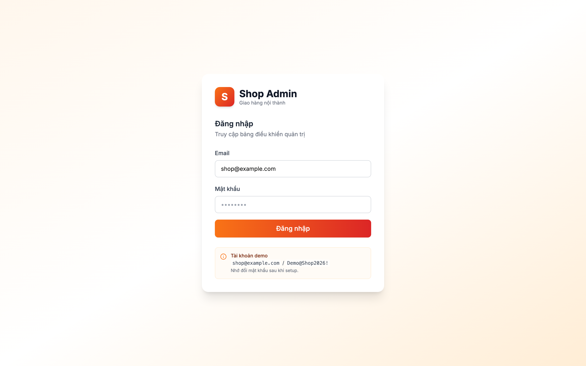

**Dashboard.** Sau khi đăng nhập, chủ shop thấy trang Dashboard tổng hợp các chỉ số KPI (doanh thu, số đơn, tỉ lệ huỷ…) cùng ba biểu đồ Recharts: doanh thu theo thời gian, top shipper và tỉ lệ huỷ đơn. Dữ liệu được cập nhật realtime qua WebSocket STOMP.

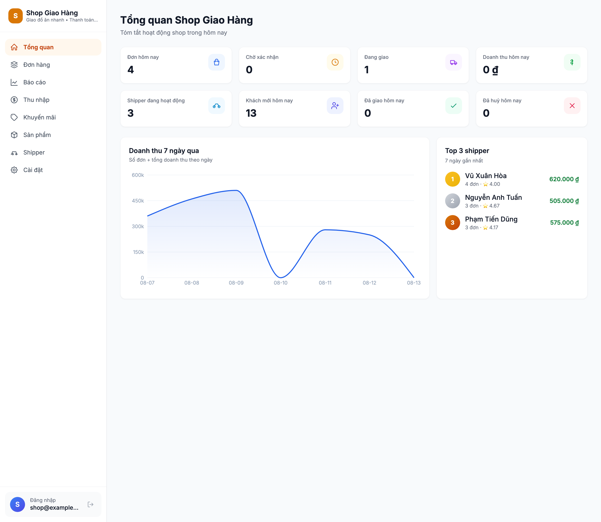

**Danh sách đơn hàng.** Trang quản lý đơn hiển thị toàn bộ đơn theo trạng thái trong máy trạng thái hữu hạn (bảy trạng thái). Đơn mới và mỗi lần chuyển trạng thái được đẩy realtime tới giao diện qua topic `/topic/admin/orders`, giúp chủ shop không phải tải lại trang.

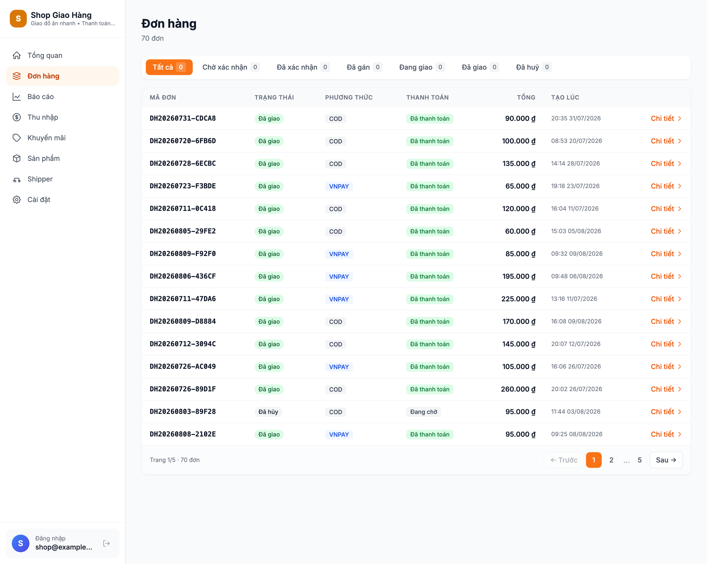

**Chi tiết đơn hàng.** Trang chi tiết hiển thị thông tin khách, danh sách sản phẩm, phương thức thanh toán (COD/VNPay), phí ship tính theo công thức Haversine và trạng thái hiện tại. Từ đây chủ shop gán đơn cho shipper phù hợp.

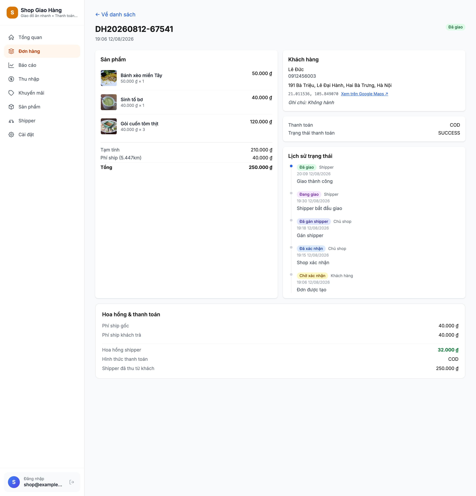

**Quản lý sản phẩm.** Chủ shop thực hiện đầy đủ CRUD sản phẩm (thêm, sửa, xoá, tìm kiếm) — bao gồm tên, giá, mô tả, ảnh và tồn kho. Danh mục sản phẩm này chính là dữ liệu khách hàng duyệt trên Mini App.

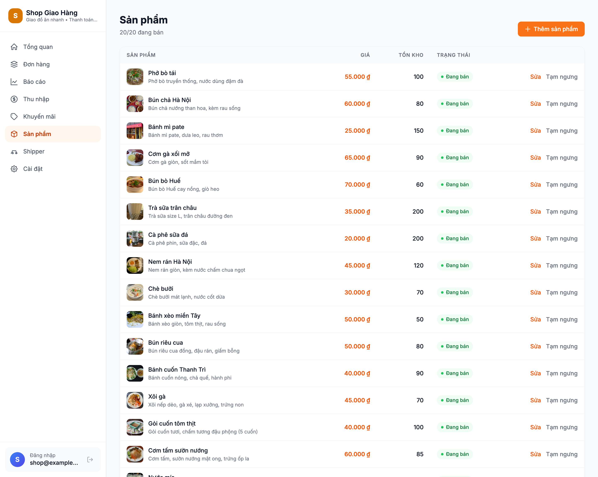

**Quản lý shipper.** Trang quản lý shipper cho phép chủ shop duyệt đơn đăng ký shipper (gửi từ Bot qua FSM bốn bước), khoá/mở khoá shipper, và xem trạng thái sẵn sàng (AVAILABLE) cùng đánh giá trung bình của từng shipper.

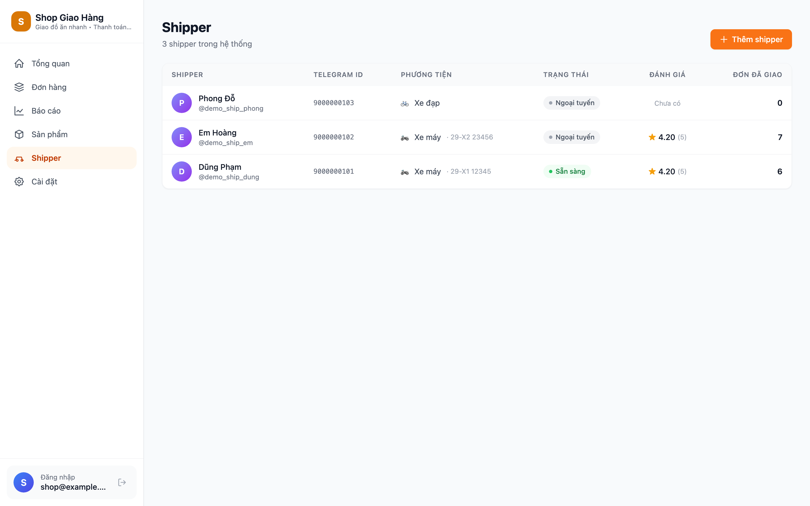

**Báo cáo doanh thu.** Trang báo cáo cho phép chủ shop chọn khoảng ngày tuỳ ý để thống kê doanh thu, số lượng đơn theo trạng thái và theo thời gian. Truy vấn sử dụng enum whitelist trước `DATE_TRUNC` để chống SQL injection.

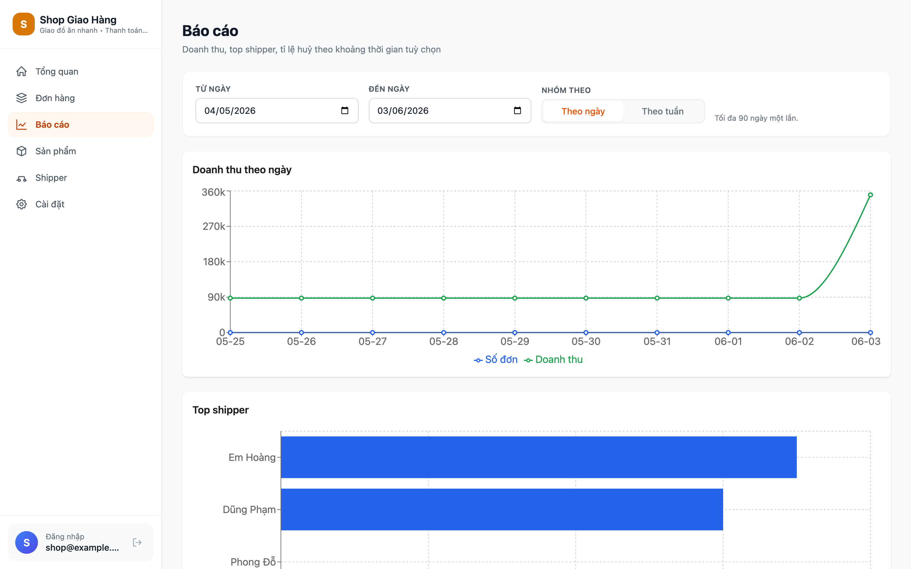

**Cấu hình shop (Settings).** Trang cài đặt cho phép chủ shop cập nhật cấu hình shop: thông tin cửa hàng, toạ độ điểm lấy hàng (pickup) dùng để tính phí ship theo khoảng cách và các tham số vận hành khác.

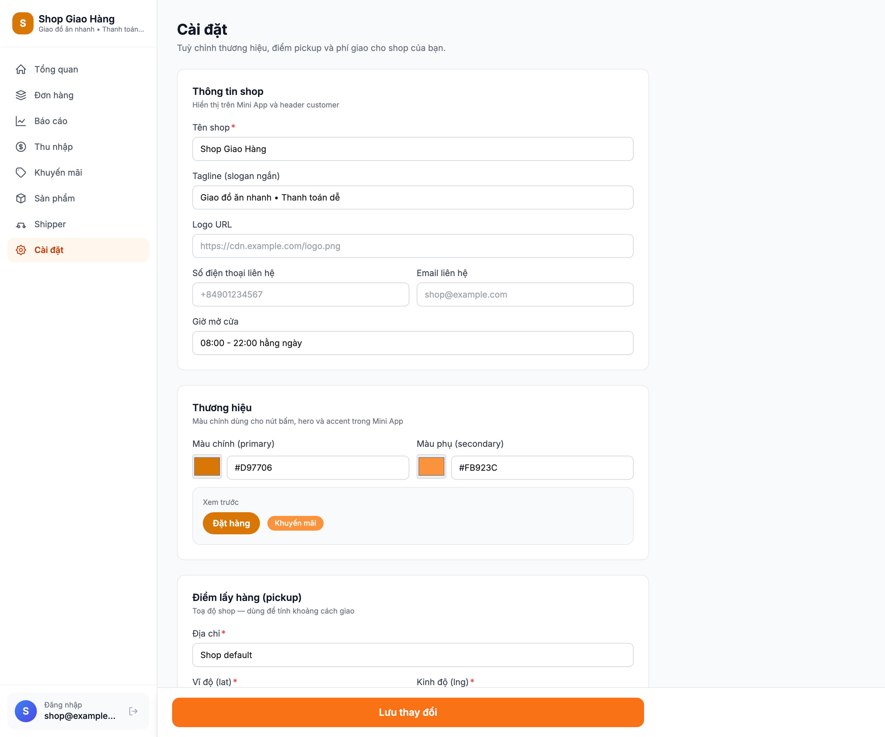

### 4.2.2. Giao diện Mini App Khách hàng

Mini App khách hàng chạy trực tiếp bên trong Telegram, không yêu cầu cài ứng dụng ngoài. Khách được đăng nhập tự động qua `initData` (HMAC-SHA256) mà không cần nhập mật khẩu. Luồng trải nghiệm gồm: duyệt danh mục → thêm giỏ hàng → checkout (COD/VNPay) → theo dõi đơn trên bản đồ realtime → xem lịch sử và đánh giá shipper.

**Danh mục sản phẩm.** Trang danh mục hiển thị các sản phẩm của shop kèm ảnh, tên, giá. Khách bấm thêm sản phẩm vào giỏ ngay tại đây; giao diện được tối ưu cho màn hình di động trong khung Telegram.

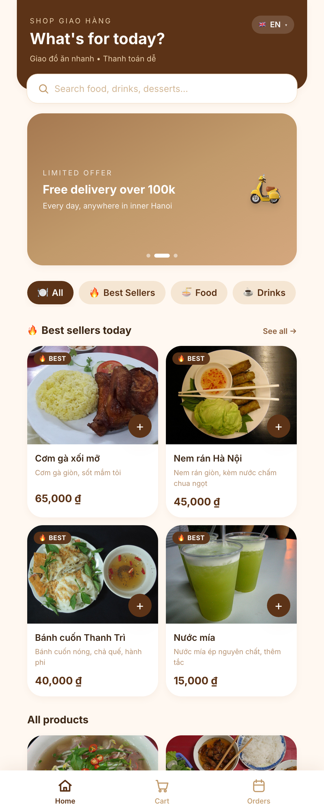

**Giỏ hàng.** Giỏ hàng liệt kê các sản phẩm đã chọn, cho phép tăng/giảm số lượng, xoá món và hiển thị tạm tính. Trạng thái giỏ được lưu bền vững (persist) bằng Zustand nên không mất khi khách rời và quay lại.

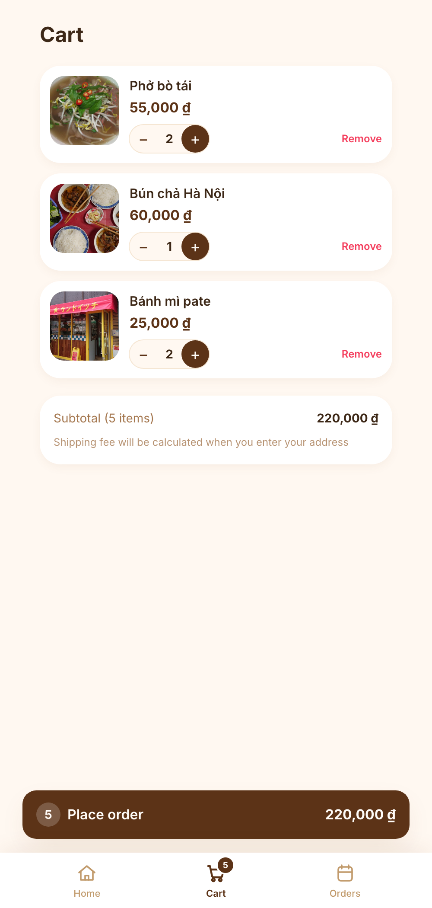

**Thanh toán (Checkout).** Trang checkout cho phép khách ghim toạ độ giao hàng trên bản đồ Leaflet (phí ship tính tự động theo Haversine), nhập thông tin liên hệ và chọn phương thức thanh toán COD hoặc VNPay. Với VNPay, hệ thống mở trang thanh toán qua `Telegram.WebApp.openLink`.

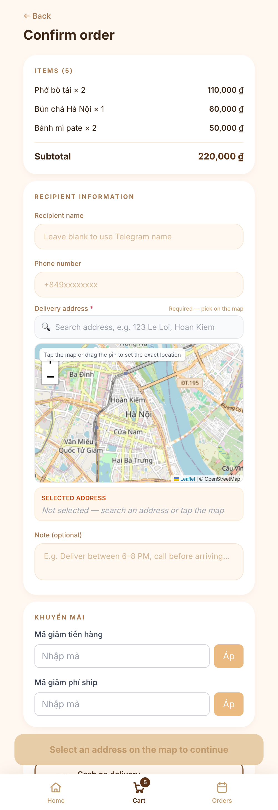

**Lịch sử đơn hàng.** Trang lịch sử liệt kê các đơn của khách kèm trạng thái hiện tại, cho phép khách theo dõi tiến trình từng đơn theo thời gian.

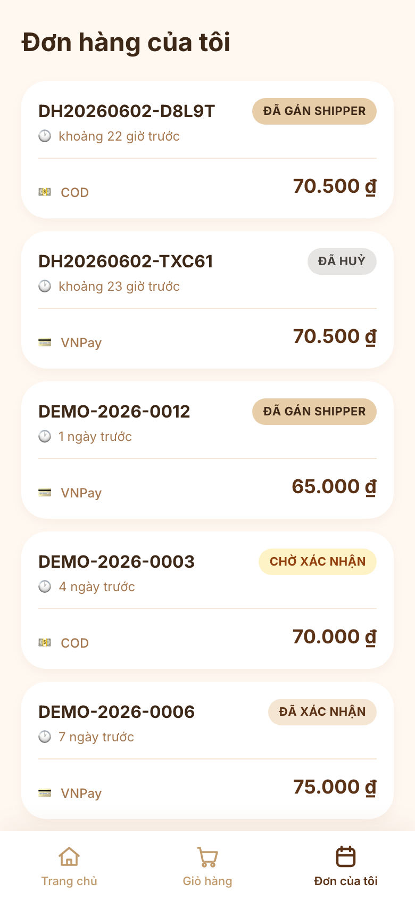

**Chi tiết đơn và bản đồ tracking.** Khi đơn đang được giao, khách theo dõi vị trí shipper theo thời gian thực trên bản đồ react-leaflet + OpenStreetMap, với độ trễ end-to-end dưới ba giây nhờ Telegram Live Location và WebSocket STOMP. Sau khi đơn hoàn tất, khách đánh giá shipper 1–5 sao kèm bình luận qua FSM hội thoại trong Bot.

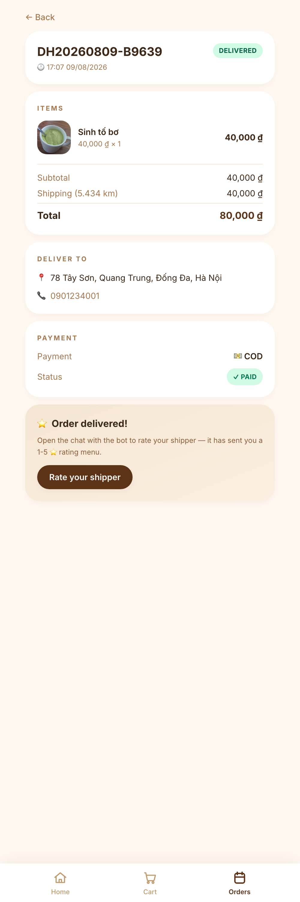

### 4.2.3. Giao diện Mini App Shipper

Mini App shipper cũng chạy bên trong Telegram, phục vụ đội shipper nội bộ của shop. Shipper đăng ký qua Bot (FSM bốn bước: tên → số điện thoại → loại xe → biển số), chờ chủ shop duyệt, sau đó nhận và thực hiện các đơn giao.

**Danh sách phân công (assignment).** Trang danh sách hiển thị các đơn được gán cho shipper cùng trạng thái tương ứng. Shipper nhận/từ chối offer qua inline keyboard của Bot; các nút "Bắt đầu giao" và "Đã giao xong" điều khiển chuyển trạng thái trong máy trạng thái giao hàng.

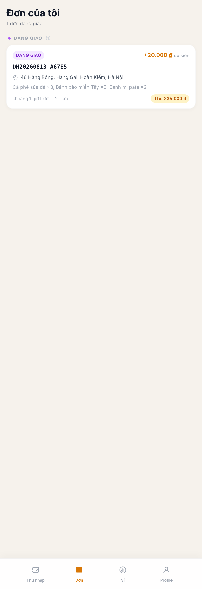

**Chi tiết phân công.** Trang chi tiết hiển thị thông tin đơn, địa chỉ và toạ độ giao, thông tin liên hệ khách. Khi bắt đầu giao, shipper chia sẻ Telegram Live Location để khách theo dõi; khi hoàn tất, shipper đánh dấu đã giao và có thể đánh giá lại khách hàng.

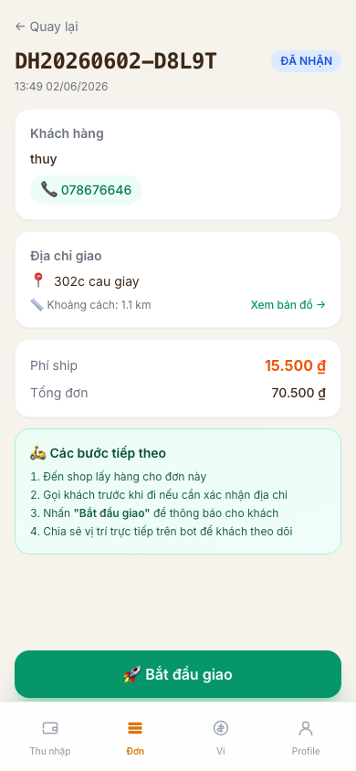

# KẾT LUẬN

## Kết quả đạt được

Đề tài *"Hệ thống quản lý giao hàng tích hợp Telegram Mini App, Web Admin và VNPay"* đã hoàn thành toàn bộ mục tiêu kỹ thuật đặt ra. Về phạm vi chức năng, toàn bộ tám yêu cầu *Must have* và ba yêu cầu *Should have* trong phân loại MoSCoW đều đã được hiện thực và kiểm thử đầy đủ (đạt 100%), đem lại hơn ba mươi tính năng nghiệp vụ trên ba vai trò người dùng:

- **Khách hàng:** đăng nhập tự động qua Telegram, duyệt danh mục, thêm giỏ hàng (persist qua Zustand), đặt đơn với hai phương thức COD/VNPay, ghim toạ độ giao trên bản đồ Leaflet với phí ship tính theo Haversine, theo dõi vị trí shipper realtime, xem lịch sử đơn và đánh giá shipper 1–5 sao.
- **Shipper:** đăng ký qua Bot FSM bốn bước, nhận/từ chối offer qua inline keyboard, chia sẻ Telegram Live Location, đánh dấu đã giao và đánh giá lại khách.
- **Chủ shop:** đăng nhập Web Admin bằng JWT, xem Dashboard KPI với ba biểu đồ Recharts, quản lý đơn realtime qua WebSocket STOMP, CRUD sản phẩm, duyệt và khoá shipper, xem báo cáo doanh thu theo khoảng ngày và cấu hình shop.

Về mặt kỹ thuật, đề tài đem lại các đóng góp chính: (i) **mô hình triển khai lai trên nền tảng Telegram** dùng đồng thời ba kênh (Mini App, Bot, Web Admin) phân vai theo thiết bị; (ii) **theo dõi GPS realtime bằng Telegram Live Location native** với độ trễ end-to-end dưới ba giây, tiết kiệm khoảng 80% công sức so với tự lập trình GPS streaming; (iii) **kiến trúc Modular Monolith với tám bounded context** giao tiếp qua Spring Application Events `@TransactionalEventListener(AFTER_COMMIT)`; (iv) **tích hợp VNPay với IPN-as-source-of-truth** kèm các đảm bảo cụ thể (constant-time hash comparison, idempotent IPN, JSONB audit trail bắt buộc, `Propagation.REQUIRES_NEW`); và (v) **mô hình bảo mật defense-in-depth gồm mười một lớp** đối phó song song, mỗi lớp có regression test khoá.

Về số liệu định lượng, hệ thống được kiểm thử qua **345 test (318 backend + 27 frontend)** với tỉ lệ build xanh 100% trên mỗi commit ở nhánh `main`; quản lý schema bằng **mười lăm Flyway migration**; đóng gói bằng **Docker Compose năm container** với quy trình deploy ba lệnh; và minh hoạ bằng **30 ảnh chụp giao diện** thực tế. Về quy trình, đề tài minh hoạ phương pháp phát triển có kỷ luật **GSD (Get Shit Done)** với mười pha (P0–P9), mỗi pha sáu bước Research → Plan → Plan-check → Execute → Code-review → Fix, sinh ra hơn 160 commit nguyên tử; hai vòng review giúp catch năm critical bug trước khi merge và mười hai blocker trước khi chạm code.

Về mặt thực tiễn, hệ thống lấp vào khoảng trống định vị giữa các nền tảng tổng hợp (chi phí cao, mất hoa hồng 20–25%, mất kiểm soát dữ liệu) và shop tự xây ứng dụng native (chi phí phát triển và vận hành lớn). Với chi phí vận hành chỉ khoảng mười đô-la Mỹ mỗi tháng cho một VPS, hệ thống có thể phục vụ ngay các shop F&B, tạp hoá quy mô nhỏ và vừa (50–500 đơn/ngày, 1–10 shipper nội bộ) muốn tự chủ về dữ liệu và quy trình giao hàng, trong khi khách và shipper không phải cài thêm ứng dụng nào ngoài Telegram sẵn có.

## Hạn chế

Để không phóng đại kết quả, đề tài khai báo trung thực các hạn chế đã nhận diện. Bốn hạn chế ban đầu đã được khắc phục trong giai đoạn hoàn thiện cuối: bổ sung đánh giá hai chiều (shipper đánh giá khách qua Flyway V12); bổ sung khung kiểm thử frontend (Vitest + Testing Library); tối ưu bundle Web Admin từ hơn 740 KB xuống khoảng 121 KB gzipped; và thay mật khẩu admin demo yếu bằng chuỗi mạnh. Các hạn chế còn lại được phân loại theo bản chất:

- **Out-of-scope cố ý:** hệ thống hiện phục vụ *một shop duy nhất* (chưa multi-tenant), và *phụ thuộc vào tính khả dụng của Telegram* (bị chặn ở một số quốc gia, tuy hoạt động ổn định tại Việt Nam — target market chính).
- **Giới hạn nhà cung cấp:** Telegram Live Location giới hạn tối đa 8 giờ mỗi lần chia sẻ — không ảnh hưởng mô hình giao hàng nội thành 1–10 km (mỗi đơn tối đa 60–90 phút).
- **Cần credential thật:** thanh toán online phụ thuộc credential VNPay sandbox thật; và bộ smoke test thủ công trong `RUNBOOK.md` chưa được tự động hoá end-to-end với Telegram thật.
- **Trade-off cố ý:** chưa có push notification ngoài Telegram — nếu khách tắt thông báo Telegram sẽ không nhận cập nhật, đổi lại lợi ích "không phải cài app mới" và không tốn chi phí Firebase Cloud Messaging.

Việc liệt kê thẳng thắn các hạn chế cùng phân loại và phương án xử lý cho thấy tác giả hiểu rõ phạm vi và các trade-off của hệ thống.

## Hướng phát triển

Các hướng phát triển được phân theo độ ưu tiên kinh doanh và độ phức tạp kỹ thuật:

- **Hoàn thiện trong scope hiện tại (1–2 tuần/hạng mục):** chat ẩn danh giữa khách và shipper qua Bot làm trung gian; lưu địa chỉ thường dùng của khách kèm autocomplete; hiển thị timeline `status_history` trên Web Admin; modal "Gán shipper" với filter theo khoảng cách và rating; hoàn thiện FSM đăng ký shipper; mở rộng test frontend lên 40+ case.
- **Mở rộng vượt scope (1–2 tháng/hạng mục):** ưu tiên cao là *mở rộng sang Zalo Mini App* (~75 triệu MAU tại Việt Nam, tái sử dụng khoảng 80% UI, chỉ thay SDK và cơ chế xác thực) và *tích hợp thêm cổng thanh toán Momo/ZaloPay/VietQR* qua abstraction `PaymentGateway`. Các hướng khác gồm multi-tenant SaaS, ứng dụng di động React Native, gợi ý sản phẩm bằng học máy, loyalty program, voice ordering, đa ngôn ngữ, quản lý kho barcode và tối ưu lộ trình last-mile.
- **Củng cố cho production (1–2 tháng):** TLS/HTTPS thật (Let's Encrypt), chuyển Bot sang webhook mode, distributed lock (ShedLock) cho scheduler, CI/CD pipeline (GitHub Actions), observability (Prometheus + Grafana + Loki + OpenTelemetry), rate limiting, backup strategy, và penetration testing.
- **Nghiên cứu nâng cao:** dự đoán nhu cầu, định giá động, phát hiện bất thường, học tăng cường cho tối ưu lộ trình, federated learning, blockchain proof-of-order và privacy-preserving location — mỗi hướng có thể trở thành một đề tài nghiên cứu riêng.

Trong đó, hai ưu tiên hàng đầu — mở rộng sang Zalo Mini App và tích hợp Momo/ZaloPay — sẽ tiếp tục được nghiên cứu ở giai đoạn sau khoá luận, với mục tiêu đưa hệ thống từ prototype hiện tại lên môi trường vận hành thực tế phục vụ các shop kinh doanh nhỏ và vừa tại Việt Nam.

# TÀI LIỆU THAM KHẢO

[5] Hiệp hội Thương mại điện tử Việt Nam — VECOM (2024), *Báo cáo chỉ số Thương mại điện tử Việt Nam 2024*, Hà Nội. <https://vecom.vn>, truy cập ngày 15/05/2026.

[6] Công ty Cổ phần Giải pháp Thanh toán Việt Nam — VNPAY (2025), *Tài liệu kỹ thuật tích hợp cổng thanh toán VNPay phiên bản 2.1.0*, TP. Hà Nội. <https://sandbox.vnpayment.vn/apis/docs/>, truy cập ngày 20/04/2026.

[7] Beck K. (2002), *Test-Driven Development: By Example*, Addison-Wesley Professional, Boston, MA.

[8] Coulouris G., Dollimore J., Kindberg T., Blair G. (2011), *Distributed Systems: Concepts and Design*, 5th edition, Addison-Wesley, Boston, MA.

[9] Date C. J. (2003), *An Introduction to Database Systems*, 8th edition, Addison-Wesley, Boston, MA.

[10] Docker Inc. (2025), *Docker Documentation — Compose specification*, <https://docs.docker.com/compose/>, truy cập ngày 10/05/2026.

[11] Evans E. (2003), *Domain-Driven Design: Tackling Complexity in the Heart of Software*, Addison-Wesley, Boston, MA.

[12] Fielding R. T. (2000), *Architectural Styles and the Design of Network-based Software Architectures*, Doctoral Dissertation, University of California, Irvine.

[13] Fowler M. (2018), *Refactoring: Improving the Design of Existing Code*, 2nd edition, Addison-Wesley, Boston, MA.

[14] Gamma E., Helm R., Johnson R., Vlissides J. (1994), *Design Patterns: Elements of Reusable Object-Oriented Software*, Addison-Wesley, Boston, MA.

[15] Jones M., Bradley J., Sakimura N. (2015), "JSON Web Token (JWT)", *RFC 7519*, Internet Engineering Task Force (IETF), <https://datatracker.ietf.org/doc/html/rfc7519>, truy cập ngày 18/04/2026.

[16] Krasner G. E., Pope S. T. (1988), "A Description of the Model-View-Controller User Interface Paradigm in the Smalltalk-80 System", *Journal of Object-Oriented Programming*, 1 (3), pp. 26–49.

[17] Krug S. (2014), *Don't Make Me Think, Revisited: A Common Sense Approach to Web Usability*, 3rd edition, New Riders, Berkeley, CA.

[18] Newman S. (2019), *Monolith to Microservices: Evolutionary Patterns to Transform Your Monolith*, O'Reilly Media, Sebastopol, CA.

[19] Nielsen J. (1993), *Usability Engineering*, Morgan Kaufmann, San Francisco, CA.

[20] OpenJS Foundation (2024), *React Documentation*, <https://react.dev/>, truy cập ngày 22/04/2026.

[21] OWASP Foundation (2021), *OWASP Top 10: 2021 — The Ten Most Critical Web Application Security Risks*, <https://owasp.org/Top10/>, truy cập ngày 14/05/2026.

[22] OWASP Foundation (2024), *OWASP Application Security Verification Standard (ASVS) version 4.0.3*, <https://owasp.org/www-project-application-security-verification-standard/>, truy cập ngày 14/05/2026.

[23] PostgreSQL Global Development Group (2025), *PostgreSQL 16 Documentation*, <https://www.postgresql.org/docs/16/>, truy cập ngày 25/04/2026.

[24] Pressman R. S., Maxim B. R. (2019), *Software Engineering: A Practitioner's Approach*, 9th edition, McGraw-Hill Education, New York, NY.

[25] Telegram FZ-LLC (2025), *Telegram Bot API Documentation*, <https://core.telegram.org/bots/api>, truy cập ngày 02/04/2026.

[26] Telegram FZ-LLC (2025), *Telegram Mini Apps — Web App SDK*, <https://core.telegram.org/bots/webapps>, truy cập ngày 02/04/2026.

[27] Testcontainers Authors (2024), *Testcontainers for Java Documentation*, <https://java.testcontainers.org/>, truy cập ngày 28/04/2026.

[28] Vernon V. (2013), *Implementing Domain-Driven Design*, Addison-Wesley, Boston, MA.

[29] VMware Inc. (2025), *Spring Boot Reference Documentation version 3.4*, <https://docs.spring.io/spring-boot/docs/3.4.x/reference/html/>, truy cập ngày 05/04/2026.

[30] VMware Inc. (2025), *Spring Security Reference Documentation version 6.x*, <https://docs.spring.io/spring-security/reference/>, truy cập ngày 05/04/2026.
