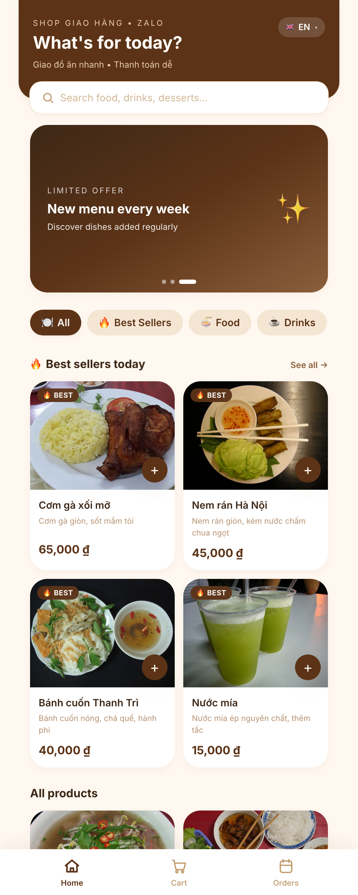
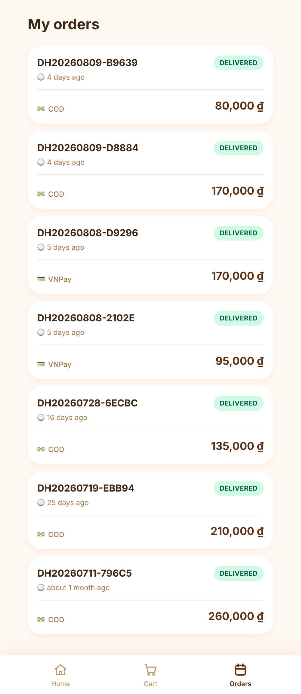
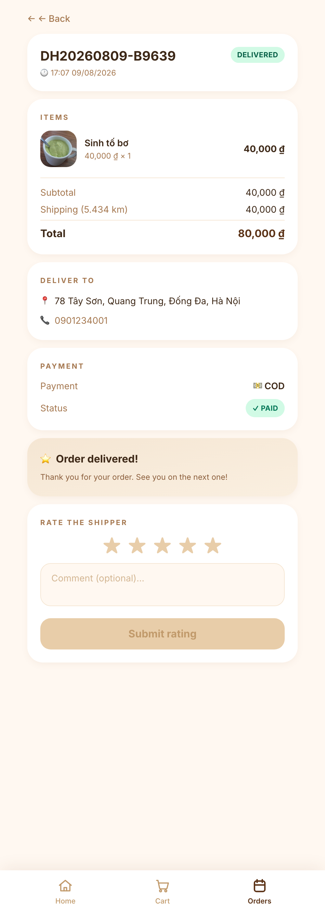

# CHƯƠNG 4: KẾT QUẢ SẢN PHẨM

Chương này trình bày kết quả sản phẩm cuối cùng của đề tài *"Hệ thống quản lý giao hàng tích hợp Telegram Mini App, Web Admin và VNPay"*. Nội dung đi từ nền tảng đến sản phẩm hoàn chỉnh: tổng hợp các công nghệ đã sử dụng cùng vai trò của từng công nghệ (mục 4.1); cấu trúc dự án và tổ chức mã nguồn (mục 4.2); các quyết định cài đặt then chốt của những mô-đun chính — máy trạng thái đơn hàng, tích hợp Telegram Bot, tích hợp VNPay và kênh realtime WebSocket (mục 4.3); chiến lược và kết quả kiểm thử với 491 test tự động (mục 4.4); phương án đóng gói và triển khai bằng Docker Compose (mục 4.5); cuối cùng là giao diện chương trình thực tế qua các ảnh chụp màn hình của cả ba kênh — Web Admin cho chủ shop, Mini App cho khách hàng và Mini App cho shipper (mục 4.6). Toàn bộ ảnh chụp được lấy trực tiếp từ hệ thống đang vận hành với bộ dữ liệu seed phục vụ demo.

## 4.1. Công nghệ sử dụng

Hệ thống được xây dựng trên một tập công nghệ mã nguồn mở và dịch vụ miễn phí/sandbox, tối ưu cho mục tiêu chi phí thấp (khoảng mười đô-la Mỹ mỗi tháng cho một VPS phổ thông) và khả năng triển khai một-lệnh. Kiến trúc tổng thể là **Modular Monolith** theo nguyên tắc Domain-Driven Design (DDD-lite) với tám ngữ cảnh nghiệp vụ (bounded context) tách bạch, giao tiếp một chiều qua Spring Application Events. Mục này giới thiệu ngắn gọn từng công nghệ nòng cốt kèm vai trò cụ thể trong đề tài.

### 4.1.1. Java 17 và Spring Boot 3.4

Java 17 là phiên bản Long-Term Support (LTS) của nền tảng Java, cung cấp các tính năng hiện đại như record, sealed class, pattern matching và text block giúp mã nguồn ngắn gọn, an toàn kiểu. Spring Boot 3.4 là framework nền tảng cho toàn bộ backend, dựa trên Spring Framework 6 và chuẩn Jakarta EE 9+.

Trong đề tài, Java 17 và Spring Boot 3.4 đóng vai trò xương sống của tầng backend: hiện thực toàn bộ tám bounded context (shared, auth, order, delivery, payment, bot, notification, app), 46 REST endpoint, tầng bảo mật Spring Security, truy xuất dữ liệu qua Spring Data JPA, kênh realtime Spring WebSocket (STOMP), quản lý migration bằng Flyway và tích hợp Telegram Bot qua `telegrambots-spring-boot-starter` 6.9.7.1. Cơ chế `@TransactionalEventListener(AFTER_COMMIT)` của Spring được dùng để phát và xử lý sự kiện cross-module một cách an toàn giao dịch.

### 4.1.2. React 18 và Vite 5

React 18 là thư viện JavaScript xây dựng giao diện người dùng theo mô hình component, hỗ trợ concurrent rendering và hook. Vite 5 là công cụ build và dev-server thế hệ mới dựa trên esbuild và Rollup, cho thời gian khởi động và hot-reload gần như tức thì.

Trong đề tài, React 18 + Vite 5 (với TypeScript 5.6) là nền tảng cho ba ứng dụng frontend: Web Admin cho chủ shop, Telegram Mini App cho khách hàng + shipper, và Zalo Mini App cho khách hàng (mục 4.8) — cả ba dùng chung gói `@shop/shared`. Hệ sinh thái đi kèm gồm: TanStack Query 5 quản lý trạng thái server và cache, Zustand 4 quản lý trạng thái phía client (ví dụ giỏ hàng persist), Tailwind CSS 3 cho styling tiện dụng, Recharts 3 vẽ biểu đồ Dashboard, `@twa-dev/sdk` 7 tương tác Telegram WebApp và react-leaflet + OpenStreetMap cho bản đồ tracking. Cấu hình Vite `manualChunks` tách Recharts thành chunk lazy-load, đưa bundle initial của Web Admin xuống khoảng 121 KB gzipped.

### 4.1.3. PostgreSQL 16 và Flyway

PostgreSQL 16 là hệ quản trị cơ sở dữ liệu quan hệ mã nguồn mở, hỗ trợ kiểu JSONB, ràng buộc CHECK, partial unique index và các hàm cửa sổ mạnh mẽ. Flyway là công cụ quản lý phiên bản schema theo kiểu migration tuần tự.

Trong đề tài, PostgreSQL 16 lưu toàn bộ dữ liệu nghiệp vụ: người dùng, sản phẩm, đơn hàng, phân công giao hàng, giao dịch thanh toán, đánh giá, vị trí. Các tính năng đặc thù được khai thác trực tiếp: cột JSONB `payment_transaction.raw_payload` lưu audit trail toàn bộ payload IPN của VNPay; partial unique index `uq_assignment_shipper_started` chống gán nhầm shipper; ràng buộc CHECK đồng bộ enum trạng thái. Flyway quản lý mười bảy file migration (V1 đến V17) — từ khởi tạo schema đến bổ sung `saved_address` (V16) và `chat_message` (V17) — đảm bảo không có thay đổi schema thủ công nào và mọi môi trường đều tái lập được cùng một trạng thái CSDL.

### 4.1.4. Telegram Bot API và Mini App SDK

Telegram Bot API là giao diện lập trình chính thức của Telegram cho phép ứng dụng phía server nhận và gửi tin nhắn, inline keyboard, Live Location. Telegram Mini App (Web App) SDK cho phép nhúng một ứng dụng web chạy trực tiếp bên trong client Telegram, kèm cơ chế xác thực `initData` được Telegram ký HMAC-SHA256.

Trong đề tài, Telegram là *cổng vào duy nhất* cho khách hàng và shipper — cả hai đều không phải cài thêm ứng dụng nào. Mini App SDK phục vụ giao diện đặt món, giỏ hàng, checkout, theo dõi bản đồ (khách) và danh sách/chi tiết đơn giao (shipper). Bot API phục vụ các thao tác hội thoại nhanh: lệnh `/start`, đăng ký shipper qua FSM bốn bước, nhận/từ chối offer qua inline keyboard, chia sẻ Telegram Live Location trong quá trình giao và luồng đánh giá 1–5 sao. Việc tận dụng Live Location native của Telegram giúp tiết kiệm khoảng 80% công sức so với tự lập trình GPS streaming, đồng thời thừa hưởng cơ chế bảo mật HMAC sẵn có.

### 4.1.5. Cổng thanh toán VNPay

VNPay là một trong những cổng thanh toán điện tử phổ biến nhất tại Việt Nam, hỗ trợ thanh toán qua thẻ ATM nội địa, thẻ quốc tế và ví điện tử. Đề tài tích hợp môi trường sandbox của VNPay với thuật toán ký HMAC-SHA512 và cơ chế IPN (Instant Payment Notification) server-to-server.

Trong đề tài, VNPay là phương thức thanh toán trực tuyến bên cạnh COD. Hệ thống áp dụng đúng mẫu *IPN-as-source-of-truth* mà VNPay khuyến nghị, với các đảm bảo bảo mật cụ thể: so sánh chữ ký constant-time bằng `MessageDigest.isEqual` chống timing attack; IPN idempotent trả `RspCode 02` cho request lặp (chống replay); audit bắt buộc mọi payload IPN vào JSONB kể cả khi chữ ký sai; `Propagation.REQUIRES_NEW` trên `OrderService.confirmAfterPayment` tránh phantom commit; và `PaymentExpiryScheduler` cron 60 giây tự đánh dấu thanh toán PENDING quá 15 phút thành FAILED.

### 4.1.6. Docker và Docker Compose

Docker là nền tảng đóng gói ứng dụng thành container độc lập môi trường; Docker Compose là công cụ điều phối nhiều container qua một file khai báo duy nhất.

Trong đề tài, toàn bộ hệ thống được đóng gói bằng Docker Compose với năm container: PostgreSQL, backend Spring Boot, Mini App, Web Admin và nginx reverse-proxy. Ba Dockerfile đa giai đoạn (multi-stage) giảm kích thước image cuối. Chuỗi healthcheck (postgres → backend → miniapp + webadmin → nginx) đảm bảo thứ tự khởi động đúng phụ thuộc. Kết quả là quy trình triển khai chỉ gồm ba lệnh shell trên bất kỳ VPS nào có cài Docker, hiện thực hoá mục tiêu "một-lệnh triển khai" của đề tài.

## 4.2. Cấu trúc dự án và tổ chức mã nguồn

### 4.2.1. Cây thư mục tổng thể

Mã nguồn được tổ chức theo ranh giới rõ ràng giữa backend, frontend và hạ tầng triển khai; mỗi nhánh là một thư mục cấp một có thể build độc lập:

```
KhoaLuan-GiaoHang/
├── backend/                              # Spring Boot 3 multi-module Maven
│   ├── pom.xml                           # Parent pom — aggregator + dependencyManagement
│   ├── app/                              # Executable jar — entry point
│   │   └── src/main/resources/db/migration/   # 17 file Flyway V1 → V17
│   ├── modules/
│   │   ├── shared/                       # BaseEntity, exception, event records
│   │   ├── auth/                         # Telegram initData + JWT admin
│   │   ├── order/                        # Product, Order, OrderItem, FSM
│   │   ├── delivery/                     # ShipperProfile, Assignment, Rating
│   │   ├── payment/                      # VNPay signing + IPN + scheduler
│   │   ├── bot/                          # Telegram Bot handlers + FSM
│   │   ├── notification/                 # 4 cross-module event listeners
│   │   ├── promotion/                    # Voucher — bổ sung ở pha mở rộng
│   │   └── miniapp/, webadmin/           # Static resource serving stub
│   └── mvnw, mvnw.cmd                    # Maven wrapper
├── frontend/                             # pnpm workspace với 4 package
│   ├── shared/                           # @shop/shared — types + helpers
│   ├── miniapp/                          # @shop/miniapp — Telegram Mini App
│   ├── webadmin/                         # @shop/webadmin — Web Admin
│   └── zaloapp/                          # @shop/zaloapp — Zalo Mini App (mục 4.8)
├── infra/
│   ├── docker-compose.yml                # Full stack demo (5 service)
│   ├── docker-compose.dev.yml            # Postgres-only cho dev
│   ├── nginx/nginx.conf                  # Reverse proxy
│   └── postgres/init.sql                 # Encoding + extension
├── .env.example                          # Manifest biến môi trường
├── README.md                             # Quick start
└── RUNBOOK.md                            # 8 bước smoke test thủ công
```

### 4.2.2. Backend Maven multi-module

Backend là một project Maven multi-module với **mười một submodule**: tám bounded context nghiệp vụ tại thời điểm bảo vệ (`shared`, `auth`, `order`, `delivery`, `payment`, `bot`, `notification`, `app` — trong đó `app` đóng gói executable jar), module `promotion` bổ sung ở pha mở rộng, và hai stub `miniapp` / `webadmin` phục vụ static resource. Parent `pom.xml` không chứa mã nguồn mà đảm nhận hai nhiệm vụ: khai báo thứ tự build qua `<modules>` (`shared` trước, rồi các module nghiệp vụ, cuối cùng `app`) và quản lý phiên bản dependency tập trung qua `<dependencyManagement>` để tránh version drift. Mỗi module có package gốc `com.shop.delivery.<module>`; Maven cưỡng chế ranh giới ngay lúc biên dịch — module `bot` muốn dùng class của `order` phải khai báo dependency tường minh, không thể tự tiện import. Lệnh `./mvnw package` đóng gói toàn bộ vào một fat jar khoảng 70 megabyte, chạy bằng `java -jar app.jar` hoặc đóng vào Docker image.

### 4.2.3. Frontend pnpm workspace

Frontend gồm bốn workspace pnpm khai báo trong `frontend/pnpm-workspace.yaml`. Package `@shop/shared` chứa kiểu TypeScript cho DTO backend (mỗi interface ứng với một response class Java), API client wrapper trên `axios` với interceptor tự chèn header xác thực (`X-Telegram-Init-Data` cho Telegram Mini App, `Authorization: Bearer` cho Web Admin, `X-Zalo-Access-Token` cho Zalo Mini App) và các helper định dạng `formatVnd`, `formatDateTime`, `haversineKm`. Ba ứng dụng `@shop/miniapp`, `@shop/webadmin` và `@shop/zaloapp` (mục 4.8) import nó qua đường dẫn workspace (`"@shop/shared": "workspace:*"`); pnpm hardlink `frontend/shared/dist` vào `node_modules` của các workspace tiêu thụ nên thay đổi DTO ở một nơi lan toả ngay, không cần publish gói lên registry.

### 4.2.4. Quản lý schema bằng Flyway

Toàn bộ schema cơ sở dữ liệu được quản lý qua **mười bảy file Flyway migration (V1 đến V17)** theo quy ước `V<n>__<snake_name>.sql`, không có bất kỳ thay đổi thủ công nào trên production. Các migration được đóng góp theo đúng ranh giới bounded context: V1 thiết lập baseline; V2 và V5 thuộc `auth`; V3 thuộc `bot`; V4, V13 và V16 (`saved_address`) thuộc `order`; V6, V7, V8, V10, V12, V15 và V17 (`chat_message`) thuộc `delivery`; V9 thuộc `payment`; V14 thuộc `promotion`; V11 seed dữ liệu demo dùng chung. Trong production, Flyway chạy lúc Spring Boot khởi động — một migration lỗi thì backend không khởi động được (fail-fast), tránh chạy trên schema sai phiên bản; mọi thay đổi schema phải qua một file mới vì Flyway lưu checksum và dừng ứng dụng khi phát hiện file đã apply bị sửa.

Ba quyết định migration thể hiện rõ tư duy thiết kế: V7 dùng index BRIN thay BTREE trên cột `ping_at` của bảng timeseries `location_ping`, tiết kiệm khoảng 95% dung lượng chỉ mục mà vẫn giữ hiệu năng quét khoảng thời gian; V8 đưa quy tắc "mỗi shipper tối đa một assignment `STARTED`" xuống tầng cơ sở dữ liệu bằng partial unique index; V13 hiện thực mẫu *singleton row* cho bảng `shop_config`, cho phép chủ shop tự đổi nhận diện thương hiệu và biểu phí giao qua trang Settings mà không cần redeploy.

## 4.3. Cài đặt các mô-đun chính

Tám bounded context backend tuân thủ đồ thị phụ thuộc một chiều (DAG, không chu trình) đã thiết kế ở Chương 3. Mục này trình bày bốn mảng cài đặt then chốt quyết định tính đúng đắn và an toàn của hệ thống.

### 4.3.1. Máy trạng thái đơn hàng và phân công giao hàng

Vòng đời đơn hàng từ `Order(PENDING)` đến các trạng thái cuối `DELIVERED`, `CANCELLED` hoặc `RETURNED` được kiểm soát bởi `OrderStateMachine` — một bảng whitelist `Map<OrderStatus, Set<OrderStatus>>` từ chối mọi chuyển dịch ngoài bảng bằng ngoại lệ `IllegalStateTransitionException`; mỗi lần chuyển trạng thái đều ghi vào bảng `status_history` kèm trạng thái trước/sau, tác nhân và thời điểm:

```
public void assertTransitionAllowed(OrderStatus from, OrderStatus to) {
    Set<OrderStatus> allowed = TRANSITIONS.getOrDefault(from, Set.of());
    if (!allowed.contains(to)) {
        throw new IllegalStateTransitionException(
            "Không thể chuyển từ %s sang %s".formatted(from, to));
    }
}
```

Phí giao hàng do `FeeCalculator` tính theo công thức Haversine với chính sách `base_fee + max(0, distance_km - free_km) × fee_per_km`, tham số đọc từ `shop_config`. Phía giao hàng, `DeliveryAssignment` có máy trạng thái năm trạng thái riêng (OFFERED / ACCEPTED / STARTED / COMPLETED / DECLINED) với `expires_at` cho TTL của offer. Quy tắc nghiệp vụ "một shipper tối đa một assignment đang giao" được khoá kép: kiểm tra ở tầng service và cưỡng chế ở tầng cơ sở dữ liệu bằng partial unique index — kể cả khi mã Java có race condition, PostgreSQL vẫn từ chối bản ghi thứ hai:

```
-- Trích V8: enforce "1 shipper có tối đa 1 STARTED assignment"
CREATE UNIQUE INDEX IF NOT EXISTS uq_assignment_shipper_started
    ON delivery_assignment(shipper_id)
    WHERE status = 'STARTED';
```

### 4.3.2. Tích hợp Telegram Bot

Module `bot` là facade với Telegram Bot API qua thư viện `telegrambots-spring-boot-starter` 6.9.7.1. Lõi là `DeliveryBot extends TelegramLongPollingBot` chạy chế độ long-polling (có thể chuyển webhook qua biến `BOT_MODE`). `UpdateRouter` định tuyến mỗi `Update` đến danh sách `UpdateHandler` inject theo thứ tự `@Order(n)`: các handler thuộc luồng hội thoại nhiều bước đặt `@Order(0)` để chạy trước command handler chung, tránh trường hợp người dùng gõ `/help` giữa chừng làm hỏng luồng đăng ký. Ba cơ chế đáng chú ý:

- **Xử lý idempotent:** `ProcessedUpdateService` ghi mỗi `update_id` vào bảng `processed_update`, bảo đảm mỗi update được xử lý đúng một lần kể cả khi Telegram gửi lại (retry) sau timeout.
- **FSM hội thoại:** luồng đăng ký shipper bốn bước (tên → số điện thoại → loại xe → biển số) được quản lý bởi `ConversationStateService` với payload JSONB qua `@JdbcTypeCode(SqlTypes.JSON)` của Hibernate 6, nên trạng thái hội thoại sống sót qua cả restart backend.
- **Rate limit:** `BotSender` được bao bởi Bucket4j theo giới hạn 30 message/giây của Telegram Bot API.

```
switch (state.getCurrentState()) {
    case AWAITING_NAME -> {
        state.getPayload().put("fullName", text);
        conversationStateService.transition(
            chatId, ShipperRegistrationStates.AWAITING_PHONE);
        sender.send(buildRequestContactPrompt(chatId));
    }
    case AWAITING_PLATE -> {
        state.getPayload().put("plate", normalisePlate(text));
        completeRegistration(chatId, state);
    }
}
```

Shipper nhận và phản hồi offer giao hàng qua inline keyboard "Chấp nhận / Từ chối" (`OrderOfferCallbackHandler`); trong quá trình giao, `LiveLocationHandler` nhận các bản tin Telegram Live Location, lưu thành `LocationPing` và phát sự kiện để đẩy vị trí xuống bản đồ của khách qua WebSocket — tận dụng hạ tầng GPS native của Telegram thay vì tự lập trình streaming.

### 4.3.3. Tích hợp cổng thanh toán VNPay

Luồng VNPay được hiện thực theo mô hình *IPN-as-source-of-truth*: Return URL chỉ render trang kết quả cho khách xem, còn mọi cập nhật trạng thái thanh toán đều đến từ IPN (Instant Payment Notification) server-to-server. `VnpaySignatureService` ký URL bằng HMAC-SHA512 theo đúng đặc tả VNPay v2.1.0 — sort tham số theo thứ tự ASCII, URL-encode US-ASCII, hash hex chữ thường:

```
Mac mac = Mac.getInstance("HmacSHA512");
mac.init(new SecretKeySpec(props.getHashSecret().getBytes(StandardCharsets.UTF_8),
                            "HmacSHA512"));
byte[] hashBytes = mac.doFinal(dataToHash.getBytes(StandardCharsets.UTF_8));
String hashHex = HexFormat.of().formatHex(hashBytes);  // lowercase
```

Bốn đảm bảo an toàn cụ thể: (i) chữ ký IPN được so sánh bằng `MessageDigest.isEqual` — phép so sánh thời gian không đổi (constant-time) chống timing attack; (ii) IPN idempotent — request lặp (replay) nhận `RspCode 02` và không làm thay đổi cơ sở dữ liệu, mỗi event IPN đều ghi vào `payment_transaction` với payload nguyên gốc trong cột JSONB `raw_payload` *kể cả khi chữ ký không hợp lệ*, giữ trọn audit trail phục vụ điều tra hậu kỳ; (iii) `OrderService.confirmAfterPayment` chạy với `@Transactional(propagation = Propagation.REQUIRES_NEW)` — nếu để `REQUIRED` mặc định, listener fire ở phase `AFTER_COMMIT` của transaction ngoài sẽ không commit được cập nhật đơn (phantom commit, phát hiện nhờ integration test); (iv) `PaymentExpiryScheduler` chạy chu kỳ 60 giây, tự đánh dấu thanh toán `PENDING` quá 15 phút thành `FAILED` để khách có thể đặt lại đơn.

### 4.3.4. WebSocket STOMP và thông báo realtime

Kênh realtime dùng Spring WebSocket với giao thức STOMP. `WebSocketAuthInterceptor` xác thực frame CONNECT theo cơ chế kép (Telegram `initData` cho Mini App, JWT Bearer cho Web Admin) và áp dụng **allowlist trên frame SUBSCRIBE**: khách chỉ được subscribe queue vị trí của chính đơn hàng mình sở hữu (`/user/queue/order/{id}/location`), còn topic `/topic/admin/orders` chỉ dành cho phiên JWT của chủ shop — chặn triệt để việc một người dùng nghe lén dữ liệu của người khác.

Giao tiếp giữa các module đi qua chín event record bất biến (Java 17 `record`) trong module `shared`. Module `notification` tập trung bốn listener cross-module, tất cả dùng `@TransactionalEventListener(phase = TransactionPhase.AFTER_COMMIT)` nên thông báo chỉ phát sau khi transaction đã commit — tránh tình huống gửi tin nhắn cho khách rồi cơ sở dữ liệu rollback: `OrderAssignedNotifier` gửi inline keyboard offer cho shipper; `OrderLifecycleNotifier` báo khách và broadcast STOMP cho Web Admin khi đơn được xác nhận, giao xong hoặc huỷ; `RatingPromptBuilder` nhắc khách đánh giá 1–5 sao sau khi đơn `DELIVERED`; `ShipperRegistrationNotifier` báo chủ shop có đơn đăng ký shipper mới.

## 4.4. Kiểm thử

### 4.4.1. Chiến lược kiểm thử backend

Backend áp dụng mô hình *kim tự tháp kiểm thử* (testing pyramid) với **369 test** chia ba tầng. Tầng đáy gồm **314 unit test** dùng Mockito 5 và AssertJ 3, kiểm thử service, handler và helper ở mức class đơn lẻ với mọi dependency được mock; toàn bộ chạy bởi Maven Surefire trong chưa đầy mười giây, đủ nhanh để chạy trước mỗi commit. Tầng giữa gồm **55 integration test** (suffix `IT.java`, chạy bởi Maven Failsafe) dùng Testcontainers khởi động PostgreSQL 16 *thật* trong container và `@SpringBootTest`, kiểm thử tương tác đa thành phần — repository, service, listener, transaction propagation — trên schema thật đã apply đủ mười bảy Flyway migration; toàn bộ hoàn tất trong khoảng ba phút. Tầng đỉnh là các slice test `@WebMvcTest` kiểm thử validation của controller và cấu trúc JSON mà không cần boot toàn bộ context Spring.

Phân bổ test theo mô-đun phản ánh mức độ phức tạp nghiệp vụ: `bot` nhiều nhất với 74 test do phải phủ toàn bộ handler và máy trạng thái hội thoại (bao gồm luồng chat ẩn danh); kế đến `delivery` với 71 test (gồm integration test cho race condition khi gán shipper) và `order` với 47 test; `payment` 33 test tập trung vào chữ ký HMAC-SHA512 và tính idempotent của IPN; mô-đun `app` chỉ có integration test vì không chứa logic nghiệp vụ.

### 4.4.2. Kiểm thử frontend

Frontend dùng Vitest kết hợp Testing Library với **122 test** tổ chức theo workspace: chín test cho `@shop/shared` (các helper `formatVnd`, `formatDateTime`, `haversineKm` với edge case); bốn mươi ba test cho `@shop/miniapp` (Zustand store `useCart`, i18n, `VoucherInput`, `AddressPicker`); mười tám test cho `@shop/webadmin` (`auth-store`, `OrderStatusBadge`, `StatusTimeline`, `AssignShipperModal`, `ShippersPage`); và **năm mươi hai test cho `@shop/zaloapp`** — ứng dụng Zalo Mini App (mục 4.8) — phủ SDK wrapper, giỏ hàng, `AddressPicker`, `VoucherInput`, `OrderTrackingMap`, `OrderChat` và `RatingForm`. Toàn bộ hoàn tất trong khoảng năm giây.

Tổng cộng toàn dự án có **491 test tự động (369 backend + 122 frontend)**. Quy trình xác minh chạy trước mỗi commit: `./mvnw verify` (Surefire + Failsafe + Testcontainers), `pnpm -r build` và `pnpm -r type-check`; tỉ lệ build xanh đạt 100% — không commit nào ở nhánh `main` mà bộ test thất bại.

### 4.4.3. Các lỗi nghiêm trọng phát hiện qua code review

Bên cạnh test tự động, mỗi pha phát triển đều qua hai vòng review (review kế hoạch trước khi viết mã, review diff sau khi hiện thực) với ba mức phân loại CRITICAL / IMPORTANT / MINOR. Quy trình này phát hiện và vá **năm lỗi nghiêm trọng** trước khi merge:

- **CR-1 — Khe hở phân quyền STOMP SUBSCRIBE:** phiên Mini App có thể subscribe queue `/user/*` của người dùng khác; vá bằng allowlist SUBSCRIBE kiểm tra quyền sở hữu đơn hàng (mục 4.3.4).
- **CR-2 — Gán sai shipper cho Live Location ping:** vị trí của shipper A bị gán sang assignment `STARTED` của shipper B; vá bằng truy vấn assignment theo đúng `shipper_id` của người gửi ping.
- **CR-3 — NPE khi `from` null:** tin nhắn từ channel không có trường `from`, gây NullPointerException trong handler; vá bằng guard kiểm tra null trước khi định tuyến.
- **CR-4 — Khe hở audit IPN:** `PaymentTransaction` chưa được ghi khi chữ ký IPN không hợp lệ, làm mất dấu vết tấn công; vá bằng persist bắt buộc mọi payload IPN vào JSONB trước khi xác thực chữ ký.
- **CR-5 — Lệch enum `ShipperState`:** enum Java không khớp CHECK constraint trong PostgreSQL, gây lỗi runtime khi lưu trạng thái; vá bằng đồng bộ hai phía và bổ sung test khoá.

Mỗi lỗi sau khi vá đều kèm regression test tương ứng để bảo đảm không tái xuất hiện.

### 4.4.4. Smoke test thủ công

Bên cạnh test tự động, `RUNBOOK.md` mô tả tám bước smoke test thủ công chạy end-to-end qua Telegram thật và VNPay sandbox: đăng nhập admin, tạo sản phẩm, đặt đơn từ Mini App, thanh toán VNPay, gán shipper, shipper chấp nhận và chia sẻ Live Location, đánh dấu đã giao, đánh giá năm sao. Smoke test được chạy cho mỗi phiên bản phát hành nhằm xác nhận hệ thống vận hành đúng khi tích hợp đầy đủ dịch vụ ngoài.

## 4.5. Đóng gói và triển khai

### 4.5.1. Docker Compose năm container

Hệ thống đóng gói thành năm container do `infra/docker-compose.yml` điều phối: `postgres` (image `postgres:16-alpine`, không expose port ra host), `backend` (Spring Boot, profile `prod`), `miniapp`, `webadmin` và `nginx` (reverse proxy, cổng duy nhất publish ra host là 80). Hai loại Dockerfile multi-stage giữ image gọn: backend build bằng `eclipse-temurin:17-jdk` rồi chạy trên `eclipse-temurin:17-jre-alpine` với user non-root, image cuối khoảng 220 megabyte (so với 450 megabyte nếu giữ nguyên JDK); mỗi frontend build bằng `node:22-alpine` rồi phục vụ `dist/` qua `nginx:1.27-alpine`, mỗi image khoảng mười megabyte.

Thứ tự khởi động được bảo đảm bằng chuỗi healthcheck qua `depends_on: condition: service_healthy`: postgres healthy trước (`pg_isready`), backend đợi Flyway migrate xong (`/actuator/health`), tiếp theo miniapp và webadmin, cuối cùng nginx mở cổng 80. Nginx đảm nhận bốn nhiệm vụ: serve hai SPA theo tiền tố `/miniapp/*` và `/admin/*`; proxy `/api/*` về backend; proxy `/ws/*` với header `Upgrade` và `proxy_read_timeout` dài để duy trì kết nối WebSocket; và endpoint healthcheck `/healthz`. Các dịch vụ nội bộ (`backend:8080`, `postgres:5432`) chỉ nghe trong mạng Docker Compose, không truy cập được từ Internet.

### 4.5.2. Cấu hình môi trường và profile

Toàn bộ cấu hình runtime nạp qua biến môi trường theo nguyên tắc Twelve-Factor App; file `.env.example` ở thư mục gốc là manifest chuẩn của mọi biến, còn `.env` thật nằm trong `.gitignore`. Bốn secret bắt buộc (`BOT_TOKEN`, `BOT_USERNAME`, `JWT_SECRET`, cặp `VNPAY_TMN_CODE`/`VNPAY_HASH_SECRET`) được nạp theo profile Spring Boot: profile `dev` cho phép header giả lập người dùng và CORS localhost để phát triển thuận tiện; profile `prod` bật cơ chế **fail-fast** — thiếu bất kỳ secret nào thì backend từ chối khởi động, loại trừ khả năng deploy production với credential test.

### 4.5.3. Quy trình triển khai ba lệnh

Triển khai lên một máy chủ mới chỉ cần ba lệnh shell:

```
git clone <repo-url> && cd KhoaLuan-GiaoHang
cp .env.example .env       # → mở .env, điền 4 secret bắt buộc
docker compose -f infra/docker-compose.yml up -d --build
```

Sau khoảng ba phút cho lần build đầu (tải dependency Maven và pnpm) hoặc ba mươi giây các lần sau (cache hit), toàn bộ stack sẵn sàng tại `http://localhost`. Quy trình này hiện thực hoá mục tiêu "một-lệnh triển khai" của đề tài: bất kỳ VPS phổ thông nào có cài Docker đều dựng được hệ thống hoàn chỉnh mà không cần cài đặt thủ công JDK, Node.js hay PostgreSQL.

## 4.6. Giao diện chương trình

Mục này trình bày giao diện thực tế của hệ thống qua ảnh chụp màn hình trên cả ba kênh. Các ảnh được đánh số liên tục Hình 4.1, 4.2… và chú thích rõ chức năng tương ứng.

### 4.6.1. Giao diện Web Admin (Chủ shop)

Web Admin là giao diện chạy trên trình duyệt desktop dành cho chủ shop, được thiết kế theo phong cách tối giản (Linear/Notion style). Chủ shop đăng nhập bằng JWT, sau đó quản lý toàn bộ nghiệp vụ: theo dõi dashboard KPI, xử lý đơn hàng realtime, quản lý sản phẩm và shipper, xem báo cáo doanh thu và cấu hình shop.

**Trang đăng nhập.** Chủ shop xác thực bằng email và mật khẩu; hệ thống cấp JWT lưu trong trình duyệt để xác thực các yêu cầu tiếp theo. Tài khoản demo là `shop@example.com` với mật khẩu mạnh `Demo@Shop2026!`.


**Dashboard.** Sau khi đăng nhập, chủ shop thấy trang Dashboard tổng hợp các chỉ số KPI (doanh thu, số đơn, tỉ lệ huỷ…) cùng ba biểu đồ Recharts: doanh thu theo thời gian, top shipper và tỉ lệ huỷ đơn. Dữ liệu được cập nhật realtime qua WebSocket STOMP.


**Danh sách đơn hàng.** Trang quản lý đơn hiển thị toàn bộ đơn theo trạng thái trong máy trạng thái hữu hạn (bảy trạng thái). Đơn mới và mỗi lần chuyển trạng thái được đẩy realtime tới giao diện qua topic `/topic/admin/orders`, giúp chủ shop không phải tải lại trang.


**Chi tiết đơn hàng.** Trang chi tiết hiển thị thông tin khách, danh sách sản phẩm, phương thức thanh toán (COD/VNPay), phí ship tính theo công thức Haversine và trạng thái hiện tại. Từ đây chủ shop gán đơn cho shipper phù hợp.


**Quản lý sản phẩm.** Chủ shop thực hiện đầy đủ CRUD sản phẩm (thêm, sửa, xoá, tìm kiếm) — bao gồm tên, giá, mô tả, ảnh và tồn kho. Danh mục sản phẩm này chính là dữ liệu khách hàng duyệt trên Mini App.


**Quản lý shipper.** Trang quản lý shipper cho phép chủ shop duyệt đơn đăng ký shipper (gửi từ Bot qua FSM bốn bước), khoá/mở khoá shipper, và xem trạng thái sẵn sàng (AVAILABLE) cùng đánh giá trung bình của từng shipper.


**Báo cáo doanh thu.** Trang báo cáo cho phép chủ shop chọn khoảng ngày tuỳ ý để thống kê doanh thu, số lượng đơn theo trạng thái và theo thời gian. Truy vấn sử dụng enum whitelist trước `DATE_TRUNC` để chống SQL injection.


**Cấu hình shop (Settings).** Trang cài đặt cho phép chủ shop cập nhật cấu hình shop: thông tin cửa hàng, toạ độ điểm lấy hàng (pickup) dùng để tính phí ship theo khoảng cách và các tham số vận hành khác.


### 4.6.2. Giao diện Mini App Khách hàng

Mini App khách hàng chạy trực tiếp bên trong Telegram, không yêu cầu cài ứng dụng ngoài. Khách được đăng nhập tự động qua `initData` (HMAC-SHA256) mà không cần nhập mật khẩu. Luồng trải nghiệm gồm: duyệt danh mục → thêm giỏ hàng → checkout (COD/VNPay) → theo dõi đơn trên bản đồ realtime → xem lịch sử và đánh giá shipper.

| Giao diện | Mô tả |
|:---:|:---|
| {width="4.3cm"} | **Hình 4.9 — Danh mục sản phẩm.** Trang danh mục hiển thị các sản phẩm của shop kèm ảnh, tên, giá. Khách bấm thêm sản phẩm vào giỏ ngay tại đây; giao diện được tối ưu cho màn hình di động trong khung Telegram. |
| {width="4.3cm"} | **Hình 4.10 — Giỏ hàng.** Giỏ hàng liệt kê các sản phẩm đã chọn, cho phép tăng/giảm số lượng, xoá món và hiển thị tạm tính. Trạng thái giỏ được lưu bền vững (persist) bằng Zustand nên không mất khi khách rời và quay lại. |
| {width="4.3cm"} | **Hình 4.11 — Thanh toán (Checkout).** Trang checkout cho phép khách ghim toạ độ giao hàng trên bản đồ Leaflet (phí ship tính tự động theo Haversine), nhập thông tin liên hệ và chọn phương thức thanh toán COD hoặc VNPay. Với VNPay, hệ thống mở trang thanh toán qua `Telegram.WebApp.openLink`. |
| {width="4.3cm"} | **Hình 4.12 — Lịch sử đơn hàng.** Trang lịch sử liệt kê các đơn của khách kèm trạng thái hiện tại, cho phép khách theo dõi tiến trình từng đơn theo thời gian. |
| {width="4.3cm"} | **Hình 4.13 — Chi tiết đơn và bản đồ tracking.** Khi đơn đang được giao, khách theo dõi vị trí shipper theo thời gian thực trên bản đồ react-leaflet + OpenStreetMap, với độ trễ end-to-end dưới ba giây nhờ Telegram Live Location và WebSocket STOMP. Sau khi đơn hoàn tất, khách đánh giá shipper 1–5 sao kèm bình luận qua FSM hội thoại trong Bot. |

### 4.6.3. Giao diện Mini App Shipper

Mini App shipper cũng chạy bên trong Telegram, phục vụ đội shipper nội bộ của shop. Shipper đăng ký qua Bot (FSM bốn bước: tên → số điện thoại → loại xe → biển số), chờ chủ shop duyệt, sau đó nhận và thực hiện các đơn giao.

| Giao diện | Mô tả |
|:---:|:---|
| {width="4.3cm"} | **Hình 4.14 — Danh sách phân công (assignment).** Trang danh sách hiển thị các đơn được gán cho shipper cùng trạng thái tương ứng. Shipper nhận/từ chối offer qua inline keyboard của Bot; các nút "Bắt đầu giao" và "Đã giao xong" điều khiển chuyển trạng thái trong máy trạng thái giao hàng. |
| {width="4.3cm"} | **Hình 4.15 — Chi tiết phân công.** Trang chi tiết hiển thị thông tin đơn, địa chỉ và toạ độ giao, thông tin liên hệ khách. Khi bắt đầu giao, shipper chia sẻ Telegram Live Location để khách theo dõi; khi hoàn tất, shipper đánh dấu đã giao và có thể đánh giá lại khách hàng. |

### 4.6.4. Giao diện hội thoại Bot Telegram

Bên cạnh Mini App, Bot Telegram (`shop_giaohang_bot`) đảm nhiệm các thao tác hội thoại nhanh không cần mở giao diện web. Hình 4.16 minh hoạ bốn luồng chính. *Do Bot chạy chế độ long-polling (không có endpoint web tĩnh), hình được tái dựng theo phong cách Telegram với **nội dung tin nhắn và inline keyboard lấy nguyên văn từ mã nguồn** hai module `bot` và `notification` (`OrderAssignedNotifier`, `ChatMessageHandler`, `RatingCallbackHandler`, các handler đăng ký shipper).*


## 4.7. Các tính năng hoàn thiện sau bảo vệ

Sau bảo vệ, năm hạng mục "hoàn thiện trong scope" đã được hiện thực trọn vẹn theo đúng quy trình sáu bước (Research → Plan → Plan-check → Execute → Code-review → Fix), mỗi hạng mục một nhánh riêng với kiểm thử đơn vị và tích hợp. Các tính năng tái sử dụng nguyên vẹn kiến trúc Modular Monolith hiện có — không phát sinh bounded context mới — và tuân thủ ranh giới phụ thuộc `bot → delivery → order`.

### 4.7.1. Hoàn thiện luồng đăng ký và duyệt shipper

Luồng đăng ký shipper qua bot (FSM bốn bước: tên → số điện thoại → phương tiện → biển số) trước đây dừng ở trạng thái `PENDING` mà Web Admin chưa có nút duyệt. Bổ sung khép kín vòng lặp: `ShipperResponse` trả thêm `approvalStatus`; Web Admin có mục "Chờ duyệt" riêng với hai thao tác **Duyệt** (`POST /api/admin/shippers/{id}/approve`) và **Từ chối** (`POST /api/admin/shippers/{id}/reject` — xoá hồ sơ `PENDING`, cho phép đăng ký lại), mỗi thao tác phát sự kiện để bot thông báo lại shipper. Đồng thời vá một lỗi FSM: chuỗi bắt đầu bằng `/` (ví dụ `/start`) không còn bị lưu nhầm thành họ tên.

### 4.7.2. Timeline lịch sử trạng thái đơn trên Web Admin

Bảng `status_history` vốn ghi mọi lần chuyển trạng thái (from → to, thời điểm, người thao tác, ghi chú) nhưng chưa hiển thị. Bổ sung `GET /api/admin/orders/{id}/history` và component `StatusTimeline` (React) vẽ dòng thời gian mới→cũ, tái sử dụng nhãn/màu của `OrderStatusBadge` và suy vai trò tác nhân theo ngữ cảnh chuyển trạng thái. Truy vấn lịch sử dùng cache key con của query đơn nên mọi thao tác xác nhận/huỷ/gán tự động làm tươi timeline.

### 4.7.3. Modal "Gán shipper" theo khoảng cách và rating

Modal gán shipper được nâng cấp xếp hạng ứng viên: `GET /api/admin/orders/{orderId}/candidate-shippers` trả các shipper `AVAILABLE` kèm điểm đánh giá (sẵn có) và khoảng cách best-effort. Do vị trí chỉ được lưu trong lúc giao (`location_ping` gắn theo assignment), khoảng cách tính từ ping cuối cùng của shipper đến điểm lấy hàng (tái sử dụng `DistanceCalculator` haversine), kèm nhãn độ mới; shipper chưa từng giao xếp cuối với nhãn "chưa rõ vị trí". Giao diện hiển thị sao đánh giá + khoảng cách và cho phép chuyển giữa sắp xếp "Gần nhất" và "Đánh giá cao".

### 4.7.4. Lưu địa chỉ thường dùng kèm autocomplete

Bổ sung bảng `saved_address` (Flyway **V16**, khử trùng theo `(customer_id, lat, lng)`). Mỗi đơn đặt thành công tự lưu địa chỉ giao qua listener `@TransactionalEventListener(AFTER_COMMIT)` trên `OrderCreatedEvent` — chạy sau commit nên lỗi lưu địa chỉ không bao giờ làm hỏng đơn. API `GET/DELETE /api/addresses` (scope theo `@CurrentUser`) phục vụ Mini App: ô tìm kiếm địa chỉ (vốn autocomplete qua Nominatim) nay ưu tiên hiển thị địa chỉ đã lưu khớp truy vấn lên đầu; chọn địa chỉ đã lưu điền thẳng toạ độ, không cần geocode lại.

### 4.7.5. Chat ẩn danh khách ↔ shipper qua Bot

Bổ sung bảng `chat_message` (Flyway **V17**) và luồng chat trung gian qua bot: khi shipper nhận đơn, cả hai bên nhận nút "💬 Chat" mở chế độ hội thoại (trạng thái FSM `CHAT_ACTIVE`). Tin nhắn được **gửi lại dưới dạng văn bản mới có tiền tố vai trò** ("🧑 Khách" / "🛵 Shipper"), tuyệt đối không dùng `forwardMessage` — nhờ đó không bên nào thấy tài khoản Telegram hay số điện thoại của bên kia. Phần miền (`ChatService` trong module `delivery`) phân giải hai bên và trạng thái mở/đóng của hội thoại (mở khi assignment `ACCEPTED/STARTED`); phần truyền (handler trong module `bot`) đảm nhiệm gửi qua `BotSender`, giữ đúng ranh giới `delivery` không phụ thuộc `bot`. Mọi tin được lưu phục vụ audit qua `GET /api/admin/orders/{orderId}/chat`.

## 4.8. Mở rộng đa nền tảng: Zalo Mini App

Hướng ưu tiên hàng đầu ở phần Hướng phát triển — *mở rộng sang Zalo Mini App* (~75 triệu người dùng hoạt động hàng tháng tại Việt Nam) — đã được hiện thực thành ứng dụng khách thứ ba (`frontend/zaloapp`), chạy song song với Telegram Mini App và Web Admin. Kiến trúc backend nghiệp vụ được tái sử dụng **nguyên vẹn** (cùng REST API, cùng cơ sở dữ liệu); chỉ lớp giao tiếp nền tảng thay đổi.

Điểm khác biệt cốt lõi: **Zalo Mini App không có kênh Bot DM và WebSocket như Telegram**, nên các tính năng vốn chạy qua bot/STOMP được hiện thực lại bằng **REST + polling**:

- **Xác thực**: thay `initData` (HMAC-SHA256) của Telegram bằng `zmp-sdk` `getAccessToken` phía client; backend bổ sung `ZaloAuthFilter` gọi Zalo OpenAPI `GET graph.zalo.me/v2.0/me` để xác minh token và upsert người dùng. Bộ lọc tự vô hiệu khi chưa cấu hình `ZALO_APP_ID`, nên có thể phát triển/kiểm thử trên trình duyệt thường qua cơ chế dev-bypass.
- **Theo dõi shipper**: thay STOMP bằng poll `GET /api/orders/{id}/location` mỗi 5 giây.
- **Chat ẩn danh**: khách Zalo nhắn qua REST (`POST /api/orders/{id}/chat`); backend phát `CustomerChatSentEvent` để module `notification` relay sang **bot Telegram của shipper**, giữ nguyên tính ẩn danh — một luồng chat *xuyên nền tảng* Zalo ↔ Telegram.
- **Đánh giá**: khách Zalo chấm sao qua `POST /api/orders/{id}/rating` (thay vì FSM bot).

Nhờ tách bạch domain/transport và dùng chung gói `@shop/shared` (kiểu dữ liệu + API helper), ứng dụng Zalo đạt **parity đầy đủ luồng khách** (đặt món, giỏ hàng, thanh toán, lưu địa chỉ + autocomplete, mã giảm giá, theo dõi bản đồ, chat, đánh giá) mà chỉ phát sinh một endpoint mới (chat khách) và hai lớp backend (`CustomerChatController`, `CustomerChatNotifier`). Việc đăng ký Zalo Official Account + xuất bản `.zmp` nằm ngoài phạm vi khoá luận (cần phê duyệt ~1–2 tuần của Zalo); phần mã tích hợp thật đã được chuẩn bị sẵn theo cơ chế *gated* — kích hoạt khi điền credential.

Về giao diện, Zalo Mini App tái sử dụng nguyên vẹn hệ thống thiết kế của Mini App khách hàng nhưng chạy trong khung Zalo (tiêu đề *"Shop Giao Hàng • Zalo"*). Ba màn tiêu biểu dưới đây được chụp trực tiếp từ ứng dụng `frontend/zaloapp` đang chạy với cùng backend và bộ dữ liệu seed.

| Giao diện | Mô tả |
|:---:|:---|
| {width="4.3cm"} | **Hình 4.17 — Danh mục sản phẩm (Zalo).** Trang danh mục hiển thị sản phẩm kèm ảnh, tên, giá, banner khuyến mãi và bộ lọc theo nhóm hàng — dùng lại hoàn toàn các thành phần giao diện của Telegram Mini App qua gói `@shop/shared`, chỉ khác lớp xác thực (`zmp-sdk` thay cho `initData`). |
| {width="4.3cm"} | **Hình 4.18 — Lịch sử đơn hàng (Zalo).** Danh sách đơn của khách kèm trạng thái, phương thức thanh toán và tổng tiền; dữ liệu lấy qua cùng REST API `GET /api/orders` với backend Telegram. |
| {width="4.3cm"} | **Hình 4.19 — Chi tiết đơn (Zalo).** Trang chi tiết hiển thị món hàng, địa chỉ giao, thanh toán và trạng thái. Do Zalo không có kênh Bot/WebSocket, việc theo dõi vị trí dùng REST polling và luồng **chat/đánh giá được hiện thực xuyên nền tảng** (khách Zalo ↔ bot Telegram của shipper). |

# KẾT LUẬN

## Kết quả đạt được

Đề tài *"Hệ thống quản lý giao hàng tích hợp Telegram Mini App, Web Admin và VNPay"* đã hoàn thành toàn bộ mục tiêu kỹ thuật đặt ra. Về phạm vi chức năng, toàn bộ tám yêu cầu *Must have* và ba yêu cầu *Should have* trong phân loại MoSCoW đều đã được hiện thực và kiểm thử đầy đủ (đạt 100%), đem lại hơn ba mươi tính năng nghiệp vụ trên ba vai trò người dùng:

- **Khách hàng:** đăng nhập tự động qua Telegram, duyệt danh mục, thêm giỏ hàng (persist qua Zustand), đặt đơn với hai phương thức COD/VNPay, ghim toạ độ giao trên bản đồ Leaflet với phí ship tính theo Haversine, theo dõi vị trí shipper realtime, xem lịch sử đơn và đánh giá shipper 1–5 sao.
- **Shipper:** đăng ký qua Bot FSM bốn bước, nhận/từ chối offer qua inline keyboard, chia sẻ Telegram Live Location, đánh dấu đã giao và đánh giá lại khách.
- **Chủ shop:** đăng nhập Web Admin bằng JWT, xem Dashboard KPI với ba biểu đồ Recharts, quản lý đơn realtime qua WebSocket STOMP, CRUD sản phẩm, duyệt và khoá shipper, xem báo cáo doanh thu theo khoảng ngày và cấu hình shop.

Đối chiếu với phân loại MoSCoW đặt ra ở Chương 1, hiện trạng hoàn thành như sau: hai yêu cầu *Could have* (lưu địa chỉ thường dùng, chat trong bot) được chuyển thành hướng phát triển; hai yêu cầu *Won't have* (multi-tenant, siêu quản trị viên hệ thống) nằm ngoài phạm vi có chủ đích.

**Bảng KL.1. Hiện trạng các tính năng theo phân loại MoSCoW**

| Phân loại | Số lượng yêu cầu | Đã hiện thực | Tỉ lệ |
|---|---|---|---|
| Must have (M1–M8) | 8 | 8 | 100% |
| Should have (S9–S11) | 3 | 3 | 100% |
| Could have (C12–C13) | 2 | 0 (hướng phát triển) | 0% |
| Won't have (W14–W15) | 2 | 0 (ngoài phạm vi) | — |
| **Tổng (Must + Should)** | **11** | **11** | **100%** |

Về mặt kỹ thuật, đề tài đem lại các đóng góp chính: (i) **mô hình triển khai lai trên nền tảng Telegram** dùng đồng thời ba kênh (Mini App, Bot, Web Admin) phân vai theo thiết bị; (ii) **theo dõi GPS realtime bằng Telegram Live Location native** với độ trễ end-to-end dưới ba giây, tiết kiệm khoảng 80% công sức so với tự lập trình GPS streaming; (iii) **kiến trúc Modular Monolith với tám bounded context** giao tiếp qua Spring Application Events `@TransactionalEventListener(AFTER_COMMIT)`; (iv) **tích hợp VNPay với IPN-as-source-of-truth** kèm các đảm bảo cụ thể (constant-time hash comparison, idempotent IPN, JSONB audit trail bắt buộc, `Propagation.REQUIRES_NEW`); và (v) **mô hình bảo mật defense-in-depth gồm mười một lớp** đối phó song song, mỗi lớp có regression test khoá.

Về số liệu định lượng (tính đến sau giai đoạn hoàn thiện các tính năng còn dang dở và mở rộng sang Zalo Mini App), hệ thống cung cấp **46 REST endpoint**, được kiểm thử qua **491 test (369 backend gồm 314 unit và 55 integration, cộng 122 frontend)** với tỉ lệ build xanh 100% trên mỗi commit ở nhánh `main`; quản lý schema bằng **mười bảy Flyway migration (V1–V17)**; đóng gói bằng **Docker Compose năm container** với quy trình deploy ba lệnh; và minh hoạ bằng **18 ảnh chụp giao diện** thực tế (gồm ba màn Zalo Mini App) cùng một hình tái dựng bốn luồng hội thoại Bot Telegram. Về quy trình, đề tài minh hoạ phương pháp phát triển có kỷ luật với mười pha, mỗi pha sáu bước Research → Plan → Plan-check → Execute → Code-review → Fix, sinh ra hơn 152 commit nguyên tử; hai vòng review giúp phát hiện năm lỗi nghiêm trọng trước khi merge và mười hai blocker trước khi chạm code. Bảng KL.2 tổng hợp các chỉ số định lượng.

**Bảng KL.2. Tổng hợp các chỉ số định lượng kết quả đạt được**

| Chỉ số | Giá trị |
|---|---|
| Tổng số commit nguyên tử | hơn 152 |
| Tổng số dòng mã (Java + TypeScript) | khoảng 25 000 |
| Số mô-đun backend (bounded context) | 8 (11 submodule Maven) |
| Số endpoint REST | 46 |
| Số sự kiện cross-module | 9 |
| Số topic WebSocket | 2 |
| Số file Flyway migration | 17 (V1 đến V17) |
| Test backend (unit + integration) | 369 (314 + 55) |
| Test frontend (Vitest + Testing Library) | 122 |
| Tổng số test toàn dự án | 491 |
| Tỉ lệ build xanh trên mỗi commit ở `main` | 100% |
| Số trang Mini App / Web Admin | 13 / 13 |
| Số Dockerfile / container Docker Compose | 3 / 5 |
| Số ảnh chụp giao diện trong báo cáo | 15 |

Về mặt thực tiễn, hệ thống lấp vào khoảng trống định vị giữa các nền tảng tổng hợp (chi phí cao, mất hoa hồng 20–25%, mất kiểm soát dữ liệu) và shop tự xây ứng dụng native (chi phí phát triển và vận hành lớn). Với chi phí vận hành chỉ khoảng mười đô-la Mỹ mỗi tháng cho một VPS, hệ thống có thể phục vụ ngay các shop F&B, tạp hoá quy mô nhỏ và vừa (50–500 đơn/ngày, 1–10 shipper nội bộ) muốn tự chủ về dữ liệu và quy trình giao hàng, trong khi khách và shipper không phải cài thêm ứng dụng nào ngoài Telegram sẵn có.

## Hạn chế

Để không phóng đại kết quả, đề tài khai báo trung thực các hạn chế đã nhận diện. Bốn hạn chế ban đầu đã được khắc phục trong giai đoạn hoàn thiện cuối: bổ sung đánh giá hai chiều (shipper đánh giá khách qua Flyway V12); bổ sung khung kiểm thử frontend (Vitest + Testing Library); tối ưu bundle Web Admin từ hơn 740 KB xuống khoảng 121 KB gzipped; và thay mật khẩu admin demo yếu bằng chuỗi mạnh. Các hạn chế còn lại được phân loại theo bản chất:

- **Out-of-scope cố ý:** hệ thống hiện phục vụ *một shop duy nhất* (chưa multi-tenant), và *phụ thuộc vào tính khả dụng của Telegram* (bị chặn ở một số quốc gia, tuy hoạt động ổn định tại Việt Nam — target market chính).
- **Giới hạn nhà cung cấp:** Telegram Live Location giới hạn tối đa 8 giờ mỗi lần chia sẻ — không ảnh hưởng mô hình giao hàng nội thành 1–10 km (mỗi đơn tối đa 60–90 phút).
- **Cần credential thật:** thanh toán online phụ thuộc credential VNPay sandbox thật; và bộ smoke test thủ công trong `RUNBOOK.md` chưa được tự động hoá end-to-end với Telegram thật.
- **Trade-off cố ý:** chưa có push notification ngoài Telegram — nếu khách tắt thông báo Telegram sẽ không nhận cập nhật, đổi lại lợi ích "không phải cài app mới" và không tốn chi phí Firebase Cloud Messaging.

Việc liệt kê thẳng thắn các hạn chế cùng phân loại và phương án xử lý cho thấy tác giả hiểu rõ phạm vi và các trade-off của hệ thống.

## Hướng phát triển

Các hướng phát triển được phân theo độ ưu tiên kinh doanh và độ phức tạp kỹ thuật. Năm hạng mục hoàn thiện trong scope từng liệt kê ở đây (chat ẩn danh, lưu địa chỉ, timeline trạng thái, modal gán shipper theo khoảng cách/rating, hoàn thiện luồng duyệt shipper) cùng việc mở rộng test frontend **đã được thực hiện sau bảo vệ** — chi tiết trình bày ở mục 4.7. Các hướng còn lại:

- **Mở rộng vượt scope (1–2 tháng/hạng mục):** hướng *mở rộng sang Zalo Mini App* trước đây đứng đầu danh sách **đã được hiện thực** (mục 4.8) — chỉ còn khâu đăng ký tài khoản Zalo + xuất bản chính thức. Ưu tiên còn lại là *tích hợp thêm cổng thanh toán Momo/ZaloPay/VietQR* qua abstraction `PaymentGateway`. Các hướng khác gồm multi-tenant SaaS, ứng dụng di động React Native, gợi ý sản phẩm bằng học máy, loyalty program, voice ordering, quản lý kho barcode và tối ưu lộ trình last-mile.
- **Củng cố cho production (1–2 tháng):** TLS/HTTPS thật (Let's Encrypt), chuyển Bot sang webhook mode, distributed lock (ShedLock) cho scheduler, CI/CD pipeline (GitHub Actions), observability (Prometheus + Grafana + Loki + OpenTelemetry), rate limiting, backup strategy, và penetration testing.
- **Nghiên cứu nâng cao:** dự đoán nhu cầu, định giá động, phát hiện bất thường, học tăng cường cho tối ưu lộ trình, federated learning, blockchain proof-of-order và privacy-preserving location — mỗi hướng có thể trở thành một đề tài nghiên cứu riêng.

Trong đó, ưu tiên mở rộng sang Zalo Mini App đã hoàn thành ở mức mã nguồn (mục 4.8); hướng tích hợp Momo/ZaloPay sẽ tiếp tục được nghiên cứu ở giai đoạn sau khoá luận, với mục tiêu đưa hệ thống từ prototype hiện tại lên môi trường vận hành thực tế phục vụ các shop kinh doanh nhỏ và vừa tại Việt Nam.

# TÀI LIỆU THAM KHẢO

[1] Hiệp hội Thương mại điện tử Việt Nam — VECOM (2024), *Báo cáo chỉ số Thương mại điện tử Việt Nam 2024*, Hà Nội. <https://vecom.vn>, truy cập ngày 15/05/2026.

[2] Công ty Cổ phần Giải pháp Thanh toán Việt Nam — VNPAY (2025), *Tài liệu kỹ thuật tích hợp cổng thanh toán VNPay phiên bản 2.1.0*, TP. Hà Nội. <https://sandbox.vnpayment.vn/apis/docs/>, truy cập ngày 20/04/2026.

[3] Beck K. (2002), *Test-Driven Development: By Example*, Addison-Wesley Professional, Boston, MA.

[4] Coulouris G., Dollimore J., Kindberg T., Blair G. (2011), *Distributed Systems: Concepts and Design*, 5th edition, Addison-Wesley, Boston, MA.

[5] Date C. J. (2003), *An Introduction to Database Systems*, 8th edition, Addison-Wesley, Boston, MA.

[6] Docker Inc. (2025), *Docker Documentation — Compose specification*, <https://docs.docker.com/compose/>, truy cập ngày 10/05/2026.

[7] Evans E. (2003), *Domain-Driven Design: Tackling Complexity in the Heart of Software*, Addison-Wesley, Boston, MA.

[8] Fielding R. T. (2000), *Architectural Styles and the Design of Network-based Software Architectures*, Doctoral Dissertation, University of California, Irvine.

[9] Fowler M. (2018), *Refactoring: Improving the Design of Existing Code*, 2nd edition, Addison-Wesley, Boston, MA.

[10] Gamma E., Helm R., Johnson R., Vlissides J. (1994), *Design Patterns: Elements of Reusable Object-Oriented Software*, Addison-Wesley, Boston, MA.

[11] Jones M., Bradley J., Sakimura N. (2015), "JSON Web Token (JWT)", *RFC 7519*, Internet Engineering Task Force (IETF), <https://datatracker.ietf.org/doc/html/rfc7519>, truy cập ngày 18/04/2026.

[12] Krasner G. E., Pope S. T. (1988), "A Description of the Model-View-Controller User Interface Paradigm in the Smalltalk-80 System", *Journal of Object-Oriented Programming*, 1 (3), pp. 26–49.

[13] Krug S. (2014), *Don't Make Me Think, Revisited: A Common Sense Approach to Web Usability*, 3rd edition, New Riders, Berkeley, CA.

[14] Newman S. (2019), *Monolith to Microservices: Evolutionary Patterns to Transform Your Monolith*, O'Reilly Media, Sebastopol, CA.

[15] Nielsen J. (1993), *Usability Engineering*, Morgan Kaufmann, San Francisco, CA.

[16] OpenJS Foundation (2024), *React Documentation*, <https://react.dev/>, truy cập ngày 22/04/2026.

[17] OWASP Foundation (2021), *OWASP Top 10: 2021 — The Ten Most Critical Web Application Security Risks*, <https://owasp.org/Top10/>, truy cập ngày 14/05/2026.

[18] OWASP Foundation (2024), *OWASP Application Security Verification Standard (ASVS) version 4.0.3*, <https://owasp.org/www-project-application-security-verification-standard/>, truy cập ngày 14/05/2026.

[19] PostgreSQL Global Development Group (2025), *PostgreSQL 16 Documentation*, <https://www.postgresql.org/docs/16/>, truy cập ngày 25/04/2026.

[20] Pressman R. S., Maxim B. R. (2019), *Software Engineering: A Practitioner's Approach*, 9th edition, McGraw-Hill Education, New York, NY.

[21] Telegram FZ-LLC (2025), *Telegram Bot API Documentation*, <https://core.telegram.org/bots/api>, truy cập ngày 02/04/2026.

[22] Telegram FZ-LLC (2025), *Telegram Mini Apps — Web App SDK*, <https://core.telegram.org/bots/webapps>, truy cập ngày 02/04/2026.

[23] Testcontainers Authors (2024), *Testcontainers for Java Documentation*, <https://java.testcontainers.org/>, truy cập ngày 28/04/2026.

[24] Vernon V. (2013), *Implementing Domain-Driven Design*, Addison-Wesley, Boston, MA.

[25] VMware Inc. (2025), *Spring Boot Reference Documentation version 3.4*, <https://docs.spring.io/spring-boot/docs/3.4.x/reference/html/>, truy cập ngày 05/04/2026.

[26] VMware Inc. (2025), *Spring Security Reference Documentation version 6.x*, <https://docs.spring.io/spring-security/reference/>, truy cập ngày 05/04/2026.
