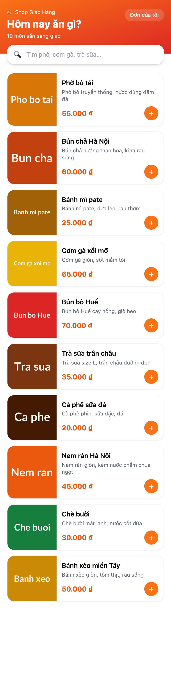
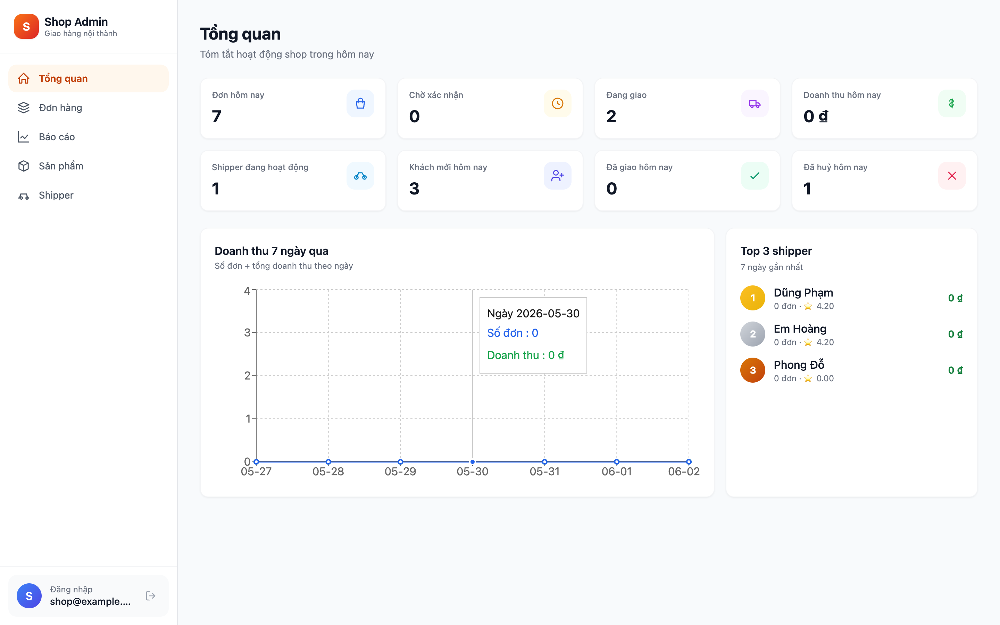
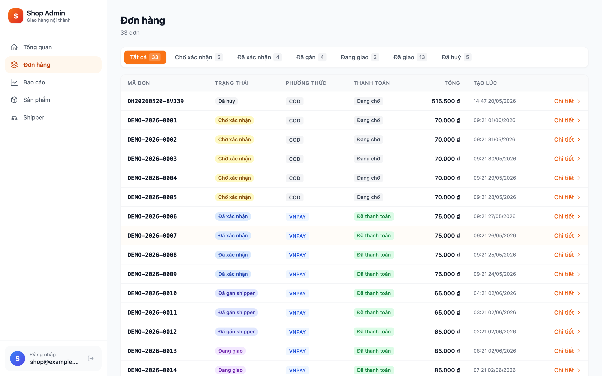
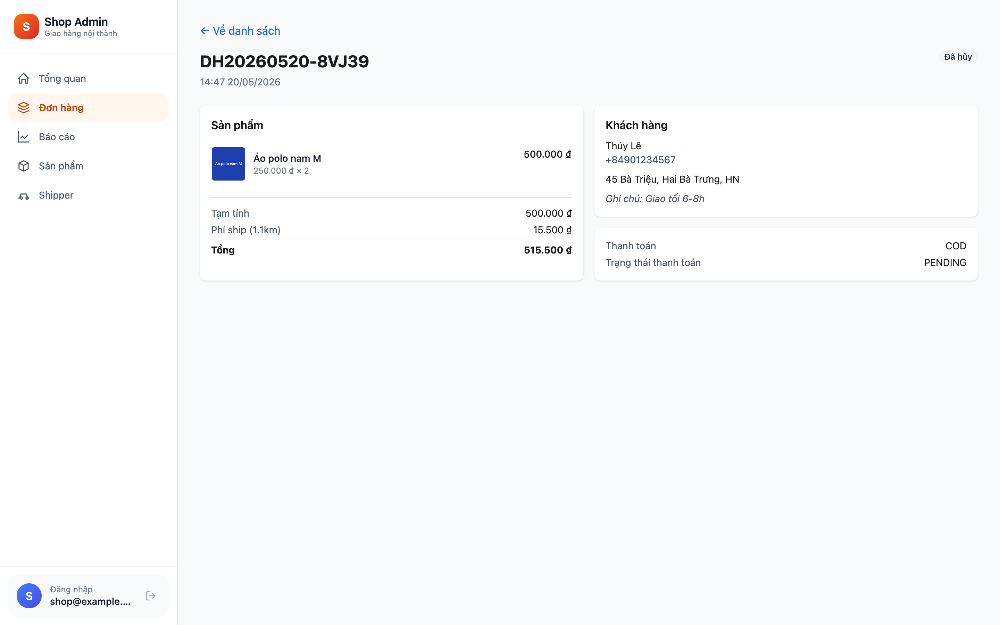
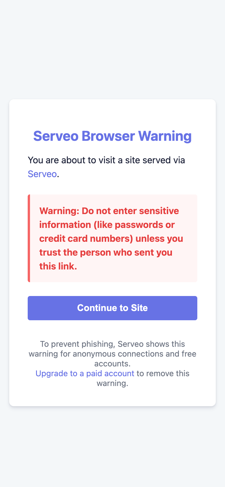
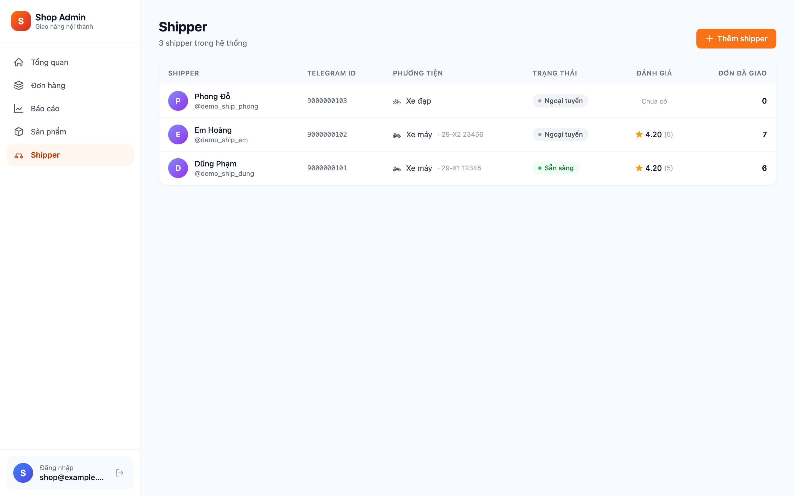

# Chương 2. Cơ sở lý thuyết

Chương này trình bày các nền tảng công nghệ then chốt được áp dụng trong đề tài. Các tiểu mục được tổ chức theo lớp công nghệ — từ nền tảng nhắn tin Telegram (đóng vai trò cổng vào của hệ thống), qua các framework phía máy chủ (Spring Boot 3) và phía trình duyệt (React 18), đến cơ sở dữ liệu PostgreSQL, cổng thanh toán VNPay, các mẫu kiến trúc phần mềm (Modular Monolith và DDD-lite), phương pháp phát triển hướng kiểm thử (TDD) và cuối cùng là đóng gói triển khai bằng Docker Compose. Mỗi tiểu mục đi kèm trích đoạn mã ngắn nhằm minh hoạ cụ thể phần lý thuyết.

## 2.1. Nền tảng Telegram

### 2.1.1. Telegram Bot API

Telegram Bot API là giao diện HTTP chuẩn cho phép server giao tiếp với bot Telegram. Bot có thể nhận sự kiện qua hai cơ chế:

- *Long polling.* Server chủ động gọi `GET /getUpdates` với tham số `offset` để Telegram giữ kết nối đến khi có sự kiện mới hoặc timeout. Phù hợp cho môi trường phát triển vì không cần URL HTTPS public.
- *Webhook.* Server gọi `setWebhook` để đăng ký URL HTTPS, sau đó Telegram chủ động đẩy `Update` đến server. Phù hợp cho production vì giảm tải đáng kể và phản hồi nhanh hơn.

Trong đề tài, thư viện `telegrambots-springboot-longpolling-starter 7.x` của tác giả Ruben Lagus được dùng. Mặc định hệ thống chạy ở chế độ long polling cho cả `dev` và `prod` để đơn giản hoá triển khai; webhook là hướng phát triển ở chương 5.

Đặc tả `Update` của Bot API có nhiều trường, trong đó các trường được dùng trực tiếp trong hệ thống là `message`, `edited_message` (cho Live Location), `callback_query` (cho inline keyboard) và `contact` (cho luồng đăng ký shipper với nút `KeyboardButton.request_contact`).

Một ràng buộc kỹ thuật quan trọng cần lưu ý: trường `callback_data` của `InlineKeyboardButton` có giới hạn tối đa **64 byte UTF-8**. Vì vậy hệ thống không thể nhét toàn bộ payload vào `callback_data` mà chỉ encode kiểu `ACTION:param1:param2` rồi tra cứu DB tại handler.

```java
InlineKeyboardButton button = InlineKeyboardButton.builder()
    .text("Nhận đơn")
    .callbackData("OFFER_ACCEPT:" + assignmentId.toString())  // < 64 byte
    .build();
```

Tham khảo: tài liệu Telegram Bot API chính thức [25].

### 2.1.2. Telegram Mini App (Web App SDK)

Telegram Mini App là một WebView nhúng trong cửa sổ chat, cho phép chạy ứng dụng web đầy đủ tính năng với quyền truy cập một số API native qua object toàn cục `window.Telegram.WebApp`. Khi Telegram mở Mini App, nó truyền vào URL một tham số đặc biệt là `initData` — một query string đã được Telegram ký bằng HMAC-SHA256 với khoá bí mật là `bot_token`. Backend xác minh `initData` để chắc chắn rằng yêu cầu đến từ một phiên Telegram hợp pháp.

Thuật toán xác minh `initData` theo đặc tả chính thức:

```java
String dataCheckString = params.entrySet().stream()
    .filter(e -> !"hash".equals(e.getKey()))
    .sorted(Map.Entry.comparingByKey())
    .map(e -> e.getKey() + "=" + e.getValue())
    .collect(Collectors.joining("\n"));

byte[] secret = hmacSha256("WebAppData".getBytes(), botToken.getBytes());
byte[] computed = hmacSha256(secret, dataCheckString.getBytes());
boolean ok = MessageDigest.isEqual(computed, hexToBytes(receivedHash));
```

Mini App SDK còn cung cấp một số API tiện ích được dùng trong đề tài: `WebApp.ready()` báo Telegram rằng app đã sẵn sàng (loại bỏ vòng quay loading); `WebApp.expand()` mở rộng WebView lên kích thước tối đa; `WebApp.openLink(url)` mở URL bên ngoài Telegram (được dùng để redirect sang VNPay thay vì `window.location.href` vốn sẽ làm thoát Mini App); `WebApp.themeParams` cung cấp màu nền/chữ tự động theo theme dark/light của Telegram; và nút `BackButton` cho phép gắn handler riêng cho nút back native.

Tham khảo: tài liệu Telegram Mini Apps (Web App SDK) chính thức [26].

### 2.1.3. Telegram Live Location

Tính năng *Live Location* là khả năng chia sẻ vị trí GPS liên tục trong khoảng thời gian định trước (15 phút, 1 giờ hoặc 8 giờ), kèm các trường tuỳ chọn `heading` (hướng di chuyển) và `horizontal_accuracy` (sai số ngang). Telegram cập nhật vị trí mỗi 5–10 giây.

Phân biệt quan trọng giữa hai loại sự kiện do Telegram phát ra:

- `Update.message.location` — phát đúng *một lần* tại thời điểm shipper bắt đầu share; chứa `live_period` cho biết thời lượng share.
- `Update.edited_message.location` — phát *mỗi lần Telegram cập nhật* vị trí mới (5–10 giây/lần) trong suốt khoảng thời gian share.

Cả hai loại sự kiện trên đều được Telegram ký HMAC trên đường truyền, do đó backend chỉ cần xác minh `update.from.id` để chống giả mạo. Khi shipper bấm "Stop sharing", Telegram phát một `edited_message.location` cuối cùng không có trường `live_period` — backend phát hiện chỉ báo này để biết shipper đã ngừng chia sẻ.

Trong đề tài, `LiveLocationHandler` xử lý cả hai loại sự kiện, tra `DeliveryAssignment` đang `STARTED` của shipper, lưu `location_ping` (V7) và phát `LocationPingReceivedEvent` cho `LocationBroadcaster` đẩy tiếp qua WebSocket.

## 2.2. Spring Boot 3 và Java 17

### 2.2.1. Spring MVC và REST Controller

Spring MVC là khung dispatcher servlet xử lý các yêu cầu HTTP. Một REST controller được khai báo bằng annotation `@RestController`, kết hợp annotation tuyến đường (`@GetMapping`, `@PostMapping`, ...) và annotation tham số (`@PathVariable`, `@RequestBody`, `@RequestParam`). Validation tham số được thực hiện qua Jakarta Bean Validation với annotation `@Valid` trên body DTO.

```java
@PostMapping("/{id}/cancel")
public OrderResponse cancel(
        @PathVariable UUID id,
        @CurrentUser TelegramUser user,
        @Valid @RequestBody CancelOrderRequest req) {
    return orderService.cancel(id, user.id(), req.reason());
}
```

### 2.2.2. Spring Data JPA và Hibernate 6

Spring Data JPA cung cấp tầng repository trừu tượng trên JPA. Đề tài dùng Hibernate 6 làm hiện thực JPA. Một vài kỹ thuật cụ thể được áp dụng:

- *`@Transactional` với `Propagation.REQUIRED`* (mặc định) cho hầu hết các service.
- *`@Transactional(propagation = Propagation.REQUIRES_NEW)`* cho `OrderService.confirmAfterPayment`. Quyết định tinh tế này phát sinh từ một phát hiện trong Wave 1 Task 9 của pha P7: nếu để propagation mặc định, listener fire trong giai đoạn AFTER_COMMIT của transaction ngoài sẽ không commit được order update.
- *`@Version`* (Optimistic Lock) trên các thực thể bị nhiều luồng cùng cập nhật — `Order`, `Payment`, `ShipperProfile` — để bắt `OptimisticLockingFailureException` và retry nếu cần.
- *`@JdbcTypeCode(SqlTypes.JSON)`* — tính năng mới của Hibernate 6 cho phép map field Java sang cột JSONB của PostgreSQL mà không cần dependency `hypersistence-utils`.

```java
@Entity
@Table(name = "payment_transaction")
public class PaymentTransaction {
    @Id @GeneratedValue private Long id;
    @JdbcTypeCode(SqlTypes.JSON)
    @Column(columnDefinition = "jsonb")
    private Map<String, Object> rawPayload;
    // ...
}
```

### 2.2.3. Spring Security 6 với JWT và custom filter

Spring Security 6 sử dụng kiểu cấu hình lambda mới qua bean `SecurityFilterChain`. Trong đề tài, hai filter custom được chèn vào chain:

- `TelegramAuthFilter` — đặt trước `UsernamePasswordAuthenticationFilter`. Đọc header `X-Telegram-Init-Data`, xác minh HMAC, nạp `TelegramUser` vào `SecurityContext`.
- `JwtAuthFilter` — đặt trong cùng chain nhưng kích hoạt cho các URL `/api/admin/**`. Đọc `Authorization: Bearer <jwt>`, xác minh chữ ký HS512 với `JWT_SECRET`, nạp `AdminUser` vào `SecurityContext`.

Quyền truy cập mức phương thức được kiểm tra bằng `@PreAuthorize`, ví dụ:

```java
@PreAuthorize("hasRole('SHOP_OWNER')")
@GetMapping("/admin/orders")
public Page<AdminOrderRow> list(...) { ... }
```

Custom argument resolver `@CurrentUser` giúp inject thẳng thực thể người dùng đã xác thực vào method handler, tránh phải đọc `SecurityContextHolder` thủ công và (quan trọng hơn) chống giả mạo `customerId` qua path parameter — nếu controller dùng `@PathVariable Long customerId` thì kẻ tấn công có thể forge ID, còn dùng `@CurrentUser` thì danh tính được lấy thẳng từ context đã được filter xác minh.

### 2.2.4. Spring Application Events và `@TransactionalEventListener`

Spring cung cấp cơ chế *Application Events* để giao tiếp trong tiến trình theo mô hình publish-subscribe. Annotation `@TransactionalEventListener` mở rộng cơ chế này gắn với pha của transaction. Trong đề tài, mọi listener cross-module đều dùng `phase = AFTER_COMMIT`:

```java
@TransactionalEventListener(phase = TransactionPhase.AFTER_COMMIT)
public void onOrderCreated(OrderCreatedEvent event) {
    adminBroadcaster.broadcast(event);
    botSender.notifyOwner(event);
}
```

Lý do dùng `AFTER_COMMIT` thay vì `@EventListener` đơn thuần là để *tránh gửi notification khi transaction rollback*. Ví dụ: nếu sau khi insert Order, mã chạy thêm một bước check business rule fail và throw exception, thì transaction rollback và đơn không tồn tại trong DB — nếu listener đã gửi tin Telegram thì khách hàng nhận message mâu thuẫn ("đơn của bạn đã được tạo") trong khi DB không có đơn nào.

Một pitfall kỹ thuật cần lưu ý: nếu listener `AFTER_COMMIT` lại gọi update DB, nó cần `Propagation.REQUIRES_NEW` để mở transaction mới (transaction cũ đã commit và đóng). Đây chính là nguyên do `OrderService.confirmAfterPayment` phải dùng `REQUIRES_NEW` như đã đề cập ở 2.2.2.

### 2.2.5. Spring WebSocket với STOMP

Spring WebSocket hỗ trợ giao thức STOMP (Simple Text Oriented Messaging Protocol) trên kết nối WebSocket, với fallback SockJS cho client không hỗ trợ WebSocket. STOMP có ba frame chính được hệ thống sử dụng:

- *CONNECT* — client mở kết nối, gửi header xác thực.
- *SUBSCRIBE* — client đăng ký nhận message từ một destination (`/topic/...` cho broadcast, `/user/...` cho per-user).
- *SEND* — client gửi message (đề tài không dùng vì luồng chỉ một chiều server→client).

`ChannelInterceptor` chèn vào pipeline để xác thực header trên CONNECT frame và áp allowlist cho SUBSCRIBE frame (đây là cách hệ thống chống lỗ hổng cross-user data leak — L7 trong mô hình defense-in-depth). Sau khi xác thực, server có thể đẩy message qua `SimpMessagingTemplate`:

```java
template.convertAndSendToUser(
    customerId.toString(),
    "/queue/order/" + orderId + "/location",
    locationDto);
```

### 2.2.6. Spring Scheduling

`@Scheduled` cùng `@EnableScheduling` cho phép định nghĩa các tác vụ chạy theo lịch. Hai scheduler đáng chú ý trong đề tài:

- `PaymentExpiryScheduler` — chạy `fixedDelay = 60_000` (60 giây), quét các `Payment(PENDING)` quá 15 phút và đánh dấu FAILED.
- Bot cleanup — định kỳ xoá các `processed_update` cũ hơn 24 giờ và `conversation_state` stale.

Lưu ý ràng buộc: `@Scheduled` chạy trên *mọi* instance khi scale ngang. Trong môi trường HA cần thêm thư viện *ShedLock* với Postgres advisory lock để chỉ một instance thực thi mỗi tick. Đây là hạng mục đã được document ở khâu code review P7 (IM-02) và thuộc hướng phát triển production hardening.

## 2.3. React 18 và hệ sinh thái Vite 5

### 2.3.1. Functional Components và Hooks

React 18 chuyển hoàn toàn sang mô hình *Functional Component* kết hợp Hooks. Bốn hook được dùng nhiều trong đề tài:

- `useState` — quản lý state cục bộ.
- `useEffect` — side effect (gọi API, subscribe WebSocket) với dependency array.
- `useMemo` — memoize giá trị derived tốn kém tính toán.
- `useCallback` — memoize hàm để tránh tạo identity mới mỗi render (giảm re-render con).

### 2.3.2. React Router v6

React Router v6 cung cấp routing client-side. Mini App và Web Admin đều dùng `BrowserRouter` với routes định nghĩa khai báo, kết hợp `lazy + Suspense` để code-split mỗi page thành chunk riêng:

```tsx
const ReportsPage = lazy(() => import('./pages/ReportsPage'));
// ...
<Route path="/reports" element={
  <Suspense fallback={<Spinner/>}><ReportsPage/></Suspense>
} />
```

### 2.3.3. TanStack Query

TanStack Query (trước đây là React Query) quản lý state phía server (server state) — fetching, caching, invalidation. Trong đề tài, `queryKey` được tổ chức phân cấp (`['orders', 'list', filter]`) để invalidate selectively. `refetchInterval` được dùng cho poll trạng thái VNPay payment khi đang ở giai đoạn PENDING. `invalidateQueries` được gọi sau mutation thành công.

### 2.3.4. Zustand

Zustand là thư viện quản lý state phía client (UI state) với API tối giản, không cần Provider. Trong đề tài, một store giữ giỏ hàng (cart) với middleware `persist` lưu vào `localStorage`, một store giữ session admin (access token + refresh token). Selector pattern được dùng để tránh re-render không cần thiết:

```ts
const cartCount = useCartStore(s => s.items.reduce((n, i) => n + i.qty, 0));
```

### 2.3.5. TailwindCSS

Tailwind là framework CSS utility-first với chiến lược JIT (Just-In-Time) chỉ sinh ra class thực sự được dùng. Đề tài cấu hình dark mode chiến lược `class` (Web Admin) và `media` (Mini App theo theme Telegram). Toàn bộ Web Admin sau khi build có CSS bundle cuối cùng < 40 KB gzip nhờ purge utility không dùng tới.

### 2.3.6. Recharts

Recharts là thư viện vẽ biểu đồ React dựa trên SVG, hỗ trợ `LineChart`, `BarChart`, `PieChart` cùng các thành phần phụ trợ `Tooltip`, `Legend`, `ResponsiveContainer`. Một lưu ý kỹ thuật phát sinh trong khâu code review P8: prop `formatter` của `Tooltip` có khai báo TypeScript trả về `string | number | ReactNode` tuỳ phiên bản, dễ gây lệch type khi formatter trả về tuple `[label, value]`. Phương án xử lý là explicit cast.

### 2.3.7. Leaflet và react-leaflet

Leaflet là thư viện bản đồ mã nguồn mở phổ biến nhất; `react-leaflet` là wrapper React. Đề tài dùng tile của OpenStreetMap miễn phí, các thành phần `MapContainer`, `TileLayer`, `Marker` (cho điểm xuất phát, đích đến, vị trí shipper hiện tại) và `Polyline` (cho đường đi đã được shipper đi qua, vẽ từ chuỗi `location_ping`).

### 2.3.8. STOMP client `@stomp/stompjs` với SockJS

Phía client kết nối WebSocket qua `@stomp/stompjs` kết hợp `sockjs-client`. Khi mở kết nối, header xác thực được gửi trên CONNECT frame:

```ts
const client = new Client({
  webSocketFactory: () => new SockJS('/ws'),
  connectHeaders: {
    'X-Telegram-Init-Data': WebApp.initData,
  },
});
client.onConnect = () => {
  client.subscribe(`/user/queue/order/${orderId}/location`, msg => {
    updateMarker(JSON.parse(msg.body));
  });
};
client.activate();
```

## 2.4. PostgreSQL 16 và Flyway

### 2.4.1. Migration versioning với Flyway

Flyway tổ chức migration theo quy ước tên file `V<version>__<name>.sql`. Mỗi lần boot, Flyway so sánh bảng meta `flyway_schema_history` với danh sách file để xác định cần apply migration mới nào. Trong đề tài có 11 migration `V1__init.sql` đến `V11__demo_seed.sql`, mỗi pha cấp một migration cho mô-đun của pha đó.

Một lưu ý vận hành: nếu nội dung file migration đã apply bị sửa đổi, checksum không khớp và Flyway từ chối khởi động. Cách xử lý đúng là tạo migration mới (`V12`, `V13`...) thay vì sửa file cũ. Trong trường hợp đặc biệt (sửa lỗi nghiêm trọng trên migration chưa được pha sản phẩm áp dụng), có thể dùng `flyway repair` để cập nhật checksum.

### 2.4.2. Các kiểu dữ liệu nâng cao

Đề tài sử dụng năm kiểu dữ liệu nâng cao của PostgreSQL:

- *UUID* — khoá chính cho `orders`, `payment`, `delivery_assignment` và `refresh_token`. Lý do: chống enumeration (kẻ tấn công không thể đoán ID kế tiếp).
- *JSONB* — lưu `payment_transaction.raw_payload` (audit toàn bộ payload IPN VNPay) và `conversation_state.data` (state FSM của bot).
- *NUMERIC(precision, scale)* — toàn bộ giá tiền và toạ độ. Ví dụ `NUMERIC(12,2)` cho giá tiền, `NUMERIC(10,7)` cho lat/lng (độ chính xác tới 7 chữ số sau dấu phẩy, đủ để định vị tới mét).
- *TIMESTAMPTZ* — toàn bộ timestamp lưu với time-zone, tránh ambiguity khi hệ thống chạy ở nhiều múi giờ.
- *SMALLINT CHECK (stars BETWEEN 1 AND 5)* — `rating.stars` được giới hạn 1–5 ngay tại tầng DB.

### 2.4.3. Chiến lược index

Bốn loại index được dùng trong đề tài:

- *B-tree* (mặc định) — cho hầu hết các index.
- *Partial index* — `idx_product_active ON product(is_active) WHERE is_active = TRUE` chỉ index dòng active, tiết kiệm không gian. Tương tự `idx_refresh_token_expiry ... WHERE revoked = FALSE` (V5).
- *Composite index* — `idx_orders_status_created ON orders(status, created_at DESC)` hỗ trợ query "đơn theo status, mới nhất trước".
- *Partial UNIQUE index* — `uq_assignment_shipper_started ON delivery_assignment(shipper_id) WHERE status = 'STARTED'` (V8) — ràng buộc business "một shipper chỉ có tối đa một assignment đang chạy" được khoá tại tầng DB. Đây là một sáng kiến cụ thể trong đề tài, vá đúng lớp L11 của defense-in-depth.

### 2.4.4. Ràng buộc CHECK cho giá trị enum

Vì PostgreSQL có kiểu ENUM nhưng kém linh hoạt khi cần thêm giá trị, đề tài dùng `VARCHAR(16)` kết hợp ràng buộc tại tầng ứng dụng (Java enum) thay vì tại tầng DB. Một số trường nhạy cảm bổ sung `CHECK` để chốt giá trị từ tầng DB, ví dụ `stars BETWEEN 1 AND 5` ở bảng `rating` (V10).

### 2.4.5. Time-series với `DATE_TRUNC` và `generate_series`

Báo cáo doanh thu theo ngày / tuần / tháng (Web Admin) cần *aggregate theo bucket thời gian* và *điền các bucket trống bằng 0*. PostgreSQL cung cấp `DATE_TRUNC(:bucket, ts)` để cắt timestamp về đầu khoảng và `generate_series` để sinh dãy bucket. Mẫu query:

```sql
SELECT bucket, COALESCE(SUM(total), 0) AS revenue
FROM generate_series(:from, :to, INTERVAL '1 day') AS bucket
LEFT JOIN orders ON DATE_TRUNC('day', created_at) = bucket
                 AND status = 'DELIVERED'
GROUP BY bucket
ORDER BY bucket;
```

Tham số `:bucket` được bind từ Java sau khi *đối chiếu với enum whitelist* `{'day', 'week', 'month'}` thay vì nhúng trực tiếp giá trị do client gửi vào (đây là lớp L9 của defense-in-depth — chống SQL injection ở Reports).

### 2.4.6. Mẫu status history qua bảng audit riêng

Thay vì dùng trigger DB, đề tài áp dụng *application-level audit* qua bảng `status_history` (V4): mỗi lần chuyển trạng thái đơn, service insert một dòng `(order_id, from_status, to_status, changed_by_user_id, changed_at, note)`. Bảng này phục vụ truy vết và là cơ sở để render timeline trong Order Detail (chương trình hướng phát triển sau khoá luận).

## 2.5. Tích hợp VNPay sandbox

### 2.5.1. Cơ chế ký HMAC-SHA512

VNPay dùng *HMAC-SHA512* để chống giả mạo. Thuật toán ký theo đặc tả chính thức:

1. Lấy tất cả tham số ngoại trừ `vnp_SecureHash` và `vnp_SecureHashType`.
2. URL-encode *giá trị* (không encode khoá) theo chuẩn `application/x-www-form-urlencoded` (space → `+`).
3. Sắp xếp theo khoá theo thứ tự alphabet ASCII tăng dần.
4. Nối thành chuỗi `key1=value1&key2=value2&...`.
5. Tính HMAC-SHA512 với khoá là `vnpay.hash-secret`.
6. So sánh hash bằng `MessageDigest.isEqual` (constant time, chống timing attack).

```java
byte[] expected = HexFormat.of().parseHex(receivedHash);
byte[] computed = hmacSha512(secret, signData);
if (!MessageDigest.isEqual(expected, computed)) {
    throw new InvalidSignatureException();
}
```

### 2.5.2. Hình dạng tham số request

**Bảng 2.1. Tham số bắt buộc khi tạo URL thanh toán VNPay**

| Tham số | Giá trị |
|---|---|
| `vnp_Version` | `2.1.0` |
| `vnp_Command` | `pay` |
| `vnp_TmnCode` | từ env `VNPAY_TMN_CODE` |
| `vnp_Amount` | `order.total × 100` (đơn vị: VND × 100) |
| `vnp_CurrCode` | `VND` |
| `vnp_TxnRef` | `"<orderCode>-<epochMs>"`, UNIQUE |
| `vnp_OrderInfo` | `"Thanh toan don hang <orderCode>"` (không dấu) |
| `vnp_Locale` | `vn` |
| `vnp_CreateDate` | định dạng `yyyyMMddHHmmss`, múi giờ GMT+7 |
| `vnp_ExpireDate` | `vnp_CreateDate + 15 phút` |
| `vnp_SecureHash` | HMAC-SHA512 trên các tham số đã sort + url-encode |

### 2.5.3. Ba endpoint: create, return và IPN

- `POST /api/payment/vnpay/create` — auth qua Telegram initData; tạo `Payment(PENDING)`, ký URL trả về cho Mini App.
- `GET /api/payment/vnpay/return` — public; xác minh chữ ký, **chỉ** render trang HTML phản hồi cho khách (không cập nhật DB).
- `POST /api/payment/vnpay/ipn` — public, server-to-server; xác minh chữ ký, check số tiền và idempotency, cập nhật `payment.status` và publish event để `OrderService.confirmAfterPayment` chạy trong transaction mới.

### 2.5.4. Bảng mã RspCode

**Bảng 2.2. Bảng mã `RspCode` trong giao thức IPN của VNPay**

| RspCode | Ý nghĩa |
|---|---|
| `00` | Confirm Success |
| `01` | Order not found |
| `02` | Order already confirmed (idempotent replay) |
| `04` | Invalid amount |
| `97` | Invalid signature |
| `99` | Unknown error |

### 2.5.5. Yêu cầu idempotency

VNPay được phép retry IPN nhiều lần nếu lần đầu không nhận `RspCode=00`. Hệ thống vì vậy phải đảm bảo IPN idempotent: lần đầu chuyển trạng thái và trả `00`; các lần sau phát hiện `payment.status != PENDING` thì trả `02` mà không thay đổi DB. Mọi event IPN — bao gồm cả lần invalid signature — đều được ghi vào `payment_transaction.raw_payload`.

Tham khảo: tài liệu kỹ thuật VNPay sandbox phiên bản 2.1.0 [6].

## 2.6. Modular Monolith và DDD-lite

### 2.6.1. Khái niệm Bounded Context

*Bounded Context* (ngữ cảnh có biên giới) là một khái niệm cốt lõi của *Domain-Driven Design* do Eric Evans giới thiệu (2003) [11] và được Vaughn Vernon hệ thống lại (2013) [28]. Một Bounded Context là một vùng trong hệ thống nơi một mô hình miền (domain model) cùng với ngôn ngữ chung (ubiquitous language) được áp dụng nhất quán. Hai context khác nhau có thể có cùng từ vựng (ví dụ "Order") nhưng mang ý nghĩa khác nhau, và sự khác biệt này được khoanh vùng bởi đường biên.

### 2.6.2. Modular Monolith so với Microservices

*Modular Monolith* là kiến trúc trung gian: code được tổ chức thành nhiều module độc lập về mặt logic (như microservices) nhưng triển khai trong cùng một process (như monolith). Sam Newman trong "Monolith to Microservices" (2019) gọi đây là *bước đệm bắt buộc* trước khi tách sang microservices, vì nếu monolith ban đầu không modular thì việc tách sẽ kéo theo viết lại nghiệp vụ [18].

**Bảng 2.3. So sánh Modular Monolith với Microservices**

| Tiêu chí | Modular Monolith | Microservices |
|---|---|---|
| Triển khai | 1 container, 1 lệnh | N container, orchestration K8s |
| Debug | Stacktrace xuyên module | Distributed tracing (Jaeger/Zipkin) |
| Transaction | Local ACID | Saga / eventual consistency |
| Độ phức tạp vận hành | Thấp | Cao |
| Phù hợp với phạm vi đề tài | Đủ | Quá phức tạp |

### 2.6.3. Đồ thị phụ thuộc DAG (không có chu trình)

Đề tài tổ chức 9 module thành đồ thị phụ thuộc một chiều: `shared` là cơ sở, không phụ thuộc module nào; các module nghiệp vụ (`auth`, `order`, `delivery`, `payment`, `promotion`) phụ thuộc `shared`; `bot` phụ thuộc `auth`, `order`, `delivery`; `notification` phụ thuộc các module qua *event interface*; cuối cùng `app` là module thực thi (executable jar) wire mọi thứ. Đồ thị này không có chu trình — đây là kiểm tra tự động được Maven enforce qua thứ tự khai báo trong `pom.xml`.

### 2.6.4. Giao tiếp cross-module qua domain events

Thay vì gọi trực tiếp service hay repository của module khác (anti-pattern), các module phát *domain event* và lắng nghe event của module khác qua `@TransactionalEventListener(AFTER_COMMIT)`. Cách tiếp cận này có ba lợi ích: (i) giảm coupling vì publisher không cần biết về consumer; (ii) đảm bảo eventual consistency với guarantee "fire chỉ khi commit thành công"; (iii) tạo lối thoát chuyển sang messaging thực (Kafka, RabbitMQ) trong tương lai mà gần như không sửa code nghiệp vụ.

### 2.6.5. Anti-pattern cần tránh

Anti-pattern phổ biến: *gọi DAO của module khác*. Ví dụ `bot` gọi thẳng `OrderRepository` của module `order` là vi phạm encapsulation — nếu `order` đổi schema thì `bot` cũng buộc phải sửa. Đề tài tuân thủ quy tắc *gọi service public của module khác qua interface trong package `*.api`*. Mỗi module có thư mục `api/` chỉ chứa các interface và DTO cho phép module khác dùng.

## 2.7. Phát triển hướng kiểm thử (TDD)

### 2.7.1. Chu kỳ Red-Green-Refactor

Kent Beck (2002) định nghĩa TDD qua chu kỳ ba bước lặp đi lặp lại [7]:

1. *Red* — viết một test cho hành vi chưa tồn tại; chạy → fail.
2. *Green* — viết mã tối thiểu để test pass; chạy → green.
3. *Refactor* — cải thiện cấu trúc mã mà không thay đổi hành vi; chạy lại test → vẫn green.

Đề tài áp dụng TDD nghiêm túc cho các logic nhạy cảm: ký và xác minh chữ ký VNPay (`VnpaySignatureServiceTest`), chuyển trạng thái máy trạng thái đơn (`OrderStateMachineTest`), tính phí ship theo Haversine (`PricingServiceTest`), idempotent IPN (`VnpayIpnIT`).

### 2.7.2. Test pyramid

Mô hình *test pyramid* (Mike Cohn) đề xuất: nhiều test unit (chạy nhanh) > ít test integration > rất ít test E2E. Đề tài bố trí:

- *Unit test* (Maven Surefire) — ~150 test, runtime < 10 giây.
- *Integration test* (Maven Failsafe) với Testcontainers — ~70 test, runtime ~3 phút (gồm thời gian startup container PostgreSQL).
- *E2E* — manual smoke test theo RUNBOOK.

### 2.7.3. Testcontainers

Testcontainers là thư viện Java cho phép spin up Docker container thật trong test (PostgreSQL, RabbitMQ, ...) thay vì mock [27]. Lợi ích: test integration chạy đúng database thật, bắt được lỗi liên quan tới SQL dialect, partial index, JSONB serialization mà mock không bắt được.

```java
@SpringBootTest
@Testcontainers
class VnpayIpnIT {
    @Container
    static PostgreSQLContainer<?> postgres =
        new PostgreSQLContainer<>("postgres:16-alpine");
    @DynamicPropertySource
    static void props(DynamicPropertyRegistry r) {
        r.add("spring.datasource.url", postgres::getJdbcUrl);
        // ...
    }
}
```

### 2.7.4. Mockito và AssertJ

*Mockito* được dùng cho test unit cần thay thế phụ thuộc, ví dụ mock `BotSender` khi test `RatingService` để tránh thực sự gọi Telegram API. *AssertJ* được dùng làm thư viện assertion với fluent API:

```java
assertThat(payment.getStatus()).isEqualTo(PaymentStatus.SUCCESS);
assertThat(payment.getPaidAt()).isCloseTo(Instant.now(), within(5, SECONDS));
```

### 2.7.5. Spring Boot Test slices

Để giảm thời gian khởi động ApplicationContext, Spring Boot cung cấp các *test slice*:

- `@WebMvcTest(Controller.class)` — chỉ load controller, mock service phía dưới.
- `@DataJpaTest` — chỉ load tầng JPA, dùng H2 in-memory (đề tài không dùng vì cần PostgreSQL thật).
- `@SpringBootTest` — load full context, dùng cho IT.

## 2.8. Đóng gói Docker và Docker Compose

### 2.8.1. Multi-stage build

*Multi-stage Dockerfile* cho phép tách pha build (cần JDK + Maven) khỏi pha runtime (chỉ cần JRE), giảm kích thước image cuối. Mẫu dùng trong backend:

```dockerfile
# build stage
FROM eclipse-temurin:17-jdk AS builder
WORKDIR /src
COPY . .
RUN ./mvnw -pl app -am package -DskipTests

# runtime stage
FROM eclipse-temurin:17-jre-alpine
WORKDIR /app
RUN addgroup -S app && adduser -S app -G app
COPY --from=builder /src/app/target/*.jar app.jar
USER app
ENTRYPOINT ["java", "-jar", "app.jar"]
```

Pha runtime chạy với user không phải root để giảm bề mặt tấn công nếu container bị compromise.

### 2.8.2. Healthcheck và `depends_on: condition: service_healthy`

Docker Compose cho phép khai báo `healthcheck` cho mỗi service và `depends_on: condition: service_healthy` để dịch vụ phụ thuộc chỉ start sau khi dịch vụ chính báo healthy. Trong đề tài, backend chỉ start sau khi PostgreSQL healthy, và nginx chỉ start sau khi backend trả về `/actuator/health` UP.

```yaml
postgres:
  image: postgres:16-alpine
  healthcheck:
    test: ["CMD-SHELL", "pg_isready -U $${POSTGRES_USER}"]
    interval: 5s
    timeout: 5s
    retries: 10
backend:
  depends_on:
    postgres: { condition: service_healthy }
```

### 2.8.3. Nginx reverse proxy với WebSocket upgrade

Nginx phục vụ ba mục đích trong stack: (i) serve static SPA của Mini App và Web Admin, (ii) proxy `/api/*` đến backend, (iii) proxy `/ws/*` với header upgrade WebSocket. Header WebSocket bắt buộc:

```nginx
location /ws {
    proxy_pass http://backend:8080;
    proxy_http_version 1.1;
    proxy_set_header Upgrade $http_upgrade;
    proxy_set_header Connection "upgrade";
    proxy_read_timeout 86400;
}
```

### 2.8.4. Biến môi trường, `.env` và `.dockerignore`

Docker Compose hỗ trợ substitution `${VAR}` từ file `.env` cùng cấp với `docker-compose.yml`. Đề tài có file `.env.example` liệt kê danh sách biến cần điền (BOT_TOKEN, BOT_USERNAME, JWT_SECRET, VNPAY_TMN_CODE, VNPAY_HASH_SECRET, ...) — đóng vai trò *canonical manifest* cho biến môi trường.

`.dockerignore` loại bỏ các thư mục không cần thiết khỏi build context (`node_modules`, `target/`, `.git`, `*.log`) để giảm thời gian truyền context tới Docker daemon.

### 2.8.5. Volume cho data persistence

Container có filesystem ephemeral; mọi dữ liệu cần persistence phải mount qua *volume*. PostgreSQL trong đề tài mount thư mục `pgdata` để dữ liệu survive khi container restart hoặc rebuild.

```yaml
volumes:
  pgdata:
services:
  postgres:
    volumes:
      - pgdata:/var/lib/postgresql/data
```

Tham khảo: tài liệu Docker Compose specification chính thức [10].















## 2.9. Kết luận chương

Chương 2 đã giới thiệu tám nền tảng công nghệ then chốt được áp dụng trong đề tài: nền tảng Telegram (Bot API, Mini App, Live Location), Spring Boot 3 với Java 17, React 18 cùng hệ sinh thái Vite 5, PostgreSQL 16 và Flyway, tích hợp VNPay sandbox, mẫu kiến trúc Modular Monolith với DDD-lite, phương pháp phát triển hướng kiểm thử và đóng gói triển khai bằng Docker Compose. Các nền tảng này tạo cơ sở lý thuyết cho phần phân tích và thiết kế hệ thống được trình bày ở Chương 3 tiếp theo.
