# Chương 3. Phân tích và thiết kế hệ thống

Chương này trình bày phân tích yêu cầu, kiến trúc tổng thể, thiết kế cơ sở dữ liệu, thiết kế giao diện lập trình ứng dụng (API), thiết kế máy trạng thái cho các thực thể chính, thiết kế bốn luồng nghiệp vụ quan trọng và thiết kế bảo mật theo mô hình defense-in-depth của hệ thống quản lý giao hàng dựa trên Telegram.

## 3.1. Phân tích yêu cầu

### 3.1.1. Yêu cầu chức năng

Tổng cộng 15 yêu cầu chức năng (Functional Requirement — FR) được rút trích từ tài liệu thiết kế gốc và đánh số liên tục theo nhóm vai trò.

**Nhóm khách hàng:**

- **FR1.** Hệ thống cho phép khách hàng đăng nhập tự động khi mở Mini App qua Telegram, thông qua xác minh `initData` ký HMAC-SHA256.
- **FR2.** Hệ thống cho phép khách hàng duyệt danh mục sản phẩm với hình ảnh, mô tả, giá và tình trạng còn hàng.
- **FR3.** Hệ thống cho phép khách hàng thêm, sửa, xoá sản phẩm trong giỏ hàng với trạng thái lưu trên `localStorage` qua Zustand.
- **FR4.** Hệ thống cho phép khách hàng đặt đơn với hai phương thức: COD (tiền mặt khi nhận hàng) hoặc VNPay (thanh toán điện tử).
- **FR5.** Hệ thống cho phép khách hàng xem lịch sử đơn hàng và chi tiết một đơn cụ thể.
- **FR6.** Hệ thống cho phép khách hàng theo dõi vị trí shipper thời gian thực trên bản đồ Leaflet khi đơn đang ở trạng thái STARTED.
- **FR7.** Hệ thống cho phép khách hàng đánh giá shipper 1–5 sao kèm comment tuỳ chọn sau khi đơn DELIVERED, qua bot Telegram.

**Nhóm shipper:**

- **FR8.** Hệ thống cho phép shipper nhận / từ chối offer đơn qua Telegram Bot với inline keyboard hai nút.
- **FR9.** Hệ thống cho phép shipper bấm "Bắt đầu giao" và "Đã giao" qua Mini App hoặc Bot để cập nhật trạng thái đơn.
- **FR10.** Hệ thống ghi nhận `location_ping` mỗi khi Telegram phát sự kiện Live Location của shipper đang trong assignment STARTED.

**Nhóm chủ shop:**

- **FR11.** Hệ thống cho phép chủ shop đăng nhập Web Admin bằng email và mật khẩu, trả về cặp access token (JWT 15 phút) và refresh token (DB-backed 7 ngày).
- **FR12.** Hệ thống cho phép chủ shop xem dashboard với KPI và ba biểu đồ Recharts (doanh thu theo ngày, top shipper, tỉ lệ huỷ).
- **FR13.** Hệ thống cho phép chủ shop quản lý đơn (xem, lọc theo trạng thái và khoảng ngày, xác nhận, gán shipper, huỷ).
- **FR14.** Hệ thống cho phép chủ shop CRUD sản phẩm, quản lý shipper (duyệt, khoá, mở khoá).
- **FR15.** Hệ thống cho phép chủ shop xem báo cáo doanh thu, top shipper và tỉ lệ huỷ theo khoảng thời gian tuỳ chọn.

### 3.1.2. Yêu cầu phi chức năng

Bảy nhóm yêu cầu phi chức năng (Non-Functional Requirement — NFR) được nêu cùng tiêu chí đo lường cụ thể.

**Bảng 3.1. Bảng yêu cầu phi chức năng (NFR) kèm tiêu chí đo lường**

| Mã | Loại | Yêu cầu | Tiêu chí đo lường |
|---|---|---|---|
| NFR1 | Hiệu năng | Độ trễ tracking GPS end-to-end | < 3 giây từ Telegram phát `edited_message.location` đến lúc khách hàng thấy chấm di chuyển trên bản đồ |
| NFR2 | Hiệu năng | Thời gian phản hồi REST trung bình | < 200 ms ở trạng thái idle (P50) |
| NFR3 | Khả dụng | Uptime mong muốn | ≥ 99% (single VPS, không HA) |
| NFR4 | Bảo mật | Mọi yêu cầu thay đổi trạng thái phải xác thực | 100% endpoint thay đổi đều có filter xác thực; chỉ public endpoint là `/api/payment/vnpay/return`, `/ipn` và webhook nội bộ Telegram (xác thực qua chữ ký) |
| NFR5 | Khả mở rộng | Số shipper tối đa | 50 (single instance), 500+ (sau khi enable ShedLock và scale ngang) |
| NFR6 | Khả dụng | Số đơn / ngày hệ thống xử lý mượt | 50–500 |
| NFR7 | Trải nghiệm | Mini App khởi động mượt | < 2 giây time-to-interactive trên thiết bị 4G phổ thông |

### 3.1.3. Sơ đồ Use Case

Sơ đồ Use Case dưới đây mô tả tất cả các use case của hệ thống chia theo ba actor chính.

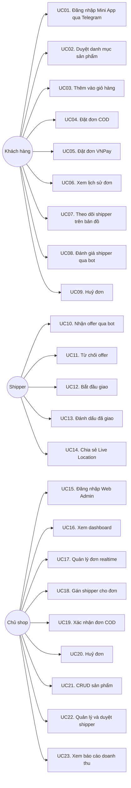
```mermaid
graph LR
  Khach((Khách hàng))
  Shipper((Shipper))
  Admin((Chủ shop))

  Khach --> UC01[UC01. Đăng nhập Mini App qua Telegram]
  Khach --> UC02[UC02. Duyệt danh mục sản phẩm]
  Khach --> UC03[UC03. Thêm vào giỏ hàng]
  Khach --> UC04[UC04. Đặt đơn COD]
  Khach --> UC05[UC05. Đặt đơn VNPay]
  Khach --> UC06[UC06. Xem lịch sử đơn]
  Khach --> UC07[UC07. Theo dõi shipper trên bản đồ]
  Khach --> UC08[UC08. Đánh giá shipper qua bot]
  Khach --> UC09[UC09. Huỷ đơn]

  Shipper --> UC10[UC10. Nhận offer qua bot]
  Shipper --> UC11[UC11. Từ chối offer]
  Shipper --> UC12[UC12. Bắt đầu giao]
  Shipper --> UC13[UC13. Đánh dấu đã giao]
  Shipper --> UC14[UC14. Chia sẻ Live Location]

  Admin --> UC15[UC15. Đăng nhập Web Admin]
  Admin --> UC16[UC16. Xem dashboard]
  Admin --> UC17[UC17. Quản lý đơn realtime]
  Admin --> UC18[UC18. Gán shipper cho đơn]
  Admin --> UC19[UC19. Xác nhận đơn COD]
  Admin --> UC20[UC20. Huỷ đơn]
  Admin --> UC21[UC21. CRUD sản phẩm]
  Admin --> UC22[UC22. Quản lý và duyệt shipper]
  Admin --> UC23[UC23. Xem báo cáo doanh thu]
```

### 3.1.4. Đặc tả use case chi tiết

Năm use case quan trọng nhất được mô tả chi tiết theo chuẩn UML, mỗi use case gồm các thành phần: Actor, Điều kiện trước (Precondition), Luồng chính, Luồng thay thế (Alternative), Điều kiện sau (Postcondition).

#### UC04. Đặt đơn (Khách hàng)

- **Actor:** Khách hàng.
- **Precondition:** Khách đã đăng nhập Mini App (initData hợp lệ); giỏ hàng có ít nhất một sản phẩm; `shop_config` có toạ độ điểm xuất phát.
- **Luồng chính:**
  1. Khách vào trang Checkout từ giỏ hàng.
  2. Khách nhập địa chỉ giao, ghim toạ độ trên bản đồ Leaflet.
  3. Khách nhập số điện thoại liên hệ và ghi chú (tuỳ chọn).
  4. Hệ thống tính phí ship theo công thức Haversine: `distance_km = haversine(pickup, delivery)`, `delivery_fee = base_fee + max(0, distance_km - free_km) × fee_per_km`.
  5. Khách chọn phương thức thanh toán (COD hoặc VNPay).
  6. Khách bấm "Xác nhận".
  7. Nếu COD: hệ thống tạo Order ở trạng thái PENDING, phát `OrderCreatedEvent`, bot gửi notification đến chủ shop, WebSocket đẩy đơn mới lên Web Admin realtime.
  8. Nếu VNPay: hệ thống tạo Order PENDING và Payment PENDING, ký URL VNPay, trả `paymentUrl` cho Mini App; Mini App mở URL bằng `WebApp.openLink`.
- **Luồng thay thế:**
  - 4a. Khoảng cách vượt bán kính giao cho phép → hệ thống trả lỗi `OUT_OF_DELIVERY_RANGE` 422.
  - 6a. Khách thiếu thông tin bắt buộc → frontend hiển thị validation error, không gọi API.
  - 8a. Khách thoát Mini App giữa luồng VNPay → Order vẫn PENDING; sau 15 phút `PaymentExpiryScheduler` đánh dấu Payment FAILED.
- **Postcondition:** Order đã được persist; thông báo đã được gửi đến chủ shop.

#### UC10. Nhận offer (Shipper)

- **Actor:** Shipper.
- **Precondition:** Shipper đã đăng ký và được duyệt (role SHIPPER, status ACTIVE); chủ shop vừa gán đơn cho shipper.
- **Luồng chính:**
  1. Backend tạo `DeliveryAssignment` với status OFFERED.
  2. Bot gửi message cho shipper với inline keyboard `[Nhận đơn]` và `[Từ chối]`.
  3. Shipper bấm "Nhận đơn"; bot gửi callback `OFFER_ACCEPT:<assignmentId>`.
  4. Backend kiểm tra: shipper hiện không có assignment STARTED nào khác; assignment vẫn đang OFFERED.
  5. Backend chuyển assignment sang ACCEPTED, order sang ASSIGNED.
  6. Bot báo khách "Shipper [Tên] đã nhận đơn", gửi WebSocket update lên Web Admin.
- **Luồng thay thế:**
  - 4a. Shipper đã có assignment STARTED (partial unique index `uq_assignment_shipper_started` từ chối) → hệ thống bắt `DataIntegrityViolationException` và trả lỗi "Bạn đang giao một đơn khác".
  - 4b. Assignment đã được shipper khác accept (race condition) → hệ thống trả lỗi "Đơn đã có shipper khác nhận".
- **Postcondition:** Order ở trạng thái ASSIGNED; assignment ở trạng thái ACCEPTED; khách nhận thông báo.

#### UC12 + UC13 + UC14. Giao đơn và chia sẻ Live Location (Shipper)

- **Actor:** Shipper.
- **Precondition:** Assignment ở trạng thái ACCEPTED; shipper đến điểm xuất phát.
- **Luồng chính:**
  1. Shipper bấm "Bắt đầu giao" trên Mini App.
  2. Backend chuyển assignment ACCEPTED → STARTED, order ASSIGNED → DELIVERING.
  3. Bot gửi shipper hướng dẫn share Live Location.
  4. Shipper share Live Location qua Telegram (chọn biểu tượng đính kèm → Location → Share Live Location for 1 hour).
  5. Telegram bắn `Update.message.location` đến webhook; `LiveLocationHandler` lưu `location_ping` đầu tiên và phát `LocationPingReceivedEvent`.
  6. Cứ mỗi 5–10 giây, Telegram bắn `Update.edited_message.location`; backend lưu ping mới và phát event.
  7. `LocationBroadcaster` (TransactionalEventListener AFTER_COMMIT) đẩy `LocationDto` qua STOMP đến `/user/{customerId}/queue/order/{orderId}/location`.
  8. Mini App của khách hàng nhận message, cập nhật marker shipper trên Leaflet map.
  9. Shipper đến nơi, bấm "Đã giao".
  10. Backend chuyển assignment STARTED → COMPLETED, order DELIVERING → DELIVERED, `shipper_profile.total_deliveries += 1`, `shipper_profile.current_state = AVAILABLE`.
  11. Bot gửi khách inline keyboard 5 sao để đánh giá.
- **Luồng thay thế:**
  - 4a. Shipper không share Live Location → hệ thống vẫn hoạt động, chỉ thiếu bản đồ realtime; khách vẫn nhận được cập nhật trạng thái.
  - 9a. Shipper báo "Không liên lạc được khách" → assignment STARTED → CANCELLED, order DELIVERING → CANCELLED kèm lý do.
- **Postcondition:** Order DELIVERED; shipper trở về AVAILABLE; khách nhận prompt đánh giá.

#### UC08. Đánh giá shipper (Khách hàng)

- **Actor:** Khách hàng.
- **Precondition:** Order ở trạng thái DELIVERED; chưa có rating cho order này (UNIQUE constraint trên `rating.order_id`).
- **Luồng chính:**
  1. Bot gửi inline keyboard 5 sao kèm nút "Bỏ qua".
  2. Khách bấm số sao N (1 ≤ N ≤ 5); callback `RATE:<orderId>:<N>` được phát.
  3. `RatingService.rate` insert dòng `rating(order_id, customer_id, shipper_id, stars=N)`.
  4. Service recompute `shipper_profile.rating_avg = AVG(stars)` và `rating_count = COUNT(*)` từ aggregate query trên tất cả rating của shipper.
  5. Bot edit message gốc — xoá inline keyboard, hiển thị "Cảm ơn bạn đã đánh giá N sao!".
  6. Bot prompt nhập comment kèm gợi ý gõ `/skip` để bỏ qua.
  7. `ConversationStateService` chuyển state khách sang CUSTOMER_RATING_COMMENT, lưu `{orderId: ...}` vào `conversation_state.data` JSONB.
  8. Nếu khách gõ text: `RatingCommentHandler` (Order 0) bắt text trước handler khác, update `rating.comment`, clear FSM.
  9. Nếu khách gõ `/skip`: clear FSM, không update gì.
- **Luồng thay thế:**
  - 3a. Rating đã tồn tại (UNIQUE violation) → bot trả "Bạn đã đánh giá đơn này rồi".
- **Postcondition:** Rating được lưu; `shipper_profile.rating_avg` đã cập nhật; FSM clear.

#### UC23. Xem báo cáo doanh thu (Chủ shop)

- **Actor:** Chủ shop.
- **Precondition:** Chủ shop đã đăng nhập Web Admin (JWT hợp lệ).
- **Luồng chính:**
  1. Chủ shop vào trang Reports, chọn khoảng ngày `from` và `to`, chọn `groupBy` ∈ {day, week, month}.
  2. Web Admin gọi `GET /api/admin/reports/revenue?from=...&to=...&groupBy=day`.
  3. Backend validate `groupBy` ∈ whitelist (chống SQL injection — lớp L9).
  4. Backend chạy query `generate_series + LEFT JOIN orders WHERE status='DELIVERED'` với `DATE_TRUNC(:groupBy, created_at)`, điền bucket trống bằng 0.
  5. Backend trả `[{ bucket: '2026-05-19', revenue: 1250000 }, ...]`.
  6. Web Admin render LineChart Recharts.
- **Luồng thay thế:**
  - 3a. `groupBy` không nằm trong whitelist → trả 400 `INVALID_GROUP_BY`.
- **Postcondition:** Chủ shop thấy biểu đồ doanh thu.

## 3.2. Kiến trúc tổng thể

### 3.2.1. Sơ đồ kiến trúc tổng thể

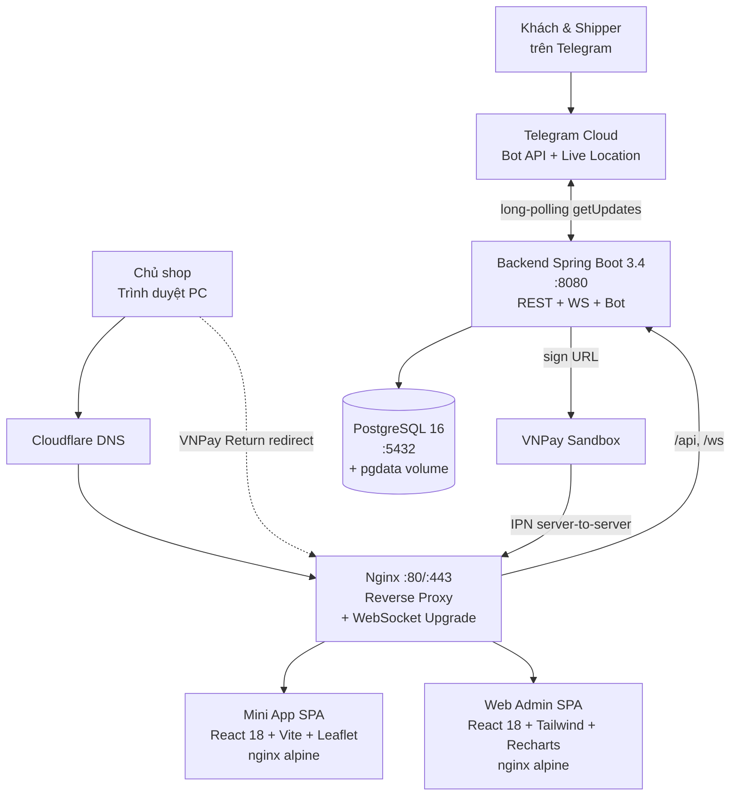
```mermaid
graph TD
  TGUser[Khách & Shipper<br/>trên Telegram]
  Browser[Chủ shop<br/>Trình duyệt PC]
  CF[Cloudflare DNS]
  Nginx[Nginx :80/:443<br/>Reverse Proxy<br/>+ WebSocket Upgrade]
  Miniapp[Mini App SPA<br/>React 18 + Vite + Leaflet<br/>nginx alpine]
  Webadmin[Web Admin SPA<br/>React 18 + Tailwind + Recharts<br/>nginx alpine]
  Backend[Backend Spring Boot 3.4<br/>:8080<br/>REST + WS + Bot]
  Postgres[(PostgreSQL 16<br/>:5432<br/>+ pgdata volume)]
  Telegram[Telegram Cloud<br/>Bot API + Live Location]
  VNPay[VNPay Sandbox]

  TGUser --> Telegram
  Browser --> CF
  CF --> Nginx
  Nginx --> Miniapp
  Nginx --> Webadmin
  Nginx -->|/api, /ws| Backend
  Telegram <-->|long-polling getUpdates| Backend
  Backend --> Postgres
  Backend -->|sign URL| VNPay
  VNPay -->|IPN server-to-server| Nginx
  Browser -.->|VNPay Return redirect| Nginx
```

### 3.2.2. Modular Monolith với 8 bounded context

Hệ thống được tổ chức thành 8 mô-đun Maven độc lập, phụ thuộc nhau theo đồ thị có hướng phi chu trình (DAG).

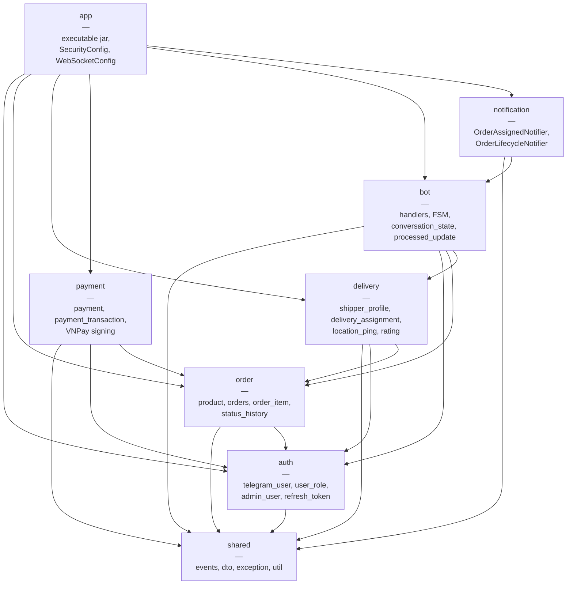
```mermaid
graph TD
  shared[shared<br/>—<br/>events, dto, exception, util]
  auth[auth<br/>—<br/>telegram_user, user_role,<br/>admin_user, refresh_token]
  order[order<br/>—<br/>product, orders, order_item,<br/>status_history]
  delivery[delivery<br/>—<br/>shipper_profile, delivery_assignment,<br/>location_ping, rating]
  payment[payment<br/>—<br/>payment, payment_transaction,<br/>VNPay signing]
  bot[bot<br/>—<br/>handlers, FSM,<br/>conversation_state, processed_update]
  notification[notification<br/>—<br/>OrderAssignedNotifier,<br/>OrderLifecycleNotifier]
  app[app<br/>—<br/>executable jar,<br/>SecurityConfig, WebSocketConfig]

  auth --> shared
  order --> shared
  order --> auth
  delivery --> shared
  delivery --> auth
  delivery --> order
  payment --> shared
  payment --> auth
  payment --> order
  bot --> shared
  bot --> auth
  bot --> order
  bot --> delivery
  notification --> shared
  notification --> bot
  app --> auth
  app --> order
  app --> delivery
  app --> payment
  app --> bot
  app --> notification
```

**Bảng 3.2. Bảng trách nhiệm 8 mô-đun (bounded context) của hệ thống**

| Module | Trách nhiệm chính |
|---|---|
| `shared` | Các sự kiện ứng dụng cross-module (OrderCreatedEvent, OrderConfirmedEvent...), exception cơ sở (DomainException), DTO chung, utility (Haversine, JWT helper). |
| `auth` | Đăng ký Telegram user qua `/start`, xác minh initData HMAC, quản lý vai trò CUSTOMER / SHIPPER / SHOP_OWNER, admin email + password + JWT (access 15 phút, refresh 7 ngày). |
| `order` | CRUD sản phẩm, vòng đời đơn hàng, ghi `status_history`, tính phí ship Haversine, máy trạng thái OrderStatus. |
| `delivery` | Gán shipper, máy trạng thái DeliveryAssignment, lưu `location_ping` từ Live Location, đánh giá shipper, báo cáo top-shipper. |
| `payment` | Tạo URL VNPay với HMAC-SHA512, xử lý Return URL (không cập nhật DB), xử lý IPN idempotent với audit trail JSONB. |
| `bot` | Webhook bot Telegram (chạy long-polling), UpdateRouter theo vai trò, các handler `common/customer/shipper/shopowner`, FSM `ConversationState`, BotSender bọc Bucket4j rate-limit. |
| `notification` | Lắng nghe các sự kiện cross-module bằng `@TransactionalEventListener(AFTER_COMMIT)`, gửi message qua bot và đẩy WebSocket. |
| `app` | Module thực thi — chứa `SecurityConfig`, `WebSocketConfig`, `main` method và file `application.yml`. |

### 3.2.3. Bảng tech stack chi tiết

**Bảng 3.3. Bảng tech stack — công nghệ và phiên bản**

| Tầng | Công nghệ | Phiên bản | Vai trò |
|---|---|---|---|
| **Backend** | | | |
| Ngôn ngữ | Java | 17 LTS | Ngôn ngữ chính |
| Framework | Spring Boot | 3.4.x | Web, security, JPA, WebSocket |
| ORM | Spring Data JPA + Hibernate | 6.x | Map entity ↔ DB |
| Build | Maven | 3.9+ | Multi-module build |
| Bot | telegrambots-springboot-longpolling-starter | 7.x | Telegram Bot API client |
| Migration | Flyway | 10.x | Quản lý schema migration |
| Security | Spring Security | 6.x | Auth filter chain, JWT |
| WebSocket | Spring WebSocket + STOMP | 6.x | Pub/sub thời gian thực |
| Validation | Jakarta Bean Validation | 3.x | Validate DTO |
| Test | JUnit 5, Mockito, AssertJ, Testcontainers | latest | Unit + IT |
| **Frontend** | | | |
| Ngôn ngữ | TypeScript | 5.6 | Type-safe React |
| Framework | React | 18 | UI |
| Build tool | Vite | 5 | Dev server + production build |
| Routing | React Router | 6 | Client-side routing |
| Server state | TanStack Query | 5 | Cache + invalidation |
| UI state | Zustand | 4 | Cart + admin session |
| Styling | TailwindCSS | 3 | Utility-first CSS |
| Chart | Recharts | 3 | Biểu đồ Web Admin |
| Map | react-leaflet + Leaflet | 4 + 1.9 | Bản đồ tracking |
| HTTP | Axios | 1.x | REST client |
| Date | date-fns (locale vi) | 3.x | Format ngày tiếng Việt |
| Mini App SDK | @twa-dev/sdk | 7 | WebApp.openLink, theme, initData |
| WebSocket | @stomp/stompjs + sockjs-client | latest | STOMP client |
| **Storage** | | | |
| RDBMS | PostgreSQL | 16 | DB chính |
| **Infra** | | | |
| Container | Docker | latest | Container runtime |
| Orchestration | Docker Compose | latest | Local + 1-node prod |
| Reverse proxy | Nginx | 1.27 | Static + reverse proxy + WS upgrade |
| TLS | Self-signed (dev) / Let's Encrypt (prod, hướng phát triển) | — | HTTPS |

### 3.2.4. Sơ đồ triển khai Docker Compose

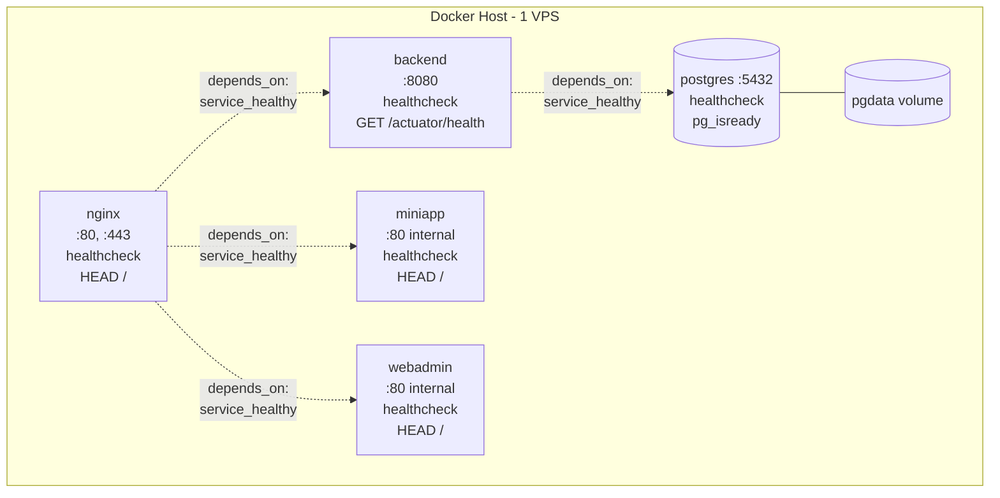
```mermaid
graph LR
  subgraph DockerHost[Docker Host - 1 VPS]
    direction LR
    Nginx[nginx<br/>:80, :443<br/>healthcheck<br/>HEAD /]
    Backend[backend<br/>:8080<br/>healthcheck<br/>GET /actuator/health]
    Miniapp[miniapp<br/>:80 internal<br/>healthcheck<br/>HEAD /]
    Webadmin[webadmin<br/>:80 internal<br/>healthcheck<br/>HEAD /]
    Postgres[(postgres :5432<br/>healthcheck<br/>pg_isready)]
    pgdata[(pgdata volume)]
  end
  Postgres --- pgdata
  Backend -.->|depends_on:<br/>service_healthy| Postgres
  Nginx -.->|depends_on:<br/>service_healthy| Backend
  Nginx -.->|depends_on:<br/>service_healthy| Miniapp
  Nginx -.->|depends_on:<br/>service_healthy| Webadmin
```

Khi chạy `docker compose up -d`, thứ tự khởi động được điều phối bởi `depends_on: condition: service_healthy`: `postgres` healthy trước, `backend` mới khởi động và đợi tới khi `/actuator/health` trả UP, sau đó `miniapp`, `webadmin` và `nginx` mới start.

## 3.3. Thiết kế cơ sở dữ liệu

### 3.3.1. Sơ đồ thực thể – quan hệ (ERD)

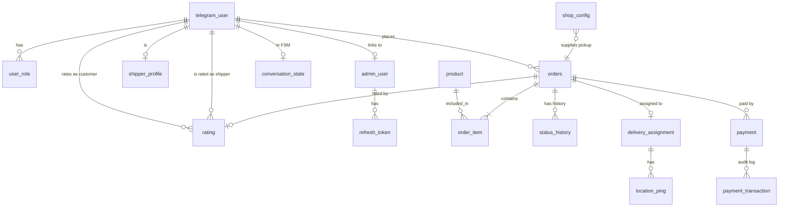
```mermaid
erDiagram
  telegram_user ||--o{ user_role : has
  telegram_user ||--o| admin_user : "links to"
  telegram_user ||--o| shipper_profile : "is"
  telegram_user ||--o{ orders : places
  telegram_user ||--o{ rating : "rates as customer"
  telegram_user ||--o{ rating : "is rated as shipper"
  telegram_user ||--o| conversation_state : "in FSM"

  admin_user ||--o{ refresh_token : has

  product ||--o{ order_item : included_in

  orders ||--|{ order_item : contains
  orders ||--o{ status_history : "has history"
  orders ||--o| delivery_assignment : "assigned to"
  orders ||--o{ payment : "paid by"
  orders ||--o| rating : "rated by"

  delivery_assignment ||--o{ location_ping : has

  payment ||--o{ payment_transaction : "audit log"

  shop_config }o--|| orders : "supplies pickup"
```

### 3.3.2. Mô tả từng bảng

Hệ thống có 15 bảng chính được tạo bởi 11 file Flyway migration. Mô tả ngắn gọn từng bảng:

- **`telegram_user`** (V2). Lưu thông tin người dùng Telegram. PK = `id` (chính là Telegram user ID, BIGINT). Cột chính: `username`, `first_name`, `phone` (lấy qua `KeyboardButton.request_contact`), `is_blocked` (true khi Telegram trả 403 — user block bot). Index: `idx_telegram_user_username WHERE username IS NOT NULL`.

- **`user_role`** (V2). Liên kết user với vai trò CUSTOMER / SHIPPER / SHOP_OWNER. UNIQUE `(telegram_user_id, role)` — một user không trùng vai trò. `status` ∈ {ACTIVE, PENDING, BLOCKED} (chủ yếu dùng cho luồng duyệt shipper).

- **`admin_user`** (V5). Tài khoản đăng nhập Web Admin. `email` UNIQUE, `password_hash` BCrypt-10. Có thể link sang `telegram_user_id` để bot gửi notification cho chủ shop.

- **`refresh_token`** (V5). Refresh token JWT 7 ngày, lưu `token_hash` (SHA-256, không lưu cleartext). `revoked` để soft-delete sau logout.

- **`product`** (V4). Sản phẩm. `price NUMERIC(12,2) CHECK (price >= 0)`, `stock INT CHECK (stock >= 0)`. Partial index `idx_product_active WHERE is_active = TRUE`.

- **`orders`** (V4). Đơn hàng. PK = UUID (chống enumeration). `code` UNIQUE dạng `"DH<yyyyMMdd>-<seq>"` cho user-facing. Snapshot tại thời điểm tạo: `customer_name`, `customer_phone`, `pickup_lat/lng` (từ `shop_config`), `delivery_lat/lng`, `distance_km`, `delivery_fee`, `total`. `payment_status` denormalized từ `payment.status`. `version` cho optimistic lock. Hai composite index `(status, created_at DESC)` và `(customer_id, created_at DESC)`.

- **`order_item`** (V4). Dòng sản phẩm trong đơn. `unit_price` snapshot từ `product.price` tại thời điểm tạo (tránh việc giá đổi sau ảnh hưởng đơn cũ). `quantity > 0` CHECK.

- **`status_history`** (V4). Audit log mỗi lần đổi trạng thái đơn — `(from_status, to_status, changed_by_user_id, changed_at, note)`. Không dùng trigger DB; insert tại tầng service.

- **`shipper_profile`** (V6). Hồ sơ shipper. PK = `user_id` (FK đến `telegram_user`). `vehicle_type` ∈ {MOTORBIKE, CAR, BICYCLE}, `current_state` ∈ {AVAILABLE, BUSY, OFFLINE}. `rating_avg NUMERIC(3,2)`, `rating_count INT` — được recompute từ aggregate query (không incremental math).

- **`delivery_assignment`** (V6). Việc gán shipper cho đơn. PK = UUID. `order_id` UNIQUE — một đơn chỉ có một assignment. `status` ∈ {OFFERED, ACCEPTED, STARTED, COMPLETED, REJECTED, CANCELLED}. Timestamp cột: `assigned_at`, `accepted_at`, `started_at`, `delivered_at`, `cancelled_at`, `rejected_at`.

- **`uq_assignment_shipper_started`** (V8). Partial UNIQUE index `ON delivery_assignment(shipper_id) WHERE status = 'STARTED'` — ràng buộc "một shipper chỉ có tối đa một assignment đang chạy" tại tầng DB.

- **`location_ping`** (V7). Ping GPS từ Telegram Live Location. `lat/lng NUMERIC(10,7)`, `accuracy`, `heading`. Composite index `(assignment_id, recorded_at DESC)` hỗ trợ query "Polyline đường đi".

- **`payment`** (V9). Một order có thể có nhiều payment (khách thử lại sau khi fail). PK UUID. `vnp_txn_ref VARCHAR(64) UNIQUE` — `"<orderCode>-<epochMs>"`, đảm bảo chống replay. `version` optimistic lock.

- **`payment_transaction`** (V9). Audit log mọi sự kiện VNPay (CREATE / IPN / RETURN). `raw_payload JSONB NOT NULL` — toàn bộ payload kể cả invalid signature, phục vụ forensics.

- **`rating`** (V10). Đánh giá shipper. `order_id` UNIQUE — chống đánh giá trùng. `stars SMALLINT CHECK (stars BETWEEN 1 AND 5)`. Index `(shipper_id, created_at DESC)` cho trang Shipper Detail.

- **`conversation_state`** (V3). FSM hội thoại bot. PK = `telegram_user_id`. `state VARCHAR(64)`, `data JSONB`. TTL 30 phút (cron xoá stale, hướng phát triển).

- **`processed_update`** (V3). Idempotency cho bot — `update_id` PK, chống Telegram retry duplicate.

### 3.3.3. Quyết định thiết kế không tầm thường

**Lựa chọn PK UUID cho `orders`, `payment`, `delivery_assignment` thay vì BIGSERIAL.** UUID v4 không thể đoán tuần tự — kẻ tấn công không thể enumerate `/api/orders/1, /api/orders/2, ...` để dò đơn của khách khác. Các bảng nội bộ như `rating`, `status_history`, `location_ping` vẫn dùng BIGSERIAL vì không lộ ra URL ngoài hoặc đã được khoá bởi context của bảng cha.

**Dùng JSONB cho audit và FSM data.** `payment_transaction.raw_payload` lưu toàn bộ map tham số VNPay (có thể thay đổi giữa các phiên bản API mà không phải migrate schema). `conversation_state.data` lưu payload tuỳ FSM state (state CUSTOMER_RATING_COMMENT lưu `{orderId}`, state đăng ký shipper tương lai lưu `{name, phone, vehicle, plate}`). Hibernate 6 hỗ trợ native qua `@JdbcTypeCode(SqlTypes.JSON)`.

**Partial unique index `uq_assignment_shipper_started` (V8).** Quy tắc nghiệp vụ "một shipper chỉ có một assignment STARTED tại một thời điểm" được khoá tại tầng DB thay vì chỉ tầng ứng dụng. Lý do: `LiveLocationHandler` tra `DeliveryAssignment` STARTED của shipper để route ping — nếu có hai dòng STARTED do race condition, GPS sẽ rò qua đơn của khách khác. Partial index từ chối insert dòng STARTED thứ hai bằng `DataIntegrityViolationException`, và service catch để trả lỗi đẹp.

**`@Version` optimistic lock trên `orders`, `payment`, `shipper_profile`.** Ba thực thể này chịu nhiều luồng đồng thời (admin xác nhận đơn + customer huỷ; VNPay IPN + cron expiry). Optimistic lock đơn giản hơn pessimistic lock, retry tại tầng service nếu cần.

**Mẫu status history qua bảng audit thay vì trigger.** Lý do: trigger DB khó test, khó debug và lock-in với DBMS cụ thể. Service insert dòng audit trong cùng transaction với update trạng thái — đảm bảo atomic và testable.

## 3.4. Thiết kế API

### 3.4.1. Phân vùng theo actor

**Bảng 3.4. Phân vùng URL và cơ chế xác thực**

| Phân vùng | URL prefix | Cơ chế xác thực |
|---|---|---|
| Customer | `/api/orders/*`, `/api/products/*`, `/api/payment/vnpay/create` | Telegram initData (HMAC-SHA256) |
| Shipper | `/api/shipper/*` | Telegram initData |
| Admin | `/api/admin/*` | JWT (Authorization: Bearer) |
| Public | `/api/payment/vnpay/return`, `/api/payment/vnpay/ipn` | Chữ ký HMAC-SHA512 của VNPay |
| Bot webhook | `/api/bot/webhook` | Header secret token (long-polling không dùng) |

### 3.4.2. Danh sách endpoint đầy đủ

**Bảng 3.5. Danh sách endpoint REST đầy đủ của hệ thống**

| URL | Method | Auth | Mô tả |
|---|---|---|---|
| `/api/me` | GET | initData | Trả thông tin user và vai trò |
| `/api/products` | GET | initData | Danh mục sản phẩm active |
| `/api/products/{id}` | GET | initData | Chi tiết sản phẩm |
| `/api/orders` | POST | initData | Tạo đơn (COD hoặc VNPay) |
| `/api/orders/mine` | GET | initData | Lịch sử đơn của khách (paginated) |
| `/api/orders/{id}` | GET | initData | Chi tiết đơn |
| `/api/orders/{id}/cancel` | POST | initData | Khách huỷ đơn (PENDING/CONFIRMED) |
| `/api/orders/{id}/rating` | POST | initData | Đánh giá shipper |
| `/api/payment/vnpay/create` | POST | initData | Tạo URL VNPay đã ký |
| `/api/payment/vnpay/return` | GET | (chữ ký) | VNPay redirect khách về |
| `/api/payment/vnpay/ipn` | POST | (chữ ký) | VNPay server-to-server notify |
| `/api/shipper/assignments` | GET | initData | Danh sách đơn đang giao |
| `/api/shipper/assignments/{id}` | GET | initData | Chi tiết assignment |
| `/api/shipper/assignments/{id}/accept` | POST | initData | Nhận đơn |
| `/api/shipper/assignments/{id}/reject` | POST | initData | Từ chối đơn |
| `/api/shipper/assignments/{id}/start` | POST | initData | Bắt đầu giao |
| `/api/shipper/assignments/{id}/complete` | POST | initData | Đã giao |
| `/api/shipper/profile/state` | POST | initData | Toggle AVAILABLE / OFFLINE |
| `/api/admin/auth/login` | POST | (public) | Login email + password |
| `/api/admin/auth/refresh` | POST | refresh token | Cấp lại access token |
| `/api/admin/auth/logout` | POST | JWT | Revoke refresh token |
| `/api/admin/dashboard/summary` | GET | JWT | KPI tổng quan |
| `/api/admin/orders` | GET | JWT | Danh sách đơn (filter + paginate) |
| `/api/admin/orders/{id}` | GET | JWT | Chi tiết đơn (admin view) |
| `/api/admin/orders/{id}/confirm` | POST | JWT | Xác nhận đơn COD |
| `/api/admin/orders/{id}/assign` | POST | JWT | Gán shipper |
| `/api/admin/orders/{id}/cancel` | POST | JWT | Huỷ đơn (kèm lý do) |
| `/api/admin/products` | GET, POST | JWT | CRUD sản phẩm |
| `/api/admin/products/{id}` | PUT, DELETE | JWT | Update / xoá sản phẩm |
| `/api/admin/shippers` | GET | JWT | Danh sách shipper |
| `/api/admin/shippers/{id}` | GET | JWT | Chi tiết shipper |
| `/api/admin/shippers/{id}/approve` | POST | JWT | Duyệt shipper PENDING |
| `/api/admin/shippers/{id}/block` | POST | JWT | Khoá shipper |
| `/api/admin/shippers/{id}/unblock` | POST | JWT | Mở khoá shipper |
| `/api/admin/reports/revenue` | GET | JWT | Báo cáo doanh thu |
| `/api/admin/reports/top-shippers` | GET | JWT | Top shipper theo doanh thu |
| `/api/admin/reports/cancellation` | GET | JWT | Tỉ lệ huỷ |
| `/api/admin/settings` | GET, PUT | JWT | shop_config |

### 3.4.3. Cơ chế xác thực

**Telegram initData (Mini App).** `TelegramAuthFilter` đọc header `X-Telegram-Init-Data`, parse query string, kiểm tra trường `auth_date` không quá hạn (cấu hình 24 giờ), tính HMAC-SHA256 với khoá `HMAC("WebAppData", botToken)` và so sánh `hash` bằng `MessageDigest.isEqual`. Nếu hợp lệ, filter set request attribute `currentUser`. Argument resolver `@CurrentUser` đọc attribute này.

**JWT (Web Admin).** `JwtAuthFilter` đọc header `Authorization: Bearer <token>`. Token là JWS HS512 với payload `{sub: adminId, role: SHOP_OWNER, exp: ...}`, ký bằng `JWT_SECRET` từ env. Hạn 15 phút. Refresh token là UUID v4 lưu trong DB ở cột `token_hash` (SHA-256, không lưu cleartext), hạn 7 ngày.

**WebSocket dual auth.** `ChannelInterceptor` chèn vào `inboundChannel`, kiểm tra CONNECT frame có header `X-Telegram-Init-Data` (cho Mini App) HOẶC `Authorization: Bearer <jwt>` (cho Web Admin). Nếu cả hai đều thiếu, throw `AccessDeniedException` để Spring đóng kết nối. Trên SUBSCRIBE frame, interceptor áp allowlist: customer chỉ subscribe `/user/{customerId}/queue/order/*` của chính mình; admin chỉ subscribe `/topic/admin/orders`.

**Dev-bypass header `X-Dev-User-Id`.** Chỉ active trong profile `dev`. Nếu request đến với header này, `TelegramAuthFilter` skip xác minh HMAC và set `currentUser` theo ID truyền vào — phục vụ test Mini App trên trình duyệt thường mà không cần Telegram. Trong profile `prod`, filter bỏ qua header này hoàn toàn.

## 3.5. Thiết kế Máy trạng thái (FSM)

### 3.5.1. OrderStatus FSM

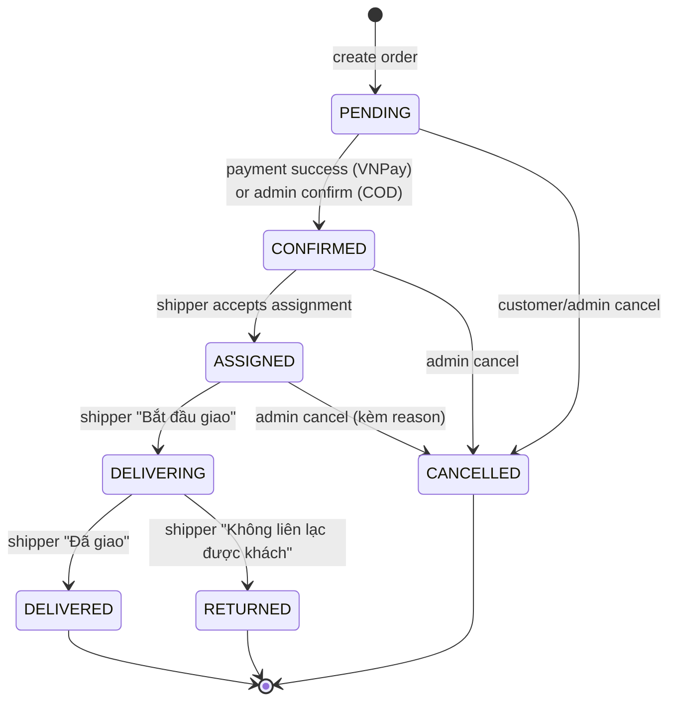
```mermaid
stateDiagram-v2
    [*] --> PENDING : create order
    PENDING --> CONFIRMED : payment success (VNPay)<br/>or admin confirm (COD)
    PENDING --> CANCELLED : customer/admin cancel
    CONFIRMED --> ASSIGNED : shipper accepts assignment
    CONFIRMED --> CANCELLED : admin cancel
    ASSIGNED --> DELIVERING : shipper "Bắt đầu giao"
    ASSIGNED --> CANCELLED : admin cancel (kèm reason)
    DELIVERING --> DELIVERED : shipper "Đã giao"
    DELIVERING --> RETURNED : shipper "Không liên lạc được khách"
    DELIVERED --> [*]
    CANCELLED --> [*]
    RETURNED --> [*]
```

### 3.5.2. DeliveryAssignment FSM

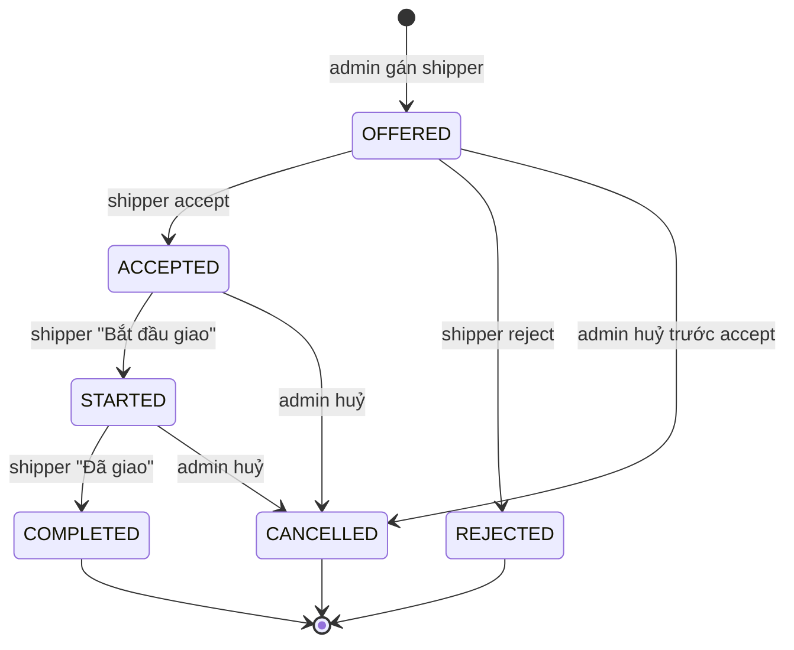
```mermaid
stateDiagram-v2
    [*] --> OFFERED : admin gán shipper
    OFFERED --> ACCEPTED : shipper accept
    OFFERED --> REJECTED : shipper reject
    OFFERED --> CANCELLED : admin huỷ trước accept
    ACCEPTED --> STARTED : shipper "Bắt đầu giao"
    ACCEPTED --> CANCELLED : admin huỷ
    STARTED --> COMPLETED : shipper "Đã giao"
    STARTED --> CANCELLED : admin huỷ
    COMPLETED --> [*]
    REJECTED --> [*]
    CANCELLED --> [*]
```

### 3.5.3. PaymentStatus FSM

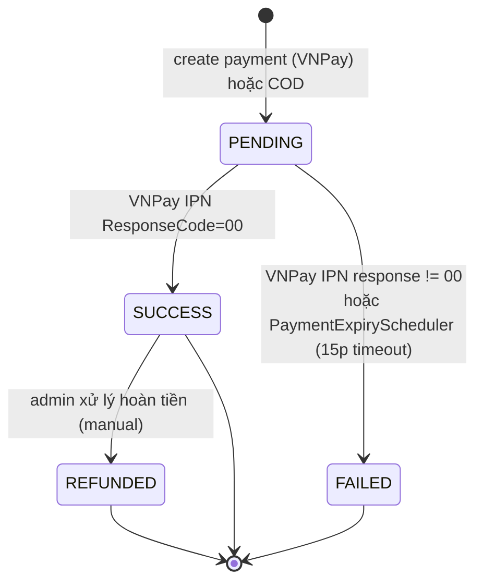
```mermaid
stateDiagram-v2
    [*] --> PENDING : create payment (VNPay) hoặc COD
    PENDING --> SUCCESS : VNPay IPN ResponseCode=00
    PENDING --> FAILED : VNPay IPN response != 00<br/>hoặc PaymentExpiryScheduler (15p timeout)
    SUCCESS --> REFUNDED : admin xử lý hoàn tiền (manual)
    SUCCESS --> [*]
    FAILED --> [*]
    REFUNDED --> [*]
```

### 3.5.4. ConversationState FSM (Bot)

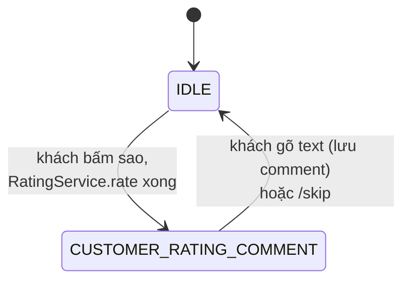
```mermaid
stateDiagram-v2
    [*] --> IDLE
    IDLE --> CUSTOMER_RATING_COMMENT : khách bấm sao,<br/>RatingService.rate xong
    CUSTOMER_RATING_COMMENT --> IDLE : khách gõ text (lưu comment)<br/>hoặc /skip
```

### 3.5.5. Bảng ma trận chuyển trạng thái (transition matrix)

**Bảng 3.6. Ma trận chuyển trạng thái `OrderStatus`**

| Từ → Đến | Sự kiện kích hoạt | Điều kiện |
|---|---|---|
| PENDING → CONFIRMED | Payment SUCCESS / Admin confirm | Đơn còn hiệu lực |
| PENDING → CANCELLED | Customer cancel / Admin cancel | — |
| CONFIRMED → ASSIGNED | Shipper accept | Có DeliveryAssignment cho đơn |
| CONFIRMED → CANCELLED | Admin cancel | Kèm reason |
| ASSIGNED → DELIVERING | Shipper "Bắt đầu giao" | Assignment chuyển STARTED đồng thời |
| ASSIGNED → CANCELLED | Admin cancel | Kèm reason |
| DELIVERING → DELIVERED | Shipper "Đã giao" | Assignment chuyển COMPLETED |
| DELIVERING → RETURNED | Shipper báo không liên lạc được | — |

**Bảng 3.7. Ma trận chuyển trạng thái `DeliveryAssignment`**

| Từ → Đến | Sự kiện |
|---|---|
| OFFERED → ACCEPTED | `OFFER_ACCEPT` callback |
| OFFERED → REJECTED | `OFFER_REJECT` callback |
| OFFERED → CANCELLED | Admin cancel đơn |
| ACCEPTED → STARTED | `/api/shipper/assignments/{id}/start` |
| ACCEPTED → CANCELLED | Admin cancel |
| STARTED → COMPLETED | `/api/shipper/assignments/{id}/complete` |
| STARTED → CANCELLED | Admin cancel |

**Bảng 3.8. Ma trận chuyển trạng thái `PaymentStatus`**

| Từ → Đến | Sự kiện |
|---|---|
| PENDING → SUCCESS | IPN ResponseCode=00, amount khớp |
| PENDING → FAILED | IPN ResponseCode!=00 hoặc PaymentExpiryScheduler |
| SUCCESS → REFUNDED | Admin xử lý refund (chưa hiện thực, hướng phát triển) |

## 3.6. Thiết kế luồng nghiệp vụ chính

### 3.6.1. Đặt đơn COD

```mermaid
sequenceDiagram
    autonumber
    actor Khach as Khách (Mini App)
    participant BE as Backend (Spring)
    participant DB as PostgreSQL
    participant WS as STOMP /topic/admin/orders
    participant Bot as Telegram Bot
    participant Admin as Web Admin

    Khach->>BE: POST /api/orders<br/>{items, delivery, COD}<br/>+ X-Telegram-Init-Data
    BE->>BE: TelegramAuthFilter verify HMAC
    BE->>BE: PricingService.calc<br/>(Haversine + base + perKm)
    BE->>DB: BEGIN; INSERT orders, order_item,<br/>status_history(null→PENDING)
    DB-->>BE: OK
    BE->>BE: publish OrderCreatedEvent
    BE->>DB: COMMIT
    Note over BE: TransactionalEventListener<br/>AFTER_COMMIT
    BE->>WS: SimpMessagingTemplate<br/>convertAndSend /topic/admin/orders
    WS-->>Admin: realtime push (đơn mới)
    BE->>Bot: BotSender.send (shop owner)
    Bot-->>Bot: tin nhắn "🔔 Đơn mới DH..."
    BE-->>Khach: 201 + OrderResponse
```

### 3.6.2. Đặt đơn VNPay

```mermaid
sequenceDiagram
    autonumber
    actor Khach as Khách (Mini App)
    participant BE as Backend
    participant DB as PostgreSQL
    participant VNPay
    participant Browser as Browser/WebView

    Khach->>BE: POST /api/orders {items, VNPAY}
    BE->>DB: INSERT orders(PENDING)
    BE-->>Khach: 201 OrderResponse
    Khach->>BE: POST /api/payment/vnpay/create<br/>{orderId}
    BE->>DB: INSERT payment(PENDING)<br/>vnp_txn_ref UNIQUE
    BE->>BE: VnpaySignatureService<br/>HMAC-SHA512 sign params
    BE-->>Khach: {paymentUrl}
    Khach->>Khach: WebApp.openLink(paymentUrl)
    Khach->>VNPay: chuyển hướng đến VNPay sandbox
    VNPay-->>Khach: form OTP, NCB card
    Khach->>VNPay: nhập OTP
    par Return URL (browser)
        VNPay->>Browser: 302 → /api/payment/vnpay/return<br/>?vnp_SecureHash=...
        Browser->>BE: GET /api/payment/vnpay/return
        BE->>BE: verify HMAC<br/>(MessageDigest.isEqual)
        BE-->>Browser: HTML "Thanh toán thành công"<br/>(KHÔNG cập nhật DB)
    and IPN (server-to-server)
        VNPay->>BE: POST /api/payment/vnpay/ipn
        BE->>BE: verify HMAC
        BE->>DB: SELECT payment WHERE vnp_txn_ref
        DB-->>BE: payment(PENDING)
        BE->>DB: BEGIN; UPDATE payment status=SUCCESS<br/>INSERT payment_transaction(IPN, raw_payload JSONB)
        BE->>BE: publish PaymentSucceededEvent
        BE->>DB: COMMIT
        Note over BE: TransactionalEventListener<br/>REQUIRES_NEW
        BE->>DB: BEGIN (new tx)<br/>UPDATE orders SET status=CONFIRMED<br/>INSERT status_history(PENDING→CONFIRMED)
        BE-->>VNPay: {RspCode: "00", Message: "Confirm Success"}
    end
```

### 3.6.3. Gán shipper và giao đơn

```mermaid
sequenceDiagram
    autonumber
    actor Admin
    participant BE as Backend
    participant DB
    participant Bot as Telegram Bot
    actor Shipper
    participant WS as STOMP

    Admin->>BE: POST /api/admin/orders/{id}/assign<br/>{shipperId}
    BE->>DB: INSERT delivery_assignment(OFFERED)
    BE->>BE: publish OrderAssignedEvent
    BE-->>Admin: 200
    Note over BE: AFTER_COMMIT
    BE->>Bot: BotSender.send (shipper)
    Bot-->>Shipper: "📦 Đơn DH..., Phí 25k<br/>[Nhận] [Từ chối]"
    Shipper->>Bot: bấm "Nhận"
    Bot->>BE: POST /api/bot/webhook<br/>(callback OFFER_ACCEPT:xxx)
    BE->>DB: SELECT delivery_assignment FOR UPDATE
    BE->>DB: UPDATE assignment status=ACCEPTED<br/>UPDATE orders status=ASSIGNED
    BE->>WS: /topic/admin/orders (status change)
    BE->>Bot: notify khách "Shipper X đã nhận"
    Shipper->>BE: POST /api/shipper/assignments/{id}/start
    BE->>DB: UPDATE assignment STARTED<br/>(partial unique index check)<br/>UPDATE orders DELIVERING
    Shipper->>Bot: share Live Location 1h
    loop mỗi 5-10 giây
        Bot->>BE: Update.edited_message.location
        BE->>BE: LiveLocationHandler<br/>tra assignment STARTED của shipper
        BE->>DB: INSERT location_ping
        BE->>BE: publish LocationPingReceivedEvent
        BE->>WS: /user/{customerId}/queue/order/{id}/location
    end
    Shipper->>BE: POST /api/shipper/assignments/{id}/complete
    BE->>DB: UPDATE assignment COMPLETED<br/>UPDATE orders DELIVERED<br/>shipper_profile.total_deliveries += 1
    BE->>Bot: notify khách + prompt rating
```

### 3.6.4. Đánh giá shipper

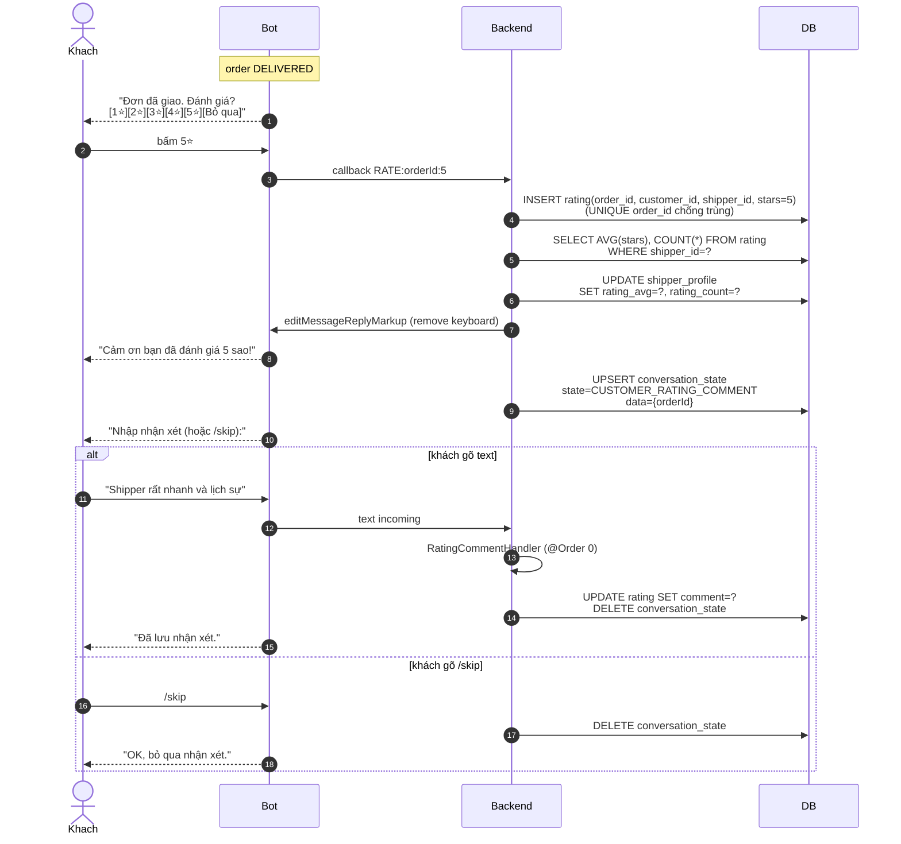
```mermaid
sequenceDiagram
    autonumber
    actor Khach
    participant Bot
    participant BE as Backend
    participant DB

    Note over Bot: order DELIVERED
    Bot-->>Khach: "Đơn đã giao. Đánh giá?<br/>[1⭐][2⭐][3⭐][4⭐][5⭐][Bỏ qua]"
    Khach->>Bot: bấm 5⭐
    Bot->>BE: callback RATE:orderId:5
    BE->>DB: INSERT rating(order_id, customer_id, shipper_id, stars=5)<br/>(UNIQUE order_id chống trùng)
    BE->>DB: SELECT AVG(stars), COUNT(*) FROM rating<br/>WHERE shipper_id=?
    BE->>DB: UPDATE shipper_profile<br/>SET rating_avg=?, rating_count=?
    BE->>Bot: editMessageReplyMarkup (remove keyboard)
    Bot-->>Khach: "Cảm ơn bạn đã đánh giá 5 sao!"
    BE->>DB: UPSERT conversation_state<br/>state=CUSTOMER_RATING_COMMENT<br/>data={orderId}
    Bot-->>Khach: "Nhập nhận xét (hoặc /skip):"
    alt khách gõ text
        Khach->>Bot: "Shipper rất nhanh và lịch sự"
        Bot->>BE: text incoming
        BE->>BE: RatingCommentHandler (@Order 0)
        BE->>DB: UPDATE rating SET comment=?<br/>DELETE conversation_state
        Bot-->>Khach: "Đã lưu nhận xét."
    else khách gõ /skip
        Khach->>Bot: /skip
        BE->>DB: DELETE conversation_state
        Bot-->>Khach: "OK, bỏ qua nhận xét."
    end
```

## 3.7. Thiết kế bảo mật

Hệ thống áp dụng *defense-in-depth* — nhiều lớp phòng thủ song song, không dựa duy nhất vào một cơ chế. Mỗi lớp đối phó một loại đe doạ cụ thể và có ít nhất một regression test khoá đảm bảo.

### 3.7.1. Mô hình đe doạ (Threat Model) và 11 lớp đối phó

**Bảng 3.9. Mô hình đe doạ và 11 lớp đối phó (defense-in-depth)**

| Lớp | Đe doạ | Cơ chế đối phó | Vị trí trong code |
|---|---|---|---|
| L1 | Giả mạo Telegram identity | `TelegramAuthFilter` verify HMAC initData | `auth/config/TelegramAuthFilter` |
| L2 | Hijack phiên admin | `JwtAuthFilter` (TTL 15p) + refresh token DB-backed | `auth/config/JwtAuthFilter` |
| L3 | Endpoint chưa được phân quyền | `SecurityConfig` filter chain allowlist | `app/config/SecurityConfig` |
| L4 | Privilege escalation | `@PreAuthorize` mức controller | toàn bộ controller `/admin/*` |
| L5 | Forge `customerId` qua path | Custom `@CurrentUser` resolver thay vì `@PathVariable` | `auth/api/CurrentUser` |
| L6 | Anonymous WebSocket connect | CONNECT frame interceptor dual auth | `app/config/WebSocketAuthInterceptor` |
| L7 | Cross-user data leak qua broadcast | SUBSCRIBE frame allowlist `/user/*`, `/queue/*` | `app/config/WebSocketAuthInterceptor` |
| L8 | Signature spoof + timing attack | VNPay HMAC `MessageDigest.isEqual` constant-time | `payment/service/VnpaySignatureService` |
| L9 | SQL injection ở Reports | `groupBy` enum whitelist trước `DATE_TRUNC` bind | `delivery/service/ReportService` |
| L10 | Payment replay | `vnp_TxnRef UNIQUE` + audit trail `payment_transaction` | `payment/service/VnpayIpnService` |
| L11 | Quy gán nhầm vị trí shipper | Partial unique index `uq_assignment_shipper_started` (V8) | `db/migration/V8` |

### 3.7.2. Ma trận đối chiếu (mitigation matrix)

**Bảng 3.10. Ma trận đối chiếu STRIDE — lớp đối phó — test bao phủ** [21], [22]

| Loại đe doạ | Lớp đối phó | Test bao phủ |
|---|---|---|
| Spoofing identity | L1, L2, L5 | `TelegramAuthFilterTest`, `JwtAuthFilterTest` |
| Tampering | L8, L9, L10 | `VnpaySignatureServiceTest`, `ReportServiceSqlInjectionIT` |
| Repudiation | L10 (audit trail) | `VnpayIpnAuditIT` |
| Information disclosure | L4, L5, L7 | `WebSocketAdminAuthIT`, `OrderAccessControlIT` |
| Denial of service | (Bucket4j rate-limit) | `BotRateLimitTest` |
| Elevation of privilege | L3, L4 | `AdminEndpointSecurityIT` |
| Race condition | L11 | `AssignmentConcurrencyIT` |

### 3.7.3. Audit trail

Hai bảng audit cung cấp khả năng truy vết hậu kỳ:

- **`payment_transaction`** (V9). Mỗi event VNPay (CREATE / IPN / RETURN) được ghi với `raw_payload JSONB` chứa toàn bộ payload đến. Quan trọng: kể cả khi chữ ký invalid, payload vẫn được ghi để phục vụ điều tra. Đây là phát hiện từ code review pha P7 và đã được vá hậu kỳ.
- **`status_history`** (V4). Mỗi lần đơn chuyển trạng thái, dòng `(from, to, changed_by_user_id, changed_at, note)` được insert trong cùng transaction. Bảng này là nguồn để render timeline trong Order Detail (hướng phát triển).

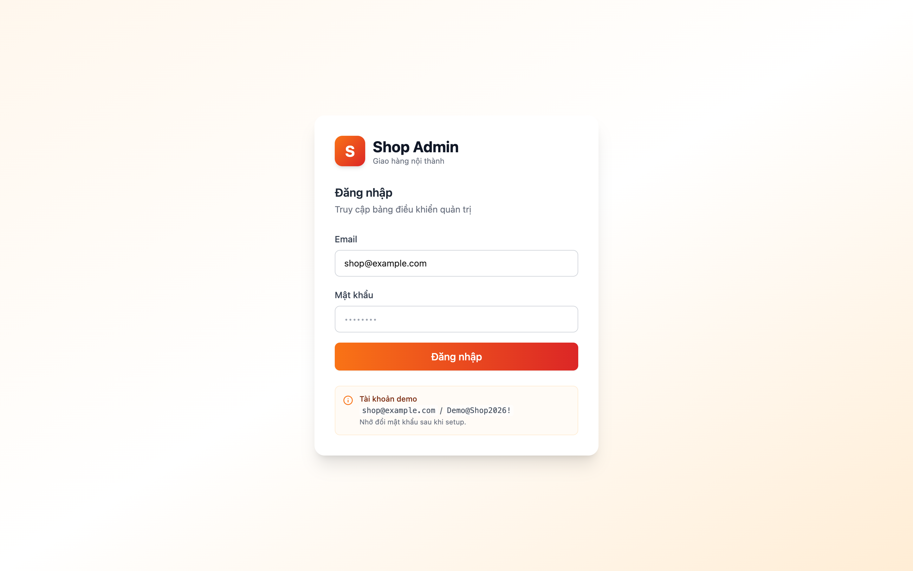

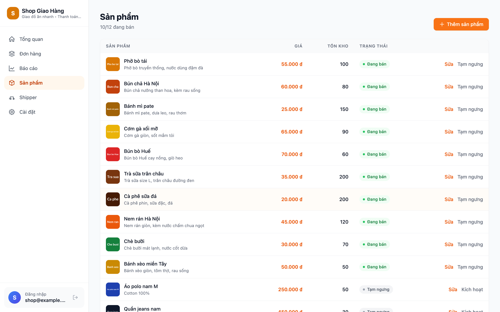

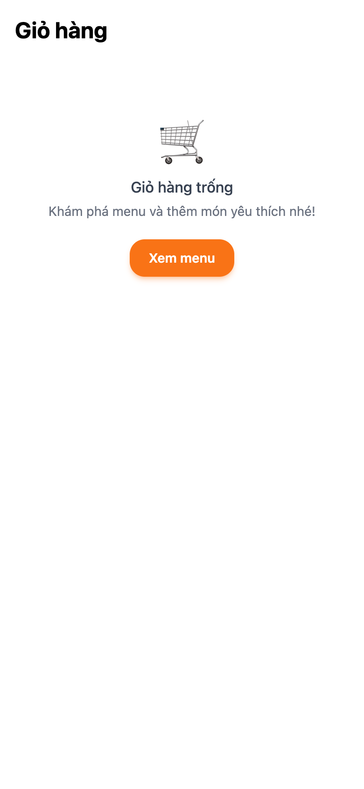

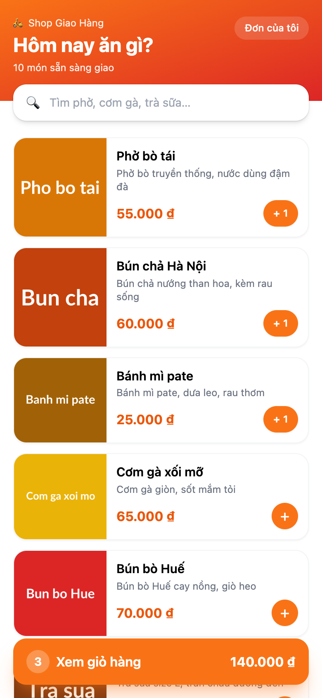

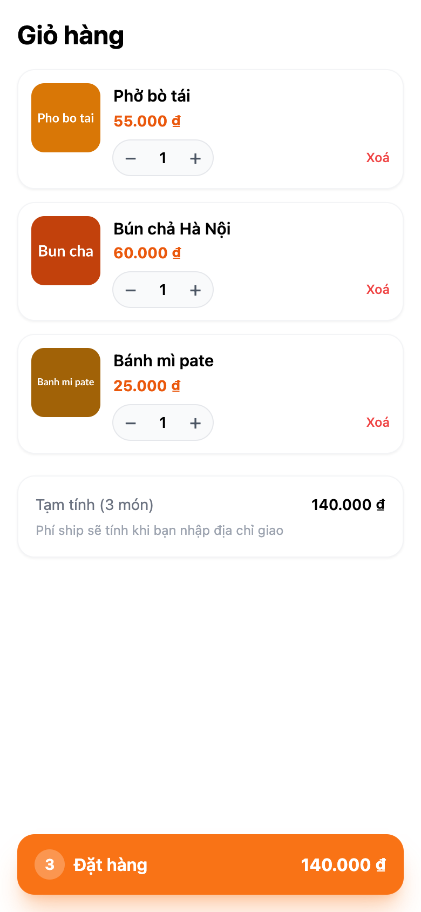

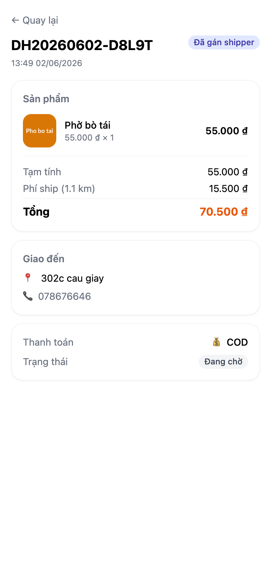

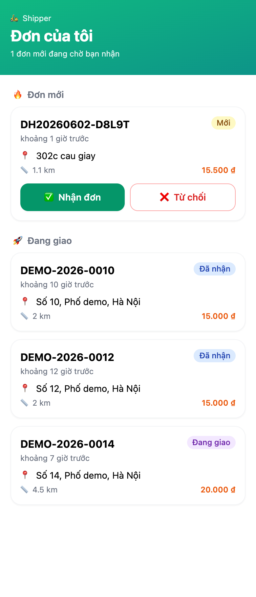

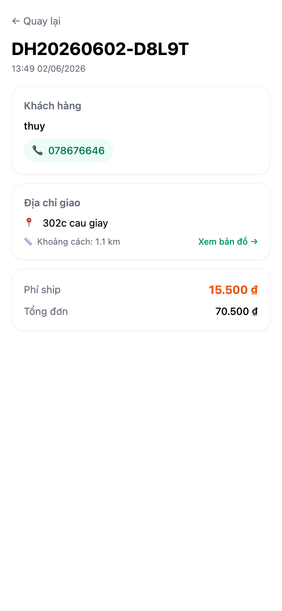

## 3.8. Kết luận chương

Chương 3 đã trình bày phân tích yêu cầu chức năng và phi chức năng của hệ thống, kiến trúc tổng thể với mô hình Modular Monolith gồm 8 mô-đun, thiết kế cơ sở dữ liệu với 15 bảng và năm kiểu dữ liệu nâng cao, thiết kế API với 35 endpoint phân theo ba phân vùng xác thực, bốn máy trạng thái hữu hạn (FSM) cho `OrderStatus`, `DeliveryAssignment`, `PaymentStatus`, `ConversationState`, bốn luồng nghiệp vụ trọng tâm và thiết kế bảo mật defense-in-depth gồm mười một lớp đối phó. Phần thiết kế chi tiết này là cơ sở để Chương 4 trình bày các quyết định hiện thực, công cụ phát triển và phương án triển khai bằng Docker Compose.
