# Chương 3. Phân tích và thiết kế hệ thống

Chương này trình bày yêu cầu, kiến trúc, thiết kế cơ sở dữ liệu, API, máy trạng thái, bốn luồng nghiệp vụ trọng tâm và thiết kế bảo mật defense-in-depth của hệ thống.

## 3.1. Phân tích yêu cầu

### 3.1.1. Yêu cầu chức năng

Hệ thống có 15 yêu cầu chức năng (Functional Requirement — FR) theo ba nhóm vai trò.

**Nhóm khách hàng.** **FR1.** Đăng nhập tự động khi mở Mini App qua xác minh `initData` ký HMAC-SHA256. **FR2.** Duyệt danh mục sản phẩm (ảnh, mô tả, giá, tình trạng còn hàng). **FR3.** Thêm, sửa, xoá sản phẩm trong giỏ, giỏ lưu `localStorage` qua Zustand. **FR4.** Đặt đơn COD (tiền mặt khi nhận) hoặc VNPay. **FR5.** Xem lịch sử và chi tiết đơn. **FR6.** Theo dõi vị trí shipper thời gian thực trên bản đồ Leaflet khi đơn ở trạng thái STARTED. **FR7.** Đánh giá shipper 1–5 sao kèm comment tuỳ chọn sau khi đơn DELIVERED, qua bot Telegram.

**Nhóm shipper.** **FR8.** Nhận hoặc từ chối offer đơn qua Telegram Bot bằng inline keyboard hai nút. **FR9.** Bấm "Bắt đầu giao" và "Đã giao" qua Mini App hoặc Bot. **FR10.** Hệ thống ghi `location_ping` mỗi khi Telegram phát Live Location của shipper trong assignment STARTED.

**Nhóm chủ shop.** **FR11.** Đăng nhập Web Admin bằng email và mật khẩu, nhận access token (JWT 15 phút) và refresh token (DB-backed 7 ngày). **FR12.** Xem dashboard KPI và ba biểu đồ Recharts (doanh thu theo ngày, top shipper, tỉ lệ huỷ). **FR13.** Quản lý đơn: xem, lọc theo trạng thái và khoảng ngày, xác nhận, gán shipper, huỷ. **FR14.** CRUD sản phẩm, quản lý shipper (duyệt, khoá, mở khoá). **FR15.** Xem báo cáo doanh thu, top shipper, tỉ lệ huỷ theo khoảng thời gian chọn trước.

### 3.1.2. Yêu cầu phi chức năng

Hệ thống có bảy yêu cầu phi chức năng (Non-Functional Requirement — NFR).

**Bảng 3.1. Bảng yêu cầu phi chức năng (NFR) kèm tiêu chí đo lường**

| Mã | Loại | Yêu cầu | Tiêu chí đo lường |
|---|---|---|---|
| NFR1 | Hiệu năng | Độ trễ tracking GPS end-to-end | < 3 giây từ Telegram phát `edited_message.location` đến lúc khách hàng thấy chấm di chuyển trên bản đồ |
| NFR2 | Hiệu năng | Thời gian phản hồi REST trung bình | < 200 ms ở trạng thái idle (P50) |
| NFR3 | Khả dụng | Uptime mong muốn | ≥ 99% (single VPS, không HA) |
| NFR4 | Bảo mật | Mọi yêu cầu thay đổi trạng thái phải xác thực | 100% endpoint thay đổi đều có filter xác thực; chỉ ba endpoint không qua filter xác thực người dùng là `/api/payment/vnpay/return` và `/api/payment/vnpay/ipn` (xác thực bằng chữ ký HMAC-SHA512 của VNPay) và `/api/bot/webhook` (xác thực bằng header secret token của Telegram) |
| NFR5 | Khả mở rộng | Số shipper tối đa | 50 (single instance), 500+ (sau khi enable ShedLock và scale ngang) |
| NFR6 | Khả dụng | Số đơn / ngày hệ thống xử lý mượt | 50–500 |
| NFR7 | Trải nghiệm | Mini App khởi động mượt | < 2 giây time-to-interactive trên thiết bị 4G phổ thông |

### 3.1.3. Sơ đồ Use Case

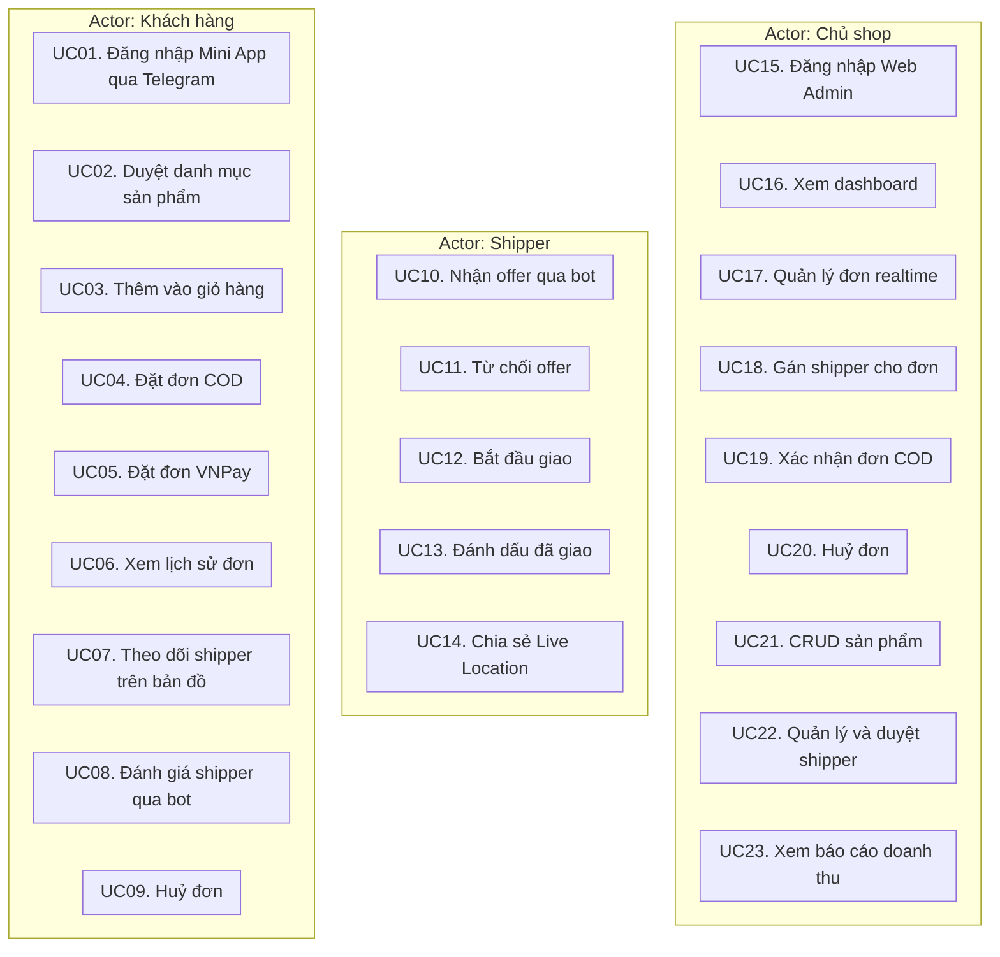

*Hình 3.1. Sơ đồ Use Case tổng thể của ba actor Khách hàng, Shipper và Chủ shop*

### 3.1.4. Đặc tả use case chi tiết

Năm use case trọng tâm — UC04 (Đặt đơn), UC10 (Nhận offer), UC12–UC14 (Giao đơn, chia sẻ Live Location), UC08 (Đánh giá shipper), UC23 (Báo cáo doanh thu) — được đặc tả theo chuẩn UML: Actor, Precondition, Luồng chính, Luồng thay thế, Postcondition. Chúng phủ cả ba actor, hai phương thức thanh toán và toàn bộ vòng đời đơn hàng. Toàn văn xem **Phụ lục A**.

## 3.2. Kiến trúc tổng thể

### 3.2.1. Sơ đồ kiến trúc tổng thể

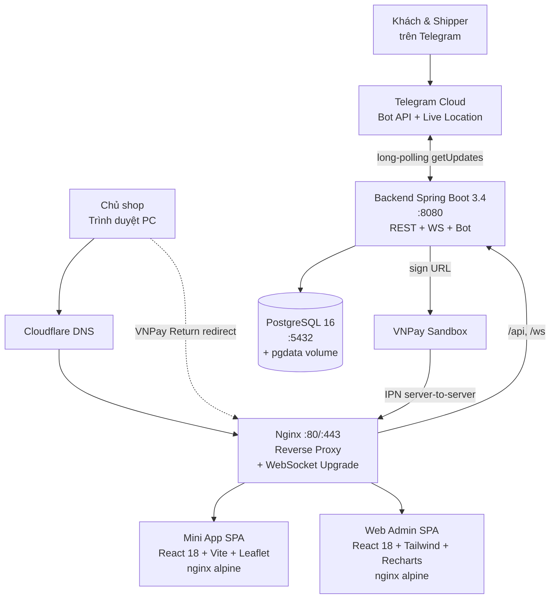

*Hình 3.2. Sơ đồ kiến trúc tổng thể hệ thống*

### 3.2.2. Modular Monolith với 8 bounded context

Hệ thống gồm 8 mô-đun Maven độc lập, phụ thuộc nhau theo đồ thị có hướng phi chu trình (DAG).

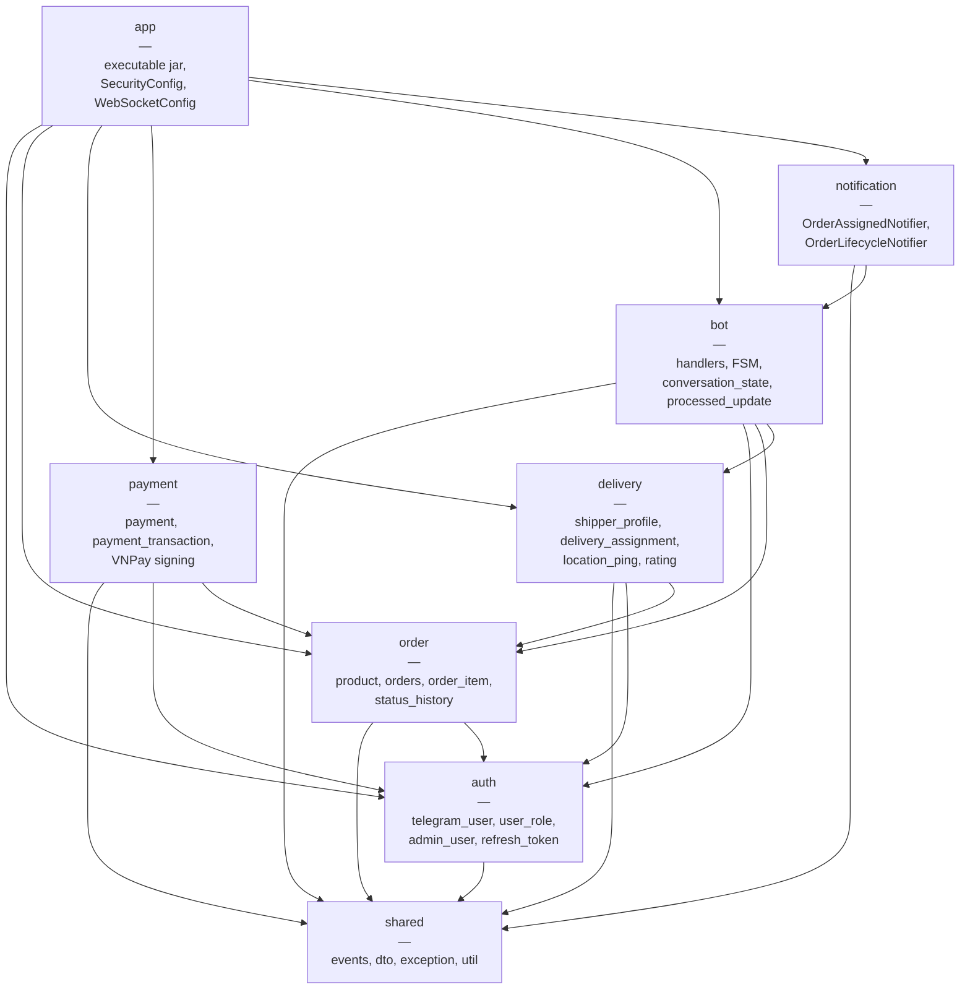

*Hình 3.3. Đồ thị phụ thuộc tám bounded context của Modular Monolith*

**Bảng 3.2. Bảng trách nhiệm 8 mô-đun (bounded context) của hệ thống**

| Module | Trách nhiệm chính |
|---|---|
| `shared` | Các sự kiện ứng dụng cross-module (OrderCreatedEvent, OrderConfirmedEvent...), exception cơ sở (DomainException), DTO chung, utility (Haversine, JWT helper). |
| `auth` | Đăng ký Telegram user qua `/start`, xác minh initData HMAC, quản lý vai trò CUSTOMER / SHIPPER / SHOP_OWNER, admin email + password + JWT (access 15 phút, refresh 7 ngày). |
| `order` | CRUD sản phẩm, vòng đời đơn hàng, ghi `status_history`, tính phí ship Haversine, máy trạng thái OrderStatus. |
| `delivery` | Gán shipper, máy trạng thái DeliveryAssignment, lưu `location_ping` từ Live Location, đánh giá shipper, báo cáo top-shipper. |
| `payment` | Tạo URL VNPay với HMAC-SHA512, xử lý Return URL (không cập nhật DB), xử lý IPN idempotent với audit trail JSONB. |
| `bot` | Webhook bot Telegram (chạy long-polling), UpdateRouter theo vai trò, các handler `common/customer/shipper/shopowner`, FSM `ConversationState`, BotSender bọc Bucket4j rate-limit. |
| `notification` | Lắng nghe các sự kiện cross-module bằng `@TransactionalEventListener(AFTER_COMMIT)`, gửi message qua bot và đẩy WebSocket. |
| `app` | Module thực thi — chứa `SecurityConfig`, `WebSocketConfig`, `main` method và file `application.yml`. |

### 3.2.3. Công nghệ sử dụng

Backend: Java 17 LTS, Spring Boot 3.4 (Web, Security, Data JPA, WebSocket/STOMP), Flyway 10 quản lý phiên bản schema, `telegrambots-springboot-longpolling-starter` 7.x làm client Telegram Bot API, dữ liệu trên PostgreSQL 16. Frontend: TypeScript 5.6, React 18 trên Vite 5, TanStack Query 5 (server state), Zustand 4 (UI state), TailwindCSS 3 (giao diện), Recharts 3 (biểu đồ), react-leaflet (bản đồ theo dõi). Hạ tầng: Docker Compose, Nginx 1.27 làm reverse proxy và điểm kết thúc TLS. Kiểm thử: JUnit 5, Mockito, AssertJ, Testcontainers chạy PostgreSQL 16 thật.

Bảng đối chiếu tầng – công nghệ – phiên bản – vai trò xem **Phụ lục E**.

### 3.2.4. Sơ đồ triển khai Docker Compose

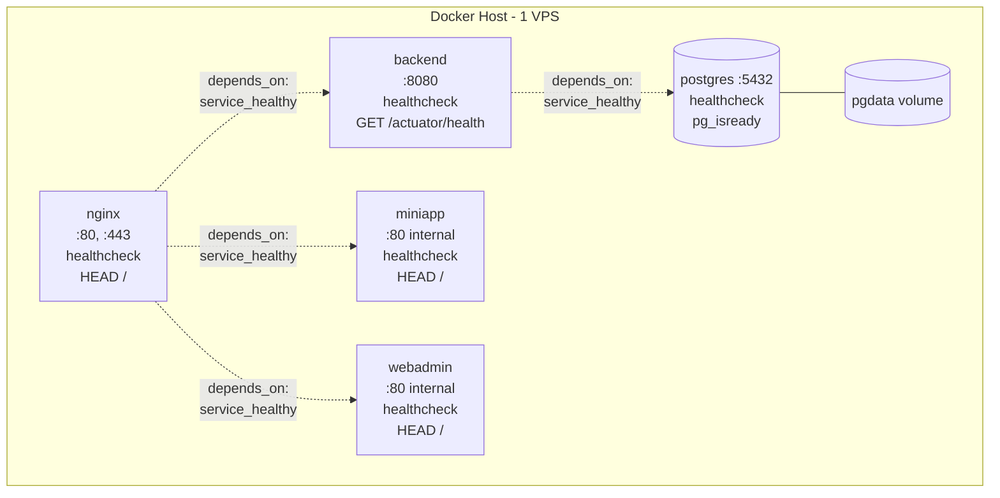

*Hình 3.4. Sơ đồ triển khai năm container bằng Docker Compose*

`depends_on: condition: service_healthy` bảo đảm thứ tự khởi động: `postgres` healthy trước, `backend` đợi `/actuator/health` trả UP, rồi đến `miniapp`, `webadmin`, `nginx`.

## 3.3. Thiết kế cơ sở dữ liệu

### 3.3.1. Sơ đồ thực thể – quan hệ (ERD)

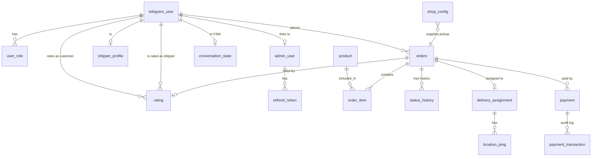

*Hình 3.5. Sơ đồ thực thể – quan hệ (ERD) của cơ sở dữ liệu*

### 3.3.2. Mô tả các bảng dữ liệu

Cơ sở dữ liệu gồm 15 bảng do 11 file Flyway migration V1–V11 tạo ra; bốn file V12–V15 thuộc phần mở rộng sau bảo vệ (Phụ lục I). Các bảng phân bổ theo năm nhóm bounded context — định danh và phân quyền, đơn hàng, giao vận, thanh toán, hội thoại bot — đúng như phân chia mô-đun ở Hình 3.3 và Bảng 3.2.

Mô tả chi tiết từng bảng (khoá chính, cột nghiệp vụ, ràng buộc CHECK/UNIQUE, index) xem **Phụ lục C**.

### 3.3.3. Quyết định thiết kế không tầm thường

**PK UUID cho `orders`, `payment`, `delivery_assignment` thay vì BIGSERIAL.** UUID v4 không tuần tự nên không thể enumerate `/api/orders/1, /api/orders/2, ...` để dò đơn của khách khác. Các bảng nội bộ `rating`, `status_history`, `location_ping` vẫn dùng BIGSERIAL vì không lộ ra URL và đã bị khoá bởi context bảng cha.

**JSONB cho audit và FSM data.** `payment_transaction.raw_payload` lưu toàn bộ map tham số VNPay, vốn có thể đổi giữa các phiên bản API mà không cần migrate schema; `conversation_state.data` lưu payload tuỳ FSM state (CUSTOMER_RATING_COMMENT lưu `{orderId}`, state đăng ký shipper lưu `{name, phone, vehicle, plate}`). Hibernate 6 hỗ trợ native qua `@JdbcTypeCode(SqlTypes.JSON)`.

**Partial unique index `uq_assignment_shipper_started` (V8).** Quy tắc "một shipper chỉ có một assignment STARTED tại một thời điểm" được khoá tại tầng DB thay vì chỉ tầng ứng dụng, vì `LiveLocationHandler` tra `DeliveryAssignment` STARTED để route ping: hai dòng STARTED do race condition sẽ làm GPS rò qua đơn của khách khác. Index từ chối dòng STARTED thứ hai bằng `DataIntegrityViolationException` để service catch và trả lỗi.

**`@Version` optimistic lock trên `orders`, `payment`, `shipper_profile`.** Ba thực thể chịu nhiều luồng đồng thời (admin xác nhận đơn + customer huỷ; VNPay IPN + cron expiry); optimistic lock đơn giản hơn pessimistic lock, retry tại tầng service nếu cần.

**Status history qua bảng audit thay vì trigger.** Trigger DB khó test, khó debug và lock-in DBMS. Service insert dòng audit cùng transaction với update trạng thái, vừa atomic vừa testable.

## 3.4. Thiết kế API

### 3.4.1. Phân vùng theo actor

**Bảng 3.3. Phân vùng URL và cơ chế xác thực**

| Phân vùng | URL prefix | Cơ chế xác thực |
|---|---|---|
| Customer | `/api/orders/*`, `/api/products/*`, `/api/payment/vnpay/create` | Telegram initData (HMAC-SHA256) |
| Shipper | `/api/shipper/*` | Telegram initData |
| Admin | `/api/admin/*` | JWT (Authorization: Bearer) |
| Public | `/api/payment/vnpay/return`, `/api/payment/vnpay/ipn` | Chữ ký HMAC-SHA512 của VNPay |
| Bot webhook | `/api/bot/webhook` | Header secret token (chỉ dùng khi `BOT_MODE=webhook`; mặc định hệ thống chạy long-polling) |

### 3.4.2. Danh sách endpoint

Nhóm khách hàng: `/api/me`, `/api/products/*` (danh mục, chi tiết sản phẩm), `/api/orders/*` (tạo đơn, lịch sử, chi tiết, huỷ, đánh giá), `/api/payment/vnpay/*` (tạo URL thanh toán, Return URL, IPN). Nhóm shipper: `/api/shipper/*` cho danh sách và chi tiết assignment, nhận, từ chối, bắt đầu, hoàn tất đơn, bật/tắt trạng thái nhận đơn. Nhóm quản trị: `/api/admin/*` cho xác thực, dashboard, quản lý đơn hàng, sản phẩm, shipper, ba báo cáo (doanh thu, top shipper, tỉ lệ huỷ), cấu hình shop.

Danh sách đầy đủ URL, method và mô tả từng endpoint xem **Phụ lục B**.

### 3.4.3. Cơ chế xác thực

**Telegram initData (Mini App).** `TelegramAuthFilter` đọc header `X-Telegram-Init-Data`, kiểm tra `auth_date` còn hạn (cấu hình 24 giờ), tính HMAC-SHA256 với khoá `HMAC("WebAppData", botToken)`, so sánh `hash` bằng `MessageDigest.isEqual` rồi set request attribute `currentUser` cho resolver `@CurrentUser`.

**JWT (Web Admin).** `JwtAuthFilter` đọc header `Authorization: Bearer <token>`; token là JWS HS512 payload `{sub: adminId, role: SHOP_OWNER, exp: ...}`, ký bằng `JWT_SECRET` từ env, hạn 15 phút. Refresh token là UUID v4 lưu ở cột `token_hash` (SHA-256, không cleartext), hạn 7 ngày.

**WebSocket dual auth.** `ChannelInterceptor` trên `inboundChannel` yêu cầu CONNECT frame có `X-Telegram-Init-Data` (Mini App) HOẶC `Authorization: Bearer <jwt>` (Web Admin); thiếu cả hai thì throw `AccessDeniedException` để Spring đóng kết nối. Trên SUBSCRIBE frame, allowlist cho customer chỉ subscribe `/user/{customerId}/queue/order/*` của chính mình, admin chỉ subscribe `/topic/admin/orders`.

**Dev-bypass header `X-Dev-User-Id`.** Chỉ active trong profile `dev`: `TelegramAuthFilter` skip xác minh HMAC và set `currentUser` theo ID truyền vào để test Mini App trên trình duyệt thường; profile `prod` bỏ qua header này.

## 3.5. Thiết kế Máy trạng thái (FSM)

### 3.5.1. OrderStatus FSM

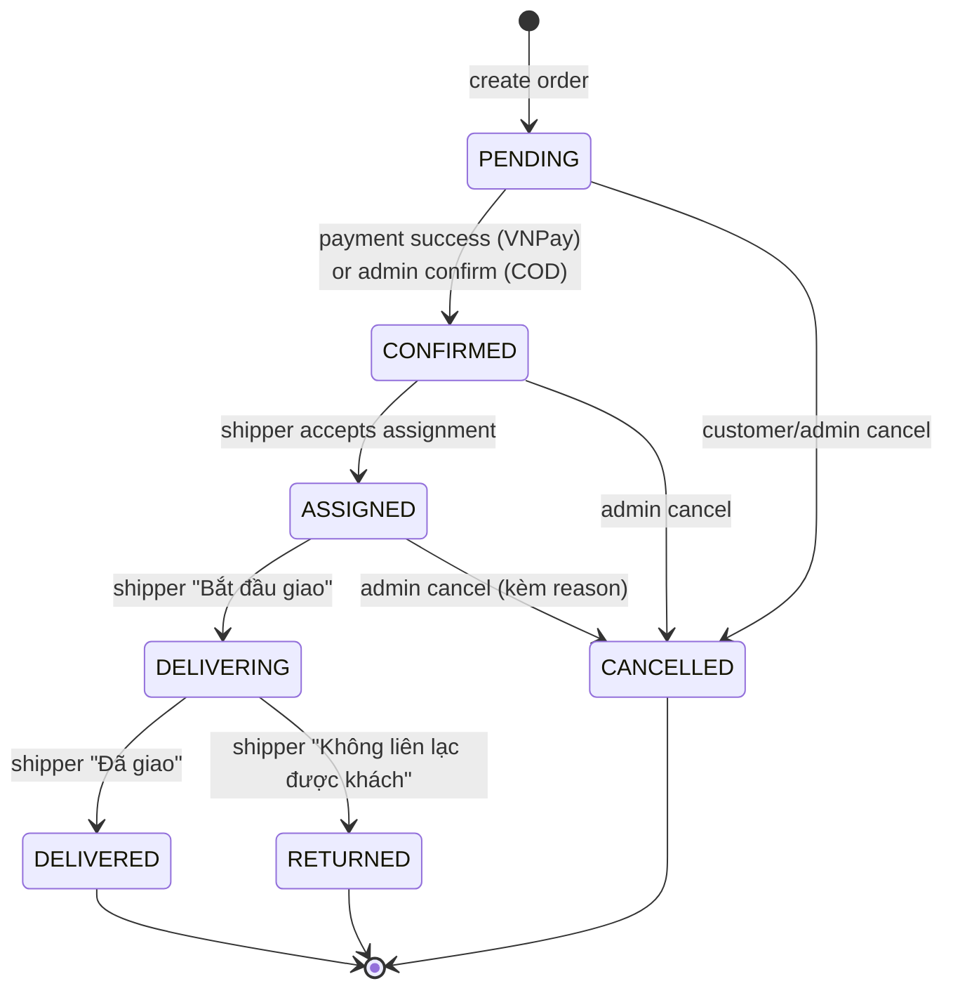

*Hình 3.6. Máy trạng thái OrderStatus — bảy trạng thái với chuyển dịch được whitelist*

### 3.5.2. DeliveryAssignment FSM

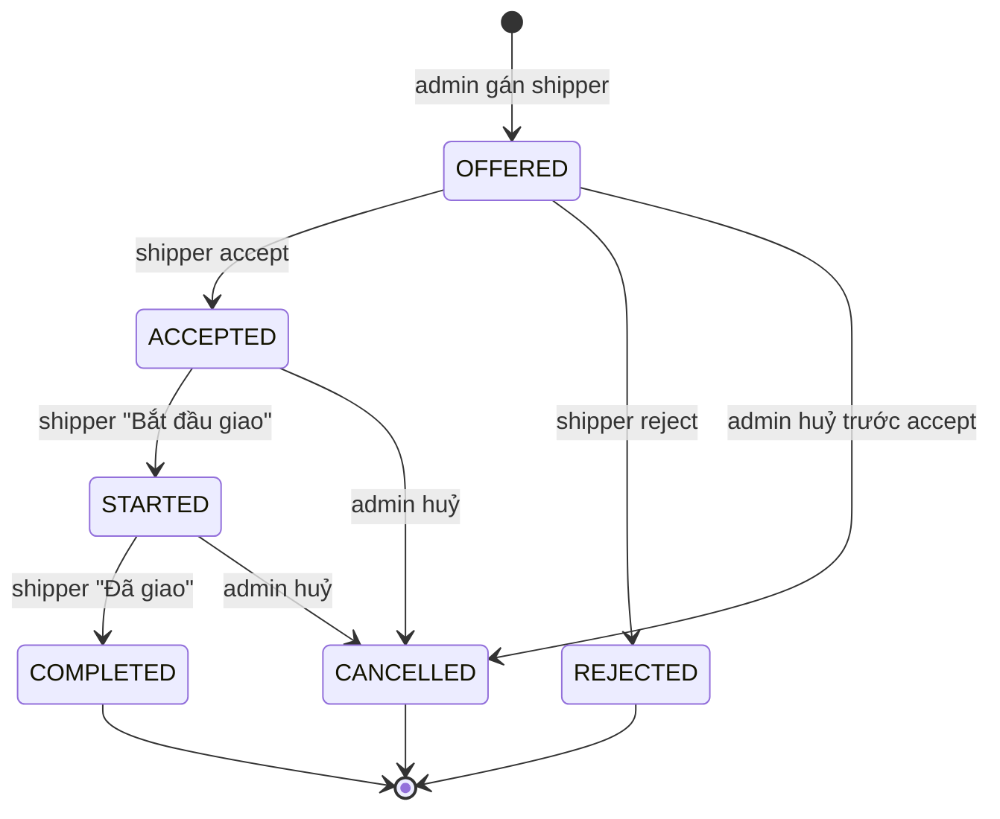

*Hình 3.7. Máy trạng thái DeliveryAssignment của phiếu gán shipper*

### 3.5.3. PaymentStatus FSM

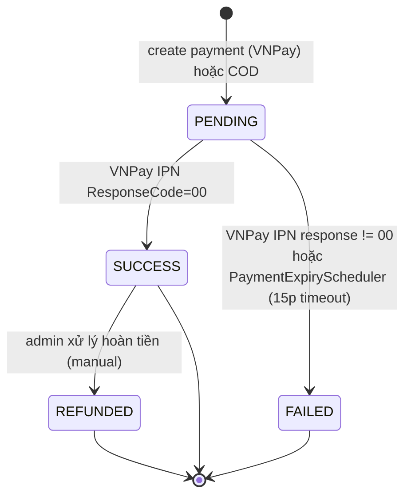

*Hình 3.8. Máy trạng thái PaymentStatus của giao dịch thanh toán*

### 3.5.4. ConversationState FSM (Bot)

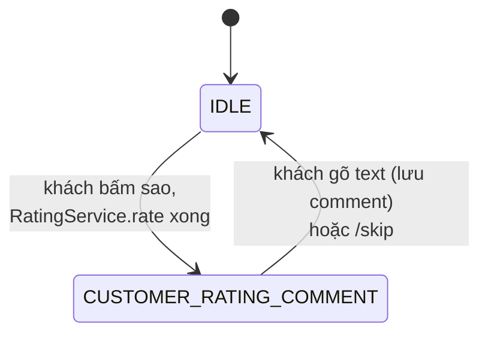

*Hình 3.9. Máy trạng thái ConversationState của hội thoại bot*

### 3.5.5. Ma trận chuyển trạng thái

Cả bốn máy trạng thái đều theo nguyên tắc whitelist: mỗi phép chuyển được khai báo tường minh kèm sự kiện kích hoạt và điều kiện tiền đề, phép chuyển ngoài danh sách bị tầng service từ chối thay vì âm thầm ghi vào cơ sở dữ liệu. Các trạng thái kết thúc (`DELIVERED`, `CANCELLED`, `RETURNED`, `COMPLETED`, `REJECTED`) do đó là trạng thái hấp thụ, không thể bị đưa ngược về trạng thái đang xử lý.

Ba ma trận chuyển trạng thái đầy đủ của `OrderStatus`, `DeliveryAssignment` và `PaymentStatus` xem **Phụ lục D**. Riêng `ConversationState` không cần ma trận vì mỗi luồng hội thoại chỉ là một chuỗi tuyến tính hai trạng thái (`IDLE` ⇄ state đang chờ nhập), đã thể hiện trọn vẹn trên Hình 3.9.

## 3.6. Thiết kế luồng nghiệp vụ chính

### 3.6.1. Đặt đơn COD

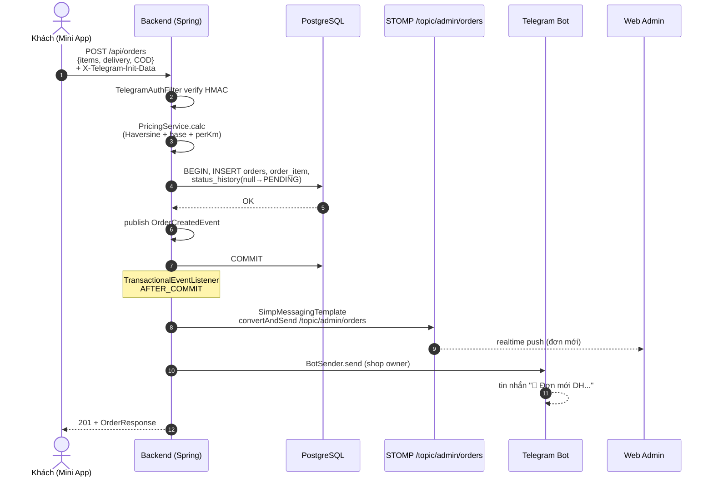

*Hình 3.10. Sequence luồng đặt đơn COD — từ Mini App đến Web Admin thời gian thực*

### 3.6.2. Đặt đơn VNPay

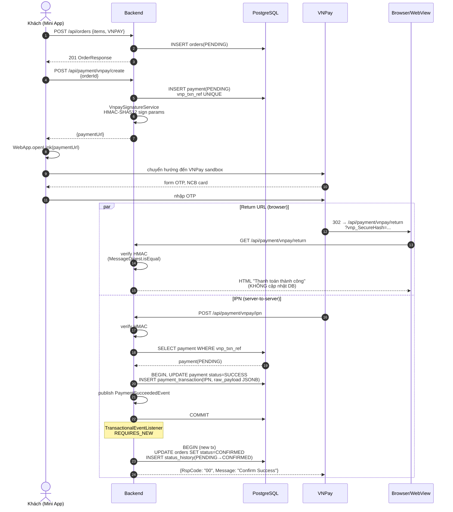

*Hình 3.11. Sequence luồng đặt đơn VNPay theo mẫu IPN-as-source-of-truth*

### 3.6.3. Gán shipper và giao đơn

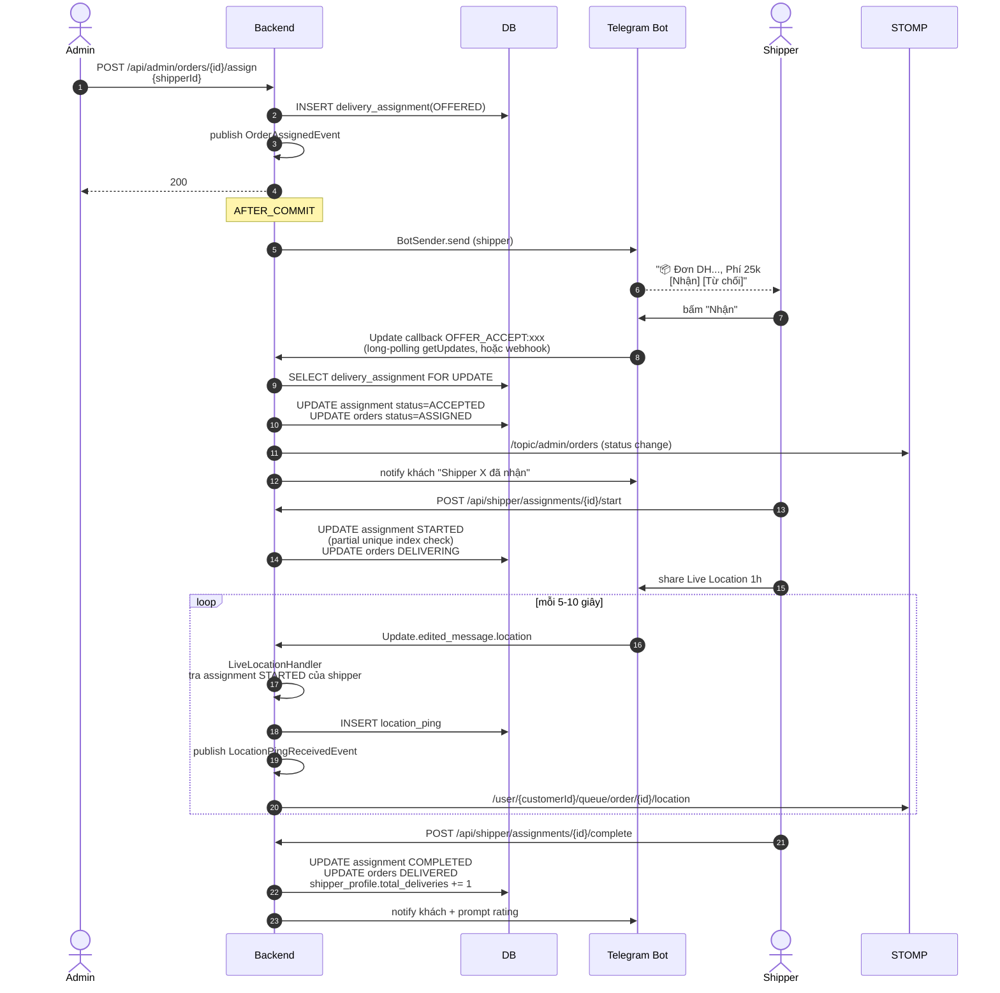

*Hình 3.12. Sequence luồng gán shipper và giao đơn đến khi hoàn tất*

### 3.6.4. Đánh giá shipper

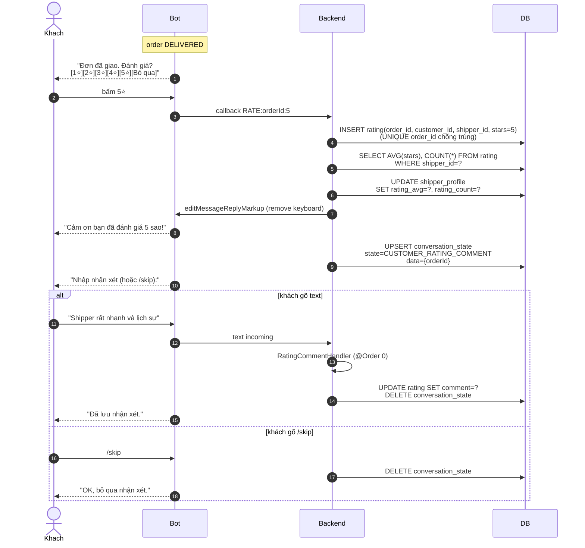

*Hình 3.13. Sequence luồng đánh giá shipper qua bot Telegram*

## 3.7. Thiết kế bảo mật

Hệ thống áp dụng *defense-in-depth*: nhiều lớp phòng thủ song song thay vì một cơ chế duy nhất, mỗi lớp đối phó một loại đe doạ cụ thể và có ít nhất một regression test bảo đảm.

### 3.7.1. Mô hình đe doạ (Threat Model) và 11 lớp đối phó

**Bảng 3.4. Mô hình đe doạ và 11 lớp đối phó (defense-in-depth)**

| Lớp | Đe doạ | Cơ chế đối phó | Vị trí trong code |
|---|---|---|---|
| L1 | Giả mạo Telegram identity | `TelegramAuthFilter` verify HMAC initData | `auth/config/TelegramAuthFilter` |
| L2 | Hijack phiên admin | `JwtAuthFilter` (TTL 15p) + refresh token DB-backed | `auth/config/JwtAuthFilter` |
| L3 | Endpoint chưa được phân quyền | `SecurityConfig` filter chain allowlist | `app/config/SecurityConfig` |
| L4 | Privilege escalation | `@PreAuthorize` mức controller | toàn bộ controller `/admin/*` |
| L5 | Forge `customerId` qua path | Custom `@CurrentUser` resolver thay vì `@PathVariable` | `auth/api/CurrentUser` |
| L6 | Anonymous WebSocket connect | CONNECT frame interceptor dual auth | `app/config/WebSocketAuthInterceptor` |
| L7 | Cross-user data leak qua broadcast | SUBSCRIBE frame allowlist `/user/*`, `/queue/*` | `app/config/WebSocketAuthInterceptor` |
| L8 | Signature spoof + timing attack | VNPay HMAC `MessageDigest.isEqual` constant-time | `payment/service/VnpaySignatureService` |
| L9 | SQL injection ở Reports | `groupBy` enum whitelist trước `DATE_TRUNC` bind | `delivery/service/ReportService` |
| L10 | Payment replay | `vnp_TxnRef UNIQUE` + audit trail `payment_transaction` | `payment/service/VnpayIpnService` |
| L11 | Gán nhầm vị trí cho shipper khác | Partial unique index `uq_assignment_shipper_started` (V8) | `db/migration/V8` |

### 3.7.2. Ma trận đối chiếu (mitigation matrix)

**Bảng 3.5. Ma trận đối chiếu STRIDE — lớp đối phó — test bao phủ** [21], [22]

| Loại đe doạ | Lớp đối phó | Test bao phủ |
|---|---|---|
| Spoofing identity | L1, L2, L5 | `TelegramAuthFilterTest`, `JwtAuthFilterTest` |
| Tampering | L8, L9, L10 | `VnpaySignatureServiceTest`, `ReportServiceSqlInjectionIT` |
| Repudiation | L10 (audit trail) | `VnpayIpnAuditIT` |
| Information disclosure | L4, L5, L7 | `WebSocketAdminAuthIT`, `OrderAccessControlIT` |
| Denial of service | Rate-limit Bucket4j (cơ chế bổ trợ, không thuộc 11 lớp) | `BotRateLimitTest` |
| Elevation of privilege | L3, L4 | `AdminEndpointSecurityIT` |
| Race condition (ngoài sáu loại STRIDE) | L11 | `AssignmentConcurrencyIT` |

### 3.7.3. Audit trail

Hai bảng audit cung cấp khả năng truy vết hậu kỳ. **`payment_transaction`** (V9) ghi mỗi event VNPay (CREATE / IPN / RETURN) kèm `raw_payload JSONB` chứa toàn bộ payload đến; kể cả khi chữ ký invalid payload vẫn được ghi để phục vụ điều tra — phát hiện từ code review pha P7, đã vá hậu kỳ. **`status_history`** (V4) insert dòng `(from, to, changed_by_user_id, changed_at, note)` cùng transaction với mỗi lần chuyển trạng thái, là nguồn render timeline trong Order Detail (hướng phát triển).

## 3.8. Kết luận chương

Chương 3 đã trình bày yêu cầu chức năng và phi chức năng, kiến trúc Modular Monolith 8 mô-đun, cơ sở dữ liệu 15 bảng, API 39 endpoint theo ba phân vùng xác thực, bốn máy trạng thái hữu hạn (`OrderStatus`, `DeliveryAssignment`, `PaymentStatus`, `ConversationState`), bốn luồng nghiệp vụ trọng tâm và thiết kế bảo mật defense-in-depth mười một lớp — cơ sở để Chương 4 trình bày quyết định hiện thực, công cụ phát triển và phương án triển khai bằng Docker Compose.
