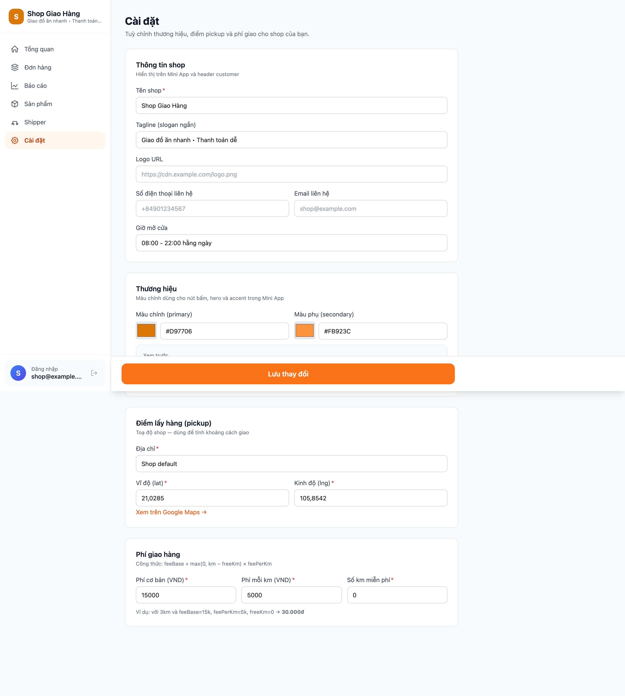

# Chương 4. Cài đặt hệ thống

Chương này trình bày các quyết định hiện thực của hệ thống: môi trường phát triển, cấu trúc dự án, tám mô-đun backend, frontend (Mini App và Web Admin), schema quản lý qua mười lăm file Flyway migration, đóng gói bằng Docker Compose, cấu hình biến môi trường và chiến lược kiểm thử nhiều tầng. Mục tiêu là chứng minh thiết kế ở Chương 3 được hiện thực đầy đủ và hệ thống đạt mức sẵn sàng triển khai (deployment-ready) với ba lệnh dựng toàn bộ stack.

## 4.1. Môi trường phát triển và công cụ

### 4.1.1. Yêu cầu phần cứng

Yêu cầu tối thiểu: CPU bốn nhân, RAM tám gigabyte, ổ đĩa trống hai mươi gigabyte (gồm image Docker và dữ liệu PostgreSQL); khuyến nghị RAM mười sáu gigabyte để chạy đồng thời IDE, PostgreSQL, backend và hai dev server Vite. Hệ điều hành hỗ trợ: macOS 13+, Linux (Ubuntu 22.04+, Fedora 38+), Windows 11 với WSL2 (Ubuntu 22.04 LTS); Windows thuần không kiểm thử vì Docker Desktop trên WSL2 cho I/O ổn định hơn.

### 4.1.2. Phần mềm phát triển và phiên bản

Bộ công cụ thống nhất đảm bảo tính tái lập (reproducibility): Java 17 LTS build bằng Maven Wrapper, Spring Boot 3.4.0 kéo theo Spring Security 6.4, Hibernate 6.6 và Flyway 10 theo phiên bản BOM quản lý; frontend dùng Node.js 22 LTS, pnpm 10, TypeScript 5.6, Vite 5, React 18.3; cơ sở dữ liệu là image `postgres:16-alpine`, reverse proxy `nginx:1.27-alpine`, chạy trên Docker Engine 24+ với Docker Compose v2. Ghim phiên bản tại `pom.xml` parent và các `package.json` workspace giúp mọi máy build ra cùng kết quả.

Bảng liệt kê đầy đủ từng tầng, công nghệ và số phiên bản tham chiếu xem **Phụ lục E**.

### 4.1.3. Tài khoản và dịch vụ ngoài

Hệ thống phụ thuộc hai dịch vụ bên thứ ba. Với Telegram, người triển khai tạo bot qua `@BotFather` bằng `/newbot`, ghi nhận token (`<10-digit-id>:<35-char-alnum>`) và username bot (không kèm `@`). Với VNPay, đăng ký tại `sandbox.vnpayment.vn/devreg` để nhận `TmnCode` (mã merchant) và `HashSecret` (khoá ký HMAC-SHA512); cả hai nạp qua biến môi trường. Chưa có credential thật, hệ thống vẫn chạy được vì test cho `VnpaySignatureService` dùng cặp mock `TEST01` / `TESTSECRETKEY123`, song luồng giao dịch end-to-end chỉ hoạt động với credential sandbox thật.

### 4.1.4. Biến môi trường

Hệ thống nạp cấu hình runtime qua biến môi trường thay vì hard-code, theo nguyên tắc Twelve-Factor App. File `.env.example` ở thư mục gốc là *canonical manifest* của mọi biến kèm mặc định hợp lý (chi tiết ở 4.7.1); `.env` thật nằm trong `.gitignore` để không commit secret vào kho mã.

## 4.2. Cấu trúc dự án

### 4.2.1. Cây thư mục tổng thể

Mã nguồn tổ chức theo ranh giới rõ ràng giữa backend, frontend, infra và tài liệu; mỗi nhánh là thư mục cấp một build độc lập được.

```text
KhoaLuan-GiaoHang/
├── backend/                              # Spring Boot 3 multi-module Maven
│   ├── pom.xml                           # Parent pom — aggregator + dependencyManagement
│   ├── app/                              # Executable jar — entry point
│   │   ├── pom.xml
│   │   └── src/main/resources/db/migration/   # 15 file Flyway V1 → V15
│   ├── modules/
│   │   ├── shared/                       # BaseEntity, exception, event records
│   │   ├── auth/                         # Telegram initData + JWT admin
│   │   ├── order/                        # Product, Order, OrderItem, FSM
│   │   ├── delivery/                     # ShipperProfile, Assignment, Rating
│   │   ├── payment/                      # VNPay signing + IPN + scheduler
│   │   ├── bot/                          # Telegram Bot handlers + FSM
│   │   ├── notification/                 # 4 cross-module event listeners
│   │   └── miniapp/, webadmin/           # Static resource serving stub
│   └── mvnw, mvnw.cmd                    # Maven wrapper
├── frontend/                             # pnpm workspace với 3 package
│   ├── pnpm-workspace.yaml               # ...
│   ├── shared/                           # @shop/shared — types + helpers
│   ├── miniapp/                          # @shop/miniapp — Telegram Mini App
│   └── webadmin/                         # @shop/webadmin — Web Admin
├── infra/
│   ├── docker-compose.yml                # Full demo stack (5 service)
│   ├── docker-compose.dev.yml            # Postgres-only cho dev
│   ├── nginx/nginx.conf                  # Reverse proxy config
│   └── postgres/init.sql                 # Encoding + extension
├── docs/
│   ├── thesis/                           # Báo cáo khoá luận (Chương 1–5)
│   └── superpowers/                      # 10 plan + 8 research + 9 review
├── .env.example                          # Manifest biến môi trường
├── README.md                             # Quick start
└── RUNBOOK.md                            # 8 bước manual smoke test
```

### 4.2.2. Backend Maven multi-module

Backend là project Maven multi-module với mười một submodule: tám bounded context nghiệp vụ tại thời điểm bảo vệ (`shared`, `auth`, `order`, `delivery`, `payment`, `bot`, `notification`, `app` — trong đó `app` đóng gói executable jar), module `promotion` bổ sung ở pha mở rộng (Phụ lục I), và hai stub `miniapp` / `webadmin` serving static resource. Parent `pom.xml` không chứa source code mà đảm nhận hai nhiệm vụ: khai báo thứ tự build qua `<modules>` (`shared` trước, rồi module nghiệp vụ, cuối cùng `app`) và quản lý phiên bản dependency tập trung qua `<dependencyManagement>` để tránh version drift. Mỗi module có package gốc `com.shop.delivery.<module>`; Maven enforce ranh giới lúc biên dịch — `bot` muốn dùng class của `order` phải khai báo dependency, không thể tự tiện import.

### 4.2.3. Frontend pnpm workspace

Frontend gồm ba workspace pnpm khai báo trong `frontend/pnpm-workspace.yaml`. `@shop/shared` chứa kiểu TypeScript, helper định dạng và API client wrapper dùng chung (chi tiết ở 4.4.1); `@shop/miniapp` và `@shop/webadmin` import nó qua đường dẫn workspace (`"@shop/shared": "workspace:*"`). pnpm hardlink `frontend/shared/dist` vào `node_modules/@shop/shared` của hai workspace tiêu thụ nên thay đổi DTO một nơi lan toả ngay, không cần publish gói lên registry.

### 4.2.4. Hạ tầng và tài liệu

Thư mục `infra/` chứa hai file Docker Compose (một production-like full stack, một dev chỉ Postgres), `nginx.conf` và `postgres/init.sql` thiết lập encoding `UTF8` cùng extension `pg_trgm` khi Postgres khởi tạo lần đầu. Thư mục `docs/` gồm `docs/thesis/` (báo cáo, screenshot) và `docs/superpowers/` (artefact GSD: mười file plan, tám file research, chín file code review, commit cùng mã nguồn để giữ truy vết thiết kế).

## 4.3. Cài đặt module backend

Backend gồm tám bounded context tuân thủ đồ thị phụ thuộc một chiều (DAG, không chu trình) ở mục 3.2.

### 4.3.1. Module `shared`

Module `shared` đứng đáy đồ thị phụ thuộc: (i) `BaseEntity` (`shared/domain`) cấp `createdAt`, `updatedAt` qua `@CreationTimestamp` và `@UpdateTimestamp` cho mọi entity nghiệp vụ; (ii) hệ ngoại lệ `DomainException` với sáu class con (`ValidationException`, `NotFoundException`, `ConflictException`, `BusinessRuleException`, `AuthenticationException`, `ExternalServiceException`); (iii) `GlobalExceptionHandler` (`@RestControllerAdvice`) ánh xạ ngoại lệ sang RFC 7807 `ApiError` kèm mã HTTP; (iv) chín event record trong `shared/event` (`OrderCreatedEvent`, `OrderConfirmedEvent`, `OrderAssignedEvent`, `OrderDeliveredEvent`, `OrderCancelledEvent`, `PaymentSucceededEvent`, `PaymentFailedEvent`, `ShipperRegisteredEvent`, `ShipperApprovedEvent`) làm ngôn ngữ chung cho giao tiếp cross-module. Là Java 17 `record`, event bất biến nên không listener nào mutate được state đã publish.

### 4.3.2. Module `auth`

Module `auth` hiện thực hai cơ chế xác thực song song: *Telegram initData* (HMAC-SHA256) cho Mini App và *JWT HS512* cho Web Admin. Bốn entity: `TelegramUser`, `UserRole` (CUSTOMER / SHIPPER / SHOP_OWNER), `AdminUser` (password BCrypt), `RefreshToken` (DB-backed, hash SHA-256). `TelegramAuthFilter` đọc header `X-Telegram-Init-Data`, kiểm tra `auth_date` không quá 24 giờ và so sánh hash bằng `MessageDigest.isEqual` (constant-time, chống timing attack); `JwtAuthFilter` đọc `Authorization: Bearer <token>` rồi xác thực qua `JwtService` (HS512, access token 15 phút, refresh token 7 ngày). `CurrentUserArgumentResolver` cho phép controller inject `@CurrentUser TelegramUser`, tránh boilerplate `SecurityContextHolder`. Module đóng góp Flyway V2 (`auth.sql`).

### 4.3.3. Module `order`

Module `order` quản lý vòng đời đơn hàng từ `Order(PENDING)` đến trạng thái cuối `DELIVERED`, `CANCELLED` hoặc `RETURNED`. Bốn entity: `Product`, `Order`, `OrderItem` (1-N qua `@OneToMany(cascade = CascadeType.ALL)`), `StatusHistory` (`previousStatus`, `newStatus`, `actor`, `note`, `timestamp`). `OrderStateMachine` giữ bảng whitelist `Map<OrderStatus, Set<OrderStatus>>` và từ chối chuyển dịch ngoài bảng bằng `IllegalStateTransitionException`. `FeeCalculator` tính phí ship theo Haversine với chính sách `base_fee + max(0, distance_km - free_km) × fee_per_km`, tham số từ `shop_config`. `OrderCodeGenerator` sinh mã đơn `ORD-yyMMddHHmmss-XX` unique kể cả khi tạo song song. `PaymentEventListener` nghe `PaymentSucceededEvent` để transition `Order(PENDING) → Order(CONFIRMED)`. Module đóng góp Flyway V4 (`order.sql`).

```java
public void assertTransitionAllowed(OrderStatus from, OrderStatus to) {
    Set<OrderStatus> allowed = TRANSITIONS.getOrDefault(from, Set.of());
    if (!allowed.contains(to)) {
        throw new IllegalStateTransitionException(
            "Không thể chuyển từ %s sang %s".formatted(from, to));
    }
}
```

### 4.3.4. Module `delivery`

Module `delivery` có nhiều entity nhất. Năm entity: `ShipperProfile` (1-1 với `TelegramUser` qua `telegram_user_id`; tên, số điện thoại, phương tiện, biển số, `rating_avg`, `rating_count`, `state`), `DeliveryAssignment` (FSM năm trạng thái OFFERED / ACCEPTED / STARTED / COMPLETED / DECLINED, có `expires_at` cho TTL offer), `LocationPing` (điểm GPS từ Telegram Live Location), `Rating` (khách → shipper, 1-5 sao, UNIQUE order_id), `ShipperRating` (shipper → khách, không công khai, thêm ở V12) và các view-DTO cho `ReportsQueryService`. Ba service trọng tâm: `DeliveryAssignmentService` (gán/nhận/từ chối), `LocationPingService` (lưu ping, publish `LocationPingReceivedEvent`), `ReportsQueryService` (aggregate DATE_TRUNC + GROUP BY cho dashboard). Sáng kiến thiết kế là *partial unique index* `uq_assignment_shipper_started` (V8) khoá quy tắc "một shipper tối đa một assignment STARTED" tại tầng DB (xem 4.5.3). Module đóng góp V6, V7, V8, V10, V12 và V15.

```sql
-- Trích V8: enforce "1 shipper có tối đa 1 STARTED assignment"
CREATE UNIQUE INDEX IF NOT EXISTS uq_assignment_shipper_started
    ON delivery_assignment(shipper_id)
    WHERE status = 'STARTED';
```

### 4.3.5. Module `payment`

Module `payment` hiện thực luồng VNPay theo mô hình *IPN-as-source-of-truth*: Return URL chỉ render HTML kết quả cho khách, mọi cập nhật state đến từ IPN server-to-server. Hai entity: `Payment` (1-1 với `Order` qua `order_id`, `vnp_TxnRef` UNIQUE) và `PaymentTransaction` (ghi mỗi event IPN kèm payload JSONB nguyên gốc trong `raw_payload`, giữ audit trail cả khi chữ ký IPN không hợp lệ). Ba service: `VnpaySignatureService` ký URL HMAC-SHA512 theo đặc tả VNPay v2.1.0 (sort param ASCII, URL-encode US-ASCII, hash hex lowercase, so sánh bằng `MessageDigest.isEqual`); `VnpayPaymentService` tạo URL và xử lý IPN idempotent (replay trả `RspCode 02`, không đổi DB); `PaymentExpiryScheduler` chạy `@Scheduled(fixedDelay = 60_000)` đánh dấu `Payment(PENDING)` quá 15 phút thành `FAILED` để khách đặt lại. Chi tiết tinh tế: `@Transactional(propagation = Propagation.REQUIRES_NEW)` trên `OrderService.confirmAfterPayment` — nếu để `REQUIRED` mặc định, listener fire ở phase `AFTER_COMMIT` của outer transaction sẽ không commit được order update (phát hiện ở integration test Wave 1 Task 9). Module đóng góp Flyway V9 (`payment.sql`).

```java
Mac mac = Mac.getInstance("HmacSHA512");
mac.init(new SecretKeySpec(props.getHashSecret().getBytes(StandardCharsets.UTF_8),
                            "HmacSHA512"));
byte[] hashBytes = mac.doFinal(dataToHash.getBytes(StandardCharsets.UTF_8));
String hashHex = HexFormat.of().formatHex(hashBytes);  // lowercase
```

### 4.3.6. Module `bot`

Module `bot` là facade với Telegram Bot API qua thư viện `telegrambots-spring-boot-starter` 6.9.7. Lõi là `DeliveryBot extends TelegramLongPollingBot` (polling mặc định, chuyển webhook qua `BOT_MODE=webhook`). `UpdateRouter` định tuyến `Update` đến `List<UpdateHandler>` inject theo thứ tự `@Order(n)`: `RatingCommentHandler` và `ShipperRegistrationTextHandler` đặt `@Order(0)` để chạy trước command handler chung, tránh user gõ `/help` giữa flow FSM rơi xuống `HelpHandler`. `ProcessedUpdateService` bảo đảm mỗi `update_id` xử lý đúng một lần kể cả khi Telegram retry. `ConversationStateService` quản lý FSM hội thoại với payload JSONB qua `@JdbcTypeCode(SqlTypes.JSON)` native Hibernate 6. `BotSender` được bao bởi Bucket4j rate-limit theo giới hạn 30 message/giây của Telegram Bot API. Trong mười một handler, đáng chú ý là bốn handler cho luồng đăng ký shipper (`ShipperRegistrationCallbackHandler`, `ShipperRegistrationContactHandler`, `ShipperRegistrationVehicleCallbackHandler`, `ShipperRegistrationTextHandler`), `OrderOfferCallbackHandler` và `LiveLocationHandler`. Module đóng góp Flyway V3 (`bot.sql`).

```java
switch (state.getCurrentState()) {
    case AWAITING_NAME -> {
        state.getPayload().put("fullName", text);
        conversationStateService.transition(
            chatId, ShipperRegistrationStates.AWAITING_PHONE);
        sender.send(buildRequestContactPrompt(chatId));
    }
    case AWAITING_PLATE -> {
        state.getPayload().put("plate", normalisePlate(text));
        completeRegistration(chatId, state);
    }
}
```

### 4.3.7. Module `notification`

Module `notification` tập trung mọi listener cross-module — không entity hay repository riêng, chỉ bốn `@Component`: `OrderAssignedNotifier` (nghe `OrderAssignedEvent`, gửi inline keyboard "Chấp nhận / Từ chối" cho shipper); `OrderLifecycleNotifier` (nghe `OrderConfirmedEvent`, `OrderDeliveredEvent`, `OrderCancelledEvent`, thông báo khách và broadcast STOMP `/topic/admin/orders`); `RatingPromptBuilder` (prompt đánh giá 1-5 sao sau khi đơn `DELIVERED`); `ShipperRegistrationNotifier` (nghe `ShipperRegisteredEvent`, `ShipperApprovedEvent`). Mọi listener dùng `@TransactionalEventListener(phase = TransactionPhase.AFTER_COMMIT)` nên notification chỉ phát sau khi transaction commit, tránh gửi tin nhắn rồi DB rollback; khi listener gọi tiếp service, `Propagation.REQUIRES_NEW` mở transaction mới độc lập.

### 4.3.8. Module `app`

Module `app` là executable jar duy nhất, wire toàn bộ thành phần. `Application` chứa `main()` với `@SpringBootApplication` (scan `com.shop.delivery.*`), `@EnableScheduling` (kích hoạt `PaymentExpiryScheduler`) và `@EnableJpaAuditing`. Module chứa `SecurityConfig` (hai filter chain song song: Mini App API qua `TelegramAuthFilter`, Web Admin API qua `JwtAuthFilter`), `WebSocketConfig` (STOMP broker với `WebSocketAuthInterceptor` xác thực CONNECT frame theo dual auth Telegram initData hoặc JWT Bearer), `application.yml` và `application-prod.yml` (fail-fast cho secret), `db/migration/` với mười lăm file Flyway V1 đến V15. Lệnh `./mvnw package` đóng gói mọi module vào một fat jar khoảng 70 megabyte qua `spring-boot-maven-plugin`, chạy bằng `java -jar app.jar` hoặc đóng vào Docker image.

## 4.4. Cài đặt module frontend

Ba workspace TypeScript chia sẻ qua pnpm giúp tránh duplicate type giữa Mini App và Web Admin, đồng thời tách bạch hai ứng dụng có bundle và vòng đời phát hành khác nhau.

### 4.4.1. Package `@shop/shared`

Package `@shop/shared` cung cấp ba nhóm tài sản: (i) kiểu TypeScript cho DTO backend, mỗi interface ứng một response class Java (`OrderResponse`, `PaymentResponse`, `LocationPingDto`, `ShipperProfileDto`, v.v.); (ii) API client wrapper trên `axios` với interceptor tự inject header xác thực (`X-Telegram-Init-Data` cho Mini App, `Authorization: Bearer` cho Web Admin) và helper `createVnpayPayment` gọi `POST /api/payment/vnpay/create`; (iii) helper định dạng `formatVnd` (tiền VND), `formatDateTime` (locale Việt Nam) và `haversineKm` (tái dùng cho client-side preview phí ship). Package build bằng `tsc` ra `dist/` gồm `.js` và `.d.ts`; Vitest chạy trong node với chín test cho các format helper.

### 4.4.2. Mini App (`@shop/miniapp`)

Mini App xây bằng React 18 + Vite 5 + TypeScript 5.6, dùng SDK `@twa-dev/sdk` cho các API native của Telegram WebApp: `WebApp.ready()`, `WebApp.expand()`, `WebApp.openLink()`, `WebApp.themeParams`, `BackButton`, `MainButton`, `HapticFeedback`. Chín trang route qua `react-router-dom` 6: Splash, Catalog, Cart, Checkout (bản đồ Leaflet ghim toạ độ giao), Orders, OrderDetail (marker shipper realtime qua STOMP), ShipperAssignments và ShipperAssignmentDetail (vai trò shipper), NotFound. `TelegramProvider` khởi tạo `WebApp.ready()` và cung cấp `initData` cho mọi component con. Giỏ hàng lưu qua Zustand với middleware `persist` vào `localStorage` để không mất giỏ khi thoát giữa chừng; server state do TanStack Query cache theo `queryKey` phân cấp (`['products']`, `['order', orderId]`), tự động invalidate sau mutation.

Để mỗi shop tự đổi nhận diện mà không build lại bundle, `ThemeProvider` (đặt sau `QueryProvider`) gọi hook `useShopConfig` đọc `/api/public/shop-config` (stale-time năm phút) rồi publish bốn CSS variable lên `:root`: `--brand-primary`, `--brand-primary-dark`, `--brand-primary-light`, `--brand-secondary`; hàm `shade()` sinh hai biến `dark`/`light` theo HSL ± 15% cho hover state. Các trang opt-in bằng class Tailwind `bg-[var(--brand-primary)]`, nên khi admin đổi màu trong Settings, khách thấy ngay khi cache TanStack Query stale.

```typescript
export const useCart = create<CartState>()(
  persist(
    (set) => ({
      items: [],
      addItem: (product, qty) => set((s) => ({ items: mergeQty(s.items, product, qty) })),
      removeItem: (id) => set((s) => ({ items: s.items.filter(i => i.product.id !== id) })),
      clear: () => set({ items: [] }),
    }),
    { name: 'cart-v1', storage: createJSONStorage(() => localStorage) },
  ),
);
```

### 4.4.3. Web Admin (`@shop/webadmin`)

Web Admin dùng cùng stack React 18 + Vite 5 + TypeScript 5.6 nhưng bundle riêng, phục vụ qua subpath `/admin/*` của nginx. Tám trang: Login (`POST /api/admin/auth/login` → cặp access + refresh token), Dashboard (KPI và ba biểu đồ Recharts: doanh thu theo ngày, top shipper, tỉ lệ huỷ), Orders (filter theo trạng thái/khoảng ngày, pagination, gán shipper, huỷ), OrderDetail, Products (CRUD), Shippers (duyệt, khoá, mở khoá), Reports (LineChart doanh thu), Settings (cập nhật `shop_config`). Session JWT lưu trong Zustand store `auth-store`; TanStack Query 5 quản lý server state với `invalidateQueries` sau mutation; client `@stomp/stompjs` cộng `sockjs-client` subscribe `/topic/admin/orders` ngay sau login để nhận đơn mới realtime. Để giữ bundle initial dưới 500 kilobyte, Vite cấu hình `manualChunks` tách Recharts thành chunk lazy-load chỉ khi Dashboard/Reports render — bundle initial sau tối ưu khoảng 121 kilobyte gzipped (Hình 4.1).

{width=13cm}

Trang Settings là điểm cuối cấu hình `shop_config` (xem V13 ở mục 4.5): tên shop, tagline, logo URL, cặp màu thương hiệu (`brandPrimary`/`brandSecondary`, picker hex kèm preview, validate regex `#RRGGBB` ở client và `@Pattern` ở backend), toạ độ pickup và ba tham số phí giao (`feeBase`, `feePerKm`, `freeKm`). Khi `PUT /api/admin/shop-config` thành công, TanStack Query invalidate cache `['admin', 'shop-config']` và `/api/public/shop-config` phản ánh ngay — Mini App nhận màu mới khi `useShopConfig` revalidate.

```typescript
export function createStompClient(url: string, headers: Record<string, string>) {
  return new Client({
    webSocketFactory: () => new SockJS(url),
    connectHeaders: headers,
    reconnectDelay: 5000,
    heartbeatIncoming: 10_000,
    heartbeatOutgoing: 10_000,
  });
}
```

## 4.5. Cơ sở dữ liệu — Flyway migrations

### 4.5.1. Tổng quan chiến lược migration

Toàn bộ schema được quản lý qua Flyway 10, không thay đổi thủ công trên production. Quy ước đặt tên `V<n>__<snake_name>.sql` với `<n>` tăng tuần tự từ 1, không khoảng trống; tổng cộng mười lăm file (V1 đến V15) tính đến thời điểm bảo vệ.

Trong dev, `mvn flyway:info` hiển thị trạng thái apply và `mvn flyway:migrate` apply migration còn thiếu; trong production, Flyway chạy lúc Spring Boot khởi động — một migration fail thì backend không up được (fail-fast), tránh chạy trên schema sai phiên bản. Mọi thay đổi schema phải qua một file `V<n>__<name>.sql` *mới*; không sửa file đã apply vì Flyway lưu checksum và sẽ dừng ứng dụng khi phát hiện sửa đổi.

### 4.5.2. Danh sách migration

Mười lăm file migration được đóng góp theo đúng ranh giới bounded context: V1 thiết lập baseline; V2 và V5 thuộc `auth`; V3 thuộc `bot`; V4 và V13 thuộc `order`; V6, V7, V8, V10, V12 và V15 thuộc `delivery`; V9 thuộc `payment`; V14 thuộc `promotion`; V11 seed dữ liệu demo dùng chung. Bốn file cuối V12–V15 ứng với hai chức năng mở rộng sau bảo vệ, trình bày tại Phụ lục I.

Bảng liệt kê đầy đủ version, tên file, mô-đun đóng góp và các bảng/chỉ mục do từng migration tạo ra xem **Phụ lục F**.

### 4.5.3. Các quyết định migration đáng chú ý

Ba migration thể hiện rõ nhất tư duy thiết kế. **V7 — `location.sql`** dùng index BRIN thay BTREE trên cột `ping_at`: `location_ping` là dữ liệu timeseries chỉ append, luôn truy vấn theo khoảng thời gian, nên BRIN tiết kiệm khoảng 95% dung lượng chỉ mục mà vẫn giữ hiệu năng quét khoảng. **V8 — `assignment_unique_started.sql`** đưa quy tắc "mỗi shipper tối đa một assignment `STARTED`" xuống tầng cơ sở dữ liệu bằng partial unique index — kể cả khi mã Java có race condition, PostgreSQL vẫn từ chối bản ghi thứ hai. **V13 — `shop_config.sql`** hiện thực mẫu *singleton row* (`id SMALLINT PRIMARY KEY CHECK (id = 1)`, `INSERT … ON CONFLICT DO NOTHING`), đưa toạ độ điểm lấy hàng, nhận diện thương hiệu và biểu phí giao từ YAML vào cơ sở dữ liệu để chủ shop tự đổi qua trang Settings, không cần redeploy.

Ngoài ra, `orders.status` dùng `VARCHAR(20)` kèm CHECK constraint thay vì PostgreSQL ENUM type để thêm trạng thái mới không phải `ALTER TYPE`; `refresh_token` lưu `token_hash` SHA-256 nên rò rỉ cơ sở dữ liệu không dẫn tới chiếm phiên; `payment_transaction.raw_payload` là JSONB lưu nguyên payload IPN của VNPay phục vụ điều tra hậu kỳ.

## 4.6. Triển khai bằng Docker Compose

### 4.6.1. Sơ đồ năm container và quy trình build

Hệ thống đóng gói thành năm container do `infra/docker-compose.yml` điều phối, dùng hai loại Dockerfile multi-stage: (i) backend — builder `eclipse-temurin:17-jdk` chạy `./mvnw -B -DskipTests package`, runtime `eclipse-temurin:17-jre-alpine` chỉ chứa fat jar và JRE, image cuối khoảng 220 megabyte (so với 450 MB nếu giữ JDK đầy đủ), user `app` non-root switch trước `ENTRYPOINT`; (ii) frontend mỗi workspace — builder `node:22-alpine` chạy `pnpm install --frozen-lockfile && pnpm build`, runtime `nginx:1.27-alpine` chỉ chứa `dist/` và `nginx.conf` con, mỗi image khoảng mười megabyte.

### 4.6.2. Năm service và healthcheck chain

Năm service khai báo trong `docker-compose.yml`:

- **`postgres`** — image `postgres:16-alpine`, volume `pgdata:/var/lib/postgresql/data`, healthcheck `pg_isready -U app -d shop_delivery` mỗi 10 giây; không expose port ra host, chỉ truy cập qua network `shopnet`.
- **`backend`** — build từ `backend/Dockerfile`, depends_on `postgres: service_healthy`, `SPRING_PROFILES_ACTIVE=prod`, healthcheck `wget` đến `/actuator/health` grep `"status":"UP"`, expose nội bộ 8080.
- **`miniapp`** — build từ `frontend/miniapp/Dockerfile`, healthcheck `/healthz` trả `ok`.
- **`webadmin`** — build tương tự `miniapp`.
- **`nginx`** — image `nginx:alpine`, depends_on cả ba service trên `service_healthy`, expose `80:80` ra host, volume mount `nginx.conf:ro`.

Thứ tự khởi động qua `depends_on: condition: service_healthy`: postgres healthy trước, backend đợi Flyway migrate xong, tiếp theo miniapp và webadmin, cuối cùng nginx mở port 80. Thời gian từ `docker compose up -d --build` đến ready khoảng ba phút lần đầu (Maven download dependency, pnpm install) và ba mươi giây các lần sau (cache hit).

### 4.6.3. Cấu hình Nginx reverse proxy

Nginx đảm nhận bốn nhiệm vụ: (i) serve static SPA — `/miniapp/*` → `miniapp:80`, `/admin/*` → `webadmin:80`; (ii) proxy `/api/*` → `backend:8080` với `X-Real-IP` và `X-Forwarded-For`; (iii) proxy `/ws/*` với `Upgrade: $http_upgrade`, `Connection: "upgrade"` và `proxy_read_timeout 86400` để duy trì kết nối WebSocket dài; (iv) healthcheck `/healthz`. CORS khoá theo domain triển khai, không dùng wildcard `*`.

### 4.6.4. Cổng và URL exposed

Chỉ cổng `80` của Nginx được publish ra host; `backend:8080`, `postgres:5432`, `miniapp:80` và `webadmin:80` chỉ nghe trong mạng nội bộ Docker Compose nên không truy cập được từ Internet. Mọi lối vào đi qua Nginx theo bốn tiền tố `/miniapp`, `/admin`, `/api/*` (REST API) và `/ws/*` (WebSocket STOMP); riêng endpoint IPN `/api/payment/vnpay/ipn` giới hạn theo whitelist địa chỉ IP của VNPay. Bảng đối chiếu đầy đủ cổng, hướng truy cập và dịch vụ phục vụ xem **Phụ lục F**.

### 4.6.5. Quy trình deploy ba lệnh

Deploy lên máy chủ mới chỉ cần ba lệnh shell:

```bash
git clone <repo-url> && cd KhoaLuan-GiaoHang
cp .env.example .env       # → mở .env, điền 4 secret bắt buộc
docker compose -f infra/docker-compose.yml up -d --build
```

Sau khoảng ba phút (lần đầu) hoặc ba mươi giây (cache), toàn bộ stack sẵn sàng tại `http://localhost`; lệnh `docker compose -f infra/docker-compose.yml logs -f backend` theo dõi log realtime để xác minh Flyway migrate xong và bot đã kết nối Telegram.

Bốn secret bắt buộc trong `.env` (`BOT_TOKEN`, `BOT_USERNAME`, `JWT_SECRET`, cặp `VNPAY_TMN_CODE`/`VNPAY_HASH_SECRET`) được nạp theo profile Spring Boot: `dev` cho phép header `X-Dev-User-Id` và CORS localhost, `prod` bật *fail-fast* — thiếu bất kỳ secret nào thì backend không khởi động, tránh deploy production với credential test. Cấu trúc đầy đủ của `.env.example`, tài khoản demo, khác biệt hai profile và bốn biến VNPay xem **Phụ lục F**.

## 4.7. Chiến lược kiểm thử

### 4.7.1. Backend testing pyramid

Backend áp dụng *testing pyramid* ba tầng. Tầng đáy: 231 *unit test* dùng Mockito 5 và AssertJ 3 cho service, handler, helper ở mức class đơn lẻ với mọi dependency được mock. Tầng giữa: 22 *integration test* (suffix `IT.java`, chạy bởi Maven Failsafe plugin) dùng Testcontainers PostgreSQL 16 và `@SpringBootTest` cho tương tác đa-component (repository + service + listener + transaction propagation) trên schema thật đã apply đủ mười lăm Flyway migration. Tầng đỉnh: các *slice test* dùng `@WebMvcTest` kiểm thử controller validation và JSON shape mà không boot toàn bộ context Spring.

### 4.7.2. Frontend testing

Frontend dùng Vitest 1.x kết hợp Testing Library, tổ chức theo workspace: (i) `@shop/shared` chạy trong node, chín test cho `formatVnd`, `formatDateTime`, `haversineKm` với các edge case (số âm, NaN, khoảng cách bằng 0); (ii) `@shop/miniapp` chạy trong jsdom, sáu test cho Zustand store `useCart` (gộp sản phẩm trùng, xoá sản phẩm cuối làm trống, persist); (iii) `@shop/webadmin` chạy trong jsdom, sáu test cho `auth-store` (login lưu token, logout clear store) và `OrderStatusBadge`. Tổng cộng 21 test frontend, hoàn tất trong khoảng năm giây.

### 4.7.3. Code review process theo phương pháp GSD

Mỗi pha GSD (P0 đến P9) có hai artefact bắt buộc: `PLAN-CHECK.md` (review plan trước khi chạm code) và `<phase>-REVIEW.md` (review diff sau khi execute). Tổng cộng chín file code review, đánh giá theo ba mức CRITICAL (vá ngay, block ship), IMPORTANT (vá trong sprint hiện tại) và MINOR (lưu backlog). Phương pháp này catch được năm critical bug: CR-1 STOMP SUBSCRIBE leak (Mini App có thể subscribe `/user/*` của user khác), CR-2 wrong-shipper attribution (Live Location của shipper A bị gán sang assignment STARTED của shipper B), CR-3 NPE trong channel message khi `from` null, CR-4 IPN audit gap (`PaymentTransaction` chưa persist cho IPN signature invalid), CR-5 `ShipperState` enum mismatch (Java enum không khớp CHECK constraint Postgres).

### 4.7.4. CI verify trên mỗi commit

Quy trình verify chạy thủ công trước mỗi commit (chưa có CI server tự động trong scope khoá luận): `./mvnw verify` build và chạy toàn bộ test backend (Surefire + Failsafe + Testcontainers); `pnpm -r build` build cả ba workspace frontend; `pnpm -r type-check` chạy `tsc --noEmit`. Tỉ lệ build green đạt 100% — không commit nào ở branch `main` mà `mvn verify` fail.

### 4.7.5. Thống kê kiểm thử

Toàn dự án có 274 test tự động: 253 test backend (231 unit, 22 integration) và 21 test frontend. Phân bổ theo mô-đun phản ánh mức độ phức tạp nghiệp vụ: `bot` nhiều nhất với 63 test do phải phủ toàn bộ handler và máy trạng thái hội thoại, kế đến `delivery` với 53 test (gồm 6 integration test cho race condition khi gán shipper) và `payment` với 35 test tập trung vào chữ ký HMAC-SHA512 và tính idempotent của IPN. Mô-đun `app` chỉ có integration test vì không chứa logic nghiệp vụ. Bảng phân bổ chi tiết theo từng mô-đun xem **Phụ lục G**.

Bên cạnh test tự động, `RUNBOOK.md` mô tả tám bước smoke test thủ công (P1 → P8) chạy end-to-end qua Telegram thật và VNPay sandbox: đăng nhập admin, tạo sản phẩm, đặt đơn từ Mini App, thanh toán VNPay, gán shipper, shipper accept và share Live Location, đánh dấu đã giao, đánh giá năm sao. Smoke test chạy cho mỗi phiên bản phát hành nhằm xác nhận hệ thống vận hành đúng khi tích hợp đầy đủ dịch vụ ngoài.

## 4.8. Kết luận chương

Chương 4 đã trình bày các quyết định hiện thực then chốt: môi trường phát triển thống nhất (JDK 17, Node 22, Docker); cấu trúc dự án tách bạch backend, frontend và infra; tám mô-đun backend theo đúng đồ thị DAG ở Chương 3 với State Machine cho `Order` và `DeliveryAssignment`, IPN-as-source-of-truth cho VNPay, FSM hội thoại payload JSONB cho luồng đăng ký shipper và `@TransactionalEventListener(AFTER_COMMIT)` cho giao tiếp cross-module; Mini App và Web Admin cùng nền tảng React 18 nhưng bundle riêng; schema quản lý qua mười lăm file Flyway migration; đóng gói bằng Docker Compose năm container với healthcheck chain, deploy ba lệnh; biến môi trường fail-fast cho production; và chiến lược kiểm thử nhiều tầng với 253 test backend cộng 21 test frontend, tổng cộng 274 test, tỉ lệ build green 100% trên mỗi commit. Chương 5 tổng kết kết quả đạt được, hạn chế và hướng phát triển tiếp theo.
