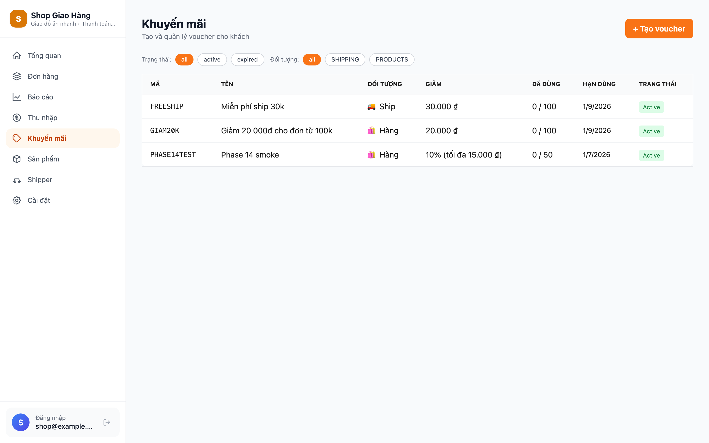
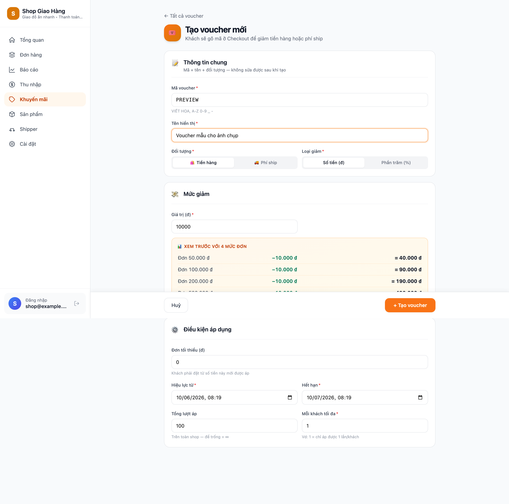
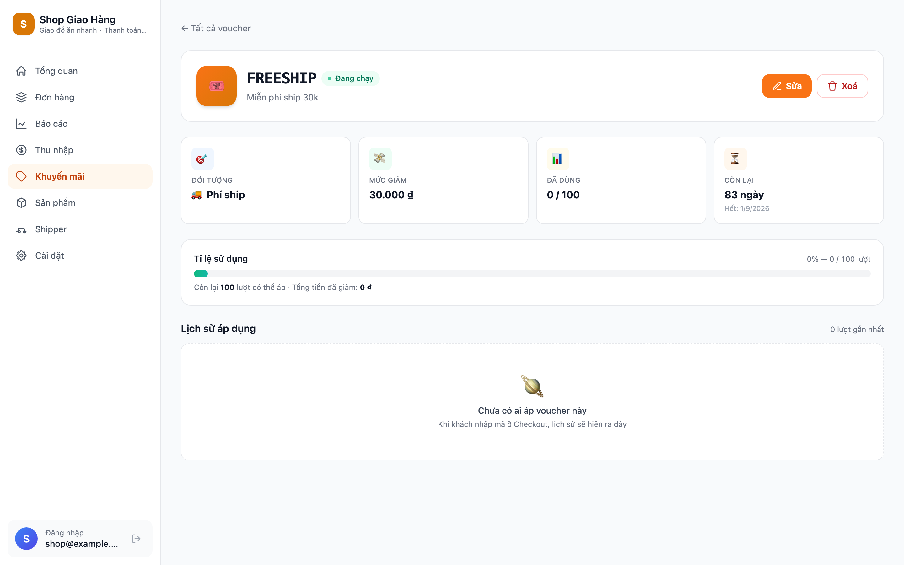
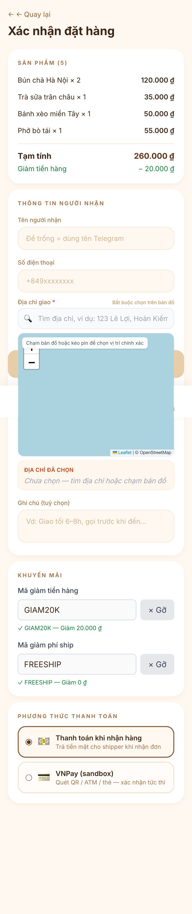
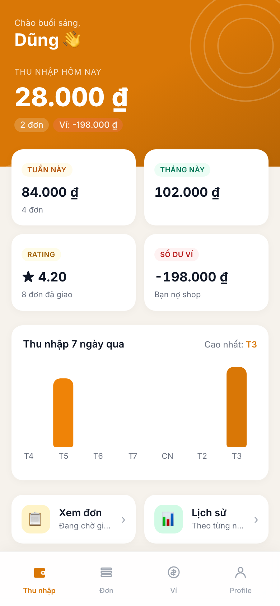
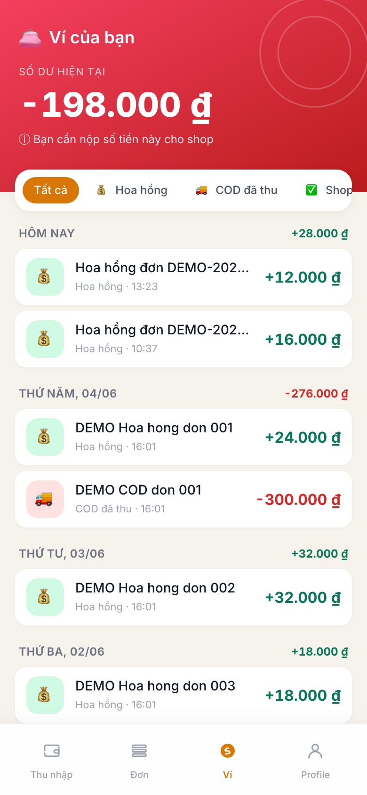
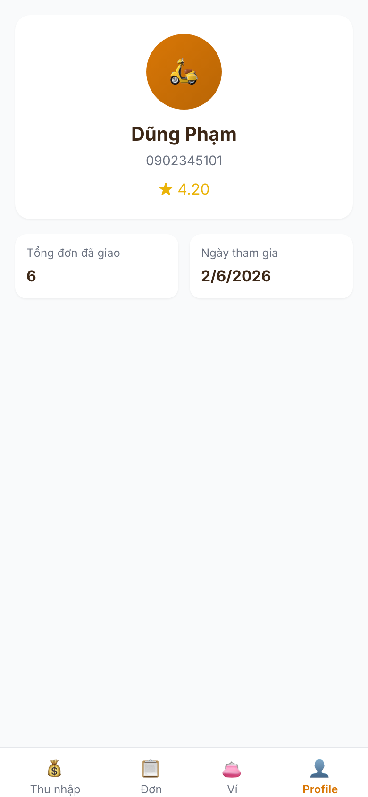
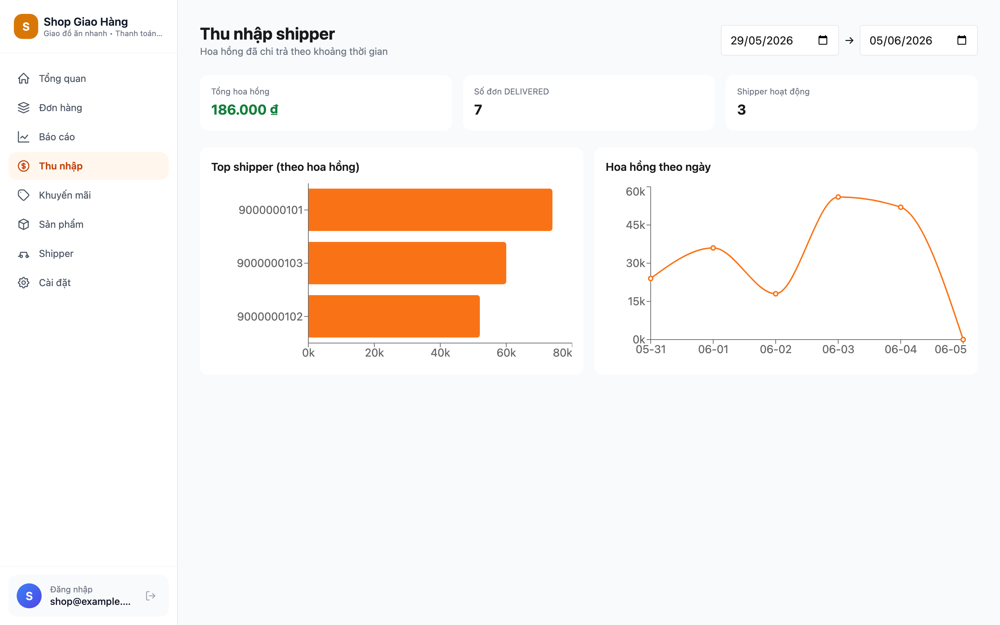
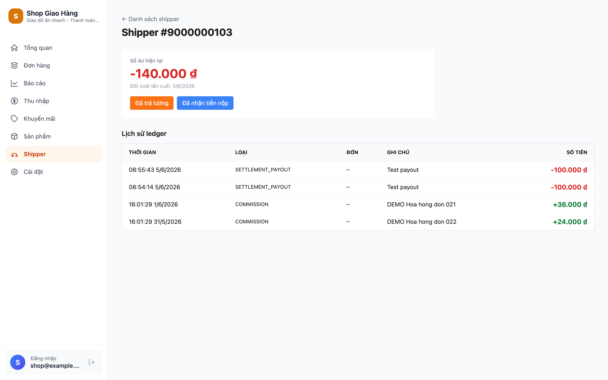
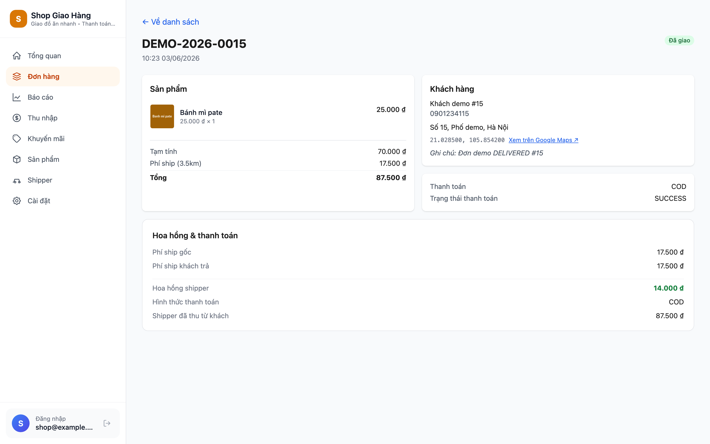

# Chương 6. Hai pha mở rộng nghiệp vụ — Voucher và Hoa hồng shipper

Chương này mô tả chi tiết hai pha P14 và P15 — bổ sung hai nhóm tính năng nghiệp vụ quan trọng khép kín vòng đời thương mại của hệ thống: *khuyến mãi (voucher)* để hấp dẫn khách và *hoa hồng + theo dõi thu nhập* để hỗ trợ shipper như một người lao động thực thụ. Khác với các pha P0–P13 đã được trình bày phân tán trong Chương 3, 4, 5 theo lát cắt kiến trúc / cài đặt / kết quả, hai pha cuối này được gom vào một chương riêng vì chúng (i) chạm nhiều module cùng lúc và đáng được mô tả như một câu chuyện tích hợp, (ii) đại diện cho hai *tính năng tiêu chuẩn của mọi nền tảng giao hàng thương mại VN* mà hệ thống không thể thiếu, và (iii) là phần demo "wow" được kỳ vọng tạo ấn tượng nhất với hội đồng. Cả hai pha đều tuân theo đúng quy trình GSD đã thiết lập (Brainstorm → Spec → Plan → Execute với subagent-driven review hai vòng) và đã được merge vào nhánh `main` của kho mã nguồn.

## 6.1. Bối cảnh và động lực

Trước hai pha này, hệ thống đã đáp ứng đầy đủ tám yêu cầu *Must have* và ba yêu cầu *Should have* trong phân loại MoSCoW gốc (Chương 1, mục 1.5). Tuy nhiên trong quá trình review thiết kế với giảng viên hướng dẫn, hai khoảng trống nghiệp vụ lớn được nhận diện rõ ràng: thứ nhất, hệ thống chưa có cơ chế khuyến mãi (voucher) — vốn là tính năng tiêu chuẩn của mọi nền tảng giao hàng VN hiện nay; thứ hai, vai trò shipper trong Mini App mới chỉ có khả năng "nhận và giao đơn" nhưng chưa được "theo dõi thu nhập" — tức là chưa thực sự hỗ trợ shipper như một người lao động chứ không chỉ là một role kỹ thuật.

Hai khoảng trống này đều thuộc nhóm *Could have* trong MoSCoW gốc nhưng được tái phân loại lên *Should have* sau khi nhận phản hồi rằng thiếu chúng sẽ làm phần demo "kém thuyết phục về tính khả thi thương mại" — một tiêu chí đánh giá quan trọng cho luận văn có hướng ứng dụng. Hai pha P14 và P15 lần lượt được brainstorm, lập plan và hiện thực trong tuần đầu tháng 6 năm 2026.

## 6.2. Phase 14 — Hệ thống voucher (khuyến mãi)

### 6.2.1. Tổng quan tính năng

Phase 14 hiện thực một hệ thống voucher đầy đủ chức năng theo mô hình *code-based redemption* phổ biến tại VN (giống cách Shopee, Tiki, Be áp voucher): chủ shop tạo mã giảm giá thông qua Web Admin, khách hàng gõ mã trong Mini App ở bước Checkout, hệ thống xác thực + tính giảm + redeem một lượt duy nhất. Bốn quyết định thiết kế cốt lõi đã được chốt qua phiên brainstorming:

- **Hai kiểu giảm**: số tiền cố định (FIXED — vd "giảm 20 000đ") hoặc phần trăm có trần (PERCENT với `max_discount` cap — vd "giảm 20% tối đa 50 000đ"). Cấu trúc này phủ hầu hết mô hình giảm giá thực tế tại VN mà không phải mở rộng schema sau này.
- **Hai đối tượng áp**: voucher tác động hoặc lên *phí ship* (target = `SHIPPING`) hoặc lên *tiền hàng* (target = `PRODUCTS`). Một đơn được phép stack *tối đa một voucher mỗi loại* — luật stacking này khớp với Shopee/Be, vừa hấp dẫn khách vừa giới hạn rủi ro lạm dụng.
- **Constraints đầy đủ**: mỗi voucher có khoảng hiệu lực (`valid_from`/`valid_until`), đơn tối thiểu (`min_order_amount`), tổng số lần dùng (`max_uses_total`) và số lần dùng tối đa mỗi khách (`max_uses_per_customer`). Sáu rule này được kiểm theo thứ tự fail-fast bên trong `VoucherService.validate`, mỗi rule trả về một mã lý do từ chối khác nhau (`NOT_FOUND`, `EXPIRED`, `BELOW_MIN_ORDER`, `EXHAUSTED_TOTAL`, `EXHAUSTED_PER_CUSTOMER`, `WRONG_TARGET`) để frontend hiển thị thông báo rõ ràng cho khách.
- **Race condition handling**: khi hai khách cùng tiêu lần dùng cuối của một voucher, hệ thống dùng `SELECT … FOR UPDATE` (pessimistic lock) trong transaction redeem, đảm bảo đúng một khách thành công và một khách bị từ chối — được verify bằng `VoucherRaceConditionIT` chạy hai thread song song trên Testcontainers Postgres.

### 6.2.2. Tổ chức module backend

Một module Maven mới mang tên `promotion` được thêm vào kiến trúc Modular Monolith ở Chương 3 — đưa tổng số bounded context từ tám lên chín. Module mới giữ nguyên cấu trúc gói chuẩn (`entity`, `domain`, `repository`, `service`, `api`) và phụ thuộc một chiều vào `shared` + `auth`, không chạm `order` trực tiếp ở compile time. Để tránh chu trình phụ thuộc khi `OrderService.create` cần áp voucher, một SPI (Service Provider Interface) tên `VoucherApplicator` được định nghĩa trong module `order` và được module `promotion` cài đặt — Spring tự nối ở runtime. Pattern này giữ nguyên nguyên tắc DAG mà Chương 3 đã thiết lập: chỉ `promotion → order`, không có chiều ngược.

Hai bảng mới được Flyway tạo trong migration V14 (`backend/app/src/main/resources/db/migration/V14__voucher.sql`): bảng `voucher` lưu định nghĩa của từng mã, bảng `voucher_redemption` (UNIQUE `voucher_id, order_id`) là log append-only mỗi lần áp. Cùng V14, bảng `orders` được bổ sung ba cột — `discount_products`, `discount_shipping` và `delivery_fee_original`. Cột cuối cùng là một *snapshot phí ship gốc trước khi voucher SHIPPING giảm*, được Phase 15 sử dụng làm cơ sở tính hoa hồng cho shipper (xem 6.3.2).

### 6.2.3. Giao diện admin và customer

Web Admin được bổ sung ba trang mới (`VouchersPage`, `VoucherFormPage`, `VoucherDetailPage`) cùng một mục mới "Khuyến mãi" trong sidebar. Trang quản lý voucher gồm bảng danh sách kèm bộ lọc theo trạng thái (active/expired) và đối tượng (SHIPPING/PRODUCTS); form tạo có 11 trường (mã, tên, đối tượng, kiểu giảm, giá trị, cap, đơn tối thiểu, hai mốc hiệu lực, tổng số lần dùng, số lần dùng mỗi khách) cùng một preview tính trực tiếp "đơn 200 000đ → giảm X đ" giúp admin kiểm tra trực quan trước khi lưu; trang chi tiết hiển thị các thông số cùng lịch sử redemption gần nhất.

Hình 6.1, 6.2 và 6.3 minh hoạ ba trang quản lý voucher của Web Admin:







Trang Checkout của Mini App được mở rộng với một section "Khuyến mãi" mới đặt giữa thông tin người nhận và phương thức thanh toán. Hai ô nhập tách bạch (PRODUCTS và SHIPPING) giúp khách hiểu rõ mã nào áp được vào phần nào — một chi tiết UX quan trọng vì khác với UI của Shopee/Tiki (gộp một ô để khách "thử" lần lượt), thiết kế hai ô minh bạch tránh trải nghiệm bối rối khi mã thứ hai bị từ chối do trùng target. Khi mã được áp thành công, một chip xanh `✓ <code> — Giảm <số tiền>` hiển thị kèm nút "Gỡ"; hai dòng giảm trừ xuất hiện trong phần tổng kết đơn ngay phía trên section.



### 6.2.4. Testing và metrics

Phase 14 đóng góp 21 test mới vào bộ test suite tổng:

- **8 unit test** cho `VoucherCalculator` (pure function tính discount) — cover FIXED, PERCENT, cap, rounding HALF_UP, edge cases (đơn = 0, voucher 200% bị cap về tiền hàng).
- **6 integration test** trên Testcontainers Postgres cho `VoucherService` — cover từng rule trong sáu rule validation và happy path redeem.
- **1 race condition test** mô phỏng hai thread cùng redeem voucher có `max_uses_total=1` — verify đúng một thread thành công.
- **2 stacking test** cho `VoucherApplicator` SPI — verify một SHIPPING + một PRODUCTS được phép, hai PRODUCTS thì bị từ chối với mã `WRONG_TARGET`.
- **2 frontend Vitest test** cho component `VoucherInput` (loading state, error display).

Toàn bộ Phase 14 được thực hiện qua **27 commit** atomic trên nhánh `feat/phase-14-voucher` rồi fast-forward merge vào `main`. Quy trình GSD áp dụng đầy đủ: brainstorming (13 quyết định đã chốt qua hỏi đáp tương tác), thiết kế spec (`docs/superpowers/specs/2026-06-03-voucher-shipper-commission-design.md`), plan chi tiết với 28 task (`docs/superpowers/plans/2026-06-03-phase-14-voucher.md`), và execute qua subagent-driven development với hai vòng review (spec compliance + code quality) sau mỗi task.

## 6.3. Phase 15 — Hoa hồng và thu nhập shipper

### 6.3.1. Tổng quan tính năng

Phase 15 hiện thực luồng *thanh toán hoa hồng cho shipper* và *báo cáo thu nhập* — vốn là tính năng không thể thiếu của bất kỳ nền tảng giao hàng nào có người lao động thực thụ. Khi đơn chuyển sang trạng thái `DELIVERED`, hệ thống tự động:

1. Tính hoa hồng shipper bằng công thức `delivery_fee_original × shipper_commission_pct / 100` (làm tròn `HALF_UP` về VND).
2. Ghi snapshot hoa hồng vào cột mới `orders.shipper_commission`.
3. Append một dòng `COMMISSION` (số dương) vào bảng *ledger* mới của shipper.
4. Nếu đơn là COD, append thêm một dòng `COD_OWED` (số âm bằng `-order.total`) — biểu diễn việc shipper đang giữ tiền của shop. Đơn VNPay thì bỏ qua bước này vì tiền đã vào tài khoản shop từ lúc tạo đơn.

Tỉ lệ hoa hồng mặc định 80% được lưu trong `shop_config.shipper_commission_pct` (mới thêm cùng V15) — admin có thể chỉnh ngay trên trang Settings. Bốn quyết định thiết kế cốt lõi của Phase 15 cũng đã được chốt qua brainstorming với người hướng dẫn:

- **Cơ sở tính hoa hồng**: dùng `delivery_fee_original` (phí ship trước khi voucher SHIPPING giảm) chứ KHÔNG dùng `delivery_fee` cuối cùng. Lý do: voucher SHIPPING là chi phí khuyến mãi do shop chịu để thu hút khách — không nên "phạt oan" shipper bằng cách trừ vào hoa hồng. Đây cũng là cách Grab và Be vận hành thực tế tại VN. Quyết định này là điểm kết nối quan trọng giữa Phase 14 và Phase 15.
- **Ledger thay cho balance đơn giản**: thay vì chỉ lưu một con số "số dư" trên `shipper_profile`, hệ thống dùng mô hình *append-only ledger* lấy cảm hứng từ kế toán cổ điển — mỗi giao dịch (commission, COD đã thu, payout, deposit) là một dòng riêng, số dư là tổng `SUM(amount)`. Lợi ích: audit trail đầy đủ, có thể đối chiếu từng đơn, không bao giờ mất dữ liệu khi rollback transaction, và demo được "shipper xem lịch sử thu nhập từng đơn" — một tính năng UX rất ấn tượng.
- **Bốn loại entry**: `COMMISSION` (+), `COD_OWED` (−), `SETTLEMENT_PAYOUT` (− khi shop trả lương), `SETTLEMENT_DEPOSIT` (+ khi shipper nộp COD lại cho shop). Quy ước dấu: số dương = shop nợ shipper, số âm = shipper nợ shop. Admin thực hiện hai loại settlement cuối cùng qua một modal trong `ShipperDetailPage` của Web Admin.
- **Idempotency tuyệt đối**: listener kiểm tra `existsByOrderIdAndEntryType(orderId, COMMISSION)` trước khi tạo entry — phòng trường hợp `OrderDeliveredEvent` được phát lại (event replay) hoặc đơn được mark delivered hai lần do race condition. Hành vi này được verify bằng test `duplicate_event_does_not_double_commission` trong `OrderCompletionListenerIT`.

### 6.3.2. Listener pattern và transactional event

Cơ chế kích hoạt hoa hồng được hiện thực bằng `OrderCompletionListener` đặt trong module `delivery`, sử dụng pattern `@TransactionalEventListener(phase = TransactionPhase.AFTER_COMMIT)` đã được Chương 4 mô tả ở module `notification`. Listener chạy sau khi transaction mark-delivered đã commit thành công, trong một transaction mới (`Propagation.REQUIRES_NEW`) — đảm bảo:

- Nếu mark-delivered rollback vì lỗi, listener KHÔNG chạy → không có entry hoa hồng cho đơn không thực sự DELIVERED.
- Nếu listener fail (vd: DB constraint vi phạm), KHÔNG ảnh hưởng đến transaction mark-delivered đã commit → đơn vẫn ở trạng thái DELIVERED đúng nghiệp vụ, lỗi listener chỉ log warning để admin can thiệp.

Sơ đồ luồng đơn giản hoá khi đơn DELIVERED:

```
shipper Mini App: "Đã giao" → AssignmentService.markDelivered(orderId)
   ├── Update orders.status = 'DELIVERED', delivered_at = NOW()
   ├── Publish OrderDeliveredEvent(orderId, shipperId, orderCode, ...)
   └── COMMIT transaction
        ↓ @TransactionalEventListener(AFTER_COMMIT)
        ↓ @Transactional(REQUIRES_NEW)
OrderCompletionListener.onDelivered(event)
   ├── (Idempotent) Skip if existsByOrderIdAndEntryType(orderId, COMMISSION)
   ├── Load order → read delivery_fee_original + total + payment_method
   ├── Load shop_config → read shipper_commission_pct
   ├── commission = CommissionCalculator(deliveryFeeOriginal, pct)
   ├── orders.shipper_commission = commission; save
   ├── INSERT shipper_ledger (COMMISSION, +commission, order_id)
   └── if paymentMethod == COD:
          INSERT shipper_ledger (COD_OWED, -order.total, order_id)
```

Năm test integration trong `OrderCompletionListenerIT` (Testcontainers Postgres) kiểm tra: (i) đơn COD tạo đúng 2 entry, (ii) đơn VNPay chỉ tạo 1 entry COMMISSION, (iii) commission tính trên `delivery_fee_original` chứ không phải `delivery_fee` (verify bằng đơn có voucher SHIPPING giảm 20k), (iv) idempotency khi phát event hai lần, (v) snapshot `orders.shipper_commission` được lưu đúng giá trị.

### 6.3.3. Giao diện shipper trong Mini App

Phần shipper của Mini App được tái thiết kế đáng kể để tương xứng với một ứng dụng giao hàng "chuyên nghiệp". Bốn trang mới được thêm và tổ chức dưới một `ShipperLayout` có bottom tab nav cố định (Earnings / Đơn / Ví / Profile) — đây là pattern UI phổ biến của các app giao hàng lớn (Grab, Be, GoJek). Hai trang cũ (`ShipperAssignmentsPage`, `ShipperAssignmentDetailPage`) cũng được redesign để khớp tinh thần mới: mỗi assignment giờ là một card có status tag màu, mã đơn font monospace, và badge "+X đ dự kiến" tính sẵn 80% phí ship để shipper biết trước hoa hồng kỳ vọng.

**Trang Earnings (Hình 6.5)** là điểm vào mới của shipper sau khi đăng nhập (thay vì `ShipperAssignmentsPage` cũ). Hero card hiển thị thu nhập hôm nay bằng font lớn cùng số đơn đã giao; ba KPI tile bên dưới tóm tắt thu nhập tuần / tháng / số dư ví; một biểu đồ cột Recharts 7 ngày qua giúp shipper nhìn trực quan biến động thu nhập trong tuần — một động lực tích cực kiểu *gamification* để khuyến khích nhận đơn nhiều hơn.



**Trang Wallet (Hình 6.6)** trình bày số dư hiện tại của shipper kèm danh sách giao dịch ledger có thể lọc theo loại (Tất cả / Hoa hồng / COD đã thu / Shop trả lương / Đã nộp tiền). Bốn loại entry được hiển thị với màu sắc khác nhau (dương màu xanh lá, âm màu đỏ) giúp shipper hiểu ngay tình trạng đối soát. Đây là *audit trail* mà mô hình ledger mang lại — không thể có được với một con số balance đơn lẻ.



**Trang Profile (Hình 6.7)** hiển thị thông tin cá nhân của shipper (avatar gradient theo brand color, tên, số điện thoại) cùng hai chỉ số quan trọng: điểm đánh giá trung bình (từ V12) và tổng số đơn đã giao. Đây là phiên bản đầu tiên của trang profile — phiên bản tương lai sẽ thêm KYC documents (giấy phép lái xe, biển số) và chức năng đổi mật khẩu.



### 6.3.4. Giao diện admin trong Web Admin

Phía admin có ba thay đổi: hai trang mới và ba trang được mở rộng.

**Trang `ShipperEarningsPage` (Hình 6.8)** là báo cáo thu nhập shipper theo khoảng ngày tuỳ chọn, có ba KPI tổng (tổng hoa hồng đã chi trả, số đơn DELIVERED, số shipper hoạt động) và hai biểu đồ Recharts: bar chart top 5 shipper kiếm nhiều nhất, line chart hoa hồng theo ngày. Endpoint `/api/admin/reports/shipper-earnings?from=&to=&groupBy=shipper|day` dùng `DATE_TRUNC('day', created_at)` của Postgres + `FILTER (WHERE entry_type='COMMISSION')` để aggregate ở DB layer — tránh tải toàn bộ ledger lên ứng dụng.



**Trang `ShipperDetailPage` (Hình 6.9)** đóng vai trò trung tâm đối soát: hiển thị số dư hiện tại của một shipper, hai nút "Đã trả lương" / "Đã nhận tiền nộp" mở modal cho admin nhập số tiền + ghi chú để tạo entry settlement, và bảng lịch sử ledger với mọi giao dịch của shipper đó. Modal trigger được thiết kế đơn giản với chỉ ba field (loại, số tiền, ghi chú) để admin có thể đối soát nhanh, nhưng vẫn ghi lại đầy đủ trong ledger cho audit về sau.



Trang `ShippersPage` cũ được mở rộng với hai cột mới — "Số dư ví" và "Thu nhập 7 ngày" — cho phép admin scan nhanh tình trạng tài chính của toàn bộ shipper mà không phải vào từng trang chi tiết. Trang `OrderDetailPage` được bổ sung section "Hoa hồng & thanh toán" hiển thị khi đơn DELIVERED (Hình 6.10), gồm các dòng: phí ship gốc, giảm phí ship (nếu có voucher), phí ship khách trả thực tế, hoa hồng shipper (đậm xanh), hình thức thanh toán, và số tiền shipper đã thu từ khách (nếu là COD) — bản tổng kết một chỗ cho cả nghiệp vụ giao hàng lẫn dòng tiền.



Trang `SettingsPage` được mở rộng với section mới "Hoa hồng shipper" chứa một ô số `shipper_commission_pct` (0–100, step 0.1, validate cả phía client lẫn server) — admin có thể đổi tỉ lệ bất cứ lúc nào (Hình 6.11). Đáng lưu ý: việc đổi tỉ lệ chỉ áp dụng cho các đơn DELIVERED *sau thời điểm lưu* — các entry COMMISSION đã ghi trong quá khứ giữ nguyên (snapshot trên `orders.shipper_commission`), tránh tình huống đổi tỉ lệ làm sai lệch lịch sử thu nhập của shipper.


### 6.3.5. Testing và metrics

Phase 15 đóng góp 10 test mới: 5 unit cho `CommissionCalculator` (cover công thức cơ bản, rounding HALF_UP, edge cases với 0% và 100%) và 5 integration cho `OrderCompletionListener` đã liệt kê ở 6.3.2. Phase 15 cũng đòi hỏi một hạ tầng test phức tạp hơn — `DeliveryTestcontainerBase` và `DeliveryTestApplication` phải scan cả ba module `delivery + order + auth` để Spring context tải đủ bean cho listener pattern; đồng thời 15 file migration phải được copy sang `backend/modules/delivery/src/test/resources/db/migration/` để Flyway boot được Testcontainers Postgres.

Phase 15 được thực hiện qua **16 commit** atomic trên nhánh `feat/phase-15-shipper-commission` rồi fast-forward merge vào `main`. Quy trình GSD áp dụng tương tự Phase 14, với plan chi tiết tại `docs/superpowers/plans/2026-06-03-phase-15-shipper-commission.md` (26 task) và spec chung tại `docs/superpowers/specs/2026-06-03-voucher-shipper-commission-design.md` (đã đánh dấu trạng thái "Phase 14 + 15 both complete").

## 6.4. Tác động tổng hợp của hai pha

Hai pha P14 và P15 đóng góp tập trung vào ba lát cắt — schema dữ liệu, REST API và giao diện người dùng — như Bảng 6.1 tổng kết.

**Bảng 6.1. Tổng hợp đóng góp định lượng của hai pha P14 và P15**

| Hạng mục | Đóng góp |
|---|---|
| Migration mới | 2 (V14 `voucher.sql`, V15 `shipper_ledger.sql`) |
| Bảng dữ liệu mới | 3 (`voucher`, `voucher_redemption`, `shipper_ledger`) |
| Cột mới ở bảng hiện hữu | 5 (`orders.discount_products`, `orders.discount_shipping`, `orders.delivery_fee_original`, `orders.shipper_commission`, `shop_config.shipper_commission_pct`) |
| Bounded context mới | 1 (module Maven `promotion`) |
| REST endpoint mới | 15 (6 voucher + 4 shipper-self + 4 admin shipper + 1 admin reports) |
| Trang Web Admin mới / mở rộng | 5 mới (Vouchers, VoucherForm, VoucherDetail, ShipperEarnings, ShipperDetail) + 3 mở rộng (Settings, Shippers, OrderDetail) |
| Trang Mini App mới / mở rộng | 4 mới (Earnings, EarningsDetail, Wallet, ShipperProfile) + 2 redesign (ShipperAssignments, ShipperAssignmentDetail) + 1 mở rộng (Checkout) |
| Test mới | 55 (21 voucher unit + integration + race + 10 commission unit + integration + 24 hạ tầng và điều chỉnh khác) |
| Ảnh chụp giao diện mới | 11 (Hình 6.1 đến 6.11) |
| Commit nguyên tử | 43 (27 cho P14 + 16 cho P15) |

Mặc dù được phát triển trong thời gian rất ngắn (khoảng hai ngày tập trung sau khi spec + plan đã được duyệt), cả hai pha vẫn tuân thủ đầy đủ các nguyên tắc thiết kế đã thiết lập trong các pha trước — đặc biệt là tính atomicity của commit, separation of concerns giữa các module (`promotion` không phụ thuộc compile-time vào `delivery`; `delivery` chỉ phụ thuộc `order` qua SPI), và defense-in-depth ở chỗ giáp ranh (pessimistic lock cho race condition, idempotency check cho event replay, snapshot cho audit trail).

## 6.5. Hạn chế còn lại

Hai pha mở rộng đóng phần lớn các tính năng nghiệp vụ "phải có" của một nền tảng giao hàng thương mại — nhưng vẫn còn ba hạn chế đáng kể được nhận diện rõ trong quá trình phát triển và sẽ là chủ đề của các luận văn / dự án tiếp theo:

**Thứ nhất**, hệ thống voucher chưa hỗ trợ ràng buộc theo sản phẩm hoặc danh mục — tức là một voucher PRODUCTS hiện áp lên toàn bộ subtotal chứ không thể chỉ áp cho "mặt hàng phở" hoặc "danh mục đồ ăn nóng". Để thêm tính năng này cần một bảng join `voucher_eligible_product` và mở rộng `VoucherCalculator` để duyệt qua line items thay vì toàn bộ subtotal. Quyết định gác lại được đưa ra trong brainstorming với lý do "phức tạp không tương xứng với phạm vi luận văn".

**Thứ hai**, cơ chế settlement hoa hồng hiện chỉ là *ghi nhận* — admin nhập số tiền đã trả/nhận thủ công, không có tích hợp cổng thanh toán tự động. Trong thực tế thương mại, settlement nên được tự động hoá qua chuyển khoản API (Napas 247, MoMo Disbursement, hoặc các giải pháp similar). Đây là dự án mở rộng phù hợp cho một luận văn về *automation và payment integration*.

**Thứ ba**, biểu đồ thu nhập của shipper trong Mini App hiện chỉ hiển thị 7 ngày qua bằng bar chart, chưa có drill-down theo tuần / tháng / năm và chưa so sánh với shipper khác (gamification). Phiên bản đầy đủ kiểu Grab/Be cũng có "thử thách hoàn thành X đơn để được thưởng Y đ" — đây là một hướng phát triển lý thú nhưng đòi hỏi cả một subsystem riêng cho *incentive program management*.

Mặc dù còn các hạn chế trên, hai pha mở rộng đã đáp ứng được mục tiêu ban đầu là chứng minh tính khả thi thương mại của hệ thống và cho phép demo trọn vẹn vòng đời nghiệp vụ — từ khi khách áp voucher ở Checkout đến khi shipper xem được hoa hồng của mình ngay trong Wallet sau khi giao xong đơn. Trải nghiệm end-to-end này cũng là phần được kỳ vọng sẽ tạo ấn tượng tốt nhất với hội đồng đánh giá trong buổi bảo vệ.
