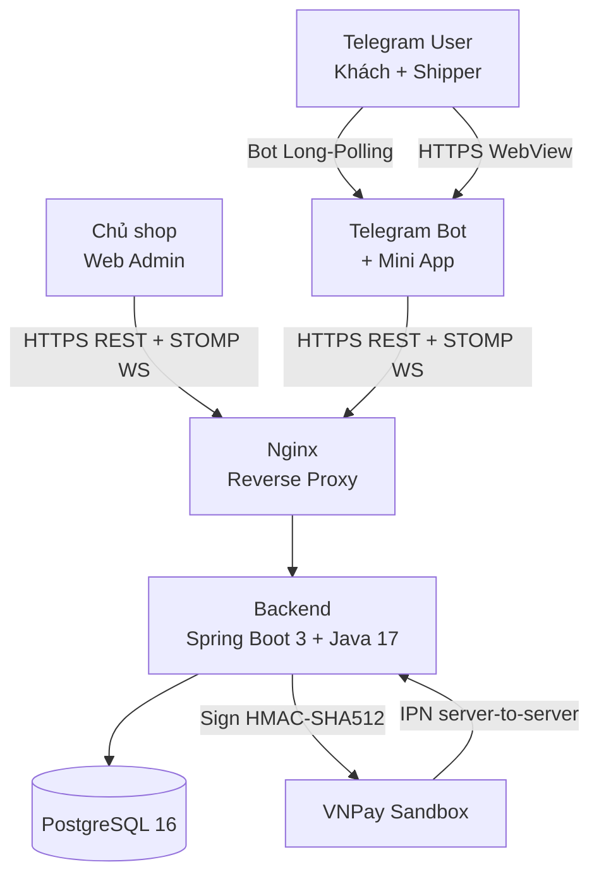

# Slide outline cho buổi bảo vệ khoá luận

> **Đề tài:** Xây dựng hệ thống quản lý giao hàng dựa trên nền tảng Telegram.
> **Tổng số slide:** 18 (~1 phút/slide + 5 phút Q&A → tổng 20–25 phút).
> **Định dạng:** Mỗi slide gồm bốn phần — *Tiêu đề*, *Nội dung chính*, *Note nói* (talking points), *Visual gợi ý*.
> **File này dùng cho gì?** Sinh viên dùng để build slide trong PowerPoint / Google Slides / Marp / reveal.js. Có thể bám sát thứ tự hoặc đảo trật tự cho phù hợp phong cách trình bày.
> **Nguyên tắc thiết kế:** mỗi slide ≤ 6 bullet, font ≥ 24 pt, ảnh chiếm ít nhất 40% diện tích cho các slide demo.

---

## Slide 1 — Trang tiêu đề

**Tiêu đề:** Xây dựng hệ thống quản lý giao hàng dựa trên nền tảng Telegram.

**Nội dung chính:**
- Tên đề tài (bằng tiếng Việt, font lớn ở trung tâm).
- Sinh viên thực hiện: [Họ và tên sinh viên] — [MSSV].
- Giảng viên hướng dẫn: [Học hàm/học vị Họ và tên GVHD].
- Đơn vị: [Khoa Công nghệ Thông tin — Trường Đại học X].
- Ngày bảo vệ: [DD/MM/2026].

**Note nói (≈ 30 giây):**
"Kính chào hội đồng. Em là [Họ tên], MSSV [...]. Hôm nay em xin trình bày khoá luận tốt nghiệp với đề tài *Xây dựng hệ thống quản lý giao hàng dựa trên nền tảng Telegram* dưới sự hướng dẫn của thầy/cô [...]. Phần trình bày của em gồm năm phần chính: bối cảnh, mục tiêu, kiến trúc, demo và kết luận. Em xin phép bắt đầu."

**Visual gợi ý:**
- Background gradient cam–đỏ matching brand "Shop Giao Hàng".
- Logo trường + logo khoa ở góc trên.
- Icon biểu tượng xe máy giao hàng + biểu tượng Telegram (paper plane) cách điệu ở trung tâm.

---

## Slide 2 — Vấn đề & động lực

**Tiêu đề:** Bài toán giao hàng cho shop nhỏ tại Việt Nam.

**Nội dung chính:**
- Quy mô thị trường giao đồ ăn VN năm 2024 vượt 1 tỷ USD, tăng trưởng kép hai con số.
- Shop nhỏ phải đối mặt 3 lựa chọn không hoàn hảo: chịu 20–25% hoa hồng aggregator, tự build app tốn hàng trăm triệu, hoặc vận hành thủ công qua Messenger/Zalo.
- Cơ hội: Telegram có gần 1 tỷ MAU + Bot API miễn phí + Mini App + Live Location native.
- Giải pháp đề xuất: dùng Telegram làm cổng vào duy nhất cho cả 3 vai trò (khách / shipper / chủ shop).

**Note nói (≈ 60 giây):**
"Thị trường giao đồ ăn VN năm 2024 đã vượt 1 tỷ USD. Tuy nhiên, các shop nhỏ — quán ăn gia đình, tạp hoá khu phố — không có giải pháp phù hợp. Họ phải chọn giữa: tham gia GrabFood chịu 20–25% hoa hồng và mất dữ liệu khách hàng; tự xây app native tốn hàng trăm triệu; hoặc nhận đơn qua Facebook/Zalo rời rạc dễ thất lạc. Em quan sát thấy Telegram có gần 1 tỷ MAU và cung cấp Bot API miễn phí, Mini App nhúng được web app, và đặc biệt là Live Location native — đây là nền tảng lý tưởng để xây hệ thống giao hàng đầu cuối với chi phí thấp."

**Visual gợi ý:**
- Cột trái: 3 icon đại diện 3 lựa chọn cũ với dấu X.
- Cột phải: logo Telegram + dòng "1 tỷ MAU" lớn.
- Số liệu "1 tỷ USD" thị trường VN được highlight màu đỏ.

---

## Slide 3 — So sánh giải pháp

**Tiêu đề:** Định vị hệ thống so với các giải pháp hiện có.

**Nội dung chính:**

| Tiêu chí | Đề tài | GrabFood / ShopeeFood | Shop tự build native |
|---|---|---|---|
| Khách cần cài app mới | Không (dùng Telegram) | Có (~150 MB) | Có |
| Chi phí triển khai / tháng | ~10 USD (1 VPS) | Không áp dụng | 50–100 USD |
| Realtime GPS tracking | Có, qua Telegram Live Location | Có | Hiếm |
| Tự chủ dữ liệu khách | Có | Không | Có |
| Tích hợp VNPay | Có | Có | Tuỳ |

**Note nói (≈ 45 giây):**
"Để định vị rõ, em so sánh với hai nhóm giải pháp phổ biến. So với GrabFood — khách phải cài app 150 MB, shop chịu hoa hồng cao, không tự chủ dữ liệu. So với shop tự build app native — chi phí cao 50–100 USD/tháng và mất nhiều thời gian dev. Hệ thống của em chỉ tốn ~10 USD/tháng cho 1 VPS, khách không cần cài thêm app, vẫn có realtime tracking nhờ Telegram Live Location. Đây chính là khoảng trống mà đề tài lấp vào."

**Visual gợi ý:**
- Bảng 3 cột rõ ràng, dấu tick xanh / dấu X đỏ thay cho text "Có/Không" để dễ nhìn.
- Highlight cột "Đề tài" bằng background nhẹ.

---

## Slide 4 — Mục tiêu & phạm vi

**Tiêu đề:** Năm mục tiêu kỹ thuật + phạm vi MoSCoW.

**Nội dung chính:**
- *MT1.* Đặt đơn online với 2 phương thức thanh toán: COD + VNPay sandbox (HMAC-SHA512, IPN làm nguồn sự thật).
- *MT2.* Theo dõi vị trí shipper realtime trên bản đồ Leaflet, độ trễ < 3s.
- *MT3.* Máy trạng thái hữu hạn (FSM) cho vòng đời đơn hàng 7 trạng thái.
- *MT4.* Thông báo realtime qua Spring WebSocket STOMP + Telegram Bot.
- *MT5.* Đóng gói Docker Compose deploy bằng 3 lệnh.
- Phạm vi MoSCoW: 8 Must + 3 Should đã hoàn thành 100%; 2 Could là hướng phát triển; 2 Won't ngoài phạm vi.

**Note nói (≈ 45 giây):**
"Đề tài hướng đến 5 mục tiêu kỹ thuật cụ thể: đặt đơn với COD và VNPay, tracking realtime dưới 3 giây, máy trạng thái cho đơn hàng, notification realtime, và Docker Compose. Phạm vi được phân loại MoSCoW: 8 yêu cầu Must và 3 Should đều đã hoàn thành 100%. Hai yêu cầu Could (lưu địa chỉ + chat trong bot) và hai Won't (multi-tenant + super admin) được liệt kê ở hướng phát triển."

**Visual gợi ý:**
- 5 icon biểu tượng cho 5 mục tiêu (giỏ hàng, bản đồ pin, FSM diagram, chuông notification, container Docker).
- Bảng MoSCoW rút gọn 4 hàng x 3 cột (Phân loại / Số yêu cầu / Tỉ lệ hoàn thành).

---

## Slide 5 — Kiến trúc tổng thể

**Tiêu đề:** Sơ đồ kiến trúc tổng thể.

**Nội dung chính:**



**Note nói (≈ 60 giây):**
"Đây là kiến trúc tổng thể. Ba kênh giao diện ở rìa: khách hàng và shipper dùng Telegram Bot + Mini App (cùng một app Telegram), còn chủ shop dùng Web Admin trên trình duyệt. Tất cả truy cập qua Nginx reverse proxy. Backend là Spring Boot 3 trên Java 17, một process duy nhất nhưng chia thành 8 module bounded context. Database là PostgreSQL 16. Tích hợp VNPay theo pattern IPN-as-source-of-truth — VNPay sẽ call server-to-server vào backend để xác nhận thanh toán, không tin tưởng Return URL."

**Visual gợi ý:**
- Render Mermaid bằng Mermaid Live Editor → export PNG, hoặc dùng marp-mermaid-plugin.
- Mũi tên có label rõ ràng (REST, WebSocket, HMAC).

---

## Slide 6 — Tech stack

**Tiêu đề:** Công nghệ áp dụng.

**Nội dung chính:**

| Tầng | Công nghệ |
|---|---|
| Frontend | React 18 + Vite 5, Tailwind, Zustand, Recharts, react-leaflet, `@twa-dev/sdk` |
| Backend | Spring Boot 3.3, Java 17, Spring Security, Spring WebSocket (STOMP), Hibernate 6 + JdbcTypeCode JSON, Maven multi-module |
| Bot | `telegrambots-springboot-longpolling-starter` 7.x |
| Database | PostgreSQL 16, Flyway 10.x (12 migration V1–V12) |
| Infra | Docker Compose 5 container, Nginx reverse proxy, Testcontainers 1.x |
| Testing | JUnit 5, Mockito, AssertJ, Failsafe + Surefire, Vitest + Testing Library |

**Note nói (≈ 30 giây):**
"Stack công nghệ tiêu chuẩn nhưng chọn lọc. Frontend React 18 + Vite + Tailwind cho cả Mini App và Web Admin. Backend Spring Boot 3 + Java 17, Hibernate 6. Bot dùng thư viện chính thống `telegrambots-springboot-longpolling-starter`. Database PostgreSQL 16 với Flyway quản lý 12 migration. Toàn bộ đóng gói Docker Compose."

**Visual gợi ý:**
- Logo các công nghệ (React, Spring, Postgres, Docker, Telegram, VNPay) sắp 6x2 grid.
- Bảng có icon cột đầu để nhận biết nhanh.

---

## Slide 7 — Modular Monolith — 8 bounded context

**Tiêu đề:** Kiến trúc Modular Monolith với 8 ngữ cảnh nghiệp vụ.

**Nội dung chính:**

```
shared (base — không phụ thuộc module nào)
   ↑
   ├── auth          → Telegram initData HMAC + JWT admin
   ├── order         → Order, Product, OrderItem, FSM, StatusHistory
   ├── delivery      → ShipperProfile, Assignment, LocationPing, Rating, Reports
   ├── payment       → Payment, PaymentTransaction, VNPay signing/IPN
   ├── bot           → Telegram Bot handlers + FSM ConversationState
   ├── notification  → OrderAssignedNotifier, OrderLifecycleNotifier, RatingPromptBuilder
   └── app           → Executable jar, WebSocketConfig, SecurityConfig
```

- Đồ thị phụ thuộc một chiều (DAG, không có chu trình).
- Giao tiếp cross-module qua **Spring Application Events** + `@TransactionalEventListener(AFTER_COMMIT)`.
- Sự kiện chỉ fire sau khi DB commit thành công — không gửi notification rồi DB rollback.

**Note nói (≈ 45 giây):**
"Em chọn Modular Monolith thay vì Microservices vì phạm vi đề tài. 8 module chia theo bounded context của DDD: shared là base, auth + order + delivery + payment là core nghiệp vụ, bot + notification là channel, app là wirer. Giao tiếp cross-module dùng Spring Events với `AFTER_COMMIT` — đảm bảo notification chỉ gửi khi DB đã commit thành công. Đây cũng là lối thoát cho microservices trong tương lai mà không phải sửa code nghiệp vụ — chỉ cần thay event publisher bằng Kafka."

**Visual gợi ý:**
- DAG diagram với mũi tên một chiều rõ ràng.
- Highlight 1–2 module bằng màu cam để chỉ ra core.

---

## Slide 8 — Demo: Mini App khách hàng (catalog + cart)

**Tiêu đề:** Demo 1 — Mini App khách: duyệt danh mục & giỏ hàng.

**Nội dung chính:**
- Khách mở bot Telegram → bấm "Đặt hàng" → Mini App load trong WebView của Telegram.
- Danh mục 10 sản phẩm demo seed V11 (cà phê, phở, bún…).
- Giỏ hàng persistent qua Zustand + `localStorage` — không mất giỏ khi reload.
- Theme tự động theo Telegram (sáng/tối).
- Xác thực: `X-Telegram-Init-Data` header → backend verify HMAC-SHA256 bằng `MessageDigest.isEqual`.

**Note nói (≈ 60 giây):**
"Đây là điểm tiếp xúc đầu tiên của khách. Khi khách bấm nút Đặt hàng trong bot, Telegram mở Mini App bên trong app chat — không cần cài thêm app. Mini App là React + Vite + Tailwind, theme tự động theo cài đặt sáng/tối của Telegram. Giỏ hàng được persist bằng Zustand vào `localStorage` nên không mất khi reload. Xác thực dùng `X-Telegram-Init-Data` header — backend verify HMAC bằng `MessageDigest.isEqual` constant-time."

**Visual gợi ý:**
- Ảnh side-by-side: `miniapp-cust-01-catalog.png` (trái) + `miniapp-cust-05-cart-filled.png` (phải).
- Mũi tên annotation chỉ vào theme dark/light, badge giỏ hàng, nút "Thêm vào giỏ".

---

## Slide 9 — Demo: Mini App — Order Detail + Live Location

**Tiêu đề:** Demo 2 — Theo dõi shipper realtime trên bản đồ.

**Nội dung chính:**
- Shipper share Live Location qua Telegram native (📎 → Vị trí → Chia sẻ trực tiếp).
- Backend nhận `edited_message.location` mỗi 5–10s → lưu `location_ping` → broadcast STOMP `/user/{customerId}/queue/order/{orderId}/location`.
- Khách thấy chấm di chuyển trên bản đồ Leaflet + polyline 10 ping gần nhất + ETA.
- Tracking page poll order status mỗi 3s để fallback nếu WebSocket disconnect.
- Độ trễ end-to-end: ~5–15 giây (chủ yếu là chu kỳ phát của Telegram).

**Note nói (≈ 60 giây):**
"Đây là tính năng đắt giá nhất của hệ thống. Em không lập trình GPS streaming phía client — thay vào đó tận dụng Live Location native của Telegram. Shipper bấm 📎 → Vị trí → Chia sẻ trực tiếp 15 phút. Telegram tự động phát `edited_message.location` mỗi 5–10 giây. Backend nhận webhook, lưu `location_ping`, phát Spring event với `AFTER_COMMIT`, rồi `LocationBroadcaster` push qua STOMP đến đúng khách hàng. Khách thấy bản đồ Leaflet cập nhật chấm shipper + polyline 10 ping gần nhất. Em tiết kiệm khoảng 80% effort so với tự build GPS streaming."

**Visual gợi ý:**
- Ảnh `miniapp-cust-07-order-detail.png` chiếm 70% diện tích.
- Inset góc dưới: ảnh `miniapp-ship-02-assignment-detail.png` để cho thấy phía shipper.
- Mũi tên annotation chỉ vào marker shipper + polyline.

---

## Slide 10 — Demo: Web Admin Dashboard + Reports

**Tiêu đề:** Demo 3 — Web Admin: Dashboard + báo cáo.

**Nội dung chính:**
- Login `shop@example.com` / `Demo@Shop2026!` → JWT access 15p + refresh 7d.
- Dashboard: 4 KPI card (đơn hôm nay / doanh thu hôm nay / shipper hoạt động / rating trung bình) + Top 3 shipper.
- Trang Reports: 3 biểu đồ Recharts (LineChart doanh thu, BarChart top shipper, PieChart lý do huỷ) lazy-load.
- Realtime: WebSocket STOMP `/topic/admin/orders` — đơn mới hiện trên list không cần refresh.
- 8 trang: Login, Dashboard, Đơn, Sản phẩm, Shipper, Reports, Cấu hình, Order Detail.

**Note nói (≈ 60 giây):**
"Web Admin dành cho chủ shop trên desktop. Đăng nhập bằng email + password → JWT access 15 phút + refresh token 7 ngày DB-backed (hash SHA-256, không lưu cleartext). Dashboard có 4 KPI card và Top 3 shipper. Trang Reports có 3 biểu đồ Recharts được lazy-load (chỉ tải khi render trang) để giảm bundle initial từ 740KB xuống còn 121KB gzipped. Khi khách đặt đơn mới, WebSocket push qua topic `/topic/admin/orders`, đơn xuất hiện trên list trong ~2 giây mà không cần refresh."

**Visual gợi ý:**
- Ảnh `admin-02-dashboard.png` (trên) + `admin-04-reports.png` (dưới).
- Annotation: dấu chấm xanh "Live" cho realtime updates.

---

## Slide 11 — Demo: Bot Telegram (đăng ký shipper FSM + rating)

**Tiêu đề:** Demo 4 — Bot Telegram: FSM hội thoại.

**Nội dung chính:**
- FSM đăng ký shipper 4 bước: `AWAITING_NAME` → `AWAITING_PHONE` (request_contact button) → `AWAITING_VEHICLE` (inline keyboard 3 nút) → `AWAITING_PLATE` → `PENDING_APPROVAL`.
- Persist state qua bảng `conversation_state` (V3) — payload JSONB qua `@JdbcTypeCode(SqlTypes.JSON)` của Hibernate 6.
- FSM đánh giá: bot gửi keyboard 5 sao → callback `RATE:<orderId>:<n>` → recompute rating_avg từ aggregate query → prompt comment hoặc `/skip`.
- `/cancel` ở bất kỳ state nào → FSM tự clear.
- `@Order(0)` trên `RatingCommentHandler` đảm bảo bắt text trước handler khác.

**Note nói (≈ 60 giây):**
"Bot Telegram dùng FSM cho hai flow phức tạp. Đăng ký shipper là FSM 4 state: tên → số điện thoại (qua nút request_contact để Telegram tự gửi contact mà không cần khách gõ) → loại xe (inline keyboard 3 nút) → biển số. State được persist vào bảng `conversation_state` với payload JSONB. Đánh giá là FSM nhỏ hơn: bot gửi keyboard 5 sao → khách bấm → backend recompute rating_avg từ aggregate query SELECT AVG, tránh floating-point drift trên NUMERIC(3,2)."

**Visual gợi ý:**
- Mock screenshot bot conversation (có thể vẽ tay hoặc tạo bằng Figma) — bên trái flow đăng ký, bên phải flow rating.
- FSM diagram nhỏ ở góc.

---

## Slide 12 — Điểm nổi bật kỹ thuật

**Tiêu đề:** Năm điểm nổi bật kỹ thuật.

**Nội dung chính:**
1. **Telegram Live Location native** — không cần GPS streaming client, tiết kiệm ~80% effort.
2. **VNPay IPN-as-source-of-truth** — `MessageDigest.isEqual` constant-time, idempotent, audit JSONB, `Propagation.REQUIRES_NEW`.
3. **Defense-in-depth 11 lớp** — từ HMAC initData đến partial unique index `uq_assignment_shipper_started`.
4. **GSD methodology 10 phase** — Research → Plan → Plan-check → Execute → Code-review → Fix.
5. **274 test** — 253 backend (Testcontainers Postgres thật) + 21 frontend (Vitest).

**Note nói (≈ 60 giây):**
"Đề tài có 5 điểm nổi bật kỹ thuật. Một là tận dụng Telegram Live Location native — tiết kiệm 80% effort. Hai là tích hợp VNPay đúng pattern IPN-as-source-of-truth với 5 đảm bảo cụ thể em sẽ nói ở slide sau. Ba là defense-in-depth 11 lớp. Bốn là quy trình phát triển GSD với 10 phase, mỗi phase có 6 bước. Năm là test suite 274 case, trong đó backend dùng Testcontainers chạy Postgres thật chứ không mock."

**Visual gợi ý:**
- 5 icon tròn xếp ngang, mỗi icon có số La Mã (I, II, III, IV, V).
- Highlight điểm 1 và 3 bằng viền đậm hơn (đó là 2 điểm hỏi nhiều nhất).

---

## Slide 13 — Bảo mật defense-in-depth (11 lớp)

**Tiêu đề:** Bảo mật defense-in-depth qua 11 lớp song song.

**Nội dung chính:**

| Lớp | Cơ chế | Chống |
|---|---|---|
| L1 | `TelegramAuthFilter` HMAC | Spoof Telegram identity |
| L2 | `JwtAuthFilter` (15p TTL) | Admin session hijack |
| L3 | SecurityConfig allowlist | Endpoint chưa phân quyền |
| L4 | `@PreAuthorize` ở controller | Privilege escalation |
| L5 | `@CurrentUser` resolver | Forge customerId trong URL |
| L6 | WebSocket CONNECT dual auth | Anonymous WS connect |
| L7 | WebSocket SUBSCRIBE allowlist | Cross-user data leak (catch ở P6 review) |
| L8 | `MessageDigest.isEqual` VNPay | Timing attack |
| L9 | groupBy enum whitelist trước `DATE_TRUNC` | SQL injection ở Reports |
| L10 | `vnp_TxnRef UNIQUE` + audit | Payment replay |
| L11 | Partial unique index (V8) | Wrong-shipper attribution |

**Note nói (≈ 60 giây):**
"Đây là 11 lớp defense-in-depth — mỗi lớp đối phó một loại đe doạ cụ thể, không dựa duy nhất vào một cơ chế. Em xin nhấn mạnh 3 lớp đáng chú ý nhất. L7 là WebSocket SUBSCRIBE allowlist — phát hiện ở code review P6, ban đầu user A có thể subscribe topic của user B, đã vá. L8 là `MessageDigest.isEqual` so sánh constant-time để chống timing attack — tuân thủ OWASP ASVS V6 L1. L11 là partial unique index `uq_assignment_shipper_started` ngăn 2 shipper cùng STARTED 1 đơn. Mỗi lớp đều có regression test."

**Visual gợi ý:**
- Bảng 11 hàng — chia 3 cột màu cam đậm/nhạt xen kẽ.
- Hoặc dùng layered onion diagram 11 lớp.

---

## Slide 14 — Quy trình phát triển GSD

**Tiêu đề:** Phương pháp GSD — Get Shit Done.

**Nội dung chính:**
- 10 phase (P0–P9), mỗi phase 6 bước:
  1. `gsd-research-phase` → research doc (~6 500 dòng tổng).
  2. `gsd-plan-phase` → plan file (~33 000 dòng tổng).
  3. Plan-checker → verdict + blocker.
  4. Wave executor → 1 commit / task atomic.
  5. `gsd-code-review` → REVIEW.md (CRITICAL / IMPORTANT / MINOR).
  6. `gsd-code-review-fix` → patch + regression test.
- **~160 commit** atomic theo Conventional Commits.
- **~42 000 dòng** plan + research + review.
- Hiệu quả: plan-checker catch 12 blocker (trước khi code); code review catch 5 critical bug (trước khi merge).

**Note nói (≈ 60 giây):**
"Bên cạnh sản phẩm, em còn minh hoạ một quy trình phát triển có kỷ luật. GSD là viết tắt của Get Shit Done — chu kỳ 6 bước cho mỗi phase: research, plan, plan-check, execute, code-review, fix. Tổng cộng 10 phase, ~160 commit atomic theo Conventional Commits. ~42 000 dòng plan + research + review. Hiệu quả thực tế: plan-checker đã catch 12 blocker trước khi code (ví dụ thiết kế lại STOMP topic ở P5), code review catch 5 critical bug như STOMP authorization gap, IPN audit gap, wrong-shipper attribution. Nếu không có 2 vòng review này thì các lỗi có thể đã đến production."

**Visual gợi ý:**
- Vòng tròn 6 bước với mũi tên xoay vòng (Research → Plan → Plan-check → Execute → Code-review → Fix).
- Timeline ngang 10 phase với markers blocker đã catch.

---

## Slide 15 — Kết quả định lượng

**Tiêu đề:** Kết quả định lượng.

**Nội dung chính:**

| Chỉ số | Giá trị |
|---|---|
| Commit atomic | hơn 160 |
| Dòng mã (Java + TS) | ~21 000 |
| Test backend (unit + IT) | 253 (Testcontainers Postgres) |
| Test frontend (Vitest) | 21 |
| **Tổng test** | **274** |
| Flyway migration | 12 (V1 → V12) |
| Bounded context | 8 |
| Endpoint REST | ~35 |
| Cross-module event | 9 |
| Container compose | 5 |
| Tỉ lệ build green / commit | **100%** |

**Note nói (≈ 45 giây):**
"Các con số cuối cùng. Hơn 160 commit, ~21 000 dòng code, 274 test (253 backend + 21 frontend) — backend test chạy Postgres thật qua Testcontainers chứ không mock. 12 Flyway migration. 8 module. ~35 REST endpoint. 9 cross-module event. 5 container Docker. Tỉ lệ build green 100% trên mỗi commit ở nhánh main — em đảm bảo điều này bằng `mvn verify` trước khi push."

**Visual gợi ý:**
- Bảng số liệu + 1 biểu đồ horizontal bar chart "Số task hoàn thành / phase" (10 cột P0–P9).
- Highlight "100%" build green bằng badge xanh.

---

## Slide 16 — Hạn chế & hướng phát triển

**Tiêu đề:** Hạn chế còn lại & hướng phát triển.

**Nội dung chính:**

**6 hạn chế còn lại (4 đã khắc phục V12):**
1. Chỉ 1 shop, chưa multi-tenant (out-of-scope cố ý).
2. Không có push ngoài Telegram (trade-off cố ý).
3. Phụ thuộc Telegram availability (out-of-scope, ổn ở VN).
4. Chỉ VNPay sandbox (cần credential thật).
5. Live Location 8h limit (giới hạn vendor).
6. Manual smoke chưa tự động hoá (cần Playwright + Telethon).

**Hướng phát triển ưu tiên cao:**
- ⭐ **Zalo Mini App** — Zalo có 75 triệu MAU VN, lớn hơn Telegram nội địa. Reuse 80% UI code, thay layer auth.
- ⭐ **Momo / ZaloPay / VietQR** — pattern tương tự VNPay, mỗi cổng ~3–5 ngày. Tạo abstraction `PaymentGateway`.

**Note nói (≈ 60 giây):**
"Hệ thống còn 6 hạn chế: chỉ 1 shop, không push ngoài Telegram, phụ thuộc Telegram, chỉ VNPay, Live Location giới hạn 8h, manual smoke chưa tự động. Trong đó: 1–3 là out-of-scope cố ý vì giữ phạm vi khoá luận khả thi; 4 cần credential thật; 5 là giới hạn nhà cung cấp; 6 cần effort 1–2 tuần. Hướng phát triển em ưu tiên: một là mở rộng sang Zalo Mini App vì Zalo có 75 triệu MAU VN — reuse được 80% code; hai là tích hợp Momo/ZaloPay để giảm phụ thuộc VNPay sandbox. Em đã thẳng thắn liệt kê các hạn chế này — đây là một điểm cộng vì chứng tỏ em hiểu rõ hệ thống."

**Visual gợi ý:**
- Cột trái: 6 hạn chế với icon cảnh báo nhỏ.
- Cột phải: 2 ưu tiên ⭐ với icon Zalo + Momo + ZaloPay.

---

## Slide 17 — Demo video

**Tiêu đề:** Demo video.

**Nội dung chính:**
- Demo video 4 phút bao trùm toàn bộ flow: khách đặt đơn → admin gán shipper → shipper share Live Location → khách theo dõi → đánh giá.
- Truy cập tại: `[URL YouTube unlisted hoặc Google Drive]`.
- Hoặc quét QR code bên dưới để xem ngay trên điện thoại.
- Nếu không truy cập được Internet: file MP4 đã backup ở USB của sinh viên.

**Note nói (≈ 45 giây):**
"Vì thời gian bảo vệ giới hạn, em chuẩn bị demo video 4 phút bao trùm toàn bộ flow nghiệp vụ — khách đặt đơn, admin gán shipper, shipper share Live Location, khách theo dõi realtime, và đánh giá sau khi giao xong. Hội đồng có thể quét QR code bên dưới để xem. Em cũng đã chuẩn bị file MP4 backup ở USB trong trường hợp Internet không ổn định."

**Visual gợi ý:**
- QR code lớn ở trung tâm (link tới YouTube unlisted hoặc Google Drive).
- Thumbnail demo video ở góc dưới phải.
- Dòng "MP4 backup: 250 MB" ở góc.

---

## Slide 18 — Cảm ơn & Q&A

**Tiêu đề:** Cảm ơn hội đồng — sẵn sàng trả lời câu hỏi.

**Nội dung chính:**
- Em xin trân trọng cảm ơn:
  - Thầy/cô GVHD: [Tên] đã hướng dẫn tận tình.
  - Quý thầy cô trong hội đồng đã dành thời gian đánh giá.
  - Gia đình và bạn bè đã ủng hộ.
- Mã nguồn mở tại: `github.com/[username]/KhoaLuan-GiaoHang` (private trước bảo vệ, sẽ public sau).
- Tài liệu báo cáo: `docs/thesis/` trong repo.
- **Em sẵn sàng trả lời các câu hỏi của hội đồng.**

**Note nói (≈ 30 giây):**
"Em xin cảm ơn thầy/cô GVHD đã hướng dẫn tận tình trong suốt quá trình thực hiện đề tài, cảm ơn quý thầy cô trong hội đồng đã dành thời gian đánh giá khoá luận của em. Mã nguồn và toàn bộ tài liệu được lưu trong repository — em sẽ public sau khi bảo vệ. Em xin phép kết thúc phần trình bày tại đây và sẵn sàng trả lời các câu hỏi của hội đồng. Em xin cảm ơn."

**Visual gợi ý:**
- Slide tối giản: dòng "Cảm ơn hội đồng" font lớn ở trung tâm.
- Logo trường + logo khoa ở góc trên.
- QR code repo + email liên hệ ở góc dưới.
- Background gradient cam–đỏ như slide đầu để tạo bookend.

---

## Phụ lục — Mapping slide ↔ chương báo cáo

| Slide | Bám sát chương / mục |
|---|---|
| 1–4 | Chương 1 (Tổng quan) — §1.1, §1.2, §1.3 |
| 5–7 | Chương 3 (Phân tích & thiết kế) — §3.2, §3.3 |
| 8–11 | Chương 4 (Cài đặt) — §4.x + screenshots |
| 12 | `diem-noi-bat-va-huong-phat-trien.md` phần A |
| 13 | Chương 3 §3.7 — Defense-in-depth |
| 14 | Chương 4 + §1.5 (phương pháp GSD) |
| 15 | Chương 5 §5.1.5 — Bảng 5.2 |
| 16 | Chương 5 §5.2 + §5.3 + `diem-noi-bat...md` phần B |
| 17–18 | (slide kết, không thuộc nội dung báo cáo) |

## Phụ lục — Checklist trước buổi bảo vệ

- [ ] Slide đã export PDF backup (nếu Marp/Google Slides offline).
- [ ] Demo video đã upload + test link mở trên 2 thiết bị.
- [ ] USB có file MP4 + slide PDF backup.
- [ ] Laptop có Docker stack đã `up -d` và `(healthy)` để demo live nếu thầy/cô yêu cầu.
- [ ] 2 điện thoại đã `/start` bot, 1 là khách, 1 là shipper đã được approve.
- [ ] Sạc đầy laptop + 2 điện thoại + mang dây sạc dự phòng.
- [ ] In bản cứng slide outline + Q&A prep + RUNBOOK để tham khảo khi trả lời.
- [ ] Mặc áo công sở, đến trước 30 phút.
