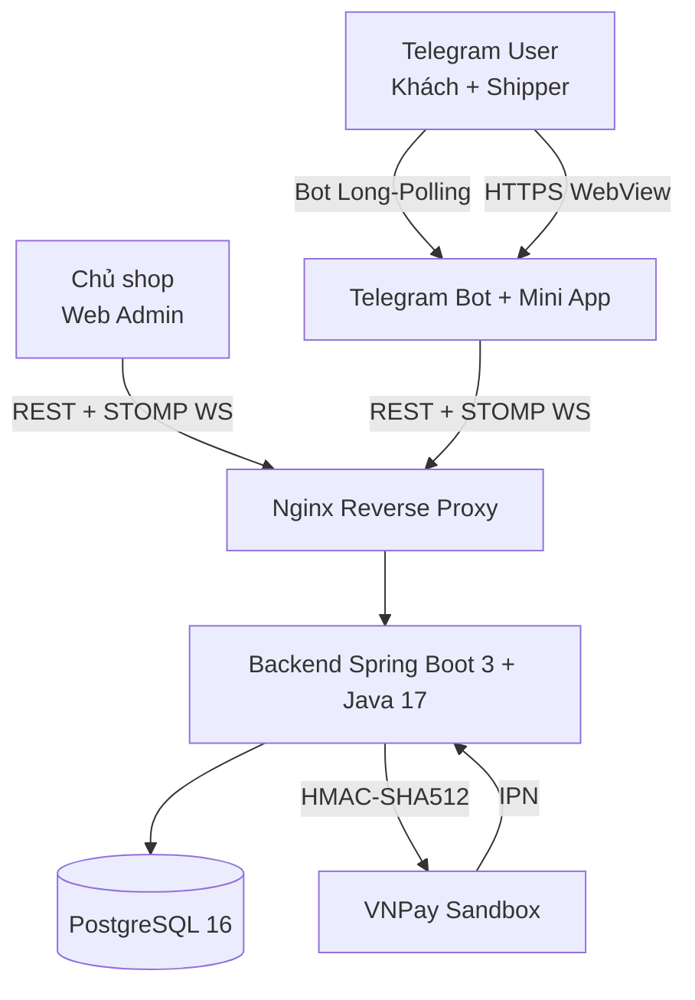

<!-- _class: title lead -->

# Xây dựng hệ thống quản lý giao hàng dựa trên nền tảng Telegram

**Khoá luận tốt nghiệp 2026**

[HỌ VÀ TÊN]
MSSV: [MSSV]
GVHD: [HỌC HÀM HỌC VỊ HỌ TÊN]
[Khoa Công nghệ Thông tin — Trường Đại học X]
Ngày bảo vệ: [DD/MM/2026]

---

## Vấn đề & động lực

- **Thị trường giao đồ ăn VN 2024 vượt 1 tỷ USD**, tăng trưởng kép hai con số.
- Shop nhỏ phải đối mặt 3 lựa chọn không hoàn hảo:
  - Tham gia GrabFood — chịu **20–25% hoa hồng**, mất dữ liệu khách hàng.
  - Tự build app native — chi phí **hàng trăm triệu đồng**.
  - Vận hành thủ công qua Messenger/Zalo — dễ thất lạc đơn.
- Cơ hội: **Telegram** có gần **1 tỷ MAU** + Bot API miễn phí + Mini App + Live Location native.
- Giải pháp: dùng Telegram làm **cổng vào duy nhất** cho cả 3 vai trò.

---

## So sánh với các giải pháp hiện có

| Tiêu chí | **Đề tài** | GrabFood / ShopeeFood | Shop tự build native |
|---|---|---|---|
| Khách cần cài app mới | **Không** | Có (~150 MB) | Có |
| Chi phí triển khai / tháng | **~10 USD** (1 VPS) | N/A | 50–100 USD |
| Realtime GPS tracking | Có, qua Telegram | Có | Hiếm |
| Tự chủ dữ liệu khách | **Có** | Không | Có |
| Tích hợp VNPay | Có | Có | Tuỳ |

→ **Khoảng trống định vị:** chi phí thấp tương đương tự xây + UX gần aggregator.

---

## Mục tiêu & phạm vi MoSCoW

**Năm mục tiêu kỹ thuật:**

1. Đặt đơn online với COD + VNPay (HMAC-SHA512, IPN là nguồn sự thật).
2. Theo dõi shipper realtime trên Leaflet, độ trễ < 3s.
3. Máy trạng thái hữu hạn (FSM) 7 trạng thái cho đơn hàng.
4. Notification realtime qua Spring WebSocket STOMP + Bot.
5. Docker Compose deploy bằng 3 lệnh.

**Phạm vi MoSCoW:** 8 Must + 3 Should → hoàn thành **100%**. 2 Could là hướng phát triển. 2 Won't ngoài phạm vi.

---

## Kiến trúc tổng thể



3 kênh giao diện · 1 process backend · 1 database · 1 cổng thanh toán.

---

## Tech stack

| Tầng | Công nghệ |
|---|---|
| Frontend | React 18 + Vite 5, Tailwind, Zustand, Recharts, react-leaflet, `@twa-dev/sdk` |
| Backend | Spring Boot 3.3, Java 17, Spring Security, Spring WS (STOMP), Hibernate 6 JSON |
| Bot | `telegrambots-springboot-longpolling-starter` 7.x |
| Database | PostgreSQL 16, Flyway 10.x (V1–V12) |
| Infra | Docker Compose 5 container, Nginx reverse proxy, Testcontainers |
| Testing | JUnit 5, Mockito, AssertJ, Failsafe + Surefire, **Vitest** + Testing Library |

---

## Modular Monolith — 8 bounded context

```
shared (base — không phụ thuộc module nào)
  ↑
  ├── auth          → Telegram initData HMAC + JWT admin
  ├── order         → Order, Product, FSM, StatusHistory
  ├── delivery      → ShipperProfile, Assignment, LocationPing, Rating
  ├── payment       → Payment, VNPay signing/IPN
  ├── bot           → Telegram handlers + FSM ConversationState
  ├── notification  → OrderLifecycleNotifier, RatingPromptBuilder
  └── app           → Executable jar + WebSocketConfig + SecurityConfig
```

- DAG một chiều — không có chu trình.
- Cross-module: **Spring Events** + `@TransactionalEventListener(AFTER_COMMIT)`.
- Lối thoát microservice trong tương lai mà không sửa code nghiệp vụ.

---

<!-- _class: section-divider -->

## Demo 1 — Mini App khách hàng

**Catalog · Cart · Checkout**


- Theme tự động theo Telegram (sáng/tối).
- Giỏ hàng persist qua **Zustand** + `localStorage`.
- Xác thực `X-Telegram-Init-Data` → HMAC verify constant-time.
- Form checkout pre-fill tên + phone từ Telegram profile.

---

<!-- _class: section-divider -->

## Demo 2 — Mini App: Live Location tracking


- Shipper share Live Location qua Telegram native (📎 → Vị trí).
- Backend nhận `edited_message.location` mỗi 5–10s.
- Broadcast STOMP `/user/{customerId}/queue/order/{orderId}/location`.
- Bản đồ Leaflet + polyline 10 ping gần nhất + ETA.
- Độ trễ end-to-end ~ **5–15s**.

---

<!-- _class: section-divider -->

## Demo 3 — Web Admin Dashboard + Reports


- Login `shop@example.com` → JWT access 15p + refresh 7d.
- Dashboard: 4 KPI + Top 3 shipper.
- Reports: 3 biểu đồ Recharts lazy-load (bundle 121KB gzipped).
- Realtime: STOMP `/topic/admin/orders` — đơn mới hiện ~2s không refresh.

---

<!-- _class: section-divider -->

## Demo 4 — Bot Telegram: FSM hội thoại

**Đăng ký shipper (4 state):**
`AWAITING_NAME` → `AWAITING_PHONE` (`request_contact`) → `AWAITING_VEHICLE` → `AWAITING_PLATE` → `PENDING_APPROVAL`

**Đánh giá:**
DELIVERED → bot gửi keyboard 5 sao → callback `RATE:<orderId>:<n>` → recompute `rating_avg = AVG(stars)` → prompt comment hoặc `/skip`.

- Persist FSM qua bảng `conversation_state` (V3) — payload **JSONB** qua `@JdbcTypeCode(SqlTypes.JSON)` của Hibernate 6.
- `/cancel` ở bất kỳ state nào → FSM tự clear.
- `@Order(0)` trên `RatingCommentHandler` → bắt text trước handler khác.

---

## Năm điểm nổi bật kỹ thuật

1. **Telegram Live Location native** — không cần GPS streaming client (~80% effort tiết kiệm).
2. **VNPay IPN-as-source-of-truth** — `MessageDigest.isEqual` constant-time + idempotent + audit JSONB + `Propagation.REQUIRES_NEW`.
3. **Defense-in-depth 11 lớp** — từ HMAC initData đến partial unique index `uq_assignment_shipper_started`.
4. **GSD methodology** — 10 phase × 6 bước (Research → Plan → Plan-check → Execute → Code-review → Fix).
5. **274 test** — 253 backend (Testcontainers Postgres) + 21 frontend (Vitest).

---

## Bảo mật defense-in-depth — 11 lớp

| Lớp | Cơ chế | Chống |
|---|---|---|
| L1 | `TelegramAuthFilter` HMAC | Spoof Telegram identity |
| L2 | `JwtAuthFilter` 15p TTL | Admin session hijack |
| L3 | SecurityConfig allowlist | Endpoint chưa phân quyền |
| L4 | `@PreAuthorize` controller | Privilege escalation |
| L5 | `@CurrentUser` resolver | Forge customerId path |
| L6 | WS CONNECT dual auth | Anonymous WS connect |
| L7 | WS SUBSCRIBE allowlist | Cross-user data leak |
| L8 | `MessageDigest.isEqual` VNPay | Timing attack |
| L9 | groupBy enum whitelist `DATE_TRUNC` | SQL injection Reports |
| L10 | `vnp_TxnRef UNIQUE` + audit | Payment replay |
| L11 | Partial unique index (V8) | Wrong-shipper attribution |

---

## Quy trình phát triển GSD

**10 phase × 6 bước:**

1. `gsd-research-phase` → research doc (~6 500 dòng tổng).
2. `gsd-plan-phase` → plan file (~33 000 dòng tổng).
3. **Plan-checker** → catch **12 blocker** trước khi code.
4. Wave executor → 1 commit / task atomic.
5. `gsd-code-review` → REVIEW.md (CRITICAL/IMPORTANT/MINOR).
6. `gsd-code-review-fix` → **catch 5 critical bug** trước merge.

→ ~160 commit atomic theo Conventional Commits. **42 000 dòng** plan + research + review.

---

## Kết quả định lượng

| Chỉ số | Giá trị |
|---|---|
| Commit atomic | **hơn 160** |
| Dòng mã (Java + TS) | ~21 000 |
| Test backend | 253 (Testcontainers Postgres thật) |
| Test frontend | 21 (Vitest + Testing Library) |
| **Tổng test** | **274** |
| Flyway migration | 12 (V1 → V12) |
| Bounded context | 8 |
| Endpoint REST | ~35 |
| Cross-module event | 9 |
| Container compose | 5 |
| **Build green / commit** | **100%** |

---

## Hạn chế còn lại & hướng phát triển

**6 hạn chế còn lại (4 đã khắc phục V12):**

1. Chỉ 1 shop, chưa multi-tenant *(out-of-scope cố ý)*
2. Không có push ngoài Telegram *(trade-off cố ý)*
3. Phụ thuộc Telegram availability *(ổn ở VN)*
4. Chỉ VNPay sandbox *(cần credential thật)*
5. Live Location 8h limit *(giới hạn vendor)*
6. Manual smoke chưa tự động *(cần Playwright + Telethon)*

**Ưu tiên cao:**

- **Mở rộng Zalo Mini App** — Zalo 75 triệu MAU VN, reuse 80% UI code, ~3–4 tuần.
- **Tích hợp Momo / ZaloPay / VietQR** — pattern tương tự VNPay, mỗi cổng ~3–5 ngày.

---

<!-- _class: section-divider -->

## Demo video

**Demo video 4 phút bao trùm toàn bộ flow:**

khách đặt đơn → admin gán shipper → shipper share Live Location → khách theo dõi realtime → đánh giá

Truy cập: **[URL YouTube unlisted / Google Drive]**

Hoặc quét QR code:

`[QR CODE PLACEHOLDER]`

Backup MP4 ở USB của sinh viên.

---

<!-- _class: title lead -->

# Cảm ơn quý thầy cô

**Em xin sẵn sàng trả lời các câu hỏi của hội đồng**

Mã nguồn: `github.com/[username]/KhoaLuan-GiaoHang`
Báo cáo: `docs/thesis/`
Liên hệ: `[email]`

---

<!-- _class: section-divider -->

## Phụ lục — Hướng dẫn build slide

**Build PDF:**
```bash
npm install -g @marp-team/marp-cli
marp slide-template.md -o slide.pdf
```

**Build PowerPoint (.pptx):**
```bash
marp slide-template.md -o slide.pptx --pptx
```

**Build HTML standalone:**
```bash
marp slide-template.md -o slide.html --html
```

**Live preview với watch:**
```bash
marp -w slide-template.md
```

**Lưu ý:** Mermaid diagram cần cài plugin `@marp-team/marp-cli` ≥ 3.x hoặc dùng `marp-mermaid-plugin`. Nếu Mermaid không render, có thể export Mermaid Live Editor ra PNG rồi ``.
